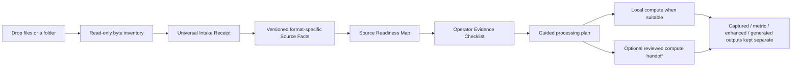
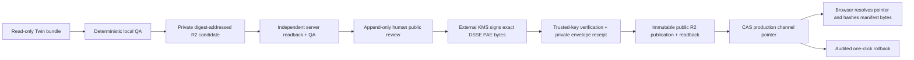

# Evidence-to-Runtime Reconstruction Foundry

The Reconstruction Foundry now has two deliberately separate product lanes:

1. the current **local multimodal super-app lane**, which turns dropped capture
   files into inspectable, truth-labelled evidence and guided next actions; and
2. an optional **runtime release lane** for an already reviewed Twin bundle.

The local lane is the current T-508 priority. It needs no account, remote
service, object store, signing step, deployment, or production database. The
release lane remains documented below, but it is not a prerequisite for local
capture intake, reconstruction experiments, visual-quality work, or evidence
review.

## Current local multimodal super-app boundary

The boundary is intentionally evidence-first:

- Discovery and inspection are read-only. Source bytes are never silently
  converted, renamed, moved, admitted, trained on, uploaded, or published.
- Every file is represented by a relative path, size, format evidence and exact
  byte fingerprint. Duplicate content remains explicit.
- Source Facts profiles are immutable once used. Adding SPZ, Gaussian PLY,
  image roles, video, calibration or another family creates a new profile or
  schema version rather than changing the meaning of an earlier artifact.
- Readiness describes observed source families; it does not select a recipe or
  claim that missing families are required.
- The checklist converts every unresolved fact into a falsifiable evidence
  request. An unresolved result remains valid and visible.
- XGRIDS XBIN stays an all-or-nothing stop until an official open export exists;
  the app does not attempt to interpret the opaque payload.

### Truth layers

The super app must never flatten different kinds of output into one apparent
truth:

| Layer | Intended use | What it must not imply |
| --- | --- | --- |
| Captured visual | faithful presentation of observed appearance | metric authority |
| Metric / planning | measurement, collision, cutaway and registration | photographic completeness |
| Enhanced captured | denoised, re-rendered or locally refined captured evidence | that generated detail was observed |
| Generated cinematic | explicitly labelled aesthetic continuation or repair | captured, metric or evidential truth |
| Concept / imagination | design variants and speculative scenes | current venue state |

The architecture therefore favours **mesh for geometry and planning, splat for
appearance, and explicit overlays for derived semantics**. Hybrid output is a
composition of labelled representations, not a licence to transfer authority
from one representation to another.

### Implemented local coverage

- Universal Intake Receipt V0 inventories and fingerprints dropped sources.
- Universal Source Facts V1 remains frozen and establishes bounded E57, binary
  GLB, streaming OBJ and stored-ZIP SOG v2 structure while preserving
  format-specific unknowns.
- Universal Source Facts V2, Source Readiness Map V2 and Operator Evidence
  Checklist V2 remain frozen. V2 reuses the exact V1 asset contracts and adds
  SPZ without changing V1 bytes, meanings or digest domains.
- The active local app uses Universal Source Facts V5, Source Readiness Map V5
  and Operator Evidence Checklist V5. V3 added classic Gaussian PLY, V4 added
  bounded media-container structure, and V5 adds calibration/trajectory
  document structure without changing earlier bytes, meanings or digest
  domains.
- The SOG inspector validates stored members, metadata declarations, CRCs,
  signed descriptors and complete RIFF member structure on the same open handle
  used for the full-file fingerprint. It does not decode WebP pixels or Gaussian
  attributes.
- The SPZ inspector validates legacy v1-v3 single-member gzip streams,
  including bounded trailing ILV extension records when declared, and current
  v4 header/extension/TOC/Zstandard stream structure on that same already-open,
  identity-checked handle. It verifies exact declared lengths and complete
  compression ranges but does not decode Gaussian attributes or infer physical
  units, venue frame, renderer support, appearance fidelity, accuracy,
  registration, provenance or rights.
- Gzip headers have a published 1 MiB inspection cap. Crossing it is reported
  as a resource limit, not as malformed input. V4 Zstandard inspection is
  feature-tested at use time: Node runtimes before `createZstdDecompress`
  support can still import and use the V1/legacy paths, while a v4 file receives
  the stable `SPZ_V4_ZSTD_RUNTIME_UNAVAILABLE` result.
- The Gaussian PLY inspector accepts a deliberately bounded PLY 1.0
  binary-little-endian, single-vertex-element profile. It derives byte offsets
  from arbitrary declared property order, requires the classic float32
  position/DC/opacity/scale/rotation set, accepts all-or-none normal
  placeholders and SH degrees 0–4, and proves the exact fixed-width payload
  equation on the same already-open handle. It does not decode attribute
  values or infer units, frame, renderer support, visual fidelity, provenance,
  accuracy, registration or rights. ASCII point clouds, mesh PLY, big-endian,
  list/multi-element and PlayCanvas packed PLY receive explicit untargeted or
  unsupported outcomes rather than false Gaussian facts.
- The media inspector establishes bounded SOF0/SOF2 eight-bit Huffman JPEG,
  static PNG or selected ISO-BMFF movie/video declarations. It does not turn
  container validity into decoded pixels/samples, capture role, provenance,
  calibration, visual fidelity, sequence or rights evidence.
- The calibration/trajectory inspector establishes only complete UTF-8 CSV
  record structure or bounded duplicate-key-safe JSON syntax/tree shape on the
  same identity-checked handle. Exact decimal lexemes remain text. Field/key
  semantics, clock domain, epoch/time units/cadence, frame/CRS/units,
  transform/quaternion convention, calibration applicability,
  synchronization, accuracy/drift, provenance, rights and registration remain
  explicit unknowns.
- V1-V5 artifact digests prove canonical local self-consistency only. Issuance is
  internal to the high-level inspected-intake path, `authority` remains `none`,
  and neither the digest nor schema validity authenticates who ran the
  inspector or independently attests the source.
- The current real authority-none SOG evidence chain is recorded in
  `docs/reports/reception-room-sog-source-facts-v1-evidence-2026-07-16.json`.
- The authority-none eight-file Reception SPZ V2 evidence chain is recorded in
  `docs/reports/reception-room-spz-source-facts-v2-evidence-2026-07-17.json`.
- The authority-none real Gaussian PLY V3 evidence chain is recorded in
  `docs/reports/reception-room-gaussian-ply-source-facts-v3-evidence-2026-07-17.json`.
- The authority-none real JPEG/PNG V4 evidence chains are recorded in
  `docs/reports/reception-room-image-video-container-source-facts-v4-evidence-2026-07-17.json`.
- The authority-none real trajectory-document V5 evidence chains are recorded
  in
  `docs/reports/calibration-trajectory-source-facts-v5-evidence-2026-07-17.json`.

The next bounded local profile should cover ordinary non-Gaussian point
geometry without widening V1-V5, beginning with PLY and adding LAS/LAZ or XYZ
only where real local inputs and explicit limits support them. Property/header
structure must stay separate from units, frame/CRS, accuracy, provenance,
rights and authority.

This ordinary local path does not depend on the optional release workflow
below. No cybersecurity, credential, cloud, deployment or publication work is
required to continue the super-app source-understanding slices.

## Optional runtime release boundary

For an already prepared and independently reviewed Twin bundle, the Foundry
also implements D-014's artifact-factory separation, D-019's detached
DSSE/in-toto posture, and D-024's transform and Scene Authority evidence
requirement without claiming that T-091 or full VSIR is complete.

## Trust boundaries

- The local CLI can prepare, upload, and verify only private candidates. It has
  no publish, promote, rollback, delete, list, bucket-policy, or private-key
  capability.
- The API accepts a candidate prefix, not caller-asserted manifest/QA status.
  It reads and reconstructs the candidate before persisting evidence.
- Release, QA, review, attestation, publication, and channel-event records are
  append-only at both application and database layers.
- The production channel row is the sole mutable record. Revision and expected
  active-release compare-and-swap protect it from lost updates.
- Public approval requires exact visual-object hashes plus TransformArtifact
  and Scene Authority Map digest references.
- DSSE verification checks the signature over exact PAE/payload bytes before
  trusting or parsing the in-toto statement. The API stores public keys only.
- Public objects use a release-digest prefix, create-if-absent writes,
  immutable caching, and byte readback.
- The public descriptor is `no-store`; runtime assets are immutable. The
  browser verifies raw manifest bytes before schema parsing or asset loading.

## Discoverable surfaces

- Platform-admin navigation: **Dashboard → Runtime Foundry**.
- Capture pipeline handoff: **Capture Factory → Open Runtime Foundry**.
- Legacy room diagnostics: visible link inside Runtime Foundry.
- Public runtime: `/venues/:venueSlug/twin`.
- Operator CLI: `pnpm reconstruction:foundry --help`.

## Deliberate deployment boundary

The repository contains migration 0049 and production adapters, but repository
work alone does not apply that migration, provision R2/KMS, upload customer
bytes, publish a release, move the production pointer, merge the branch, or
deploy services. Those remain explicit owner-controlled operations documented
in `docs/operations/reconstruction-foundry-runbook.md`.

