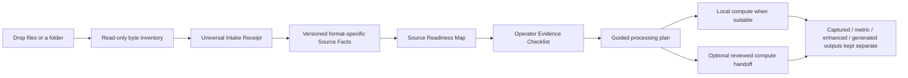
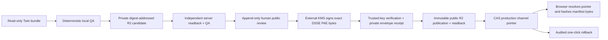

# Evidence-to-Runtime Reconstruction Foundry

The Reconstruction Foundry now has two deliberately separate product lanes:

1. the current **local multimodal super-app lane**, which turns dropped capture
   files into inspectable, truth-labelled evidence and guided next actions; and
2. an optional **runtime release lane** for an already reviewed Twin bundle.

The local lane is the current T-508 priority. It needs no account, remote
service, object store, signing step, deployment, or production database. The
release lane remains documented below, but it is not a prerequisite for local
capture intake, reconstruction experiments, visual-quality work, or evidence
review.

## Current local multimodal super-app boundary

```mermaid
flowchart LR
  A["Drop files or a folder"] --> B["Read-only byte inventory"]
  B --> C["Universal Intake Receipt"]
  C --> D["Versioned format-specific Source Facts"]
  D --> E["Source Readiness Map"]
  E --> F["Operator Evidence Checklist"]
  F --> G["Guided processing plan"]
  G --> H["Local compute when suitable"]
  G --> I["Optional reviewed compute handoff"]
  H --> J["Captured / metric / enhanced / generated outputs kept separate"]
  I --> J
```

The boundary is intentionally evidence-first:

- Discovery and inspection are read-only. Source bytes are never silently
  converted, renamed, moved, admitted, trained on, uploaded, or published.
- Every file is represented by a relative path, size, format evidence and exact
  byte fingerprint. Duplicate content remains explicit.
- Source Facts profiles are immutable once used. Adding SPZ, Gaussian PLY,
  image roles, video, calibration or another family creates a new profile or
  schema version rather than changing the meaning of an earlier artifact.
- Readiness describes observed source families; it does not select a recipe or
  claim that missing families are required.
- The checklist converts every unresolved fact into a falsifiable evidence
  request. An unresolved result remains valid and visible.
- XGRIDS XBIN stays an all-or-nothing stop until an official open export exists;
  the app does not attempt to interpret the opaque payload.

### Truth layers

The super app must never flatten different kinds of output into one apparent
truth:

| Layer | Intended use | What it must not imply |
| --- | --- | --- |
| Captured visual | faithful presentation of observed appearance | metric authority |
| Metric / planning | measurement, collision, cutaway and registration | photographic completeness |
| Enhanced captured | denoised, re-rendered or locally refined captured evidence | that generated detail was observed |
| Generated cinematic | explicitly labelled aesthetic continuation or repair | captured, metric or evidential truth |
| Concept / imagination | design variants and speculative scenes | current venue state |

The architecture therefore favours **mesh for geometry and planning, splat for
appearance, and explicit overlays for derived semantics**. Hybrid output is a
composition of labelled representations, not a licence to transfer authority
from one representation to another.

### Implemented local coverage

- Universal Intake Receipt V0 inventories and fingerprints dropped sources.
- The bounded T-542 native-selection preview adds a helper-owned, topmost
  Windows OLE `CF_HDROP` panel for one mixed file/folder gesture. The browser
  can only request the separate panel and receives neutral rows; it has no HTML
  drag/drop, `DataTransfer`, filename or path surface. Node subsequently
  reopens the process-owned paths, creates one T-541 child workspace per root
  and stores a durable collection index. This remains explicitly
  `nativeCustodyClaimed: false`, `authority: none`, and is not retained-handle
  byte custody.
- T-544 bridges a process-owned T-542 collection into the existing local V8
  inspection chain without accepting a root from HTTP. It binds the exact
  collection-index digest, reverifies every stored T-541 child independently,
  inspects only the verified copied payload, binds the V8 receipt back to the
  T-541 receipt and reverifies the child again before publishing a result. One
  damaged child does not suppress later intact children. Browser DTOs contain
  only generated `File N`/`Folder N` labels, digest/state summaries, sorted
  fixed blocker codes and fixed next-action codes; XBIN is explicitly
  `XBIN_OFFICIAL_EXPORT_ONLY` with `OBTAIN_OFFICIAL_EXPORT`. A collection entry
  with no stored copy is instead
  `COPIED_PAYLOAD_NOT_STORED` with `RESTART_LOCAL_INTAKE`; a failed child
  verification remains distinct as `COPIED_PAYLOAD_VERIFICATION_FAILED`. Every
  result stays
  `needs_operator_review`, authority remains none and cancellation is truthful
  at `between_bounded_verification_steps` because T-541 verification itself is
  not abortable. This bridge does not perform admission, plan compilation,
  reconstruction, worker/provider dispatch, training, enhancement, rights
  evaluation, signing or publication.
- Universal Source Facts V1 remains frozen and establishes bounded E57, binary
  GLB, streaming OBJ and stored-ZIP SOG v2 structure while preserving
  format-specific unknowns.
- Universal Source Facts V2, Source Readiness Map V2 and Operator Evidence
  Checklist V2 remain frozen. V2 reuses the exact V1 asset contracts and adds
  SPZ without changing V1 bytes, meanings or digest domains.
- The active local app uses Universal Source Facts V8, Source Readiness Map V8
  and Operator Evidence Checklist V8. V3 added classic Gaussian PLY, V4 added
  bounded media-container structure, V5 added calibration/trajectory document
  structure, V6 added ordinary point PLY layout, and V7 adds an exact
  three-member XGRIDS/Potree v2 bundle refinement. V8 adds a separately bound
  point-value, readiness, effective-checklist and private diagnostic-preview
  refinement without changing earlier bytes, meanings or digest domains.
- The SOG inspector validates stored members, metadata declarations, CRCs,
  signed descriptors and complete RIFF member structure on the same open handle
  used for the full-file fingerprint. It does not decode WebP pixels or Gaussian
  attributes.
- The SPZ inspector validates legacy v1-v3 single-member gzip streams,
  including bounded trailing ILV extension records when declared, and current
  v4 header/extension/TOC/Zstandard stream structure on that same already-open,
  identity-checked handle. It verifies exact declared lengths and complete
  compression ranges but does not decode Gaussian attributes or infer physical
  units, venue frame, renderer support, appearance fidelity, accuracy,
  registration, provenance or rights.
- Gzip headers have a published 1 MiB inspection cap. Crossing it is reported
  as a resource limit, not as malformed input. V4 Zstandard inspection is
  feature-tested at use time: Node runtimes before `createZstdDecompress`
  support can still import and use the V1/legacy paths, while a v4 file receives
  the stable `SPZ_V4_ZSTD_RUNTIME_UNAVAILABLE` result.
- The Gaussian PLY inspector accepts a deliberately bounded PLY 1.0
  binary-little-endian, single-vertex-element profile. It derives byte offsets
  from arbitrary declared property order, requires the classic float32
  position/DC/opacity/scale/rotation set, accepts all-or-none normal
  placeholders and SH degrees 0–4, and proves the exact fixed-width payload
  equation on the same already-open handle. It does not decode attribute
  values or infer units, frame, renderer support, visual fidelity, provenance,
  accuracy, registration or rights. ASCII point clouds, mesh PLY, big-endian,
  list/multi-element and PlayCanvas packed PLY receive explicit untargeted or
  unsupported outcomes rather than false Gaussian facts.
- The media inspector establishes bounded SOF0/SOF2 eight-bit Huffman JPEG,
  static PNG or selected ISO-BMFF movie/video declarations. It does not turn
  container validity into decoded pixels/samples, capture role, provenance,
  calibration, visual fidelity, sequence or rights evidence.
- The calibration/trajectory inspector establishes only complete UTF-8 CSV
  record structure or bounded duplicate-key-safe JSON syntax/tree shape on the
  same identity-checked handle. Exact decimal lexemes remain text. Field/key
  semantics, clock domain, epoch/time units/cadence, frame/CRS/units,
  transform/quaternion convention, calibration applicability,
  synchronization, accuracy/drift, provenance, rights and registration remain
  explicit unknowns.
- The V6 ordinary point PLY inspector runs only after inherited Gaussian
  inspection does not establish or explicitly reject a Gaussian target. It
  accepts bounded, case-sensitive PLY 1.0 `binary_little_endian` with exactly
  one positive fixed-width vertex element, unique scalar properties, required
  `x`/`y`/`z` declarations, and exact
  `header + vertex count × stride = source bytes` arithmetic. It derives
  declared property offsets but decodes no values; property names do not
  establish semantics. ASCII, big-endian, list, compressed, packed and
  mesh/multi-element layouts receive explicit unsupported-variant results;
  trailing-byte or payload-length contradictions receive explicit parse-failure
  results.
- The V7 Potree inspector binds exact co-located `metadata.json`,
  `hierarchy.bin` and `octree.bin` identities as one bundle. It accepts only the
  frozen XGRIDS `DEFAULT` declaration with a 14-byte
  position/intensity/`lcc prediction` record, traverses 22-byte little-endian
  hierarchy chunks and proxies under the official viewer rules, and proves
  point-count, node-byte-range, disjointness, gaplessness and exact octree
  coverage equations. Metadata and hierarchy capture is bounded; octree bytes
  are streamed and hashed. It decodes no point values and retains declared
  depth, leaf-with-child, histogram and proxy-replacement differences as
  compatibility evidence instead of silently normalizing them.
- The V8 point-value inspector runs only over an exact V7-established bundle.
  It decodes the frozen `int32[3]` position and two one-byte attributes, checks
  finiteness, declared ranges and derived node bounds with one scale unit of
  tolerance, and records exact extrema, quantiles, byte histograms and—under a
  bounded threshold—duplicate-position/full-record profiles. It also produces
  twelve deterministic 1024×1024 CPU PNG diagnostics across three axis pairs
  and four fixed display modes. These values and rasters do not establish
  units, frame, physical meaning, completeness, accuracy, vendor semantics or
  official-viewer fidelity.
- A separate Photo Capture Quality Workbench V0 consumes only receipt-verified
  JPEG/PNG candidates. It preserves the existing 18-build/12-held-out protocol,
  verifies exact source bytes again, decodes pixels sequentially, applies frozen
  resolution/exposure/clipping/edge-energy/colour and difference-hash heuristics,
  and emits a receipt-bound authority-none report plus memory-only WebP contact
  previews. Submitted roles, run revisions, cancellation and Stop settlement are
  explicit. This is capture triage, not Universal Source Facts V9, calibration,
  registration, reconstruction or recovered-detail evidence.
- A separate Room Envelope Review V0 workbench consumes only one exact
  V8-established Potree bundle and its three digest-bound 1024×1024 diagnostic
  planes. The operator reviews all three planes, labels one as horizontal and
  draws a simple polygon in intrinsic pixel coordinates. A bounded worker
  re-verifies the three bundle members, decodes the unchanged 14-byte records,
  maps every point through the frozen V8 raster equation and records selected
  counts, decoder-coordinate bounds and the exact inverse-mapped polygon in a
  canonical self-digested `authority:none` artifact. The polygon is eligible
  only after an explicit `accepted_as_fit_seed` decision and at least 512
  selected records. It establishes no units, axis meaning, room identity,
  physical accuracy, independent control, rights or transform authority.
- The separate E57 consumer for that artifact is fit-only by construction. Its
  production adapter requests the frozen fit scan IDs and never requests the
  frozen validation/test IDs. It may emit an authority-none candidate or a
  refusal, but never an approved TransformArtifact. A later locked validation
  action must remain a distinct process and must not tune or refit the
  candidate it evaluates.
- V1-V8 artifact digests prove canonical local self-consistency only. Issuance is
  internal to the high-level inspected-intake path, `authority` remains `none`,
  and neither the digest nor schema validity authenticates who ran the
  inspector or independently attests the source.
- The current real authority-none SOG evidence chain is recorded in
  `docs/reports/reception-room-sog-source-facts-v1-evidence-2026-07-16.json`.
- The authority-none eight-file Reception SPZ V2 evidence chain is recorded in
  `docs/reports/reception-room-spz-source-facts-v2-evidence-2026-07-17.json`.
- The authority-none real Gaussian PLY V3 evidence chain is recorded in
  `docs/reports/reception-room-gaussian-ply-source-facts-v3-evidence-2026-07-17.json`.
- The authority-none real JPEG/PNG V4 evidence chains are recorded in
  `docs/reports/reception-room-image-video-container-source-facts-v4-evidence-2026-07-17.json`.
- The authority-none real trajectory-document V5 evidence chains are recorded
  in
  `docs/reports/calibration-trajectory-source-facts-v5-evidence-2026-07-17.json`.
- The authority-none ordinary point PLY V6 evidence and its deliberate mesh and
  Gaussian-precedence controls are recorded in
  `docs/reports/ordinary-point-ply-source-facts-v6-evidence-2026-07-18.json`.
- The authority-none XGRIDS/Potree v2 V7 evidence, including the exact Reception
  positive, four metadata/octet contradictions and five unreachable-hierarchy
  negatives, is recorded in
  `docs/reports/xgrids-potree-v2-source-facts-v7-evidence-2026-07-18.json`.
- The authority-none XGRIDS/Potree point-value V8 evidence, including exact
  decoded distributions, duplicate concentration, twelve deterministic preview
  identities and responsive local-app QA, is recorded in
  `docs/reports/xgrids-potree-v2-point-values-v8-evidence-2026-07-18.json`.
- The authority-none Photo Capture Quality Workbench V0 implementation and
  controlled four-photo fixture QA are recorded in
  `docs/reports/reception-room-photo-capture-quality-workbench-v0-evidence-2026-07-18.json`.
- The authority-none Room Envelope Review V0 contract, real ineligible
  proposal, responsive workbench QA and separate fit-only E57 consumer are
  recorded in
  `docs/reports/reception-room-envelope-review-workbench-v0-evidence-2026-07-19.json`.

V8 establishes decoded numeric point values only for the exact V7-established
Reception vendor preview without widening V1-V7. It does not turn that preview
into raw sensor data, authoritative captured geometry or metric geometry.
Vendor-attribute semantics, units/frame/CRS, authoritative physical bounds,
geometry role and completeness, provenance, accuracy, registration, official-
viewer fidelity and rights remain explicit unknowns requiring separate later
evidence profiles.

The photo workbench does not close those V8 unknowns and does not establish an
Appearance Capture QA Pack. A heuristic `pass` means only that no frozen rule
fired; `capture_quality_ready` means ready for a later registration test, not
that registration, physical accuracy, source rights or release approval exists.

This ordinary local path does not depend on the optional release workflow
below. No cybersecurity, credential, cloud, deployment or publication work is
required to continue the super-app source-understanding slices.

## Optional runtime release boundary

For an already prepared and independently reviewed Twin bundle, the Foundry
also implements D-014's artifact-factory separation, D-019's detached
DSSE/in-toto posture, and D-024's transform and Scene Authority evidence
requirement without claiming that T-091 or full VSIR is complete.

```mermaid
flowchart LR
  A["Read-only Twin bundle"] --> B["Deterministic local QA"]
  B --> C["Private digest-addressed R2 candidate"]
  C --> D["Independent server readback + QA"]
  D --> E["Append-only human public review"]
  E --> F["External KMS signs exact DSSE PAE bytes"]
  F --> G["Trusted-key verification + private envelope receipt"]
  G --> H["Immutable public R2 publication + readback"]
  H --> I["CAS production channel pointer"]
  I --> J["Browser resolves pointer and hashes manifest bytes"]
  I --> K["Audited one-click rollback"]
```

## Trust boundaries

- The local CLI can prepare, upload, and verify only private candidates. It has
  no publish, promote, rollback, delete, list, bucket-policy, or private-key
  capability.
- The API accepts a candidate prefix, not caller-asserted manifest/QA status.
  It reads and reconstructs the candidate before persisting evidence.
- Release, QA, review, attestation, publication, and channel-event records are
  append-only at both application and database layers.
- The production channel row is the sole mutable record. Revision and expected
  active-release compare-and-swap protect it from lost updates.
- Public approval requires exact visual-object hashes plus TransformArtifact
  and Scene Authority Map digest references.
- DSSE verification checks the signature over exact PAE/payload bytes before
  trusting or parsing the in-toto statement. The API stores public keys only.
- Public objects use a release-digest prefix, create-if-absent writes,
  immutable caching, and byte readback.
- The public descriptor is `no-store`; runtime assets are immutable. The
  browser verifies raw manifest bytes before schema parsing or asset loading.

## Discoverable surfaces

- Platform-admin navigation: **Dashboard → Runtime Foundry**.
- Capture pipeline handoff: **Capture Factory → Open Runtime Foundry**.
- Legacy room diagnostics: visible link inside Runtime Foundry.
- Public runtime: `/venues/:venueSlug/twin`.
- Operator CLI: `pnpm reconstruction:foundry --help`.

## Deliberate deployment boundary

The repository contains migration 0049 and production adapters, but repository
work alone does not apply that migration, provision R2/KMS, upload customer
bytes, publish a release, move the production pointer, merge the branch, or
deploy services. Those remain explicit owner-controlled operations documented
in `docs/operations/reconstruction-foundry-runbook.md`.

