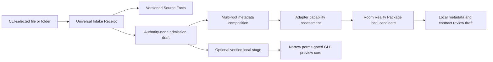

# Evidence-to-Runtime Reconstruction Foundry

Status: **T-486 in progress**, updated 2026-08-09.

The Foundry is an evidence-first local pipeline. Its current implementation can
inventory sources, establish bounded structural facts, compose independently
admitted roots, report adapter blockers, and assemble a blocked Room Reality
Package candidate for local review. It is not yet a drag-and-drop
reconstruction engine or a raw-capture-to-production-`RuntimePackage` bridge.

## Product truth

- A Room Reality Package represents stable architectural reality: walls,
  floors, doors, windows, fixed features, coordinate frames, representations,
  provenance, and review references.
- Tables, chairs, stages, bars, and other event furniture are independent
  planner objects. Captured movable objects cannot become placement,
  measurement, collision, or export authority merely because they appear in a
  scan or image.
- A timeline snapshot binds an exact immutable room-package ID, revision, and
  digest separately from an independently frozen furniture layout. Many Day or
  Week phases may correctly reuse the same room package.
- A room-package crossfade is meaningful only when two genuinely different,
  rights-cleared, reviewed captured room revisions exist. Furniture changes do
  not justify manufacturing a second room revision.
- Generated or ImageGen-derived presentation assets remain visibly labelled
  non-authoritative stand-ins. They cannot supply measurements, collision,
  exports, or room truth.

## Verified local contract graph

```mermaid
flowchart LR
  A["CLI-selected file or folder"] --> B["Universal Intake Receipt"]
  B --> C["Versioned Source Facts"]
  B --> D["Authority-none admission draft"]
  D --> E["Optional verified local stage"]
  D --> F["Multi-root metadata composition"]
  F --> G["Adapter capability assessment"]
  G --> H["Room Reality Package local candidate"]
  H --> I["Local metadata and contract review draft"]
  E --> J["Narrow permit-gated GLB preview core"]
```

The arrows are contract relationships, not an automatic workflow. No current
browser accepts arbitrary capture paths or capture-media drag/drop. The local
app receives one source path from the launching process and cannot switch that
path from the browser.

### Implemented surfaces

| Surface                       | Verified boundary                                                                                                                                                                                                                                                                                                                                                                                                                                                                                |
| ----------------------------- | ------------------------------------------------------------------------------------------------------------------------------------------------------------------------------------------------------------------------------------------------------------------------------------------------------------------------------------------------------------------------------------------------------------------------------------------------------------------------------------------------ |
| Local guided app              | Reads the one source selected at process launch, shows the V5 receipt/facts/review/plan-preview flow, and listens only on loopback. Its plan is explanatory and starts no reconstruction worker or provider job.                                                                                                                                                                                                                                                                                 |
| Source Facts V6               | `inspect-source-facts` retains the exact V5 artifact and full self-digested receipt identity set, then adds bounded ordinary point-cloud PLY header and exact-payload-extent facts. It does not decode coordinates or establish units, frame, accuracy, rights, authority, or movable-object classification.                                                                                                                                                                                     |
| Draft admission and staging   | Admission is all-path, digest-bound, authority `none`, and non-executable. Staging rehashes and copies admitted bytes to a separate local stage, then verifies the stage.                                                                                                                                                                                                                                                                                                                        |
| Multi-root capture bundle     | Combines two or more complete admission results by deterministic namespace remapping. It embeds each original admission, preserves the strictest legal state, rejects duplicate content mounted from separate roots, and grants no new capability. It performs no source reads or registration/fusion.                                                                                                                                                                                           |
| Adapter assessment            | Purely compares one exact manifest, one explicit host-capability inventory, and repository implementation truth. It distinguishes detection, structural inspection, exact-asset compatibility, worker, dependency, vendor-export, rights, and activation blockers. It does not inspect bytes, discover software, or launch tools.                                                                                                                                                                |
| Bounded E57 geometry seam     | A deterministic authority-none crop core plus local pye57 bridge is exercised against a genuine tiny ASTM E57 fixture. Resume checkpoints are source-replayed, callback values are detached, resource limits and child deadlines are fixed, poses are explicit and normalized, and image bytes may be hashed but are never decoded or extracted. The 256 MiB/1,000,000-point/64-scan cap makes the recorded Grand Hall E57 explicitly incompatible.                                              |
| Metric-registration proposal  | A deterministic library contract fits a proper source-to-target 3D similarity from exact root/frame/unit/digest-bound correspondences with fixed fit and held-out partitions, bounded to 4,096 correspondences. It records residuals and conditioning and self-verifies. Independent adversarial review returned GO for this bounded proposal contract only. Source overlap remains `not_computed`, no reviewed TransformArtifact is created, every placement/measurement/export/runtime authority is `none`, and no operator CLI/UI exists.                         |
| Room Reality Package assembly | Validates an explicit package draft and caller-supplied reference catalog. A structurally resolved result is still `local_unverified_candidate`, authority `none`, with unauthenticated catalog, unverified exact member identities, unverified movable-object classification, blocked release eligibility, and every signing/publication/export/registration/activation capability disabled.                                                                                                    |
| Local Room Reality review     | The candidate-metadata path in `/room-review` accepts candidate/evidence JSON, validates strict transform, Scene Authority, and QA bodies as unauthenticated inputs, and builds a digest-bound review draft for source comparison, alignment, scale, crop, completeness, privacy, and movable objects. That path reads no real media, decodes no geometry, applies no correction, and cannot approve or release a candidate.                                                                                 |
| Browser-local E57 crop review | `/room-review` also opens generated `FoundryE57GeometryCropV0` JSON locally, capped at 12 MiB and 50,000 points per artifact, and can overlay two distinct compatible artifacts in bounded Canvas memory. It requires explicit decisions for all seven review dimensions. Raw E57 and source images are not read and the artifacts are not uploaded. Authority remains `none`; execution, correction, TransformArtifact/Scene Authority creation, QA, export, and activation are not authorized. Browser QA used generated test crops only (100,000 overlaid points): mobile averaged 55.1 ms, max 85.7 ms; desktop averaged 58.45 ms, max 69.8 ms. This P2 path is not 60 fps. |
| GLB format previews           | The local app retains its memory-only, signed-permit GLB format preview. Separately, the Foundry package exports a durable Linux-only resumable preview core with host-pinned rights/lease decisions, authenticated records, a kernel-serialized fenced writer lease, crash-safe publication, checkpoint resume, fresh verification, and create-only review output. Non-Linux hosts fail before touching roots. It is test-reached only, authority `none`, and production execution is disabled. |
| Day/Week runtime cache        | Unit-verified browser code authorizes independent immutable snapshot bindings while reusing one decode for the same exact captured-room visual members and transform across Day/Week furniture changes. Package metadata and aliases cannot justify a room crossfade. This is renderer/cache infrastructure only; authenticated historical runtime delivery still fails closed.                                                                                                                  |

## Source Facts version boundary

- V1 established bounded E57, binary GLB, streaming OBJ, and stored-ZIP SOG
  structure.
- V2 added SPZ structure.
- V3 added the bounded classic Gaussian PLY profile.
- V4 added bounded JPEG, PNG, and selected ISO-BMFF declarations.
- V5 added bounded CSV/JSON calibration and trajectory document structure.
- V6 preserves V5 byte meaning and adds ordinary point-cloud PLY structural
  facts. Recognized mesh, classic Gaussian, and PlayCanvas packed PLY profiles
  are excluded from the ordinary-point result; other Gaussian variants require
  review. V6 uses header bytes retained during the full-file hash and verifies
  the complete intake-receipt/V5/V6 identity chain before return.

All Source Facts artifacts remain local self-consistency evidence with
`authority: none`. Successful structure inspection is not a claim of useful
decoded values, physical accuracy, provenance, rights, registration, visual
quality, or processing readiness. XGRIDS XBIN remains an official-export/SDK
stop; no opaque payload decoder is implemented.

## Execution and custody boundary

General local reconstruction compute does not exist yet. The repository has
worker cores and plan-only contracts, but no production-reachable executor
that binds a verified stage, approved purpose-specific rights, worker profile,
durable attempt/fence, output custody, and final authority review.

The durable GLB preview is the one narrow real-compute exception. It normalizes
only the reviewed static-geometry GLB subset and preserves decoded semantics.
Its local HMAC-authenticated records are mutation evidence, not independent
identity or release authority. Its reviewed built-in persistence backend is
Linux-only and uses pinned private roots, no-follow directory handles, kernel
lease serialization, monotonic fences, and crash-safe no-overwrite
publication. Windows and macOS fail closed before touching roots; a separate
reviewed backend would be required there. Output remains
`private_quarantine_review_only`.

## Release and browser boundary

The repository retains candidate preparation/upload/verification services,
keyless signing-request helpers, release-domain contracts, and migration 0049.
Their presence does not prove an operational production release system.

This architecture does **not** claim that any of the following currently
exists as a verified end-to-end path:

- a discoverable **Dashboard → Runtime Foundry** operator UI;
- a Capture Factory handoff into that UI;
- an applied production Foundry migration or provisioned R2/KMS environment;
- public publication, channel promotion, or rollback performed for this work;
- browser resolution of the active release followed by raw-manifest hash
  verification;
- a canonical Room Reality candidate registered as a production
  `RuntimePackage`;
- authenticated historical-runtime activation or private member delivery.

T-541 remains the required independent activation boundary. Until it exists,
historical runtime availability and member delivery correctly remain
unavailable/fail-closed.

## Current Grand Hall evidence

The deterministic preflight in
`docs/operations/grand-hall-universal-foundry-preflight-2026-08-09.md` used the
existing frozen manifest plus an explicit host inventory. It did not read,
copy, decode, transform, upload, train on, or freshly hash real capture media.
It found 310 assets, zero deterministic local processing workers for those
exact assets, zero production-ready assets, 309 requiring legal review, and
one legally blocked asset. Structural inspection coverage must not be
misreported as reconstruction support. The later browser crop review used
generated test artifacts, not real Grand Hall capture media.

## Remaining gates

1. Record purpose-specific processing rights for one exact Grand Hall bundle.
2. Obtain a reviewed official XGRIDS/PortalCam export or SDK bridge; do not
   decode XBIN speculatively.
3. Add a durable production execution attempt/fence and select a reviewed
   deployment backend. The current durable preview backend is Linux-only;
   Windows and macOS remain unavailable.
4. Replace the narrow 256 MiB/1,000,000-point/64-scan, scan-re-reading pye57 crop
   seam with a Grand Hall-scale resumable streaming E57 worker. Obtain real,
   independently reviewed correspondences or controls for compatible derived
   roots, run the bounded registration proposal, review held-out residuals and
   overlap, then implement fusion. Review scale, axes, origin, crop,
   completeness, and privacy against the real evidence.
5. Produce reviewed movable-object masks, TransformArtifact, QA evidence, and
   Scene Authority Map for the exact derived members.
6. Bridge the reviewed candidate into the existing canonical runtime contract
   only through T-541's independently authenticated activation.
7. Run desktop/mobile real-browser proof and the 500-object performance path
   with private, rights-cleared bytes.

No real Grand Hall Room Reality Package or two-package room crossfade is
claimed until those gates are complete.
