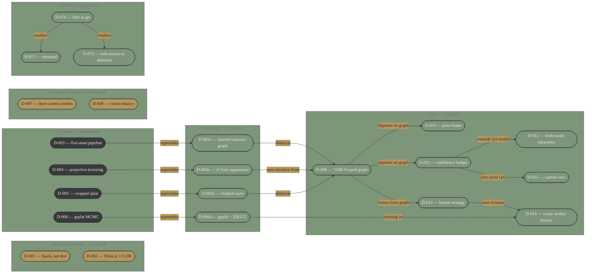

# ADR dependency and supersession graph

The 22 architecture decision records in `docs/architecture/adr/` and how they relate. Source of truth is the index at `docs/architecture/adr/README.md`; if status disagrees, the index wins.

Status legend: gold = Accepted, charcoal = Superseded, sage = Proposed. Terracotta (Blocked) is reserved for future use; off-white (Not started) is not used in this graph because every ADR has at least proposed status.

## When to update

Regenerate after each ADR landing or status change. Status colours come from `docs/architecture/adr/README.md`'s status tables — that file is authoritative if the two ever disagree. Manual cadence for now; consider `scripts/generate-diagrams.ts` after two weeks of manual flow if the diagram is actually being consulted (per D-071).
