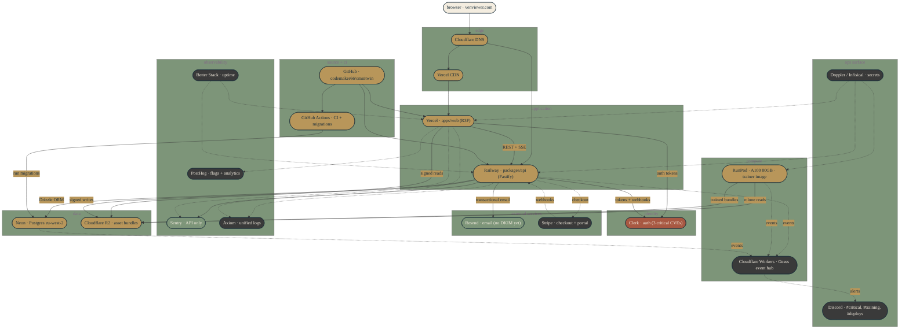

# Infrastructure map

Snapshot of Venviewer's runtime infrastructure as of 2026-04-29. Solid
arrows = data flow in production today. Dotted arrows = planned routes
gated on backlog tasks. Status colour reflects the component, not the
edge — see legend below the diagram.

## Legend

- **Gold** — current / operational in production
- **Sage** — partial: deployed but missing pieces (Sentry exists on API
  only per T-092; Resend lacks DKIM/SPF/DMARC per T-063)
- **Charcoal** — planned / deferred, gated on backlog tasks
- **Terracotta** — at-risk: Clerk has 3 critical CVEs requiring upgrade
  per T-080 before any auth-touching work proceeds

## Layer-by-layer notes

**Edge.** Cloudflare DNS routes `venviewer.com` to Vercel for the web
app and to Railway for `omnitwinapi-production.up.railway.app`. Vercel
CDN caches static assets and the R3F bundle. CDN cache strategy for
venue assets (`.ply`, `.spz`, `manifest.json`) tracked under T-067 —
currently implicit, needs explicit `Cache-Control` headers.

**Application.** Vercel hosts `apps/web` (React + R3F frontend, auto-
deploy on push to master). Railway hosts `packages/api` (Fastify
backend, auto-deploy on push to master). Both deploys are independent
and ungated — T-085 documents this honestly; T-093 builds the gated
orchestration.

**Identity.** Clerk handles auth for both surfaces. Three critical CVEs
flagged in `pnpm audit` are blocking — T-080 must close before T-088
(invitation flow), T-094 (Stripe), or any product-vision capability
that touches user identity activates. Future Clerk → Better-Auth
migration scoped under T-069 (b) when Clerk's monthly bill exceeds two
days of an engineer's salary.

**Data.** Neon Postgres (eu-west-2) backs all transactional state via
Drizzle ORM. Cloudflare R2 holds signed `AssetVersion` bundles plus the
`colmap_v2` training dataset; zero-egress so RunPod pulling fresh per
run is cheaper than persistent volumes. Backup verification is *not*
yet exercised — T-062 is the precondition before any customer data
lands.

**Compute.** RunPod A100 80GB is the canonical splat-training environment
per D-016; local Windows training was deprecated 2026-04-25. Trainer
image `omnitwin/trainer:1.5.3-cu124` runs on Community Cloud (routine)
or Secure Cloud (canonical bake-off). Cloudflare Workers will host the
Geass event hub (T-054) under the `sentinel.*` schema namespace,
read-only on system events.

**External services.** Resend handles transactional email but the
`venviewer.com` sender domain is not yet configured with DKIM/SPF/
DMARC — T-063 closes that. Stripe is entirely planned (T-094) — the
`PricingPage` CTAs currently route to a missing `/onboard`.

**Observability.** Sentry catches API errors today; web-side error
boundaries currently only log to `console.error` — T-092 wires the
frontend. Axiom (T-065), PostHog (T-066), and Better Stack (T-061) are
all planned and budget-aligned (free tiers across the board).

**Source + CI.** GitHub repo `codemaker66/omnitwin`. GitHub Actions
runs CI (lint + typecheck + tests + E2E suite, last of which has 28
failing tests pending T-084 triage) and runs migrations against Neon
after CI passes. Vercel and Railway watch the repo independently for
auto-deploy.

**Ops surface.** Doppler or Infisical (T-064) will become the single
source of truth for secrets, syncing to Vercel, Railway, RunPod, and
local `.env`. Discord — channels `#critical`, `#training`, `#deploys`,
`#daily-digest`, `#cost-alerts` — is the planned delivery surface for
Geass events (T-054).

## When to update

Regenerate when any infra component changes — provider switch, region
move, new service added, sender domain configured, etc. Status colours
should flip from charcoal → sage → gold as backlog tasks close. Mark
T-NNN closures in the relevant component's footnote to keep the audit
trail.
