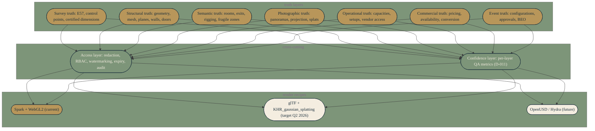

# Scene graph — VSIR-0 typed spatial-layer graph

VSIR-0 typed spatial-layer graph per D-009. Designed to be USD-isomorphic — mirror semantics to `UsdVolParticleField3DGaussianSplat` when Khronos KHR_gaussian_splatting ratifies (expected Q2 2026).

Every truth layer feeds both cross-cutting layers (access and confidence). Both cross-cutting layers feed every render recipe. The structure is what makes a switch of render recipe (Spark today, glTF when KHR ratifies, OpenUSD later) a recipe-swap rather than a rewrite.

## When to update

Regenerate when D-009 (VSIR-0) or any cross-cutting ADR (D-011 confidence budget, D-012 truth-mode separation) lands a structural change. The render-recipe row updates when D-013 (format strategy) pins a new target — for instance, when KHR_gaussian_splatting ratifies and `r_gltf` flips to gold, or when an OpenUSD/Hydra path is demonstrated and `r_usd` moves off-white.
