# Task dependency graph

Tier 0 + Tier 1 only. Tiers 2–6 are tracked in `docs/state/tasks.md` but not visualized here (too dense). Consider `scripts/generate-diagrams.ts` after two weeks if diagrams are actually being consulted.

```mermaid
%%{init: {
  'theme': 'base',
  'themeVariables': {
    'primaryColor': '#f4ede0',
    'primaryTextColor': '#1a2e3b',
    'primaryBorderColor': '#1a2e3b',
    'lineColor': '#3a3a3a',
    'secondaryColor': '#b8965a',
    'tertiaryColor': '#7d9579',
    'fontFamily': 'Georgia, serif'
  }
}}%%
flowchart TD

    subgraph this_week [this week]
        T001(["T-001 — RunPod migration"])
        T002(["T-002 — RunPod runbook"])
        T003(["T-003 — Config B training"])
        T004(["T-004 — §316 prompt (rejected)"])
        T005(["T-005 — eval Config B"])
    end

    subgraph next_done [next 2 weeks — done]
        T006(["T-006 — reframe ADR-003"])
        T007(["T-007 — reframe ADR-005"])
        T008(["T-008 — soften ADR-004"])
        T009(["T-009 — soften ADR-006"])
        T011(["T-011 — draft D-009"])
        T012(["T-012 — draft D-010"])
        T013(["T-013 — draft D-011"])
        T014(["T-014 — draft D-012"])
        T015(["T-015 — draft D-013"])
        T016(["T-016 — draft D-014"])
        T017(["T-017 — draft D-015"])
    end

    subgraph next_pending [next 2 weeks — pending]
        T010(["T-010 — soften ADR-008"])
        T018(["T-018 — AssetVersion schema"])
        T052(["T-052 — Three.js 0.170 → 0.180"])
    end

    T001 --> T002
    T001 --> T003
    T003 --> T005
    T016 --> T018

    classDef done fill:#b8965a,color:#1a2e3b
    classDef inprogress fill:#7d9579,color:#f4ede0
    classDef deferred fill:#3a3a3a,color:#f4ede0
    classDef blocked fill:#a85842,color:#f4ede0
    classDef notstarted fill:#f4ede0,color:#1a2e3b

    class T006,T007,T008,T009,T011,T012,T013,T014,T015,T016,T017 done
    class T001,T002,T003,T005,T010,T018,T052 notstarted
    class T004 deferred
```

`T-004` is rendered with the deferred (charcoal) class for visual consistency, but the actual status in `docs/state/tasks.md` is **rejected** — there is no rejected colour class in the theme. The label text `(rejected)` carries the truth.

`T-052` has no dependencies but is grouped with the Tier 1 pending subgraph because it is the Three.js 0.170 → 0.180 upgrade required for any Spark 2.0 production work — it lives logically in the next-2-weeks band even though it's an upgrade rather than a follow-on from another task.

## When to update

Regenerate after each `tasks.md` change. Manual for now; automate via `scripts/generate-diagrams.ts` only if the manual flow proves worthwhile after two weeks of use.
