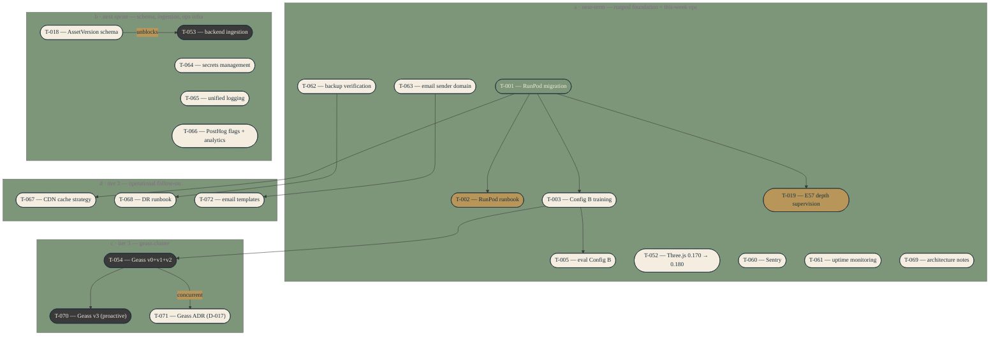

# Task dependency graph

Active backlog only. Tier 0 + the dependency-relevant slice of Tier 1/2,
plus the Tier 3 cluster covering Geass and operational follow-on. Tier 1
done work and lower-priority Tier 2/4/5/6 tasks live in `docs/state/tasks.md`
and are not visualised here. Regenerate after each `tasks.md` change.
Consider `scripts/generate-diagrams.ts` after two weeks if diagrams are
actually being consulted.

Subgraph A reflects the 2026-04-27 re-tiering: T-060, T-061, T-062, T-063,
T-069 moved from Tier 3 to Tier 0 because shipping production traffic
without error tracking, uptime monitoring, verified backups, or proper
email is below the S+ tier bar.

Subgraph B's ops infrastructure tasks (T-064, T-065, T-066) moved from
Tier 3 to Tier 1 in the same re-tiering — second-wave ops work that doesn't
gate first-customer launch but is needed inside two weeks.

`T-019` (Tier 2, done) is shown for dependency context — the E57 depth
supervision generator consumes T-001 outputs.

`T-053` (Tier 2) is shown because the backend-ingestion script template is
queued for the moment T-018 lands. Edge `T-018 → T-053` carries the label
"unblocks" because it expresses the activation trigger, not a code-level
dependency.

`T-054 → T-070` is a soft activation edge: T-070 also requires ≥ 14 days
of operational history in the `sentinel.events` table before activation,
on top of T-054 being `done`. Hard task-list dependency is on T-054 alone;
the history condition lives in the T-070 Notes field.

`T-054 → T-071` carries the label "concurrent" because the ADR is meant
to be written alongside T-054 implementation start, not before — the
dependency runs in the opposite direction from a normal blocking
dependency.

`T-001 → T-067` expresses that the CDN cache strategy needs real bundle
output from RunPod training to define cache headers against. T-067 cannot
land before the first signed AssetVersion bundle exists in R2.

`T-062 → T-068` is a precondition edge: the disaster recovery runbook is
empty ceremony if backup restore has never been verified.

`T-063 → T-072` expresses that the email template system benefits from
having the sender domain live first, so each template can be live-tested
end-to-end.

T-064, T-065, T-066 in subgraph B have no incoming edges — they are
independent ops infrastructure work that activates when capacity allows
inside the next-sprint window.

`T-010` (Tier 1, not-started, impact 2, marked "reopen on first
multi-property customer") is omitted as effectively dormant — it has no
downstream dependencies in the visualised set and reactivates only on a
future event.

Subgraph A contains 11 nodes — busy enough that another node would hurt
readability. If T-073+ near-term work lands, split A further before adding
nodes. (`docs/diagrams/_theme.md` line 51 caps a single diagram at 12
nodes before splitting; subgraphs are the relief mechanism. The 11-node
guidance here is per-subgraph readability advice, not the per-diagram
cap.)

## When to update

Regenerate after each `tasks.md` change. Manual for now; automate via
`scripts/generate-diagrams.ts` only if the manual flow proves worthwhile
after two weeks of use.
