# Task dependency graph

Active backlog: Tier 0 work in flight, schema/ingestion gates, the
audit-driven cluster (T-080–T-099), the Tier 3 Geass cluster, ops/doc
follow-on, and the deferred Product Vision capabilities (T-100–T-110)
per ADR D-018. Tier 1 done work, T-010, and lower-priority Tier 2/4/5/6
tasks live in `docs/state/tasks.md` and are not visualised here.
Regenerate after each `tasks.md` change.

## Subgraph index

- **A1** — this week, RunPod foundation
- **A2** — this week, ops baseline + audit fixes
- **A3** — this week, viewer presentation polish + trust doctrine
- **A4** — strategy readiness
- **B** — next 2 weeks, gap closing + ops follow-on
- **C** — weeks 3–6, reconstruction + edge cases
- **D** — Tier 3, Geass cluster
- **E** — Tier 3, operational + doc follow-on
- **F** — Product Vision (deferred), capabilities per D-018

```mermaid
%%{init: {
  'theme': 'base',
  'themeVariables': {
    'primaryColor': '#f4ede0',
    'primaryTextColor': '#1a2e3b',
    'primaryBorderColor': '#1a2e3b',
    'lineColor': '#3a3a3a',
    'secondaryColor': '#b8965a',
    'tertiaryColor': '#7d9579',
    'fontFamily': 'Georgia, serif'
  }
}}%%
flowchart TD

    subgraph A1 [a1 · this week — runpod foundation]
        T001(["T-001 — RunPod migration"])
        T002(["T-002 — RunPod runbook"])
        T003(["T-003 — Config B training"])
        T005(["T-005 — eval Config B"])
        T019(["T-019 — E57 depth supervision"])
        T052(["T-052 — Three.js 0.170 → 0.180"])
    end

    subgraph A2 [a2 · this week — ops baseline + audit fixes]
        T060(["T-060 — Sentry"])
        T061(["T-061 — uptime monitoring"])
        T062(["T-062 — backup verification"])
        T063(["T-063 — email sender domain"])
        T069(["T-069 — architecture notes"])
        T080(["T-080 — Clerk CVE upgrade"])
        T081(["T-081 — lint fix"])
        T082(["T-082 — placeholder copy"])
        T083(["T-083 — soften photoreal claim"])
        T084(["T-084 — E2E triage"])
        T085(["T-085 — deploy flow doc"])
        T113(["T-113 — 2D/3D grouped movement"])
        T403(["T-403 — idempotent deploy migration replay"])
    end

    subgraph A3 [a3 · this week — viewer presentation polish + trust doctrine]
        T114(["T-114 — Grand Hall visual fidelity"])
        T115(["T-115 - Grand Hall reference correction"])
        T122(["T-122 - Device-class UX doctrine"])
        T123(["T-123 - Truth Mode doctrine"])
        T124(["T-124 - Truth state tokens"])
        T127(["T-127 - Truth L1/L2 indicator"])
        T135(["T-135 - 3D planner mobile shell"])
        T136(["T-136 - scene-first mobile planner shell"])
        T156(["T-156 - Grand Hall landing redesign"])
        T354(["T-354 - landing planner fit + room picker"])
        T355(["T-355 - desktop landing planner hotfix"])
        T356(["T-356 - 3D planner wall + ceiling fix"])
        T357(["T-357 - camera POV references"])
        T358(["T-358 - 3D planner autosave validation"])
        T359(["T-359 - landing Planrise visual cleanup"])
        T360(["T-360 - landing 2D planner refit"])
        T361(["T-361 - landing 2D planner delete control"])
        T362(["T-362 - Grand Hall window wall panel cleanup"])
        T363(["T-363 - ornamented wall disassemble continuity"])
        T364(["T-364 - Grand Hall wall doors"])
        T365(["T-365 - Grand Hall fireplace orientation"])
        T366(["T-366 - dialog typing freezes camera pan"])
        T367(["T-367 - Trades Hall banquet chair mesh"])
        T368(["T-368 - folding 6ft round table mesh"])
        T369(["T-369 - refined folding table reference match"])
        T370(["T-370 - anonymous refresh-safe planner drafts"])
        T371(["T-371 - remove incorrect placeholder doors"])
        T372(["T-372 - draggable POV dialog"])
        T373(["T-373 - POV header selection hardening"])
        T374(["T-374 - floor/window/fireplace material cues"])
        T375(["T-375 - polished honey plank floor tune"])
        T376(["T-376 - restore opposite-wall double doors"])
        T377(["T-377 - POV input drag + selection polish"])
        T378(["T-378 - seat/table labels + optional POV"])
        T379(["T-379 - remove right-side wall icon"])
        T380(["T-380 - section hides ornaments"])
        T381(["T-381 - interrupted door chair rail"])
        T382(["T-382 - no native planner text selection"])
        T383(["T-383 - toolbar caption fit"])
        T384(["T-384 - internal Spark visual route"])
        T390(["T-390 - table/chair group integrity"])
        T391(["T-391 - furniture category navigation"])
        T392(["T-392 - chair brush + premium planner continuation"])
        T393(["T-393 - first-person POV controls"])
        T394(["T-394 - drag-from-catalogue placement"])
        T395(["T-395 - permissive precise placement"])
        T396(["T-396 - selected-table dressing"])
        T397(["T-397 - laser diagram markup"])
        T398(["T-398 - cinematic planner shell"])
        T399(["T-399 - transitive audit floors"])
        T400(["T-400 - planner status + chunk warning guard"])
        T401(["T-401 - CI E2E timeout guard"])
        T402(["T-402 - remote Playwright drag/auth stability"])
        T404(["T-404 - planner command deck"])
        T405(["T-405 - starter proposal + event HUD"])
        T406(["T-406 - blank fast /plan opening"])
        T407(["T-407 - internal visual command shell"])
        T408(["T-408 - live /plan command shell + readable labels"])
        T409(["T-409 - hidden heart easter egg"])
        T410(["T-410 - premium table/seat callouts"])
        T418(["T-418 - planner header/toolbar overlap fix"])
        T419(["T-419 - smooth non-magnetic furniture drag"])
        T420(["T-420 - suspend camera keys during UI input"])
        T421(["T-421 - reliable recursive test suite"])
        T422(["T-422 - API client response validation"])
        T423(["T-423 - runtime visual-asset provenance"])
        T424(["T-424 - live capacity intelligence"])
        T441(["T-441 - hallkeeper offline progress sync"])
        T442(["T-442 - idempotent progress PATCH"])
        T443(["T-443 - retail route and copy polish"])
        T444(["T-444 - dependency audit pins"])
        T445(["T-445 - runtime room/URL hardening"])
        T446(["T-446 - full local verification sweep"])
        T137(["T-137 - Residual Radiance doctrine"])
    end

    subgraph A4 [a4 · strategy readiness]
        T412(["T-412 - OpenAI/FDE readiness memo"])
    end

    subgraph B [b · next 2 weeks — gap closing + ops follow-on]
        T018(["T-018 — AssetVersion schema"])
        T053(["T-053 — backend ingestion"])
        T064(["T-064 — secrets management"])
        T065(["T-065 — unified logging"])
        T066(["T-066 — PostHog flags + analytics"])
        T086(["T-086 — fix E2E failures"])
        T087(["T-087 — Three 0.180 + Spark"])
        T088(["T-088 — invitation flow"])
        T089(["T-089 — asset upload scoping"])
        T090(["T-090 — replace as-unknown-as"])
        T091(["T-091 — Trades Hall real evidence"])
        T092(["T-092 — frontend Sentry"])
        T093(["T-093 — gated deploy"])
        T353(["T-353 — post-ultrareview hardening"])
    end

    subgraph C [c · weeks 3–6 — reconstruction + edge cases]
        T094(["T-094 — Stripe integration"])
        T095(["T-095 — multi-venue routing"])
        T096(["T-096 — editor concurrency"])
        T097(["T-097 — brief privacy"])
        T098(["T-098 — dep reproducibility"])
        T116(["T-116 — TransformArtifactV0"])
        T117(["T-117 — Hero Region spike"])
        T118(["T-118 — E57 deterministic meshing"])
        T119(["T-119 — RealityScan/PGSR/2DGS/neural compare"])
        T120(["T-120 — Chandelier/stained-glass proxy workflow"])
        T121(["T-121 — Truth Mode authority display"])
        T385(["T-385 — splat-transform bridge feasibility"])
        T386(["T-386 — splat-transform scene.ply fixture"])
        T387(["T-387 — PlayCanvas toolchain feasibility"])
        T388(["T-388 — SuperSplat diagnostic viewer fixture"])
        T389(["T-389 — PlayCanvas voxel/collision proxy eval"])
    end

    subgraph D [d · tier 3 — geass cluster]
        T054(["T-054 — Geass v0+v1+v2"])
        T070(["T-070 — Geass v3 (proactive)"])
        T071(["T-071 — Geass ADR (D-017)"])
    end

    subgraph E [e · tier 3 — operational + doc follow-on]
        T067(["T-067 — CDN cache strategy"])
        T068(["T-068 — DR runbook"])
        T072(["T-072 — email templates"])
        T099(["T-099 — per-package READMEs"])
    end

    subgraph F [f · product vision — deferred, capabilities per D-018]
        T100(["T-100 — Verified Photoreal Twin"])
        T101(["T-101 — Truth Heatmap"])
        T102(["T-102 — Constraint Solver"])
        T103(["T-103 — Prompt-To-Perfect Event"])
        T104(["T-104 — Pricing Engine"])
        T105(["T-105 — Live Planning Room"])
        T106(["T-106 — Lookbook / Style"])
        T107(["T-107 — Event Ops Compiler"])
        T108(["T-108 — Cinematic Share"])
        T109(["T-109 — Audit Trail"])
        T110(["T-110 — Revenue Optimizer"])
    end

    T001 --> T002
    T001 --> T003
    T001 --> T019
    T001 --> T067
    T001 --> T091
    T156 --> T354
    T354 --> T355
    T354 --> T359
    T355 --> T359
    T360 --> T361
    T115 --> T356
    T115 --> T362
    T356 --> T363
    T362 --> T363
    T115 --> T364
    T363 --> T364
    T115 --> T365
    T364 --> T365
    T115 --> T371
    T365 --> T371
    T115 --> T374
    T371 --> T374
    T374 --> T375
    T115 --> T376
    T363 --> T376
    T371 --> T376
    T372 --> T377
    T373 --> T377
    T357 --> T378
    T370 --> T378
    T377 --> T378
    T356 --> T379
    T374 --> T380
    T376 --> T380
    T379 --> T380
    T087 --> T384
    T384 --> T407
    T123 --> T407
    T127 --> T407
    T407 --> T091
    T385 --> T386
    T091 --> T386
    T385 --> T387
    T387 --> T388
    T091 --> T388
    T386 --> T388
    T387 --> T389
    T386 --> T389
    T357 --> T366
    T357 --> T393
    T366 --> T393
    T391 --> T394
    T390 --> T395
    T394 --> T395
    T378 --> T396
    T394 --> T396
    T395 --> T396
    T135 --> T397
    T395 --> T397
    T392 --> T398
    T397 --> T398
    T080 --> T399
    T087 --> T400
    T398 --> T400
    T398 --> T404
    T400 --> T404
    T402 --> T404
    T392 --> T405
    T398 --> T405
    T404 --> T405
    T405 --> T406
    T378 --> T408
    T398 --> T408
    T404 --> T408
    T406 --> T408
    T378 --> T410
    T408 --> T410
    T408 --> T418
    T395 --> T419
    T408 --> T419
    T393 --> T420
    T397 --> T420
    T408 --> T420
    T087 --> T423
    T384 --> T423
    T122 --> T424
    T423 --> T424
    T441 --> T442
    T083 --> T443
    T423 --> T443
    T424 --> T443
    T080 --> T444
    T421 --> T444
    T423 --> T445
    T443 --> T446
    T444 --> T446
    T445 --> T446
    T400 --> T401
    T401 --> T402
    T357 --> T372
    T366 --> T372
    T372 --> T373
    T115 --> T367
    T358 --> T367
    T115 --> T368
    T358 --> T368
    T368 --> T369
    T376 --> T381
    T380 --> T381
    T135 --> T382
    T378 --> T382
    T135 --> T383
    T382 --> T383
    T135 --> T370
    T358 --> T370
    T135 --> T356
    T135 --> T357
    T135 --> T358
    T357 --> T358
    T003 --> T005
    T003 --> T054
    T018 -- "unblocks" --> T053
    T054 --> T070
    T054 -- "concurrent" --> T071
    T062 --> T068
    T063 --> T072
    T080 --> T088
    T080 --> T094
    T080 --> T098
    T084 --> T086
    T085 --> T093
    T085 --> T403
    T088 --> T353
    T089 --> T353
    T090 --> T353
    T087 --> T098
    T114 --> T115
    T115 --> T122
    T122 --> T135
    T122 --> T156
    T135 --> T136
    T123 --> T124
    T123 --> T121
    T123 --> T137
    T124 --> T121
    T124 --> T127
    T001 --> T118
    T116 --> T091
    T116 --> T117
    T116 --> T120
    T116 --> T121
    T118 --> T091
    T118 --> T117
    T118 --> T119
    T117 --> T091
    T117 --> T120
    T120 --> T091
    T121 --> T091

    T091 --> T100
    T100 --> T101
    T087 --> T101
    T091 --> T102
    T018 --> T102
    T087 --> T102
    T102 --> T103
    T104 --> T103
    T107 --> T103
    T080 --> T103
    T094 --> T104
    T018 --> T104
    T018 --> T105
    T080 --> T105
    T064 --> T105
    T018 --> T106
    T018 --> T107
    T102 --> T107
    T100 --> T108
    T087 --> T108
    T067 --> T108
    T018 --> T109
    T105 --> T109
    T102 --> T110
    T104 --> T110
    T107 --> T110

    classDef done fill:#b8965a,color:#1a2e3b
    classDef inprogress fill:#7d9579,color:#f4ede0
    classDef deferred fill:#3a3a3a,color:#f4ede0
    classDef blocked fill:#a85842,color:#f4ede0
    classDef notstarted fill:#f4ede0,color:#1a2e3b

    class T002,T019,T052,T080,T081,T082,T083,T084,T085,T086,T087,T088,T089,T090,T095,T096,T097,T098,T099,T113,T114,T115,T122,T123,T124,T127,T135,T136,T137,T156,T353,T354,T355,T356,T357,T358,T359,T360,T361,T362,T363,T364,T365,T366,T367,T368,T369,T370,T371,T372,T373,T374,T375,T376,T377,T378,T379,T380,T381,T382,T383,T384,T385,T387,T390,T391,T392,T393,T394,T395,T396,T397,T398,T399,T400,T401,T402,T403,T404,T405,T406,T407,T408,T409,T410,T412,T418,T419,T420,T421,T422,T423,T424,T441,T442,T443,T444,T445,T446 done
    class T001 inprogress
    class T060,T092 blocked
    class T003,T005,T018,T061,T062,T063,T064,T065,T066,T067,T068,T069,T071,T072,T091,T093,T094,T116,T117,T118,T120,T121,T386,T388,T389 notstarted
    class T053,T054,T070,T100,T101,T102,T103,T104,T105,T106,T107,T108,T109,T110,T119 deferred
```

`T-053` (Tier 2) is shown because the backend-ingestion script template
is queued for the moment T-018 lands. Edge `T-018 → T-053` carries the
label "unblocks" because it expresses the activation trigger, not a
code-level dependency.

`T-054 → T-070` is a soft activation edge: T-070 also requires ≥ 14 days
of operational history in the `sentinel.events` table before activation,
on top of T-054 being `done`. Hard task-list dependency is on T-054
alone; the history condition lives in the T-070 Notes field.

`T-054 → T-071` carries the label "concurrent" because the ADR is meant
to be written alongside T-054 implementation start, not before — the
dependency runs in the opposite direction from a normal blocking
dependency.

`T-001 → T-067` expresses that the CDN cache strategy needs real bundle
output from RunPod training to define cache headers against.
`T-001 → T-091` is the same pattern: T-091 (Trades Hall real evidence)
is gated on the RunPod migration completing because the entire training
pipeline lives there.
`T-001 → T-118` reflects that deterministic E57 meshing needs the capture
and training artifact flow available before it can be compared against the
real Trades Hall data.
`T-385 → T-386` and `T-091 → T-386` capture the splat-transform bridge
split: the feasibility note is complete, but the actual cleanup/statistics/
voxel/collision fixture waits for a real RunPod `scene.ply`.
`T-385 → T-387` captures the wider PlayCanvas toolchain feasibility follow-up.
`T-387 → T-388` and `T-091/T-386 → T-388` keep the SuperSplat diagnostic
viewer fixture behind a real scene and the first splat-transform fixture.
`T-387/T-386 → T-389` keeps PlayCanvas voxel/collision proxy evaluation
separate from authoritative operational geometry until fixture evidence exists.
`T-390` closes the labelled table/chair group-integrity regression in the
current 3D planner. `T-391 → T-392` separates the first catalogue-navigation
upgrade from the larger premium planner continuation: chair row/block brush
placement, richer multi-select ergonomics, and deeper visual direction work.
`T-390/T-394 → T-395` closes the first precision-placement slice: catalogue
dragging and table-ring integrity are preserved while furniture movement becomes
grab-offset based, alignment-aware, permissive under soft violations, and visibly
constraint-labelled instead of hard-blocked.
`T-378/T-394/T-395 → T-396` adds table-bound dressing actions on top of labels,
drag-from-catalogue placement, and permissive targeting: selected tables can
receive black/white cloths and dinner place settings without placing loose decor
objects or losing metadata on save/reload.
`T-392/T-397 → T-398` captures the first shared cinematic shell slice after the
larger premium-planner follow-up and laser markup tool: the planner canvas now has
warm grading/vignette, and toolbar/catalogue/mobile dock chrome uses the same
deeper black/gold material system without changing runtime data or public claims.
`T-357/T-366 → T-393` keeps saved camera-reference POVs aligned with the
existing right-click POV and dialog-keyboard safety work: entering a saved
chair/table/floor POV switches to human eye-point look controls until Escape
restores the previous planner camera.
`T-080 → T-399` records the 2026-05-09 transitive audit floor refresh: the
Clerk/security hardening baseline remains clean after new Fastify/AWS SDK
advisories by pinning patched `fast-uri` and `fast-xml-builder` versions.
`T-087/T-398 → T-400` records the planner polish and build-noise cleanup on top
of the Spark/Three split and cinematic shell: the known large vendor chunks stay
lazy/manual-chunked, the generic Vite size warning is quieted intentionally, and
desktop `/plan` gets a Grand Hall command/status surface without changing public
claims or real-asset/T-091 state.
`T-400 → T-401` records the CI/E2E stabilization pass after the first pushed
planner polish commit: the GitHub Actions E2E timeout now matches the actual
expanded Playwright suite, and the dev Truth Mode overlay no longer intercepts
planner controls during local/CI dev-mode tests.
`T-401 → T-402` captures the remote-only Playwright flakes found after the
timeout was fixed: right-button release now owns POV creation while contextmenu
only suppresses the browser menu, catalogue drag/drop has a mouseup fallback for
remote Chromium, and the hallkeeper route protection test seeds an explicit
unauthenticated E2E auth state.
`T-085 → T-403` captures the immediate deploy-pipeline repair found after CI was
green: the production migration workflow reached Drizzle but failed replaying the
historical configuration-review constraint, so the canonical SQL now matches the
already-idempotent operator script and safely no-ops when that constraint exists.
`T-398/T-400/T-402 → T-404` captures the next planner-polish layer after the
cinematic shell, status/chunk guard, and remote E2E stabilisation: the live
desktop planner now has a context-aware command deck for catalogue, markup,
selection, grouping, deletion, table dressing, and human POV actions without
introducing a second planner state machine or changing public evidence claims.
`T-392/T-398/T-404 → T-405` captures the next visible opening-state pass:
new public Grand Hall drafts now seed a real editable starter proposal with
dressed dining rounds, a central banquet row, and a derived spaces/capacity HUD,
while the desktop camera opens in a fuller top-down planning-board composition.
`T-405 → T-406` records the immediate correction from live feedback: the starter
proposal made the default planner too heavy and violated the blank-hall expectation,
so `/plan` now creates an empty hall again while preserving the lightweight HUD/camera
chrome.
`T-384/T-123/T-127 → T-407 → T-091` keeps the internal visual command shell
separate from real-asset evidence: the route now has premium command-center chrome
and honest Truth Mode-shaped fixture data, but still waits for a real signed runtime
bundle before T-091/T-091A can close.
`T-378/T-398/T-404/T-406 → T-408` records the live `/plan` reference-alignment
pass after the label, cinematic shell, command-deck, and blank-opening fixes:
desktop now gets a full-width command-center status bar and large camera-facing
seat/table nameplates while preserving the empty default hall and evidence-claim
guardrails.
`T-409` records the small hidden global easter egg: the `jackielarkin`
key sequence now triggers a giant seven-pulse love heart while ignoring
editable fields and planner naming flows.
`T-378/T-408 → T-410` records the label quality correction after visual
feedback: table and seat names now render as larger black/gold command
callouts with contextual rows and object-side anchoring rather than tiny
strips across the furniture surface.
`T-412` records the internal OpenAI Deployment Company / FDE-readiness
strategy memo. It is intentionally doc-only: it maps Venviewer to an
FDE-style workflow deployment pattern, identifies missing proof, and does
not imply OpenAI endorsement, partnership, investment, or support.
`T-418` records the targeted desktop `/plan` chrome correction after the
command header work: the left rail and catalogue panel now dock below the
top Venviewer status bar, with Playwright coverage preventing the first
toolbar button from peeking under the top-left brand area again.
`T-395/T-408 → T-419` records the active-drag feel correction after the
permissive placement and live command-shell work: placed furniture now follows
the grabbed pointer point continuously during drag while smart alignment stays
visual-only, removing wall/object magnetism without changing grouping,
constraints, or save semantics.
`T-393/T-397/T-408 → T-420` records the camera-keyboard input safety fix after
human POV, Laser Diagram, and command-shell work: WASD/arrow camera panning now
only runs while the scene is idle, so menus, active tools, selected furniture,
marquee selection, placement, and dialogs cannot accidentally fling the view
away from the hall.
`T-083/T-423/T-424 → T-443` records the retail-client route/copy/handoff
polish sweep after the public claim guard, runtime-asset honesty foundation,
and planning-grade capacity disclosure: public pages no longer imply a real
captured Grand Hall asset before T-091 evidence exists, acquisition CTAs and
legal aliases stop falling through to the homepage, and staff/customer layout
handoffs use `/plan` rather than the legacy `/editor` shell.

`T-116 → T-091`, `T-118 → T-091`, `T-117 → T-091`, `T-120 → T-091`,
and `T-121 → T-091` capture the new D-024 planning split: real venue
loading needs persisted transforms, a deterministic room-shell mesh
baseline, explicit hero-region handling, a proxy workflow for chandelier
and stained-glass regions, and an honest raw/enhanced/proxy/splat
authority display before the signed runtime package can claim production
readiness. `T-118 → T-119` keeps RealityScan/PGSR/2DGS/neural surface
reconstruction as comparison work after the deterministic baseline, not
as the default production path.

`T-123 -> T-124 -> T-121` captures the Truth Mode doctrine-to-token-to-runtime
sequence: the first runtime overlay must follow the multi-axis trust model,
and it must use the shared semantic token vocabulary rather than component-local
colors. `T-124 -> T-127` captures the small L1/L2 trust-interface foundation
that can honestly label the current procedural scene before full provenance
exists. Follow-up Truth Mode tasks T-125, T-126, and T-128 through T-134 remain
in `docs/state/tasks.md`; they are not visualised here to keep the graph
readable.

`T-122 -> T-135` keeps the device-class UX doctrine connected to the actual
3D planner shell: T-122 fixed the Trades Hall landing/2D preview behavior,
while T-135 applies the same phone/tablet/desktop discipline to the live 3D
editor chrome, touch hints, CTA placement, and save-state surface.

`T-135 -> T-136` separates the first mobile safety pass from the deeper
interaction-shell redesign: T-136 replaces the remaining compressed desktop
toolbar with a scene-first mobile top bar, stateful touch dock, and mobile
placing/selection sheets while preserving desktop power-editor shortcuts.

`T-122 -> T-156` extends the device-class doctrine from responsive planner
behavior into the public Trades Hall module: the page is now Grand Hall-first,
with venue-oriented copy, real hall media, interactive preview, preset paths,
and phone/tablet/desktop viewport coverage.

`T-123 -> T-137` keeps the Residual Radiance Layer research track tied to
Truth Mode doctrine. A residual over a semantic/PBR mesh is allowed only as an
explainable appearance layer; the mesh remains authoritative for geometry,
semantics, collision, editing, measurement, and exports. Follow-up RRL research
and prototype-phase tasks T-138 through T-155 remain in Tier 6 and are not
visualised here.

`T-062 → T-068` is a precondition edge: the disaster-recovery runbook
is empty ceremony if backup restore has never been verified.

`T-063 → T-072` expresses that the email template system benefits from
having the sender domain live first, so each template can be live-tested
end-to-end.

`T-080 → T-088`, `T-080 → T-094`, `T-080 → T-098`, `T-080 → T-103`,
`T-080 → T-105` all reflect that the Clerk CVE upgrade blocks
downstream auth-touching work: invitation flow, Stripe integration,
dependency pin, prompt-to-event (touches user identity), and the
multiplayer planning room (per-room access control) all wait for the
auth surface to be patched.

`T-095` closes the silent multi-venue routing gap: `/v/:venueSlug/plan`
now resolves the explicit venue slug, refuses missing/unauthorized slugs,
and is covered by two-venue Playwright routing so a future second venue
does not accidentally create layouts against the first venue.

`T-080/T-421 → T-444` records the 2026-06-07 dependency audit refresh after
the auth/security baseline and reliable test-suite work: React Router,
Vitest, and vulnerable transitive `js-cookie`/`ws`/`brace-expansion` paths
are patched while the Vitest 4 config keeps the Windows heap protections
intact.

`T-423 → T-445` records a small runtime-asset hardening pass: the web visual
route now derives its room selector from the shared asset registry, uses the
same fixture/demo URL rejection vocabulary as the API/types contracts, and
keeps arbitrary manual `splatUrl` overrides out of production builds.

`T-443/T-444/T-445 → T-446` records the post-hardening local verification sweep
over public-route polish, dependency/security pins, and runtime URL hardening.
It is a local confidence gate, not a deployment or real-asset evidence claim.

`T-087 → T-098`, `T-087 → T-101`, `T-087 → T-102`, `T-087 → T-108`
reflect the same pattern for the Three.js/Spark upgrade — the modern
runtime is required before any product-vision capability that touches
the renderer can ship.

`T-084 → T-086` was the E2E triage-then-fix sequence: triage found the
current 29-failure state from the older 28-failure audit note, then
T-086 closed it with a full serial web E2E pass.

`T-085 → T-093` is the "document the current state before fixing it"
sequence: the deploy-flow gating work in T-093 needs the honest current
documentation from T-085 as its baseline.

Subgraph F (Product Vision) clusters T-103 + T-104 + T-107 — the
Prompt-to-Layout / Pricing / Ops Compiler triple that ships as one
effort per D-018 §"Activation gates". The T-104 → T-103 and T-107 →
T-103 edges represent that T-103 cannot complete without the other two,
even though the cluster activates them concurrently.

T-064, T-065, T-066 in subgraph B have no incoming edges — independent
ops infrastructure that activates when capacity allows inside the
next-sprint window.

T-092 in subgraph B has no incoming edge — frontend observability work
that doesn't sequence behind anything.

`T-010` (Tier 1, not-started, impact 2, marked "reopen on first
multi-property customer") is omitted as effectively dormant.

Subgraphs A2 and B contain 12 and 14 nodes respectively — both busy
enough that another node would hurt readability. F contains 11 nodes —
also at the readability ceiling. T-111 and T-112 are Tier 4 VSIR ADR
follow-ups and remain in `docs/state/tasks.md`, not this visual graph.
If more audit or product-vision nodes need visualization, split before
adding more nodes. T-157 through T-171 are the Layout Proof Object /
Layout Evidence Pack doctrine and follow-up research/implementation
tasks; T-172 through T-186 are the Crowd Simulation Replay Bundle /
Guest Flow Replay doctrine and follow-up research/implementation tasks;
T-187 through T-191 are the Assumption Ledger doctrine and follow-up
evidence/simulation assumption tasks; T-192 through T-197 are the Venue
Claim Lifecycle Engine doctrine and follow-up claim-state tasks; T-198
through T-202 are the Claim-Aware Copy Guard doctrine and follow-up
public-copy evidence tasks; T-203 through T-208 are the Capture Control
Network doctrine and follow-up pose/control tasks; T-209 through T-213 are
the Exposure Tier doctrine and follow-up artifact-governance tasks; T-214
through T-217 are the Calibrated Reliance Principle doctrine and follow-up
copy/UX/user-study checklist tasks; T-218 through T-222 are the Purpose-Fit
Evidence doctrine and follow-up purpose-vocabulary/Truth Mode/Evidence Pack
claim-guard tasks; T-223 through T-226 are the Layout Evidence Pack validator
message-key/template-rendering follow-up tasks; T-227 through T-230 are the
Scotland Policy Bundle route-validation boundary and route-discovery research
follow-up tasks; T-231 through T-236 are the Lighting Context Package / Probe
Leakage Guard doctrine and follow-up lighting-volume/probe/cubemap tasks;
T-237 through T-241 are the Guest Flow Replay scenario-template/instance
follow-up tasks; T-242 through T-248 are the `.venreplay.zip` Venviewer
Replay Artifact doctrine and follow-up schema/hash/loader/validator tasks;
T-249 through T-254 are the Photometric Chain-of-Custody doctrine and
fixed-light residual capture accountability follow-up tasks; T-255 through
T-259 are the Review Gate Engine doctrine and follow-up review-vocabulary/
witness/Truth Mode/events-team tasks; T-260 through T-264 are the Venue
Data Request Pack doctrine and follow-up onboarding/intake/documented-claim
mapping/review-workflow tasks; T-265 through T-268 are the Residual Disable
Test doctrine and follow-up fixture/render-comparison/authority-QA tasks.
T-269 through T-282 are the reports 20-25 hidden-lightbulb corrections:
Data Sufficiency Contract, Research Ingestion Guard, renderer-agnostic
lighting context, 2.5D flow connectors, multi-seed summaries, Appearance
Capture QA Pack, PLY-first/SPZ-second residual tests, Authoritative Zone Box,
and external-mesh Frosting background-disabled checks. T-283 through T-289
are the Venviewer Artifact Registry doctrine and follow-up artifact-type/
manifest/freshness/exposure/claim-mapping/audit-report tasks. T-290 through
T-295 are the License & IP Compliance Ledger doctrine and follow-up
JuPedSim, MILo/Frosting, Spark/SPZ, commercial-simulator, and
generated-artifact provenance license-review tasks. T-296 through T-301
are the Operational Geometry Compiler doctrine and follow-up GeoJSON schema,
walkable-area compiler, geometry-hash, polygon-validity, and data-sufficiency
tasks. T-302 through T-306 are the Flow Zone Authoring Layer doctrine and
follow-up zone-vocabulary, editor-spike, validation-test, and Trades Hall bar
queue authoring tasks. T-307 through T-311 are the Planning Evidence
Disclosure doctrine and follow-up wording-registry, PDF watermark, replay
viewer disclosure, and Truth Mode disclaimer tasks. T-312 through T-315 are
the internal engine naming note and package-boundary reviews for `venkernel`,
`venreplay`, and `venlight`. T-316 through T-320 are the Geometry
Approximation Policy doctrine and follow-up approximation-vocabulary,
proof-footprint-generator, Truth Mode display, and round/rotated-object test
tasks. T-321 through T-325 are the Simulation Job Boundary doctrine and
follow-up queue-selection, JuPedSim-worker, replay-status-API, and
timeout/retry-policy tasks. T-326 through T-352 are the Proof-Carrying
Venue Reality Stack master consolidation and follow-up missing-concept
tasks: Venue Claim Graph/HVET v0, documented venue intelligence,
provenance/OpenUSD truth layering, Event Phase Graph, human-review overlay,
frozen evaluation context, rule dependency graph, witness/telemetry split,
Venue Local CRS, 2.5D event-object semantics, regulatory trigger tags,
utility/cable routing, rule-owned wording, Guest Flow scenario data contract,
PET metric naming, lighting state machine, inserted-object lighting
provenance, residual bridge risk, splat coordinate precision, verified tool
capability, bridge verification, authoring constraints, severity split,
causal repair hints, seeded Truth Mode fixture, and measured-empty operational
policy. The done doctrine/spec tasks and remaining deferred evidence/simulation/
claim-lifecycle/capture-control/exposure-governance/calibrated-reliance/
purpose-fit/proof-message-rendering/route-validation/probe-leakage/
scenario-template/replay-artifact/photometric-capture/review-gates/
venue-onboarding/residual-disable/research-ingestion/data-sufficiency/
artifact-registry/license-compliance/operational-geometry/flow-zone/planning-
evidence-disclosure/internal-engine-naming/geometry-approximation/simulation-
job-boundary/proof-stack-consolidation work stay in Tier 6 of
`docs/state/tasks.md` and are not
visualised here until they move into the active T-091, Constraint Solver,
Truth Mode, or Event Ops Compiler path.
(`docs/diagrams/_theme.md` line 51 caps a single diagram at 12 nodes
before splitting; subgraphs are the relief mechanism. The per-subgraph
guidance here is readability advice, not the per-diagram cap.)

## When to update

Regenerate after each `tasks.md` change. Manual for now; automate via
`scripts/generate-diagrams.ts` only if the manual flow proves worthwhile
after two weeks of use.
