# Task dependency graph

Active backlog: Tier 0 work in flight, schema/ingestion gates, the
audit-driven cluster (T-080–T-099), the Tier 3 Geass cluster, ops/doc
follow-on, and the deferred Product Vision capabilities (T-100–T-110)
per ADR D-018. Tier 1 done work, T-010, and lower-priority Tier 2/4/5/6
tasks live in `docs/state/tasks.md` and are not visualised here.
Regenerate after each `tasks.md` change.

## Subgraph index

- **A1** — this week, RunPod foundation
- **A2** — this week, ops baseline + audit fixes
- **A3** — this week, viewer presentation polish + trust doctrine
- **B** — next 2 weeks, gap closing + ops follow-on
- **C** — weeks 3–6, reconstruction + edge cases
- **D** — Tier 3, Geass cluster
- **E** — Tier 3, operational + doc follow-on
- **F** — Product Vision (deferred), capabilities per D-018

```mermaid
%%{init: {
  'theme': 'base',
  'themeVariables': {
    'primaryColor': '#f4ede0',
    'primaryTextColor': '#1a2e3b',
    'primaryBorderColor': '#1a2e3b',
    'lineColor': '#3a3a3a',
    'secondaryColor': '#b8965a',
    'tertiaryColor': '#7d9579',
    'fontFamily': 'Georgia, serif'
  }
}}%%
flowchart TD

    subgraph A1 [a1 · this week — runpod foundation]
        T001(["T-001 — RunPod migration"])
        T002(["T-002 — RunPod runbook"])
        T003(["T-003 — Config B training"])
        T005(["T-005 — eval Config B"])
        T019(["T-019 — E57 depth supervision"])
        T052(["T-052 — Three.js 0.170 → 0.180"])
    end

    subgraph A2 [a2 · this week — ops baseline + audit fixes]
        T060(["T-060 — Sentry"])
        T061(["T-061 — uptime monitoring"])
        T062(["T-062 — backup verification"])
        T063(["T-063 — email sender domain"])
        T069(["T-069 — architecture notes"])
        T080(["T-080 — Clerk CVE upgrade"])
        T081(["T-081 — lint fix"])
        T082(["T-082 — placeholder copy"])
        T083(["T-083 — soften photoreal claim"])
        T084(["T-084 — E2E triage"])
        T085(["T-085 — deploy flow doc"])
        T113(["T-113 — 2D/3D grouped movement"])
    end

    subgraph A3 [a3 · this week — viewer presentation polish + trust doctrine]
        T114(["T-114 — Grand Hall visual fidelity"])
        T115(["T-115 - Grand Hall reference correction"])
        T122(["T-122 - Device-class UX doctrine"])
        T123(["T-123 - Truth Mode doctrine"])
        T124(["T-124 - Truth state tokens"])
        T127(["T-127 - Truth L1/L2 indicator"])
        T135(["T-135 - 3D planner mobile shell"])
        T136(["T-136 - scene-first mobile planner shell"])
        T156(["T-156 - Grand Hall landing redesign"])
        T137(["T-137 - Residual Radiance doctrine"])
    end

    subgraph B [b · next 2 weeks — gap closing + ops follow-on]
        T018(["T-018 — AssetVersion schema"])
        T053(["T-053 — backend ingestion"])
        T064(["T-064 — secrets management"])
        T065(["T-065 — unified logging"])
        T066(["T-066 — PostHog flags + analytics"])
        T086(["T-086 — fix E2E failures"])
        T087(["T-087 — Three 0.180 + Spark"])
        T088(["T-088 — invitation flow"])
        T089(["T-089 — asset upload scoping"])
        T090(["T-090 — replace as-unknown-as"])
        T091(["T-091 — Trades Hall real evidence"])
        T092(["T-092 — frontend Sentry"])
        T093(["T-093 — gated deploy"])
    end

    subgraph C [c · weeks 3–6 — reconstruction + edge cases]
        T094(["T-094 — Stripe integration"])
        T095(["T-095 — multi-venue routing"])
        T096(["T-096 — editor concurrency"])
        T097(["T-097 — brief privacy"])
        T098(["T-098 — dep reproducibility"])
        T116(["T-116 — TransformArtifactV0"])
        T117(["T-117 — Hero Region spike"])
        T118(["T-118 — E57 deterministic meshing"])
        T119(["T-119 — RealityScan/PGSR/2DGS/neural compare"])
        T120(["T-120 — Chandelier/stained-glass proxy workflow"])
        T121(["T-121 — Truth Mode authority display"])
    end

    subgraph D [d · tier 3 — geass cluster]
        T054(["T-054 — Geass v0+v1+v2"])
        T070(["T-070 — Geass v3 (proactive)"])
        T071(["T-071 — Geass ADR (D-017)"])
    end

    subgraph E [e · tier 3 — operational + doc follow-on]
        T067(["T-067 — CDN cache strategy"])
        T068(["T-068 — DR runbook"])
        T072(["T-072 — email templates"])
        T099(["T-099 — per-package READMEs"])
    end

    subgraph F [f · product vision — deferred, capabilities per D-018]
        T100(["T-100 — Verified Photoreal Twin"])
        T101(["T-101 — Truth Heatmap"])
        T102(["T-102 — Constraint Solver"])
        T103(["T-103 — Prompt-To-Perfect Event"])
        T104(["T-104 — Pricing Engine"])
        T105(["T-105 — Live Planning Room"])
        T106(["T-106 — Lookbook / Style"])
        T107(["T-107 — Event Ops Compiler"])
        T108(["T-108 — Cinematic Share"])
        T109(["T-109 — Audit Trail"])
        T110(["T-110 — Revenue Optimizer"])
    end

    T001 --> T002
    T001 --> T003
    T001 --> T019
    T001 --> T067
    T001 --> T091
    T003 --> T005
    T003 --> T054
    T018 -- "unblocks" --> T053
    T054 --> T070
    T054 -- "concurrent" --> T071
    T062 --> T068
    T063 --> T072
    T080 --> T088
    T080 --> T094
    T080 --> T098
    T084 --> T086
    T085 --> T093
    T087 --> T098
    T114 --> T115
    T115 --> T122
    T122 --> T135
    T122 --> T156
    T135 --> T136
    T123 --> T124
    T123 --> T121
    T123 --> T137
    T124 --> T121
    T124 --> T127
    T001 --> T118
    T116 --> T091
    T116 --> T117
    T116 --> T120
    T116 --> T121
    T118 --> T091
    T118 --> T117
    T118 --> T119
    T117 --> T091
    T117 --> T120
    T120 --> T091
    T121 --> T091

    T091 --> T100
    T100 --> T101
    T087 --> T101
    T091 --> T102
    T018 --> T102
    T087 --> T102
    T102 --> T103
    T104 --> T103
    T107 --> T103
    T080 --> T103
    T094 --> T104
    T018 --> T104
    T018 --> T105
    T080 --> T105
    T064 --> T105
    T018 --> T106
    T018 --> T107
    T102 --> T107
    T100 --> T108
    T087 --> T108
    T067 --> T108
    T018 --> T109
    T105 --> T109
    T102 --> T110
    T104 --> T110
    T107 --> T110

    classDef done fill:#b8965a,color:#1a2e3b
    classDef inprogress fill:#7d9579,color:#f4ede0
    classDef deferred fill:#3a3a3a,color:#f4ede0
    classDef blocked fill:#a85842,color:#f4ede0
    classDef notstarted fill:#f4ede0,color:#1a2e3b

    class T002,T019,T052,T080,T081,T082,T083,T084,T086,T087,T097,T113,T114,T115,T122,T123,T124,T127,T135,T136,T137,T156 done
    class T001 inprogress
    class T003,T005,T018,T060,T061,T062,T063,T064,T065,T066,T067,T068,T069,T071,T072,T085,T088,T089,T090,T091,T092,T093,T094,T095,T096,T098,T099,T116,T117,T118,T120,T121 notstarted
    class T053,T054,T070,T100,T101,T102,T103,T104,T105,T106,T107,T108,T109,T110,T119 deferred
```

`T-053` (Tier 2) is shown because the backend-ingestion script template
is queued for the moment T-018 lands. Edge `T-018 → T-053` carries the
label "unblocks" because it expresses the activation trigger, not a
code-level dependency.

`T-054 → T-070` is a soft activation edge: T-070 also requires ≥ 14 days
of operational history in the `sentinel.events` table before activation,
on top of T-054 being `done`. Hard task-list dependency is on T-054
alone; the history condition lives in the T-070 Notes field.

`T-054 → T-071` carries the label "concurrent" because the ADR is meant
to be written alongside T-054 implementation start, not before — the
dependency runs in the opposite direction from a normal blocking
dependency.

`T-001 → T-067` expresses that the CDN cache strategy needs real bundle
output from RunPod training to define cache headers against.
`T-001 → T-091` is the same pattern: T-091 (Trades Hall real evidence)
is gated on the RunPod migration completing because the entire training
pipeline lives there.
`T-001 → T-118` reflects that deterministic E57 meshing needs the capture
and training artifact flow available before it can be compared against the
real Trades Hall data.

`T-116 → T-091`, `T-118 → T-091`, `T-117 → T-091`, `T-120 → T-091`,
and `T-121 → T-091` capture the new D-024 planning split: real venue
loading needs persisted transforms, a deterministic room-shell mesh
baseline, explicit hero-region handling, a proxy workflow for chandelier
and stained-glass regions, and an honest raw/enhanced/proxy/splat
authority display before the signed runtime package can claim production
readiness. `T-118 → T-119` keeps RealityScan/PGSR/2DGS/neural surface
reconstruction as comparison work after the deterministic baseline, not
as the default production path.

`T-123 -> T-124 -> T-121` captures the Truth Mode doctrine-to-token-to-runtime
sequence: the first runtime overlay must follow the multi-axis trust model,
and it must use the shared semantic token vocabulary rather than component-local
colors. `T-124 -> T-127` captures the small L1/L2 trust-interface foundation
that can honestly label the current procedural scene before full provenance
exists. Follow-up Truth Mode tasks T-125, T-126, and T-128 through T-134 remain
in `docs/state/tasks.md`; they are not visualised here to keep the graph
readable.

`T-122 -> T-135` keeps the device-class UX doctrine connected to the actual
3D planner shell: T-122 fixed the Trades Hall landing/2D preview behavior,
while T-135 applies the same phone/tablet/desktop discipline to the live 3D
editor chrome, touch hints, CTA placement, and save-state surface.

`T-135 -> T-136` separates the first mobile safety pass from the deeper
interaction-shell redesign: T-136 replaces the remaining compressed desktop
toolbar with a scene-first mobile top bar, stateful touch dock, and mobile
placing/selection sheets while preserving desktop power-editor shortcuts.

`T-122 -> T-156` extends the device-class doctrine from responsive planner
behavior into the public Trades Hall module: the page is now Grand Hall-first,
with venue-oriented copy, real hall media, interactive preview, preset paths,
and phone/tablet/desktop viewport coverage.

`T-123 -> T-137` keeps the Residual Radiance Layer research track tied to
Truth Mode doctrine. A residual over a semantic/PBR mesh is allowed only as an
explainable appearance layer; the mesh remains authoritative for geometry,
semantics, collision, editing, measurement, and exports. Follow-up RRL research
and prototype-phase tasks T-138 through T-155 remain in Tier 6 and are not
visualised here.

`T-062 → T-068` is a precondition edge: the disaster-recovery runbook
is empty ceremony if backup restore has never been verified.

`T-063 → T-072` expresses that the email template system benefits from
having the sender domain live first, so each template can be live-tested
end-to-end.

`T-080 → T-088`, `T-080 → T-094`, `T-080 → T-098`, `T-080 → T-103`,
`T-080 → T-105` all reflect that the Clerk CVE upgrade blocks
downstream auth-touching work: invitation flow, Stripe integration,
dependency pin, prompt-to-event (touches user identity), and the
multiplayer planning room (per-room access control) all wait for the
auth surface to be patched.

`T-087 → T-098`, `T-087 → T-101`, `T-087 → T-102`, `T-087 → T-108`
reflect the same pattern for the Three.js/Spark upgrade — the modern
runtime is required before any product-vision capability that touches
the renderer can ship.

`T-084 → T-086` was the E2E triage-then-fix sequence: triage found the
current 29-failure state from the older 28-failure audit note, then
T-086 closed it with a full serial web E2E pass.

`T-085 → T-093` is the "document the current state before fixing it"
sequence: the deploy-flow gating work in T-093 needs the honest current
documentation from T-085 as its baseline.

Subgraph F (Product Vision) clusters T-103 + T-104 + T-107 — the
Prompt-to-Layout / Pricing / Ops Compiler triple that ships as one
effort per D-018 §"Activation gates". The T-104 → T-103 and T-107 →
T-103 edges represent that T-103 cannot complete without the other two,
even though the cluster activates them concurrently.

T-064, T-065, T-066 in subgraph B have no incoming edges — independent
ops infrastructure that activates when capacity allows inside the
next-sprint window.

T-089, T-090, T-092 in subgraph B have no incoming edges either —
audit-driven security/typesafety/observability work that doesn't
sequence behind anything.

`T-010` (Tier 1, not-started, impact 2, marked "reopen on first
multi-property customer") is omitted as effectively dormant.

Subgraphs A2 and B contain 12 and 13 nodes respectively — both busy
enough that another node would hurt readability. F contains 11 nodes —
also at the readability ceiling. T-111 and T-112 are Tier 4 VSIR ADR
follow-ups and remain in `docs/state/tasks.md`, not this visual graph.
If more audit or product-vision nodes need visualization, split before
adding more nodes. (`docs/diagrams/_theme.md` line 51 caps a single
diagram at 12 nodes before splitting; subgraphs are the relief
mechanism. The per-subgraph guidance here is readability advice, not
the per-diagram cap.)

## When to update

Regenerate after each `tasks.md` change. Manual for now; automate via
`scripts/generate-diagrams.ts` only if the manual flow proves worthwhile
after two weeks of use.
