# Task dependency graph

Active backlog only. Tier 0 work in flight, the schema/ingestion gates blocking
Tier 2+, plus the new Tier 3 cluster covering Geass and operational
infrastructure. Tier 1 done work and lower-priority Tier 2/4/5/6 tasks live in
`docs/state/tasks.md` and are not visualised here. Regenerate after each
`tasks.md` change. Consider `scripts/generate-diagrams.ts` after two weeks if
diagrams are actually being consulted.

```mermaid
%%{init: {
  'theme': 'base',
  'themeVariables': {
    'primaryColor': '#f4ede0',
    'primaryTextColor': '#1a2e3b',
    'primaryBorderColor': '#1a2e3b',
    'lineColor': '#3a3a3a',
    'secondaryColor': '#b8965a',
    'tertiaryColor': '#7d9579',
    'fontFamily': 'Georgia, serif'
  }
}}%%
flowchart TD

    subgraph A [a · this week — runpod foundation]
        T001(["T-001 — RunPod migration"])
        T002(["T-002 — RunPod runbook"])
        T003(["T-003 — Config B training"])
        T004(["T-004 — §316 prompt (rejected)"])
        T005(["T-005 — eval Config B"])
    end

    subgraph B [b · schema and ingestion]
        T018(["T-018 — AssetVersion schema"])
        T053(["T-053 — backend ingestion"])
    end

    subgraph C [c · geass — agentic founder ops]
        T054(["T-054 — Geass v0+v1+v2"])
        T070(["T-070 — Geass v3 (proactive)"])
        T071(["T-071 — Geass ADR (D-017)"])
    end

    subgraph D [d · operational infrastructure]
        T060(["T-060 — Sentry"])
        T061(["T-061 — uptime monitoring"])
        T062(["T-062 — backup verification"])
        T063(["T-063 — email sender domain"])
        T064(["T-064 — secrets management"])
        T065(["T-065 — unified logging"])
        T066(["T-066 — PostHog flags + analytics"])
        T067(["T-067 — CDN cache strategy"])
        T068(["T-068 — DR runbook"])
        T069(["T-069 — architecture notes"])
        T072(["T-072 — email templates"])
    end

    T001 --> T002
    T001 --> T003
    T003 --> T005
    T018 -- "unblocks" --> T053
    T003 --> T054
    T054 --> T070
    T054 -- "concurrent" --> T071
    T001 --> T067
    T062 --> T068
    T063 --> T072

    classDef done fill:#b8965a,color:#1a2e3b
    classDef inprogress fill:#7d9579,color:#f4ede0
    classDef deferred fill:#3a3a3a,color:#f4ede0
    classDef blocked fill:#a85842,color:#f4ede0
    classDef notstarted fill:#f4ede0,color:#1a2e3b

    class T002 done
    class T001 inprogress
    class T003,T005,T018,T060,T061,T062,T063,T064,T065,T066,T067,T068,T069,T071,T072 notstarted
    class T004,T053,T054,T070 deferred
```

`T-004` is rendered with the deferred (charcoal) class for visual consistency,
but the actual status in `docs/state/tasks.md` is **rejected** — there is no
rejected colour class in the theme. The label text `(rejected)` carries the
truth.

`T-053` (Tier 2) is shown because the backend-ingestion script template is
queued for the moment T-018 lands. Edge `T-018 → T-053` carries the label
"unblocks" because it expresses the activation trigger, not a code-level
dependency.

`T-054 → T-070` is a soft activation edge: T-070 also requires ≥ 14 days of
operational history in the `sentinel.events` table before activation, on top of
T-054 being `done`. Hard task-list dependency is on T-054 alone; the history
condition lives in the T-070 Notes field.

`T-054 → T-071` carries the label "concurrent" because the ADR is meant to be
written alongside T-054 implementation start, not before — the dependency runs
in the opposite direction from a normal blocking dependency.

`T-001 → T-067` expresses that the CDN cache strategy needs real bundle output
from RunPod training to define cache headers against. T-067 cannot land before
the first signed AssetVersion bundle exists in R2.

`T-062 → T-068` is a precondition edge: the disaster recovery runbook is empty
ceremony if backup restore has never been verified.

`T-063 → T-072` expresses that the email template system benefits from having
the sender domain live first, so each template can be live-tested end-to-end.

Subgraph D contains 11 nodes, just under the 12-per-diagram limit established
by `docs/diagrams/_theme.md`. If T-073+ ops infrastructure lands, split D
further before adding nodes.

## When to update

Regenerate after each `tasks.md` change. Manual for now; automate via
`scripts/generate-diagrams.ts` only if the manual flow proves worthwhile after
two weeks of use.
