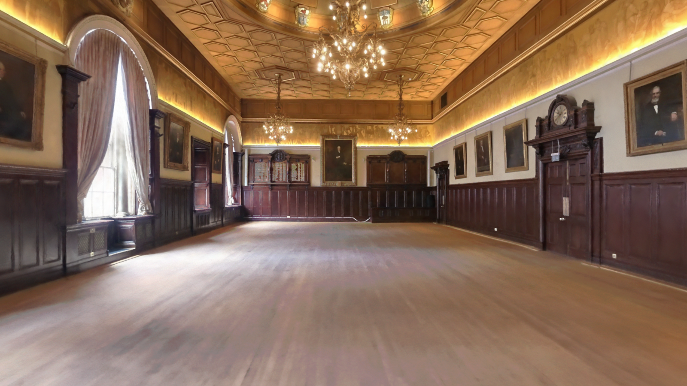
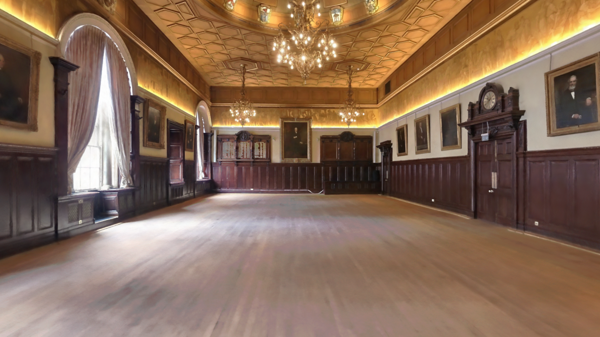
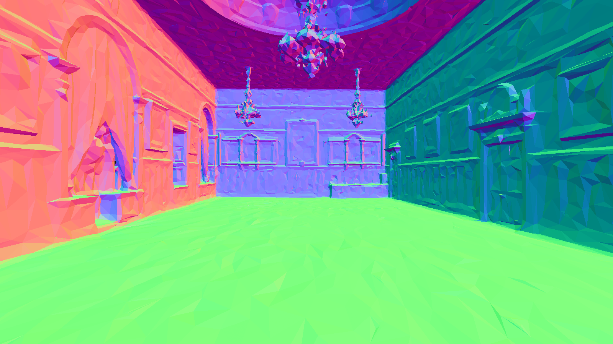

# Grand Hall source-only fixed-camera comparison

> **INTERNAL DIAGNOSTIC · HUMAN REVIEW PENDING · NO WINNER SELECTED**

This is the first visible, source-only Grand Hall comparison produced from the
clean local commit `a940a2811f2ebaa3fc700cfc76a2c3e338ebfd68`. It contains no
generated architecture, facade, neighbouring-room asset, relighting, repair,
or synthetic fill. The camera is a source-position-derived inspection camera,
not a recovered optical camera, so these records remain `diagnostic` even
though the long frame profile completed.

This historical bundle contains one capture per representation. It does not
establish fresh-browser process isolation or the later-required one-cold plus
three-warm schedule. Future complete browser runs use the
[`visible-first browser bake-off runbook`](../operations/grand-hall-visible-first-browser-bakeoff-runbook.md);
these images remain diagnostic history and are not silently upgraded.

## Captured-radiance review pool

Only the SOG and SPZ rows below are eligible for captured-radiance review.
Neither row is accepted, ranked, or selected as a master. Both loaded exactly
6,019,684 decoded and active Gaussians from eleven receipt-bound members, used
the same camera and viewport, completed 120 warm-up plus 600 timed frames on
the RTX 4090, and reported no WebGL context loss.

<table>
  <thead>
    <tr>
      <th>Exact SOG fine frontier</th>
      <th>Name-matched SPZ fine frontier</th>
    </tr>
  </thead>
  <tbody>
    <tr>
      <td></td>
      <td></td>
    </tr>
    <tr>
      <td>
        <code>format: sog</code> 
        11 members · 106,479,738 bytes · 6,019,684 Gaussians 
        PNG SHA-256: <code>72f4c376d2742128daac0fb1a8ec68c178fd0e373bf47c1ce9e808cd077d3aae</code> 
        <a href="../evidence/grand-hall-lineage/2026-08-30/grand-hall-sog-source-pose-19890-interior-v1-diagnostic-controlled-120w-600f.json">machine record</a>
        SHA-256: <code>ad94ba10f266f05eceb54fc092b474ac985e8bf91ade40029c86e035f0b21fe1</code> 
        <code>visualAssessment: not_reviewed</code>
      </td>
      <td>
        <code>format: spz</code> 
        11 members · 178,415,360 bytes · 6,019,684 Gaussians 
        PNG SHA-256: <code>02740825e322d119fd3484bda8d2b90fd2acd4352c5891cb9d51fca9b9613d20</code> 
        <a href="../evidence/grand-hall-lineage/2026-08-30/grand-hall-spz-source-pose-19890-interior-v1-diagnostic-controlled-120w-600f.json">machine record</a>
        SHA-256: <code>f7c6e8041841c144158b1237c7aa3ee689f2ed1985e2797bc5cb5b8b73c34552</code> 
        <code>visualAssessment: not_reviewed</code>
      </td>
    </tr>
  </tbody>
</table>

The two PNGs are visibly very similar and have uninterrupted timber floors in
this view. That observation does not prove codec parity, full-room fidelity,
or absence of artifacts elsewhere. A false window, doorway, floor, wall, or
out-of-room fragment remains a rejection regardless of aggregate image score.

## Structural diagnostic — excluded from radiance ranking

<figure data-radiance-ranking-eligible="false">
  
  <figcaption><strong>RECONSTRUCTED GEOMETRY · NORMAL-COLOUR DEBUG · NOT SOURCE APPEARANCE · NOT A RADIANCE CANDIDATE</strong></figcaption>
</figure>

The supplied PLY is the exact 1,185,642-byte source with SHA-256
`be8d7a47c021c4299c554d5e325740c06238c078da6fee72b884807e19528fea`.
It contains 34,040 XYZ-only vertices and 59,763 indexed triangles. The lane
proves every source face has arity three, the binary body is consumed exactly,
and no unsupported properties or trailing bytes are present. It reports 174
triangles whose cross-product squared is exactly zero. The shown colours are
computed `MeshNormalMaterial` debug colours; they were not captured by XGRIDS.
The uncropped mesh has broader bounds than the SOG frontier, so its Grand
Hall-only boundary remains human-review pending and it is not admitted as
planning or collision geometry.

- PNG SHA-256: `1678e63618c828ceac130d72dc1e9ac0c7de496814fb9944cff266190b338f60`
- [Machine record](../evidence/grand-hall-lineage/2026-08-30/grand-hall-ply-source-pose-19890-interior-v1-structural-diagnostic-controlled-120w-600f.json)
  SHA-256: `ed32910d6b668fad6a8de638a3bb2a2028e27c5e5d71fc9f1f0c2f18500f8513`
- Machine roles: `geometryRole=structural_evidence_only` and
  `appearanceRole=deterministic_debug_visualization_not_source_appearance`.

Any ranking consumer must admit captured-radiance formats explicitly and must
reject `ply_mesh` from radiance ranking.

## Native LCC lane

**GENUINE VENDOR-EDITOR UI FRAME EXISTS · DIAGNOSTIC ONLY · NOT RANKING-ELIGIBLE**

The installed vendor editor has now loaded and visibly rendered an exact
scratch-only LCC2 conversion of the native `_9` package. The resulting
1600×900 active-window PNG is genuine native-viewer evidence, not another
decoder standing in for the vendor renderer:

- [Visible-UI evidence report](grand-hall-native-lcc-ui-evidence-2026-08-30.md)
- PNG SHA-256:
  `2e4dfe18a951a5764c09a7d3fcdbb2d0f32085b8d5eb46df9c7a11f53c89e12f`
- Machine receipt SHA-256:
  `3cd6d5d788a38f4a9c8483ef2107a8082782a0242ce1e57f0fa7379f51e6eb63`

This frame visibly depicts the supplied Grand Hall with a continuous timber
floor and no facade or neighbouring room. It remains outside the
captured-radiance ranking because it has vendor UI chrome and no deterministic
camera, projection, residency, convergence, or native-capture receipt. Human
acceptance is also pending. It therefore proves that the native package can be
viewed, but it is neither a winner nor a loser in the fixed-camera comparison.

The native `_9` LCC manifest is 1,983 bytes with SHA-256
`ce2a539483c7c2a271ca2555f6390e16425bb911851a8a56c2f16b17c248cac1`.
Its finest level reports 6,127,396 splats, so it is not primitive-parity with
the SOG/SPZ rows. Read-only vendor-API inspection has established a genuine
fixed-camera route through the installed LCC Editor's public managed-module,
camera, coordinate-conversion, scene-ready, and lossless-capture services. The
first unattended adapter attempt did not load because the custom module ID was
absent from the vendor feature-toggle allowlist; it timed out safely and
produced no native PNG or in-process receipt. A first-party fail-closed adapter
frame is still required before this row can join the matched-camera benchmark.

The shared source-space inspection contract is position
`[-4.774913,-16.59914,-0.687065]`, target
`[-4.5826875,-8.392191,-0.687065]`, and up `[0,0,1]`. For the raw `_9`
zero-offset scene, the vendor's source-to-world conversion is expected to
produce native position `[4.774913,-0.687065,16.59914]`, target
`[4.5826875,-0.687065,8.392191]`, and up `[0,1,0]`. The adapter must derive
those values through the live scene API and reject a mismatch.

## Shared execution contract

| Field | Frozen value |
| --- | --- |
| Camera | `source-pose-19890-interior-v1` |
| Viewport/output | 1600 × 900, DPR 1 |
| Projection | Perspective, vertical FOV 60°, near 0.05, far 80 |
| Browser GPU | Chrome 147 / ANGLE D3D11 / NVIDIA GeForce RTX 4090 |
| Context loss | `false` for all three browser rows |
| Git state | clean `a940a2811f2ebaa3fc700cfc76a2c3e338ebfd68` |
| Frame profile | 120 explicit warm-up + 600 explicit timed frames |
| Review state | `not_reviewed`; no winner and no captured master selected |

The PLY shares the camera and viewport only. Its opaque normal-debug renderer
is intentionally different from the transparent Spark radiance renderer, so
its pixels cannot be compared as captured appearance.

The frozen bundle hashes are listed in
[`SHA256SUMS`](../evidence/grand-hall-lineage/2026-08-30/SHA256SUMS).
