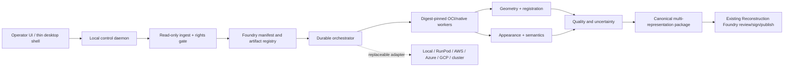

# OmniTwin Foundry root investigation

**Status:** decision-ready investigation; T-507 bounded evidence, T-509 recommendation-only proof, and T-514 local non-training proof complete; T-508 in progress with activation still NO-GO

**Evidence cutoff:** 2026-07-14

**Current-source reconciliation:** 2026-07-14. Repository-local evidence and
the named primary technology/licence sources were refreshed to this date.

**Scope:** independent capture-to-runtime reconstruction; no paid compute, proprietary-format circumvention, raw-source mutation, public release, or large reconstruction run
**Evidence classes:** **Verified** = directly inspected or primary-source documented; **Supported inference** = the evidence strongly implies the conclusion but a decisive test remains; **Hypothesis** = candidate mechanism awaiting experiment.

This report is a technical and commercial-risk screen, not legal advice. The machine-readable evidence register is in `docs/reports/omnitwin-foundry-evidence.json`.

## 1. DIRECT ANSWER

Yes, OmniTwin can own a full independent Foundry for future captures. The destination is **feasible with bounded product and pipeline engineering plus several bounded research bake-offs**; it is not immediately production-ready.

Historical PortalCam independence is only **partially feasible** today. Ten projects expose timestamps, poses, IMU and sensor-event metadata, and decimated point-cloud previews. It is a **supported inference**, not a decoded fact, that original RGB and LiDAR payloads are inside proprietary `XBAG`/`.xbin`; the named calibration bundle is ZIP-encrypted. A bounded search of official XGRIDS support pages, manuals, GitHub repositories and public developer-platform pages found no public raw decoder, sensor export or PortalCam reconstruction SDK as of the cutoff. Independent historical reconstruction is therefore blocked pending an official export/SDK, an unencrypted calibration bundle, and written rights. No `.xbin` record decoding or calibration decryption should be attempted.

What is buildable now:

- immutable, hash-addressed universal ingest and provenance;
- E57/LAS/LAZ/PLY/mesh/image/video/CAD adapters using commercially reviewable tooling;
- E57-anchored photo registration, LiDAR geometry, measured meshes, independent gsplat/3DGRUT bake-offs, semantic proposals, QA, packaging and provider-neutral job planning;
- historical vendor-export intake using PLY/SPZ/SOG/mesh/poses only when the operator has rights;
- a multi-representation runtime package that feeds the existing Reconstruction Foundry release/signing boundary.

The best architecture is a React operator UI plus a thin cross-platform shell, a local control daemon, digest-pinned OCI workers, a Foundry-owned manifest/job model, and replaceable local/cloud executors. Tauri is the preferred shell candidate; Electron is the renderer-consistency fallback. Temporal is the leading durable control-plane candidate and SkyPilot/Kubernetes are optional execution adapters. None is yet an accepted repo decision.

The recommended first room remains **Grand Hall**. Human decision `B` confirms
only anchor sweeps 000, 010, 020 and 040 as Grand Hall; sweep 049 is adjacent
space and is excluded from the candidate. This decision does **not** classify
every sweep 0–48. T-507 froze a bounded 308-asset ingest (one E57, 300
cubefaces, one COLMAP database and six sparse/configuration files) while
preserving that scope limitation.

The exact next active task is **T-508**, not a rerun of T-507. Preserve the
frozen ingest and diagnostic, close the authenticated activation/custody
contract gaps, and close or explicitly retain the external identity,
source-rights, independent-control and full-scope-classification gates.

The original 13-file T-507 output and the 22-file T-486 r2 offline dossier are
currently available and have been independently rehashed. The original T-507
tree is byte-identical to the dossier copy. All 21 indexed dossier artifacts
match their declared sizes and SHA-256 values; the manifest SHA-256 is
`3fba49c89207b6b78fbba067436c6a2a993efada113c9c0267cb625ea06203fd`
and its canonical package digest is
`d2411e3f5a0ab3206c1dc174c71005130e5cd26df6369ddd2ec6e10b5eb9a85b`.
This proves only an intact, unsigned, authority-none offline preflight. It does
not supply surveyed control, authenticated venue authority, source rights, a
load-bearing reviewed transform, online T-486 approval, signing or publication.

T-514 completed only the dependency-light local Config B checker and synthetic
non-training preflight. Its successful decision is
`contract_valid_runtime_blocked`: it neither loads nor proves the training
runtime. Do not run training until the remaining T-501/T-505/T-502 runtime,
rights, independently clean activation and accepted D-016 execution gates pass.

## 2. SUCCESS-CRITERIA AUDIT

| Criterion | State | Evidence | Decisive next test |
|---|---|---|---|
| A. Feasibility verdict | Satisfied | Prospective bounded-feasible; historical partial and explicitly blocked | Execute 30-day pilot gates |
| B. Input capability matrix | Partial design/audit | Section 4 covers the required classes, but most adapters and multi-vendor fixtures do not exist | Run parser fixtures for each implemented adapter |
| C. XGRIDS recovery verdict | Satisfied only to the bounded lawful/search boundary | `XBAG` signature; ULog catalog; encrypted calibration ZIP; open exports | Official XGRIDS bundle/SDK + written rights |
| D. Future open capture protocol | Satisfied as specification | Section 11 and strategy document | One room captured with minimum and professional lanes |
| E. Geometry pipeline | Satisfied as compared plan; empirical result pending | Architecture and pilot bake-off | TSDF/Poisson/photo mesh on frozen Grand Hall subset |
| F. Appearance pipeline | Partial compared plan; empirical and rights results pending | Architecture and approach registry | Same-camera vendor vs gsplat vs hybrid bake-off |
| G. Sensor fusion | Satisfied as specification | Architecture calibration/transform model | Calibrated open rig loop with surveyed controls |
| H. Semantic pipeline | Satisfied as specification | Canonical package and quality contract | SAM 2 proposal + human correction timing |
| I. Active recapture | Satisfied as design; model unverified | Strategy/UX | Predict then measure improvement from five prescribed shots |
| J. AI/world models | Partial policy/design | Section 10 separates truth classes; no approved model chain or consistency result exists | Licensed generated-derivative experiment only |
| K. Runtime pipeline | Satisfied as architecture | SPZ/SOG/glTF/OpenUSD adapters; RC caveats documented | 10M/100M progressive-load fixture |
| L. Cross-platform app | Satisfied as recommendation | Three architectures and UX | Windows/macOS/Linux shell/render parity spike |
| M. Provider-independent compute | Partial contract foundation | JobSpec, validated provider-plan and trusted rights/confirmation/compute dispatch gates exist; no executor parity result | Same fixture local + one approved remote backend |
| N. Quality contract | Partial spec/code foundation | Section 9, profile baselines and asset-resolved evidence validator exist; no populated pilot report or accepted source-accuracy tiers | Pilot populates every required metric and attestation |
| O. One-room pilot | T-507 deterministic ingest/diagnostic complete; downstream pilot not executed | Decision B on four anchors, immutable 308-asset manifest, proposed unreviewed fit and frozen holdout | Continue T-508: external attestation, rights, independent control, full-scope classification and review |
| P. Full programme | Satisfied | Roadmap and dependency backlog | Approve owners/budget for phase 1 |
| Q. Low-risk implementation | Expanded authority-none foundation plus one test-only end-to-end GLB conformance proof; production remains disabled | Strict shared schemas plus local intake/admission/staging/plan-only flow, sealed inspection, exact normalization proof, provider recommendation and durable execution-control evidence; cross-package tests carry one verified staged GLB through the local executor/adapter seam into a verified three-file quarantine bundle without production authority | Keep 0058/0059 NO-GO until the independent blockers are cleared, then build and audit a real OS-sandbox/database-backed worker adapter before any explicitly authorized production execution |

No empirical reconstruction, accuracy certification, production licence approval, or public release is claimed complete.

### Current implementation reconciliation — 2026-07-14

Criterion Q records the 2026-07-12 evidence cutoff. Since then, the repository
has gained an executable local intake/admission/staging/plan-only flow, a local
guided companion, sealed source inspection, a production-disabled exact GLB
normalization proof, an authority-none provider recommender and durable 0053–0057
execution/attempt/provider-command and derivative-evidence foundations. A
cross-package test-only conformance proof now carries one exact admitted and
verified GLB through `executeNextFoundryProviderCommand`, the local adapter, the
test-only normalizer/writer and the public output verifier. It proves exact
stage/source/profile/fence/output bindings, same-marker idempotency,
cancellation and tamper rejection while retaining an authority-none,
activation-absent three-file quarantine bundle. Its store and sandbox backend
are in-memory test harnesses; test-only functions remain outside the package
root and production build. The executor and injected local/RunPod adapters
remain unwired in production; legacy dispatch is quarantined; disabled 0058 is
approved only as an inert sentinel; and
spec-complete 0058 plus 0059 remain NO-GO. T-514 separately proved only the
dependency-light Config B entry/config/fixture contract and returned
`contract_valid_runtime_blocked`; it did not prove the real trainer runtime or
execute training. No actual reconstruction/detail-enhancement/training run,
provider call, paid compute, trusted activation, signing, promotion, publication
or public release is evidenced. The local companion is not yet a proven
three-OS, terminal-free production operator application.

## 3. VERIFIED CURRENT STATE

### Repository

- Repo alias: `REPO_ROOT`; branch `feature/diary-p0-slice-3`; audited commit recorded privately. The branch has no tracking upstream, but a public `origin` remote exists; this report therefore uses public-safe asset aliases.
- The worktree already contains extensive user-owned, partly untracked Reconstruction Foundry release/signing work. This investigation did not replace or normalize it.
- Binding architecture includes Spark (D-001), Three >=0.180 (D-002), Artifact Factory (D-014), a concrete VSIR activation gate (D-019), and Scene Authority Map/TransformArtifact (D-024).
- D-024 correctly treats splats as appearance and deterministic E57-derived geometry as the default structural authority.
- `state/training_runs.jsonl` is empty. No training execution is evidenced.
- The legacy training runtime remains non-runnable: its source closure is not vendored or runtime-verified, actual-image Tyro acceptance is unproved, external E57 depth is not connected to the loss, and distorted-camera/3DGUT, bilateral output, evaluation, resume and D-014 output remain unproved.
- T-514 repaired a separate dependency-light Config B checker, not the training runtime. Its 74-test suite passed and two fresh same-host synthetic preflights produced byte-identical authority-none receipts with decision `contract_valid_runtime_blocked`. Help/preflight do not load Torch, gsplat, Tyro, Open3D, pye57 or pycolmap; `execute` and the legacy runner still fail closed with exit 78.
- Runtime evidence is an internal Reception SPZ-primary check with SOG retained as backup/provenance. It still has a known transform/attribution gap, no signed alignment and no public QA. The legacy latest-package endpoint can bypass newer release gates and must be reconciled, not duplicated.

### Local assets

- `E57_ASSET_ROOT/cloud_0.e57`: 20,518,437,888 bytes; standard ASTM E57; 149 posed scans; 965,520,000 raw point records; 894 embedded 4096x4096 pinhole cubefaces, six per scan; no acquisition timestamps. The valid-point total was not computed. A read-only scan-0 spot check found 5,205,250 valid and 1,274,750 invalid records out of 6,480,000.
- `COLMAP_PILOT_ROOT`: 300 derived 1024x1024 JPEG cubefaces, 231 registered image poses sharing one PINHOLE camera model, and 124,617 sparse points. `COLMAP_DUPLICATE_CANDIDATE_ROOT` is only a duplicate candidate until full-tree hash equivalence is recorded. T-507 reproduced the historic all-50 diagnostic at scale `1.7362602880766593` and RMSE `0.010670586778897446` m. Sweep 049 is reproduction-only; the proposed 0–48 candidate instead has scale `1.7362021512269856` and RMSE `0.010604176377772601` m. Its frozen holdout is `[5,15,25,35,44]` with RMSE `0.005756579517772495` m. These are shared-lineage self-consistency diagnostics only: the transform is proposed/unreviewed, has no independent control and confers no runtime or public authority.
- Ten raw XGRIDS projects total roughly 122 GB of `.xbin` plus sidecars. All have empty `control_points.csv`.
- Grand Hall raw: accessible `poses.csv`, GNSS placeholder data, ULog sensor/event catalog, preview Potree point cloud and metadata. The `.xbin` has `XBAG` signature only.
- Grand Hall ULog proves synchronized event clocks: IMU ~200 Hz; LiDAR events ~10 Hz; four cameras ~10 Hz; four RGB events ~1.11 Hz. The payloads themselves are not in ULog.
- `lixel.zip` names camera, IMU, LiDAR and extrinsic calibration YAML files, but those entries are encrypted. This is the lawful stop boundary.
- LCC Studio application data contains open exports for multiple privately indexed rooms: Gaussian PLY, mesh PLY, collision, timestamped pose JSON and some SOG/SPZ. Four inspected room exports carry full degree-3 SH; two inspected alternatives are DC-only. Exact private project labels remain outside the public report.

### Current vendor and legal dependencies

- XGRIDS LCC/LCC2 whitepapers are public but use a custom non-OSI licence, with attribution/derivative obligations and restrictions on training competing AI without written consent. LCC/LCC2 are adapters, not clean canonical formats.
- Matterport's current Terms of Use prohibit commercial AI/ML training using Matterport Data. The customer owns Customer Data/Spaces under the subscription agreement, but the interaction with exported E57/cubefaces requires legal review before model training.
- ArtiFixer v1 code is Apache-2.0, but its released checkpoint is noncommercial/R&D-only. It cannot ship in the commercial product.
- Khronos `KHR_gaussian_splatting` remains a release candidate. OGC 3D Tiles 2.0 is still a proposed work item; XGRIDS naming must not be represented as ratification.

## 4. INPUT CAPABILITY MATRIX

`Implemented` means a repo path exists; `foundation` means a contract exists; `proposed` means no verified adapter exists. Every external dependency still needs a pinned dependency-closure review.

| Input | Parser/import route | Accessible metadata | Geometry value | Appearance value | Calibration/scale | Licence posture | State | Required engineering | Decisive test |
|---|---|---|---|---|---|---|---|---|---|
| Matterport E57 | libE57/pye57 or PDAL | scans, poses, fields, images2D | High metric point control | Embedded RGB/cubefaces if present | scan/image poses; metric | Export rights + current Matterport training restriction need counsel | Locally verified | streaming inventory, image extraction, rights gate | round-trip 5 scans and compare hashes/poses |
| MatterPak bundle | bounded archive inspector + authorized extraction | member names/sizes; OBJ/textures/panoramas when supplied | vendor mesh/reference only until controlled | potentially high texture/panorama value | bundle-dependent; preserve vendor frame/scale declarations | Matterport export/asset terms and client rights | Existing legacy reference; Foundry adapter proposed | hostile-archive limits, typed member inventory, lineage | inventory one authorized bundle and reconcile every extracted asset |
| Generic E57 | libE57Format/PDAL | vendor-dependent tree | High when registered | optional colour/images | optional poses; metric units | Boost/BSD-like tooling; source rights vary | capture intake detects E57 | generic capability probe | fixtures from 3 vendors |
| LAS/LAZ | PDAL + LASzip | CRS/VLR/point fields | High point-cloud value | RGB optional | metric/CRS if declared | PDAL clean core; audit LASzip/package | Proposed | adapter and CRS normalizer | preserve fields/CRS across conversion |
| XYZ point cloud | bounded text/PDAL adapter | columns, delimiter, count, optional RGB/normal | useful only after units/frame review | optional RGB | usually undeclared; require explicit units/frame | simple format; parser and source rights still reviewed | Proposed | quota-safe streaming parser and column map | reject ambiguous/malformed fixture; preserve reviewed columns |
| PLY point cloud | Open3D/PDAL | property names/comments | Medium-high; convention varies | RGB/normal optional | scale/frame usually undeclared | format open; asset rights vary | Existing outputs, no universal adapter | safe header probe + property map | reject ambiguous units/frame until reviewed |
| Matterport panoramas | E57 images2D or authorized export/API | dimensions, model, poses if exported | registration evidence | High | local E57 verified; timestamps absent | current Matterport AI restriction is a legal gate | Locally verified in E57 | cubeface materialization + legal policy | held-out registration to E57 |
| DSLR images | EXIF + COLMAP/hloc | EXIF/lens/time | strong photogrammetry | highest hero detail | calibrate lens; scale via control/E57 | operator/client rights | Proposed | RAW/color pipeline, lens profiles | hero-region held-out gain |
| Generic still / medium-format image | OpenImageIO + EXIF/XMP + COLMAP/hloc | dimensions, codec/RAW, EXIF/XMP, lens/time if present | photogrammetric support when registered | high to supreme, capture-dependent | lens/readout/calibration; scale external | source/client rights; RAW/plugin closure | Proposed | colour-managed RAW path and camera profiles | held-out registration/detail gain over current source |
| 360 panoramas | OpenImageIO/OpenCV + camera model | EXIF/XMP/equirect | registration support | broad coverage | calibrate projection; scale external | source rights vary | Proposed | equirect/cubemap adapter | >180° model correctness fixture |
| Phone images | EXIF + COLMAP | EXIF, device/lens | variable | useful minimum lane | rolling shutter; scale external | source rights vary | Proposed | capture companion metadata | minimum-lane room benchmark |
| Drone media | OpenImageIO/FFmpeg + EXIF/XMP flight metadata | image/video, time, GNSS/RTK if exported | exterior photogrammetry support | high exterior/roof appearance | camera calibration, rolling shutter, datum/RTK quality | operator/client, privacy and aviation rights | Proposed | exterior ingest/capture profile | one controlled exterior subset aligned to venue control |
| Video | FFmpeg + COLMAP/VIO | codec/fps/time metadata | dense view sequence | useful but blur/compression limited | timing/rolling shutter critical | FFmpeg build/licence + source rights | Proposed | deterministic keyframes, sync model | registration/completeness vs stills |
| RGB-D | Open3D/ROS/MCAP adapter | intrinsics/time/depth scale | strong short-range geometry | registered RGB | explicit calibration required | device + container rights | Proposed | device profile and timestamp validation | known-target depth residual |
| MCAP / general sensor log | MCAP reader + declared ROS/custom schema adapters | channels, schemas, clocks, message counts | high only for decoded LiDAR/depth/poses | high only for decoded image channels | clock domains and calibration mandatory | MCAP MIT; message schemas/source rights vary | Proposed | quota-safe channel registry and schema allow-list | decode a bounded open fixture with clock/calibration checks |
| Standalone IMU | CSV/MCAP/ROS adapter | timestamps, rate, axes, accel/gyro fields | motion constraint only, never geometry alone | none | bias, units, axis/frame and clock sync required | source/device rights; parser dependencies vary | Proposed | typed IMU profile and synchronization validator | known-motion fixture with bias/time residuals |
| GNSS / RTK | RINEX/NMEA/CSV or declared vendor adapter | positions, fix state, covariance/quality, time | global/control constraint, not room surface | none | CRS/datum/axis/epoch and antenna offset required | source/device/service terms vary | Proposed | geodetic→projected operation and quality parser | control fixture against surveyed checkpoints |
| XGRIDS `.xbin` | official SDK/export only | signature only from container; sidecars separate | potentially high | potentially high | inaccessible payload/calibration today | vendor terms prohibit reverse engineering; written rights required | Blocked | official route only | open 20–100-frame bundle lawfully |
| LCC | legally approved vendor export adapter | public container spec | vendor result, not metric authority | good historical base | poses/frames vary | custom non-OSI format licence | Proposed/conditional | counsel + isolated importer | export PLY/poses without losing SH/frame |
| LCC2 | approved importer/SplatTransform after review | may contain SOG/SPZ/mesh | optional mesh | strong runtime base | vendor transforms vary | custom non-OSI licence | Locally available/conditional | licence gate and versioned import | fixed-view/tensor comparison to open payloads |
| SPZ | Niantic SPZ | header/version | Gaussian positions only | lossy splat appearance | coordinate convention explicit | MIT implementation; patent/FTO review | Locally available | v4/version pin, round-trip QA | tensor and render delta |
| SOG | PlayCanvas SOG/SplatTransform | bundle manifest/chunks | Gaussian positions only | lossy streamed appearance | adapter-declared | public spec + MIT tooling | Locally available | version pin, range/LOD tests | source vs SOG fixed views |
| Gaussian PLY | strict header/property adapter | properties/comments | nonstandard Gaussian geometry | source-master candidate | convention often ambiguous | asset/code rights vary | Locally available | Foundry master normalization | detect SH/scale/opacity conventions |
| OBJ | Assimp/tinyobj or existing loaders | groups/material refs | mesh interchange | textures via MTL | units/frame often absent | format open; importer/deps vary | Locally available | units/frame declaration gate | mesh/material/normal round-trip |
| FBX | Assimp or separately approved Autodesk-capable adapter | scene graph, meshes, materials, animation metadata | mesh interchange only after unit/frame review | textures/materials if resolved | units/axes may be declared but must be normalized | proprietary format/SDK terms; Assimp build reviewed | Proposed/conditional | isolated importer and deterministic normalization | one fixture round-trip without unit/material drift |
| GLB/glTF | Khronos loaders | typed scene/material graph | strong runtime mesh | PBR/textures | coordinate conventions defined | royalty-free spec; library licences vary | Runtime implemented | canonical package adapter | validator + transform parity |
| Floor plans | PDF/raster/vector inspector | pages/scale annotations | 2D constraints, not truth alone | reference | scale if declared/control matched | document rights vary | Existing reference classification | assisted control extraction | compare dimensions to E57 |
| CAD/BIM | IfcOpenShell for IFC; approved CAD adapters | object/units/CRS | semantic planning geometry | usually limited | often strong units; alignment needed | IfcOpenShell LGPL; proprietary formats conditional | Proposed | IFC lane, version/unit policy | align one IFC to venue controls |
| OpenUSD | OpenUSD 26.05 adapter | composed scene metadata | rich interchange | rich materials/layers | explicit stages/units/up axis | current Tomorrow OST licence + notices | Proposed | custom Foundry schemas as adapter | package round-trip with provenance |
| Calibration bundle | strict JSON/YAML/ROS/Kalibr-profile adapters | intrinsics, distortion, extrinsics, clock/readout and device IDs | enabling evidence, not geometry itself | none | convention/units/frame/version must be explicit | source/device rights; parser closure reviewed | Contract foundation; adapters proposed | versioned calibration profiles and typed evidence | validate one open rig bundle against known target |
| Trajectory | typed CSV/TUM/KITTI/MCAP adapter | timestamps, positions, rotations, covariance if present | registration/SLAM evidence | none | frame, units, quaternion order and clock mandatory | source rights and schema terms vary | Contract foundation; adapters proposed | convention registry and continuity checks | align a bounded trajectory to reviewed control |
| Control network | typed CSV/JSON/survey-export adapter | control IDs, coordinates/distances, uncertainty, method | highest metric-control value within reviewed scope | none | CRS/datum/epoch/units and held-out points required | client/surveyor rights and certification scope | Contract foundation; adapter proposed | independent-control split and reviewer workflow | reproduce checkpoint residual report |
| Manual room-name / known-dimension evidence | operator UI → typed JSON evidence record | labels, dimensions, units, measurement method, frame, reviewer | semantic/constraint evidence; never a whole surface | none | declared units/frame/control and uncertainty | operator/client responsibility; review required | Contract foundation | dedicated schema/UI and contradiction handling | compare entered dimension to independent control |
| Evidence record | strict typed JSON/content-addressed asset | evidence kind, subject refs, digest, method/reviewer metadata | authority support only | authority support only | declared subject/frame/schema version | internal policy plus source evidence rights | Typed-kind foundation implemented; content adapters partial | content-schema registry and trusted resolver | reject mislabeled/missing transform, quality and attestation evidence |

## 5. XGRIDS INDEPENDENCE VERDICT

### Existing-capture recovery

| Question | Verdict |
|---|---|
| Raw RGB frames accessible? | No open files found. ULog records image event sizes/times, not payloads. |
| Frames embedded? | Supported inference: payloads are in `.xbin`; not lawfully verified internally. |
| Encrypted/proprietary? | `.xbin` is proprietary `XBAG`; calibration ZIP entries are explicitly encrypted. |
| Timestamps accessible? | Yes: poses, IMU and camera/LiDAR event clocks. |
| Poses accessible? | Yes, timestamp + translation + four-value rotation; convention/frame undocumented. |
| Intrinsics accessible? | Not in open sidecars. Named calibration file is encrypted. |
| Extrinsics accessible? | Not in open sidecars. Named extrinsic files are encrypted. |
| LiDAR/depth accessible? | Only a decimated preview; event metadata but not raw points/depth. |
| Calibration accessible? | Existence verified, content inaccessible without official credentials/export. |
| Official SDK/export? | None found in the bounded official-source search as of cutoff; this does not prove a private/partner route is absent. Official request required. |
| Existing open XGRIDS code? | Rendering/container SDKs exist; none verified as a raw sensor decoder. |
| Independent processing lawful? | Not established. Written hardware/output/reconstruction rights and counsel are required. |

Fallback: preserve raw bytes; ingest entitled open PLY/SPZ/SOG/mesh/pose exports for historical appearance; align them to independently measured E57 controls; recapture missing hero imagery; make all future acquisition open by protocol. Do not use LCC/LCC2 or Matterport-derived imagery for training until rights are approved.

### Official request

Ask XGRIDS for original-resolution RGB; frame/capture timestamps; camera IDs; intrinsics/distortion/rolling-shutter timing; raw or deskewed LiDAR with per-point time; IMU/GNSS schema; camera/LiDAR/IMU extrinsics; axes/units/quaternion order; an unencrypted calibration bundle; SDK/export documentation; redistribution/automation rights; explicit commercial independent-reconstruction rights; output ownership; and offline migration continuity.

### Future independence

Fully achievable without PortalCam containers: save ordinary images/video, E57 or LAS/LAZ, MCAP sensor streams, documented calibration, trajectory/control observations and colour/lighting metadata at capture time. The capture companion writes the Foundry manifest before leaving site.

## 6. THREE COMPETING ARCHITECTURES

| Architecture | Mechanism | Strength | Failure mode | Verdict |
|---|---|---|---|---|
| A. Owned enhancement over vendor base | Import entitled LCC-derived PLY/SOG/SPZ/mesh/poses; E57 controls geometry; add DSLR hero layers | Fast historical salvage and runtime improvement | Still reconstruction-vendor dependent; format/terms risk | Transitional only |
| B. Fully open future reconstruction | Open images/video/LiDAR/IMU/control; COLMAP/SLAM; Open3D/Poisson; gsplat/3DGRUT | True data custody and replaceable algorithms | Capture discipline, calibration and integration burden | Required prospective baseline |
| C. Maximum-ambition Foundry | B plus semantic world, active recapture, multi-representation masters, licensed generated derivatives, provider-neutral orchestration | Highest control, quality and product leverage | Scope/complexity; research may not beat disciplined recapture | Recommended target, phased behind B |

Architecture A cannot satisfy the mandated destination alone. B supplies independence. C becomes the product by adding auditable intelligence without weakening B's measured authority.

## 7. RECOMMENDED ARCHITECTURE



The Foundry owns contracts and state, not third-party process internals. Algorithms are digest-pinned workers with declared input/output, resource, licence and evidence capabilities. Raw mounts are read-only. Stages checkpoint at content-addressed boundaries. No provider identifier enters the master scene.

Representation authority is composed:

- **metric authority:** control network + E57/LAS/LAZ + reviewed TransformArtifacts;
- **planning/physics authority:** measured/planning/collision/nav meshes;
- **appearance authority:** base splat plus local hero splats/meshes/PBR overlays;
- **semantic authority:** human-reviewed room/feature graph;
- **generated derivative:** separate asset/layer with region masks and Truth Mode disclosure.

The source master is a Foundry-owned manifest plus content-addressed, unquantized typed arrays and open image/geometry files. OpenUSD is the DCC/composition adapter; glTF/GLB is the mesh runtime adapter; SPZ/SOG are current splat delivery adapters; Spark RAD is experimental; Khronos Gaussian glTF stays behind a version flag until ratified.

## 8. “JUST WORKS” PRODUCT WORKFLOW

1. **Home / New project:** venue, capture state, purpose and data-rights owner.
2. **Drop everything:** read-only roots; immediate byte estimate; no copying until a signed plan is shown.
3. **Inventory:** format, hashes, probable duplicates, rights/access warnings and missing calibration.
4. **Venue frame:** automatic candidates, units/axes disclosure, control evidence and human frame approval.
5. **Processing graph:** plain-English stages, resource/cost estimate, licence blocks, local/remote choice and kill switch.
6. **Coverage:** room map with view count, angle diversity, blur, texture, residual and uncertainty layers.
7. **Recapture instructions:** exact camera location, height, direction, focal length, shot count, lighting state and predicted benefit.
8. **Build:** resumable stages; logs summarized; expert mode exposes native parameters without changing contracts.
9. **Compare:** synchronized fixed views for source/vendor/owned/hybrid; metric and runtime panels; captured/generated filter.
10. **Review:** geometry, appearance, semantics, transforms and generated masks approved independently.
11. **Package:** master + runtime variants; complete provenance; immutable hashes.
12. **Publish:** handoff to the existing private Reconstruction Foundry. Promotion remains separately reviewed, attested and atomic.

Every blocked state supplies a next action. “One click” means a visible auditable plan, not hidden destructive work.

## 9. QUALITY CONTRACT

No scalar score declares victory. Profiles select explicit gates and evidence:

| Dimension | Required measures |
|---|---|
| Geometry | surveyed control error; alignment median/RMSE/p95; overlap; room-dimension error; local surface residual; topology/non-manifold count; watertightness only where required |
| Appearance | true held-out PSNR/SSIM/LPIPS; colour consistency; edge/detail; novel-view stability; blinded hero fixed-view review |
| Runtime | bytes; first useful frame; p50/p95 frame time; FPS; peak RAM/VRAM; streaming gaps/latency; tier and mobile fallback behavior |
| Semantics | class precision/recall; boundary IoU; cross-view identity; confidence calibration; operator corrections/time |
| Provenance | full source hashes; transform chain; tool/image/model versions; generated masks; licence decisions; reviewer identity/decision |

Pilot thresholds are provisional and purpose-bound, not universal accuracy claims. Planning/public profiles cannot pass with unmeasured required metrics. Generated appearance cannot satisfy geometry requirements. See `docs/specs/omnitwin-quality-contract-v0.md`.

Source-accuracy evidence tiers are deliberately independent of device marketing:

| Tier | Meaning | What it can support |
|---|---|---|
| U0 unknown | units/frame/calibration or source lineage is missing | inventory and research only |
| U1 internally registered | self-consistency or loop/registration residuals exist, but no independent control | visual/internal experiments; no metric claim |
| U2 measured reference | metric sensor/export and reviewed transform with stratified residuals | bounded dimensional comparison subject to purpose profile |
| U3 independent control | held-out surveyed/control evidence and uncertainty pass a declared profile | planning/operational use for that profile only |
| U4 certified procedure | named competent reviewer, calibrated instruments, method and current certificate | only the certified scope; never inferred from a file type |

Appearance evaluation also freezes camera definitions, source resolution/crop/exposure, held-out identities, and connected camera paths. Path QA reports keyframes, segment continuity, coverage gaps, loop/connectivity breaks, collision/nav authority and temporal artifacts; attractive isolated frames are not a navigable-room result.

## 10. AI / WORLD-MODEL STRATEGY

AI may propose matches, masks, room/feature semantics, uncertainty, recapture actions, super-resolution, relighting and a separate cinematic derivative. It may not authorize metric truth, alter measured geometry silently, approve its own output, or turn missing observations into captured fact.

Modes are immutable provenance classes:

1. **Captured:** measured/captured sources and deterministic transformations.
2. **Enhanced captured:** denoise/colour/exposure/detail operations that preserve source lineage and masks.
3. **Generated cinematic:** synthesized appearance in a distinct derivative with model, checkpoint, prompt-condition digest, mask, confidence, restrictions and disclosure.
4. **Concept/imagination:** intentionally non-evidentiary design visualization.

Start semantics with Apache-2.0 SAM 2 and human review. GroundingDINO is conditional on exact checkpoint review. Do not ship ScanNet-trained 3D semantic checkpoints without dataset clearance. ArtiFixer v1 is research-only. NVIDIA Fixer v2 may be a conditional cinematic experiment under its model licence/AUP, never an authority layer.

| Mechanism | Licence/source posture | Evidence now | Falsifier / gate |
|---|---|---|---|
| Rights-approved vendor PLY/SPZ/SOG base | source/format rights conditional; never canonical metric truth | local exports exist | terms or convention loss blocks use |
| Independent gsplat | Apache-2.0 code candidate; dependencies, inputs and FTO gated | T-514's Config B contract checker passes, but the runtime trainer remains blocked and unproved | approved RunPod smoke fails or held-outs lose |
| NVIDIA 3DGRUT | Apache-2.0 code candidate; assets/dependencies/FTO gated | candidate only | comparable run loses quality/cost/runtime gate |
| Deterministic photo/PBR mesh | COLMAP/AliceVision/toolchain-specific obligations | registered derived cubefaces exist | drift, reflective failure or rights block |
| Hero micro-splat/mesh | owned-source and selected worker rights required | architectural hypothesis | seam, overfit or operator cost exceeds gain |
| SAM 2 semantic proposals | Apache-2.0 code/checkpoints; human review mandatory | mechanism documented, no room result | precision/correction-time gate fails |
| Fixer v2 derivative | NVIDIA model licence/AUP; generated-cinematic only | commercial-capable model card, no venue result | multi-view/heritage/licence review fails |
| ArtiFixer v1 checkpoint | noncommercial/R&D-only | research checkpoint exists | excluded from commercial output by licence |
| Active recapture | owned capture rights | design only | predicted gain is not observed on held-outs |

The backend recommender is a policy engine, not an autonomous reconstruction authority. It filters by purpose, source tier, rights, calibration, observations, hardware and cost; ranks a small set of mechanisms with reasons and expected evidence; records rejected alternatives and uncertainty; and never changes rights, transforms, JobSpec intent, approval or publication state. A human selects the plan and separately confirms execution.

## 11. OPEN CAPTURE PROTOCOL

### Minimum lane

- calibrated recent phone; RAW/JPEG stills plus ordinary 4K video; optional phone LiDAR;
- printed scale/control targets and colour chart; tripod/monopod where allowed;
- empty-state clockwise perimeter, two heights, ceiling/floor diagonals, doors/windows, hero details, then dressed state;
- output ordinary images/video, device/EXIF metadata, target observations and manifest; no proprietary-only raw container.

### Professional lane

- mirrorless/DSLR with calibrated fixed lenses; 360 camera; survey-grade or documented terrestrial/mobile LiDAR export to E57/LAS/LAZ; IMU in MCAP; synchronized clocks; surveyed control; colour chart and exposure brackets;
- calibrated intrinsics, rolling-shutter/readout metadata, camera↔LiDAR↔IMU extrinsics and repeatable rig geometry;
- multi-session targets; empty/dressed and lighting-state separation.

### Supreme lane

- hardware-synchronized global-shutter multi-camera rig, high-density LiDAR, navigation-grade IMU, RTK/GNSS outdoors, total-station/control network, spectral/colour calibration, exterior/drone lane where lawful, and dedicated hero macro/lighting captures;
- all raw and calibration outputs documented and operator-owned.

Naming: `<venue>/<session>/<sensor>/<utc>_<sequence>_<channel>.<ext>`. The manifest records clock domain, device/lens, calibration digest, coordinate frame, rights, state, operator and hashes. Before leaving: checksum two copies; verify clocks/calibration; view coverage/blur/exposure; close loops; measure controls; photograph targets; recapture red uncertainty zones; verify empty/dressed/lighting labels.

## 12. ONE-ROOM PILOT

Grand Hall wins on evidence-to-effort: metric E57, embedded posed imagery,
registered COLMAP, two PortalCam raw captures, vendor PLY/mesh/poses and SOG.
T-507 completed the bounded identity/ingest diagnostic. Decision `B` confirms
anchors 000/010/020/040 and classifies 049 as adjacent space; it does not
classify all candidate sweeps 0–48. Full-scope classification and an externally
authenticated identity attestation remain T-508 gates. The internal decision
evidence is frozen at
`sha256:11a58296a03d907578c09c37f15dc97ac529e8c785d88e5dc1409d7bfba47ca2`;
that digest is not an external attestation.

Frozen T-507 inputs:

- one 20,518,437,888-byte E57 from `E57_ASSET_ROOT/cloud_0.e57`;
- the 300-image/231-registered-pose, one-camera-model COLMAP subset under `COLMAP_PILOT_ROOT`;
- one COLMAP database and six sparse/configuration files, for exactly 308
  manifest assets at semantic digest
  `sha256:583b4fd025bb00e28a14683c8fcbeee2cb1e0091bdbd968acd1176b9090187c0`;
- `GRAND_HALL_VENDOR_BENCHMARK` PLY/mesh/poses/SOG as a rights-approved private benchmark alias, not metric truth;
- proposed 0–48 fit evidence at scale `1.7362021512269856` and RMSE
  `0.010604176377772601` m, with frozen holdout sweeps `[5,15,25,35,44]`
  at RMSE `0.005756579517772495` m.

The fit and holdout are shared-lineage internal self-consistency only. They are
not independent surveyed control, an accuracy certificate, or an image
train/evaluation result. The proposal remains unreviewed with authority
`none`.

Outputs: universal manifest; reviewed venue/room frames; alignment residual report; measured/planning/collision meshes; visual baseline; one hero layer; semantic graph; uncertainty/recapture map; fixed-view sheet; runtime GLB+splat package; provenance and repeatable job specs. Acceptance requires all mandatory quality gates and human reviews. Rollback is deletion of derived scratch/output references only; raw inputs remain immutable. Detailed jobs, costs and gates are in the pilot document.

## 13. BUILD PROGRAMME

- **Exact next:** continue T-508 against the immutable T-507 bundle; do not
  rerun T-507 or reinterpret T-514 as runtime readiness. Close the authenticated
  runner/verifier receipt, privileged callable API, source-scoped containment,
  reverse-closure and custody-specific authority gaps while retaining the
  external identity, rights, independent-control and review gates.
- **Next 7 days:** keep 0058 disabled and 0059 prohibited; finish the exact
  T-508 contracts and negative-first evidence; review T-500 exception overlays
  without retuning the opened holdout; seek genuinely independent control and
  full-scope identity evidence; preserve the completed T-514 authority-none
  receipt without attempting training.
- **Next 30 days:** Grand Hall metric/mesh/runtime slice; complete the still-open
  trainer runtime translation only after T-501/T-505; permit an actual RunPod
  smoke only after rights, independently clean activation and explicit D-016
  approval; predeclare the semantics/recapture experiment and run the
  cross-platform shell spike.
- **Next 90 days:** professional open capture of one venue; gsplat vs 3DGRUT; hero layer; durable local+one-approved-provider execution; signed internal runtime package.
- **Next 12 months:** capture companion, calibrated rig, active recapture learning, semantic world graph, premium streaming, licensed generated derivatives, repeatable multi-venue operations.

## 14. TASK BACKLOG

Proposed IDs are subordinate to T-506 and must be reconciled with the task registry before insertion.

| ID | Task | Depends | Gate/output |
|---|---|---|---|
| T-506A | Reconcile/snapshot T-486 release Foundry changes | T-486 | clean ownership boundary |
| T-506B | Grand Hall anchor identity check | T-506 | completed as decision B for 000/010/020/040; 049 excluded; external attestation and full 0–48 classification remain |
| T-506C | Universal read-only inspector | T-506A | E57/image/PLY/mesh fixtures |
| T-506D | Rights-policy registry and XGRIDS request | T-506 | written decisions |
| T-506E | Reproduce COLMAP→E57 alignment | T-506B/C | deterministic evidence complete; independent control and reviewed TransformArtifact/residual attestation remain |
| T-506F | Measured mesh bake-off | T-506E | TSDF/Poisson/photo comparison |
| T-506G | Preserve T-514's completed local contract proof; repair and prove the real trainer runtime; approved RunPod smoke later | T-506A/D, T-501, T-505 | `contract_valid_runtime_blocked` remains authority-none until runtime proof, rights, clean activation and explicit D-016 spend approval |
| T-506H | Appearance/hybrid bake-off | T-506E/F/G | blinded fixed views |
| T-506I | Semantic/recapture prototype | T-506E | human correction and gain test |
| T-506J | Runtime/package integration | T-506F/H | canonical package into existing release boundary |
| T-506K | Cross-platform operator spike | T-506C | Win/macOS/Linux parity |
| T-506L | Open capture field trial | T-506D/K | complete professional capture bundle |

## 15. LICENCE AND COMMERCIAL MATRIX

The detailed matrix is `docs/reports/omnitwin-foundry-technology-license-matrix.md`. Default allow-list candidates include libE57Format, PDAL, Open3D, PCL, PoissonRecon, COLMAP, KISS-ICP, LIO-SAM, GTSAM, gsplat, 3DGRUT, SAM 2, SPZ, SplatTransform/SOG, Spark, glTF, Tauri, Electron, Temporal and OCI—always subject to exact-version dependency, checkpoint, dataset, patent and source-right reviews.

Conditional: AliceVision/OpenMVG (MPL obligations), hloc/LightGlue (feature/checkpoint-specific), IfcOpenShell (LGPL), Blender/CloudCompare as separate tools, OpenUSD notices, XGRIDS exports, Matterport data and NVIDIA Fixer v2.

Reject from a closed commercial core without separate terms: graphdeco Gaussian Splatting, 2DGS/GOF/SuGaR derivatives, OpenMVS AGPL, ORB-SLAM3/OpenVINS/VINS-Fusion GPL, FAST-LIO GPL, ArtiFixer v1 checkpoint, ScanNet-derived commercial checkpoints, and any proprietary raw decoder obtained by circumvention.

## 16. ADVERSARIAL FINDINGS

1. The legacy training runtime is broken in multiple independent ways; “ready but unexecuted” remains false. T-514 proves only a separate dependency-light contract checker whose successful result is `contract_valid_runtime_blocked`.
2. Historical PortalCam metadata does not equal access to RGB/LiDAR payloads or calibration.
3. Public LCC/LCC2 specifications are not commercially neutral open-source licences.
4. Matterport's 2026 terms create an AI-training risk even though customer data/space ownership language exists elsewhere.
5. The proposed 0–48 candidate's `0.010604176377772601` m COLMAP/E57 result and
   `0.005756579517772495` m holdout are shared-lineage diagnostics, not surveyed
   accuracy. Decision B classifies four anchors and excludes 049; it does not
   encode or prove all-sweep room identity.
6. Gaussian PLY is not a stable canonical standard; property, opacity, scale, SH and coordinate conventions vary.
7. The current Reception runtime transform is approximate/mismatched; runtime success cannot validate reconstruction quality.
8. Full-SH vendor masters and DC-only mobile exports differ materially; file size/vertex count alone is not quality.
9. A LiDAR mesh may be metrically useful while visually poor; a photogrammetry mesh may be detailed while drifting. Authority must remain region- and purpose-specific.
10. World models can improve appearance but cannot recover unobserved heritage truth.
11. A one-click UI without immutable plans, costs, checkpoints and evidence would conceal risk rather than remove complexity.
12. Building a raw PortalCam parser is neither the shortest nor presently lawful route to prospective independence.

## 17. CONFIDENCE

| Claim | Confidence | Why |
|---|---:|---|
| Historical XGRIDS full recovery without vendor help | 20% | payload/calibration access and rights are blocked |
| Historical salvage via entitled open exports + new photos | 85% | substantial PLY/mesh/pose/SOG assets exist |
| Future full independence | 90% | open capture and permissive pipeline components exist; integration is bounded |
| Metric geometry pipeline | 85% | E57/control methods mature; site-specific failure handling remains |
| Independent visual pipeline beats vendor everywhere | 55% | plausible, but requires fair held-out bake-off |
| Multi-representation package is best | 90% | requirements conflict under a single representation |
| World-model enhancement improves truthful captured mode | 40% | cinematic value likely; truth-preserving consistency unproven |
| Cross-platform application | 90% | standard UI/daemon/worker split; GPU/sidecar parity needs testing |
| Grand Hall pilot feasibility | 85% conditional | exceptional asset overlap and a completed bounded ingest; external attestation, full-scope classification, rights and independent control remain gates |

## 18. UNRESOLVED GAPS

| Gap | Cheapest decisive test | Owner | Effort | External cost |
|---|---|---|---:|---:|
| Grand Hall identity authority/scope | obtain a digest-bound external venue-authority attestation for decision B and classify every node/sweep in the intended 0–48 scope | venue reviewer + reconstruction lead | review dependent | £0 before external review |
| E57 archival full digest in this Foundry inventory | stream full SHA-256 and reconcile it with the private authoritative capture record | data engineer | 2–6 h | £0 |
| Complete room-export inventory | deterministically inventory/hash the granted Reception/Lady/North/South export roots | data engineer | 0.5–1 d | £0 |
| PortalCam firmware/schema versions | obtain authoritative firmware and sidecar/schema versions from project metadata or vendor response | product + vendor | 2–4 h + wait | £0 initially |
| Legacy Matterport/Unreal assets | bounded inventory of granted legacy roots; repo audit already records zero Unreal artifacts | reconstruction lead | 0.5 d | £0 |
| COLMAP JPEG derivation lineage | reproduce or prove the 1024px JPEG extraction/compression path from the 4096px E57 cubefaces | imaging engineer | 1 d | £0 |
| PortalCam raw/calibration access | official written SDK/export response | product/legal | 2–4 h + vendor wait | £0 initially |
| XGRIDS independent-processing rights | written amendment + counsel review | legal | 1–3 d | counsel TBD |
| Matterport exported-image training rights | contract-specific counsel/vendor response | legal | 1–3 d | counsel TBD |
| Independent alignment control/review | acquire independent fit/blind controls, then review the frozen transform and residual evidence | survey/control owner + geometry reviewer | acquisition dependent | TBD |
| Vendor PLY→E57 transform | 3+ controlled landmarks or cloud solve | geometry engineer | 1–2 d | £0 |
| Trainer runtime/training proof | T-514 completed the authority-none dependency-light entry/config/fixture proof; repair and prove the real pinned v1.5.3 worker path, including MCMC selection, external depth, distorted-camera policy, bilateral serialization, evaluation/resume and D-014 outputs, before any rights-valid approved D-016 smoke | ML engineer | 2–5 d | £0 locally; remote approval required |
| Visual superiority | fair held-out LCC/gsplat/hybrid comparison | ML + reviewer | 1–2 wk | deterministic preparation/QA local; actual splat training only through approved D-016 RunPod execution |
| 3DGS patent/FTO | counsel search/opinion | legal | TBD | TBD |
| Cross-platform renderer | Tauri vs Electron three-OS spike | desktop engineer | 1 wk | hardware/time only |
| First-receipt crash custody and runtime wiring | add callback/spool custody for process death before the first provider receipt, then wire the proven 0053 executor/adapters only behind a future independently clean activation path and prove replay without provider side effects | control-plane engineer | 1–3 d after activation design | £0 before any approved provider test |
| Trusted quality-profile registry | resolve one `profileDefinitionSha256` against an approved immutable definition | platform + QA lead | 1–2 d | £0 |

## 19. LOW-RISK IMPLEMENTATION REPORT

Implemented at the 2026-07-12 evidence cutoff:

- `packages/types/src/omnitwin-foundry.ts`: a pure bounded-probe file detector plus strict Zod schemas/validators for universal ingest identity, rights/access, frames/CRS/transforms, provenance, generated regions, quality evidence, job stages/rights/confirmation/approvals, provider plans and canonical venue-package references. The detector uses caller-supplied signature/header/extension evidence and performs no filesystem I/O.
- `packages/types/src/__tests__/omnitwin-foundry.test.ts`: focused immutable-source, reference-integrity, rights/approval/consume-once dispatch, quality-evidence, provider-plan and package-reference tests. At the 2026-07-12 cutoff, 14 tests passed; the current read-only rerun passes 1 file / 17 tests with no type errors.
- `packages/types/src/index.ts`: additive export.
- `docs/specs/omnitwin-universal-ingest-manifest-v0.schema.json`: portable JSON Schema.

Safety invariants include read-only roots/mounts, `sourceMutationPermitted: false`, digest-pinned worker images, cost <= cap and a kill switch. Every execution requires trusted `FoundryRightsApproval` evidence bound to the exact job/ingest-manifest digests and policy version, plus a fresh short-lived `FoundryExecutionConfirmation` bound to the job subject and job ID; neither is a boolean. After all checks, dispatch calls `consumeExecutionConfirmation`; false/throw denies. The future durable control plane must provide the truly atomic store-backed consume before starting work. Remote dispatch separately requires trusted-registry `computeApprovalId` evidence bound to the job subject, project, provider, adapter, cap and expiry. Evidence is required for passed metrics, human review gates remain separate, and generated content is excluded from metric roles.

Rights are now checked at two levels: global manifest `approved` remains all-purpose and conservative, while each JobSpec stage declares `rightsPurposes` and `validateFoundryJobRights(job, manifest)` first verifies the canonical manifest digest, then fails closed against exact input assets. T-507 supplies the bounded manifest semantic digest, but no executable Grand Hall JobSpec exists yet. Full-scope classification, external identity attestation, complete rights records, stage purposes, worker digests, validated provider plan, trusted rights approval, trusted confirmation and trusted compute approval remain unresolved.

Current continuation through 2026-07-14 adds local intake/admission/staging and
plan-only commands, a guided local companion, sealed source inspection, an exact
production-disabled `normalize_mesh_glb/v0` proof, an authority-none provider
recommender, and durable but unwired 0053–0057 execution/derivative evidence
foundations. Disabled 0058 remains an inert sentinel only; spec-complete 0058
and 0059 remain NO-GO after independent review.

Still unproved or production-disabled: broad parser coverage; a supported
three-OS beginner/expert application; production reconstruction,
detail-enhancement, training and semantic workers; trusted activation and
provider invocation; paid compute; signing, registration, publishing and public
release. The local companion, inspection/normalization proofs and injected
adapters confer no production, measured, runtime or release authority. No raw
data or external state changed.

## 20. EXACT NEXT PROMPT

```text
/goal Continue T-508 only; do not rerun T-507 or reinterpret/rerun T-514 as a training proof. Treat the T-507 308-asset Grand Hall bundle, decision-B identity digest, ingest semantic digest, proposed 0-48 fit and frozen holdout as immutable authority-none evidence. Treat T-514's contract_valid_runtime_blocked receipt as immutable authority-none checker evidence only. Close the authenticated runner/verifier receipt, privileged callable API, source-scoped containment, reverse-closure, custody-horizon and focused 0058 evidence gaps while keeping 0058 disabled and 0059 prohibited. Preserve the external identity, full-scope classification, Matterport/source-rights, independent-control and transform-review gates. Do not upgrade shared-lineage diagnostics to surveyed accuracy, mark the transform reviewed, run training, submit paid compute, parse/decrypt XGRIDS payloads, mutate raw files, register/sign/promote evidence or publish.
```

## 21. HANDOFF SUMMARY

### COMPLETED THIS GOAL

- Root investigation, architecture comparison, capability/licence audit, pilot and roadmap specifications.
- Local read-only asset forensics through the lawful metadata boundary.
- Current read-only Foundry verification: `@omnitwin/types` passed 90 files / 2,078 tests; Reconstruction Foundry passed 23 files / 215 tests with one Windows-only symlink test skipped; the Foundry CLI passed 12 files / 145 tests; the focused Foundry API slice passed 10 files / 188 tests; Capture Factory passed 5 files / 30 tests; the T-507 Python checker passed 23/23 and the T-514 checker passed 74/74. Relevant package typechecks passed. Lint and builds were not rerun in this audit.

### VERIFIED

- Future open-capture independence is technically feasible.
- Historical XGRIDS recovery is partial; raw RGB/LiDAR/calibration are not openly accessible today.
- Grand Hall has the strongest pilot evidence. Decision B confirms only anchors
  000/010/020/040 and excludes adjacent sweep 049; full 0–48 classification and
  external identity authority remain unresolved.
- Current trainer and runtime evidence do not support production-readiness claims.

### UNVERIFIED — PLEASE CHECK

- Contract-specific legal conclusions; XGRIDS/Matterport rights; 3DGS patent freedom-to-operate.
- External, digest-bound venue-authority identity attestation and classification
  of every node/sweep in the selected 0–48 scope.
- Any reconstruction quality or accuracy beyond shared-lineage self-consistency;
  independent surveyed control is absent.

### BLOCKED

- Full retrospective PortalCam reconstruction: official sensor bundle, unencrypted calibration and written rights.
- Paid/remote execution: T-514 completed only the authority-none dependency-light contract preflight; the real pinned trainer worker remains runtime-blocked, and execution additionally requires an independently clean activation path, a validated D-016 RunPod plan, passing stage-specific rights validation, trusted `FoundryRightsApproval`, subject-bound short-lived `FoundryExecutionConfirmation` and exact trusted compute approval.

### REMAINING WORK

- Close external identity/full-scope classification and independent-control review; finish production-safe reconstruction/detail-enhancement workers and the cross-platform operator path; repair and prove the real trainer runtime; clear 0058/0059 activation review; run fair bake-offs; obtain legal decisions; field-test open capture.

### NEXT PROMPT

Use the T-508 continuation prompt in section 20; do not rerun T-507.
