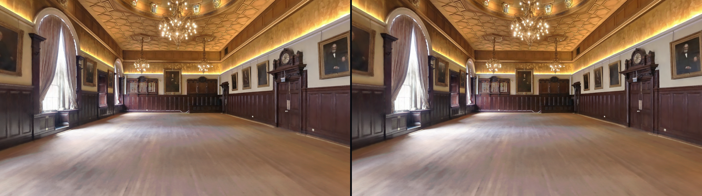
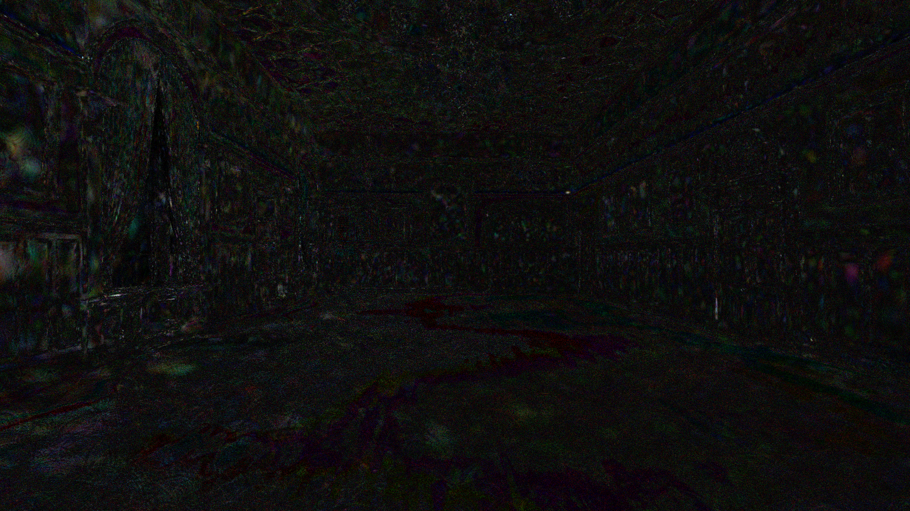

# Grand Hall visual-lineage benchmark

**Status:** clean-commit hardware-v3 residency diagnostics and a symmetric SOG/SPZ comparison completed; genuine native LCC vendor-UI diagnostic captured; matched native adapter frame and human acceptance pending
**Source audit date:** 2026-08-23; visible evidence refreshed 2026-08-31
**Audit reference:** hardware-v3 producer `8a71c1b7`; sealed comparison tool `09034f8f`
**Source root:** `C:\GRAND_HALL_BIG_MODEL_VARIATIONS`
**Target:** Trades Hall Glasgow / Grand Hall only

This report freezes the evidence and contract for the first deterministic
visual-lineage comparison. The hardware-v3 SOG, SPZ, and structural PLY lanes
come from clean commit `8a71c1b7`, an RTX 4090 hardware renderer, distinct
browser processes, and one cold load plus three same-runtime resident captures
per representation. Every capture retains a 120-warm-up / 600-timed-frame
profile. They are still diagnostics: the camera is inspection-only, SOG/SPZ
retain resolved inherited Spark defaults, and human review is pending. A
separate genuine vendor-editor native-LCC UI frame now exists, but it has UI
chrome and no deterministic camera, projection, residency, convergence, or
native-capture receipt, so it is not admitted to the matched-camera ranking.
Authenticated staging/package browser-WebGL QA has not run and is not required
for this local milestone.

The source files were supplied by the project owner with authority to use them
for this project. Rights to use an asset do not change its truth class. Truth is
assigned per declared asset and layer, not inferred from file format: the
selected eleven-member SOG appearance is `CAPTURED`, while the pose/mesh
structural diagnostics are `RECONSTRUCTED`. Neither is surveyed or measured
operational geometry.

## 1. Claim boundary

- SHA-256 and byte counts below establish file identity only. They do not prove
  visual quality, room accuracy, metric alignment, or fitness for operational
  planning.
- A format has no automatic truth class. The current RoomScene manifest records
  the exact SOG appearance as `CAPTURED`; OBJ/PLY and pose-derived structural
  witnesses remain `RECONSTRUCTED`. Any SPZ/LCC/LCC2 candidate must retain its
  own declared lineage rather than inherit a format-wide label.
- The current Grand Hall transform is a source-inspection transform, not a
  signed ARF-to-CVF-to-RRF room alignment.
- No generated or procedurally invented Grand Hall architecture is an eligible
  comparison source. The existing rectangular/domed planner room is excluded.
- The supplied `.ply` files are triangle meshes. No Gaussian PLY candidate was
  found in the supplied root.
- No comparative ranking or source-fidelity conclusion is made. The original
  exterior overview frames are retained as superseded exterior-camera
  diagnostic history. Fresh
  source-position interior SOG and SPZ frames read as a coherent Grand Hall to
  Codex, but formal human review of those exact hashes remains pending.

## 1.1 Hardware-v3 residency and symmetric radiance comparison

The complete local successor bundle is
[`2026-08-31-visible-first-hardware-v3`](../evidence/grand-hall-lineage/2026-08-31-visible-first-hardware-v3/visible-first-browser-bakeoff-receipt.json).
SOG and SPZ each served eleven source members exactly once, then retained the
same runtime UUID and source-request total through three further captures. PLY
served its one source member once and remained structural-only. All twelve
screenshots were byte-stable within their representation; WebGL2 stayed on
ANGLE D3D11 / NVIDIA GeForce RTX 4090 with no context loss.

The sealed authority-none comparator produced exactly three create-only files:

<figure>
  
  <figcaption>SOG left · SPZ right · exact decoded RGB8 pixels · human review pending.</figcaption>
</figure>

<figure>
  
  <figcaption>Per-channel <code>min(255, abs(SOG-SPZ) × 8)</code>; this is disagreement visualization, not an error map against ground truth.</figcaption>
</figure>

- Side-by-side PNG SHA-256:
  `8dced4d88ec65a884f63b02e6646ce797a1d90825c0c26167292cff869516add`
- Difference PNG SHA-256:
  `68e65209e737748f0fa5ac608d018ddfaefd01ef34745510dfaf0078916a9a7d`
- [Canonical comparison receipt](../evidence/grand-hall-lineage/2026-08-31-visible-first-hardware-v3-comparison/comparison-receipt.json)
  SHA-256:
  `b82b428b309368cf9a9ab129a683e2296bc9edd6b677ba5eba64e2925c2e1776`
- Aggregate RGB-byte MAE `1.8918046296296296`; RMSE
  `2.5220771495234136`; PSNR `40.095636261322205 dB`; maximum channel
  delta `34`; two RGB samples clipped by the ×8 display amplification.

The two frames are visually very close. In this one view, both show the empty
Grand Hall with a continuous timber floor and no facade, neighbouring room, or
false dark central floor. That limited observation cannot clear the whole room,
prove architectural fidelity, or decide which representation is more accurate
or beautiful. The receipt therefore fixes `winner: null`,
`visualAcceptance: not_reviewed`, and `rankingPermitted: false`.

## 2. Verified source inventory

The inventory and representative hashes were recomputed from the local source
root on 2026-08-23 with PowerShell `Get-ChildItem` and `Get-FileHash -Algorithm
SHA256`. Byte counts are raw decimal bytes.

### 2.1 Aggregate inventory

| Extension | Files | Total bytes | Interpretation |
| --- | ---: | ---: | --- |
| `.bin` | 12 | 3,368,596,896 | Native LCC payloads across three variants |
| `.btree` | 96 | 1,631,232 | LCC2 spatial-index members |
| `.jpg` | 9 | 1,664,487 | Thumbnails; not a source-photo corpus |
| `.json` | 18 | 23,056,749 | Pose and processing metadata |
| `.lcc` | 3 | 5,949 | Native LCC manifests |
| `.lcc2` | 6 | 744,420 | Three SOG and three SPZ manifests |
| `.lci` | 3 | 4,564,320 | Vendor files named `collision.lci`; semantics/parser/frame unvalidated |
| `.lcp` | 3 | 1,716 | Native LCC project metadata |
| `.obj` | 3 | 6,668,226 | Identical reconstructed triangle meshes |
| `.ply` | 99 | 12,037,272 | Per-tile meshes plus three identical combined meshes |
| `.sog` | 72 | 629,383,392 | Three 24-member SOG exports |
| `.spz` | 72 | 1,007,696,253 | Three 24-member SPZ exports |
| `.txt` | 3 | 7,014 | Processing reports/logs |

The nine top-level variants are:

| Variant | Principal representation | Files | Bytes |
| --- | --- | ---: | ---: |
| `scans_BIG_MODEL_TH_GH_1` | SOG/LCC2 | 60 | 214,350,601 |
| `scans_BIG_MODEL_TH_GH_2` | SOG/LCC2 + OBJ | 61 | 216,573,343 |
| `scans_BIG_MODEL_TH_GH_3` | SOG/LCC2 + combined PLY | 61 | 215,536,243 |
| `scans_BIG_MODEL_TH_GH_4` | SPZ/LCC2 | 60 | 340,454,888 |
| `scans_BIG_MODEL_TH_GH_5` | SPZ/LCC2 + OBJ | 61 | 342,677,630 |
| `scans_BIG_MODEL_TH_GH_6` | SPZ/LCC2 + combined PLY | 61 | 341,640,530 |
| `scans_BIG_MODEL_TH_GH_7` | Native LCC + OBJ | 12 | 1,129,361,511 |
| `scans_BIG_MODEL_TH_GH_8` | Native LCC + combined PLY | 12 | 1,128,324,411 |
| `scans_BIG_MODEL_TH_GH_9` | Native LCC | 11 | 1,127,138,769 |

### 2.2 Representative immutable identities

| Artifact | Bytes | SHA-256 | Evidence status |
| --- | ---: | --- | --- |
| `scans_BIG_MODEL_TH_GH_1\lcc2-result\Grand_Hall.lcc2` | 124,070 | `927a92699de222e99d2684ca2567a35ab1e523a036461e6e01236b7b77b7f659` | Verified local SOG manifest |
| `scans_BIG_MODEL_TH_GH_4\lcc2-result\Grand_Hall.lcc2` | 124,070 | `3d605eb8775722c0d12dba3e47a2bd2f875dd377d16f465e3e7c1e9ee226c127` | Verified local SPZ manifest |
| `scans_BIG_MODEL_TH_GH_2\mesh-files\Grand_Hall.obj` | 2,222,742 | `ba5aa3d2c244acca3937505a17b34fb7f437ef5f59b7a85e7e691a2b2bcd47b6` | Verified reconstructed mesh |
| `scans_BIG_MODEL_TH_GH_3\mesh-files\Grand_Hall.ply` | 1,185,642 | `be8d7a47c021c4299c554d5e325740c06238c078da6fee72b884807e19528fea` | Verified binary triangle mesh, not Gaussian PLY |
| `scans_BIG_MODEL_TH_GH_1\lcc2-result\info\poses.json` | 2,561,254 | `7a020e5f1cc00029ce773d1f448804fa1b7f16355412b023320975122556418d` | Verified pose metadata |
| `scans_BIG_MODEL_TH_GH_7\lcc-result\Grand_Hall.lcc` | 1,983 | `ce2a539483c7c2a271ca2555f6390e16425bb911851a8a56c2f16b17c248cac1` | Verified native LCC manifest |
| `scans_BIG_MODEL_TH_GH_7\lcc-result\collision.lci` | 1,521,440 | `ba410f1e6fa7f93b1c4ae7dd2dbb0aef211329dde40e8e3d75d29204f45b5248` | Verified bytes; semantics/parser unavailable |

The OBJ copies in variants `_2`, `_5`, and `_7` are byte-identical. The
combined PLY copies in variants `_3`, `_6`, and `_8` are also byte-identical.

### 2.3 Exact SOG fine frontier selected by the runtime contract

The physical SOG export contains 24 `.sog` files. The exact runtime contract
selects the eleven highest-detail non-environment leaf members below and
excludes `env.sog` and ancestor LOD nodes. Mounting both a selected leaf and one
of its ancestors would double-render data and is forbidden.

- Decision ID: `grand-hall-big-model-sog-fine-v1`
- Selection policy: `authoritative-leaf-nodes-exclude-environment-v1`
- Manifest SHA-256:
  `927a92699de222e99d2684ca2567a35ab1e523a036461e6e01236b7b77b7f659`
- Frontier receipt SHA-256:
  `sha256:8e7514e75aa19345dda1955f2cee3f9369339c553c2711c084cd04be4c9c1352`
- Selected total: 6,019,684 Gaussians / 106,479,738 bytes

| Ordered member | Gaussians | Bytes | SHA-256 |
| --- | ---: | ---: | --- |
| `data/3dgs/0_0_0_1_0_1.sog` | 556,880 | 9,980,174 | `97efa65f9aaddbd69780664c6668817125c3153469918d5f291b348ee0b6d7e1` |
| `data/3dgs/0_1_0_1_0_0.sog` | 528,394 | 9,500,250 | `2b0c0cce30cb31a34b253d5985985b3d547debe8bca1a97401eb72ab3ad3bdbf` |
| `data/3dgs/0_2_0_0_1_1.sog` | 608,233 | 10,575,631 | `b354ba55785e73a42aa4d108ac0c1fb93c333cbf5bd881e6c75149c2cecccd3e` |
| `data/3dgs/0_3_0_0_0_0.sog` | 604,745 | 10,376,269 | `e590fb5d7488071c63f10df33b31e451f3c0348c2209f1bf594015c28a1fff24` |
| `data/3dgs/0_3_0_1_0_1.sog` | 585,011 | 10,207,866 | `84b2ff813e0746d8fc8dfcc9d044dba15fef5f62ca137794c30989c04ba82a9d` |
| `data/3dgs/0_4_0_1_0_0.sog` | 514,640 | 9,199,768 | `5863e052c6f99316914df9168829543b82fb35db0118b5e02d30e4d326a79d03` |
| `data/3dgs/0_5_0_0_0_1.sog` | 504,860 | 8,975,642 | `65fd21b69a1def23cb4bd5b756da7ac03e4451a476a80a61c47b853a0366a8f1` |
| `data/3dgs/0_5_0_1_0_1.sog` | 551,142 | 9,708,760 | `d3272fee659e486190af1d2ac9427c39e5536bc85b90b5570df4b6e9e9124631` |
| `data/3dgs/0_6_0_0_0_1.sog` | 597,926 | 10,231,737 | `18e23290236bb3f220df2b59f6f255a421151c0f1da7ed633bd00d06eddf0171` |
| `data/3dgs/0_7_0_0_0_0.sog` | 524,982 | 9,417,293 | `7c4cca3644294c2955cfe9e41f387e70ce79e1aedcca132392c0493325ce4386` |
| `data/3dgs/0_7_0_0_0_1.sog` | 442,871 | 8,306,348 | `5e4409b07084ce7089e77a17d1eec0d2c4691f7a9d9e52f55ef752529d356ea9` |

The SOG LCC2 manifest reports 11,487,038 splats over five levels, with
6,019,684 in the finest level. The native LCC manifest reports 11,685,214
splats over five levels, with 6,127,396 in its finest level. Those counts do
not establish that the two representations contain identical primitives.

## 3. Pose and structural-source findings

### 3.1 SOG frontier and pose bounds

The complete selected SOG frontier declares source-space, Z-up bounds:

```text
min [-12.6987895965576, -19.8602905273438, -2.84312653541565]
max [  3.21748733520508,  2.69222021102905,  7.48998641967773]
```

`poses.json` contains 21,417 entries. Translation bounds are:

```text
min [-10.598763, -18.933943, -1.435568]
max [  0.615405,   1.519676,  2.255616]
```

Each inspected pose has timestamp `ts`, translation `T`, rotation array `R`,
and nullable `RGB`. The rotation ordering, handedness, camera-forward axis,
and camera-to-world versus world-to-camera convention have not yet been
validated against the native viewer. The file does not by itself establish
the vertical FOV or clipping planes required by a fixed-camera comparison.
Therefore no pose is yet a valid benchmark camera merely because it appears in
this file.

### 3.2 OBJ findings

The representative OBJ contains:

- 34,040 vertices;
- 59,763 triangle faces;
- bounds min `[-31.858929, -23.662237, -6.327585]`;
- bounds max `[3.825, 4.925, 8.617472]`;
- no material library or texture assignment.

The OBJ bounds are materially larger than the exact SOG frontier. A diagnostic
AABB comparison found 24,951 of 34,040 vertices and 47,634 of 59,763 complete
faces inside the SOG frontier; 47,777 faces touch it. This is evidence that a
reviewed connected-component/crop decision is needed before treating the mesh
as a room-only collision shell. It is not authority to delete the remaining
geometry automatically.

A diagnostic area histogram of near-horizontal OBJ triangles in 5 cm
source-Z bins found large surface concentrations around:

| Candidate band | Approximate triangle area by 5 cm bin |
| --- | --- |
| Source Z `4.40` to `4.50` | 12.90, 128.37, and 39.35 m² |
| Source Z `-2.25` to `-2.10` | 24.58, 72.79, 103.63, and 9.12 m² |

The upper band is consistent with a ceiling candidate and the lower band with
a main-floor candidate, but this is automated reconstruction analysis, not a
venue-reviewed semantic classification. Platforms, furnishings, outliers, and
incomplete scan surfaces can contribute to these bins.

The current source-inspection transform rotates X by `-π/2`, keeps scale `1`,
centres the SOG X/Y bounds, and translates the lowest SOG Z (`-2.8431265...`)
to world Y=0. If the dominant lower OBJ band around source Z `-2.20` is the
main floor, that floor would appear roughly 0.64 m above world Y=0. This is why
the current transform must not be described as a reviewed floor solve or
metric room alignment.

### 3.3 Structural truth caveats

- The OBJ/PLY can support an internal diagnostic proxy, cutaway, or collision
  experiment only with `RECONSTRUCTED` provenance and immutable source and
  derivative hashes.
- OBJ-to-GLB conversion, deterministic outlier removal, and a human-reviewed
  room crop may create a derived proxy; they must not create or complete
  windows, doors, walls, floors, or ceilings that are absent from the source.
- The `.lci` bytes are present, but there is no validated parser or published
  mapping from its contents to the application room frame. It is unavailable
  as collision authority today.
- A safe spawn, floor datum, portal list, and room-boundary shell remain
  unavailable pending structural review.

### 3.4 Corrective camera and composition diagnosis

The original `overview-v0` camera was not a valid Hall inspection view. Its
world position `[0,18.504553,33.687934]` inverse-maps to approximately
`[-4.740651,-42.271970,15.661427]` in source space: about 22.4 m beyond the
captured long-axis bound and 8.17 m above the captured top. It was a
whole-frontier sphere-fit dollhouse camera outside an interior-trained 3DGS,
so the compact translucent shell in the retained v0 frames was expected. The
runtime camera used a further 1.12 distance margin and was farther outside.

Read-only decoding and hierarchy checks ruled out collapsed tiles or missing
per-member transforms:

- the eleven selected files are exactly the complete depth-five frontier and
  total 6,019,684 Gaussians;
- the LCC2 offset and shift are zero, scale is one, and no per-file transform
  exists;
- decoded SOG chunk bounds match the LCC2 node bounds with a 5.52 mm maximum
  residual, while decoded SOG and SPZ positions agree point-for-point with a
  1.43 mm maximum residual; and
- adding ancestors would duplicate four coarser replacement levels, while
  `env.sog` is a kilometre-scale far-field shell rather than missing room
  architecture.

The corrected v1 fixture uses the transformed position of exact
`poses.json` entry 19,890 (`ts 1780223098.347440958`) and points horizontally
toward the centre of the q05/q95 captured-pose envelope. The position is
source-derived; the look direction and 60-degree FOV remain inspection choices
because source rotation convention and optical intrinsics have not been
validated. Both camera and target are inside the captured frontier and pose
envelope. The runtime default now uses that same interior view and keeps orbit
coordinates within the pose envelope.

The LCC2 manifest also declares `renderingHints.sortingMethod = "depth"`.
Grand Hall now passes `sortRadial: false` explicitly to Spark in both the exact
runtime and lineage fixture. This changes only the ordering metric; it does not
modify captured coordinates, transforms, colours, or architecture.

## 4. Fixed-camera lineage harness contract

The benchmark unit is one representation rendered from one immutable camera
fixture under one immutable settings profile and one recorded execution
environment. A screenshot without the complete record is review material, not
lineage evidence.

### 4.1 Required identity fields

Every run record must contain:

- schema version, run ID, UTC start/end, and run disposition;
- repository commit SHA, dirty-worktree state, and a SHA-256 digest of the
  served source state whenever the tree is dirty;
- venue slug, room slug, camera fixture ID and revision;
- representation ID and exact v0 format (`lcc`, `lcc2`, `sog`, `spz`,
  `ply_mesh`, or `venviewer`);
- source/master/runtime lineage description plus immutable source receipts and,
  for SOG/SPZ, ordered filenames, SHA-256 values, byte counts, and decoded
  Gaussian total;
- camera-registration state (`unavailable`, `inspection_only`, or
  `reviewed_matched`) and renderer-profile state (`unavailable`,
  `diagnostic_unresolved_defaults`, `diagnostic_resolved_defaults`, or
  `controlled_explicit`), plus visual assessment (`not_reviewed`,
  `reviewed_accepted`, or `reviewed_rejected`);
- canonical and actual camera state, actual renderer colour state, viewport,
  DPR, renderer settings, resolved Spark runtime state, fixture
  settings, warm-up/timed-frame counts, frame percentiles/max, environment, and
  context-loss state;
- screenshot path, SHA-256, byte count, pixel dimensions, and capture status;
- limitations and explicit unavailable state.

Truth remains referenced through the associated visual-asset/RoomScene
manifest in v0; it is not duplicated as a free-form benchmark field. An
authenticated Venviewer record must additionally cite its runtime-package and
transform receipts when that later staging surface is authorized.

Unknown values must be `null` with a reason. They must not be replaced with a
best guess.

### 4.2 Camera fixture

The camera record must freeze:

- fixture ID/revision and, when sourced from `poses.json`, pose index and `ts`;
- source position and rotation plus the validated convention;
- transformed world position and normalized quaternion;
- target/look-at point as descriptive metadata, while the quaternion remains
  authoritative;
- projection type, vertical FOV, near, far, aspect, and zoom if orthographic;
- CSS viewport, output pixel width/height, and device pixel ratio;
- camera projection and world matrices serialized after the scene settles;
- camera-mapping method, reviewer, review timestamp, and residual/error note.

The first suite should contain at least a room-wide captured pose and a
difficult oblique captured pose. Their numeric values and IDs remain
**unavailable** until pose convention and FOV are validated. A hand-placed
approximation may be useful for exploration but is not the matched-camera
benchmark.

The native LCC reference is eligible only if the external viewer accepts the
same numeric camera or a documented mapping with a measured residual. If it
does not, that comparison remains unavailable rather than being presented as
pixel-equivalent.

### 4.3 Fixed renderer profile

The initial controlled profile is:

| Field | Required value or rule |
| --- | --- |
| Browser | Playwright Chromium; record Playwright `1.59.1` and actual browser build/revision |
| Viewport | 1600 × 900 CSS px |
| Device scale factor | 1 |
| Output | 1600 × 900 px, overlay-free canvas PNG; dimensions read back from the PNG |
| WebGL antialias | `false` |
| Power preference | `high-performance` |
| Three.js | `0.180.0` |
| Spark | `@sparkjsdev/spark` `2.0.0` |
| Camera | Exact immutable fixture; controls disabled |
| Animation | Disabled; fixed scene time |
| Colour/tone | Explicit color space, tone mapping, tone-mapping exposure, alpha, and clear colour recorded |
| Source lifecycle | `cold_load` or `resident` declared; no HTTP-cache reload claim |

Current product code explicitly creates `SparkRenderer` with
`transparent:true` and `depthWrite:false`, and exact Grand Hall `SplatMesh`
instances with `editable:false`, `raycastable:false`, and per-member
`maxSplats = declaredMemberGaussianCount + 1`. The diagnostic harness reads
back the remaining resolved Spark values. A controlled profile must pass and
record them explicitly so a library update cannot silently change a benchmark:

| Spark setting | Frozen baseline |
| --- | ---: |
| `maxStdDev` | `sqrt(8)` |
| `minPixelRadius` | `0` |
| `maxPixelRadius` | `512` |
| `minAlpha` | `0.5 / 255` |
| `enable2DGS` | `false` |
| `preBlurAmount` | `0` |
| `blurAmount` | `0.3` |
| `focalDistance` | `0` |
| `apertureAngle` | `0` |
| `falloff` | `1` |
| `clipXY` | `1.4` |
| `focalAdjustment` | `1` |
| `encodeLinear` | `false` |
| `sortRadial` | `true` |
| `minSortIntervalMs` | `0` |
| `enableLod` | `true` |
| `enableDriveLod` | `true` |
| `enableLodFetching` | `true` |
| `lodSplatScale` | `1` |
| `lodRenderScale` | `1` |
| `lodInflate` | `false` |
| `pagedExtSplats` | `false` |
| `maxPagedSplats` | Explicit numeric resolved value; desktop default is `16,777,216` |
| `numLodFetchers` | `3` |

Also record `accumExtSplats`, `covSplats`, depth test/write, premultiplied
alpha, active splats when observable, maximum splats, SH level, LOD splat count, render target,
and any representation-specific decoder options. If a profile intentionally
changes blur or `focalAdjustment`, it is a new profile and must not overwrite
the baseline result.

### 4.4 Timing and runtime fields

No controlled-profile values exist yet. The executable local diagnostic
harness records monotonic per-member completion elapsed time, stable time,
explicit demand-render request-to-post-render-observation wall
percentiles/max, decoded splat count, active Spark splats, settled sort flags,
resolved Spark values, actual camera/colour pipeline, browser/WebGL identity,
and context-loss state. It asserts every canonical SOG member count and the
exact 6,019,684 decoded total before capture. Source bytes are hashed into
immutable in-memory buffers before serving; a fresh strict-port Vite process
prevents reuse of another worktree's server; dirty source plus the executed
`@omnitwin/types` build are fingerprinted. Deterministic output paths are
cleared before each run and published from temporary files only after schema
validation. The PNG gate checks dimensions and non-background pixel presence,
but explicitly does not prove completeness, fidelity, room identity, or visual
acceptance. These wall measurements are not GPU timer queries. A later
controlled/authenticated harness must
extend that record with the following raw observations rather than infer them:

- navigation start and authenticated preview-metadata completion;
- per-member request start/end, bytes received, receipt verification start/end,
  SHA-256 verification time, decode start/end, initialization end, and GPU
  attachment end;
- first canvas paint and first meaningful captured pixel;
- first member attached, all expected members attached, and exact loaded-splat
  total reached;
- time to stable, including the criteria used to declare stability;
- cold-load and same-runtime resident-capture totals reported separately;
- timed frame count, elapsed sample duration, mean/p50/p95/p99/max frame time,
  mean/p50/p95/p99 FPS, and long-frame count at declared thresholds;
- renderer calls, triangles, points, textures, geometries, and programs before
  and after the sample;
- JavaScript heap fields when supported;
- WebGL vendor, unmasked vendor, renderer, unmasked renderer, WebGL/GLSL
  versions, relevant extensions, OS, CPU/logical processors, user agent, and
  browser revision;
- Spark sort count/time and active/visible splat count when the installed API
  exposes them; otherwise `null` with reason;
- screenshot encode duration, output bytes, and output SHA-256.

A deterministic capture gate must require all expected receipts verified, all
expected meshes initialized and attached, `activeSplats > 0`, `sorting ===
false`, `sortDirty === false`, `dirty === false`, the exact camera projection/world matrices
applied, no outstanding representation fetch, and no context loss.
After that gate, explicitly invalidate and observe 120 warm-up render frames at
the locked camera, then collect 600 explicitly invalidated rendered frames
before the screenshot. Record actual wall time; do not assume a 60 Hz display.

The v0 schema permits `passed` only when human visual assessment is
`reviewed_accepted`, the worktree is clean, the camera is `reviewed_matched`,
the renderer profile is `controlled_explicit`, at least 120
warm-up and 600 timed frames are recorded, and timestamps, immutable source
receipts, actual camera, screenshot, timings, environment, and no-context-loss
evidence validate coherently, source refs and member paths/receipts are unique
and exactly matched, and
the controlled numeric profile matches the observed Spark state. An inspection
camera, inherited library defaults, a dirty tree, a reduced sample, or absent
human acceptance is `diagnostic` at best.

## 5. Current benchmark status — 2026-08-30

The visible comparison is
[`grand-hall-visual-lineage-comparison-2026-08-30.md`](grand-hall-visual-lineage-comparison-2026-08-30.md).
Its six PNG/JSON evidence files were written directly into the dated evidence
folder after commit `a940a281`, with the evidence path excluded from the source
dirty-state calculation but not from the final bundle receipt. All three runs
record `worktreeDirty: false`, Chrome 147 / ANGLE D3D11 / NVIDIA GeForce RTX
4090, 1600 × 900 at DPR 1, 120 warm-up and 600 timed frames, and no context
loss.

This dated evidence contains one capture per representation. It does **not**
prove the protocol's promised fresh browser process per representation or one
cold-load capture plus three same-runtime resident captures. It remains valid
diagnostic history, but the canonical executable for the complete browser
schedule is now the sequential orchestrator documented in
[`grand-hall-visible-first-browser-bakeoff-runbook.md`](../operations/grand-hall-visible-first-browser-bakeoff-runbook.md).

The later `2026-08-31-visible-first-hardware-v2` attempt is rejected and
incomplete. The cold SOG record was produced, but its first reload caused the
bound source-server total to increase from 11 to 22; therefore it has no valid
resident sequence and no final v2 receipt. The fresh successor target is
`2026-08-31-visible-first-hardware-v3`, which must use
`cold-load-1`, `resident-capture-1`, `resident-capture-2`, and
`resident-capture-3`, bind `VENVIEWER_BROWSER_SOURCE_RESIDENCY_V1`, and finish
with a `venviewer.grand-hall.visible-first-browser-bakeoff.v3` receipt.

| Candidate | Exact decoded source | Visible evidence | Current disposition |
| --- | --- | --- | --- |
| Exact SOG fine frontier | 11 members; 106,479,738 bytes; 6,019,684 decoded and active Gaussians | PNG `sha256:72f4c376d2742128daac0fb1a8ec68c178fd0e373bf47c1ce9e808cd077d3aae` | **DIAGNOSTIC / HUMAN REVIEW PENDING** — captured-radiance review pool |
| Name-matched SPZ fine frontier | 11 members; 178,415,360 bytes; 6,019,684 decoded and active Gaussians | PNG `sha256:02740825e322d119fd3484bda8d2b90fd2acd4352c5891cb9d51fca9b9613d20` | **DIAGNOSTIC / HUMAN REVIEW PENDING** — captured-radiance review pool; export lineage still distinct from SOG |
| Supplied triangle PLY | 1,185,642 source bytes; 34,040 XYZ vertices; 59,763 triangles | PNG `sha256:1678e63618c828ceac130d72dc1e9ac0c7de496814fb9944cff266190b338f60` | **STRUCTURAL DIAGNOSTIC ONLY** — deterministic normal-debug colours; excluded from radiance ranking and room admission |
| Native `_9` LCC | Manifest `sha256:ce2a539483c7c2a271ca2555f6390e16425bb911851a8a56c2f16b17c248cac1`; 6,127,396 finest-level splats | Genuine 1600×900 vendor-editor UI PNG `sha256:2e4dfe18a951a5764c09a7d3fcdbb2d0f32085b8d5eb46df9c7a11f53c89e12f` | **DIAGNOSTIC / NOT RANKING-ELIGIBLE / NOT A LOSER** — native package visibly loads; frame lacks the receipt-bound matched camera required for comparison |
| Current Venviewer runtime | Exact SOG code path exists | No authenticated product frame in this bundle | **NOT RUN** — local fixture evidence does not claim package activation or staging QA |

SOG and SPZ visibly show a coherent Grand Hall in this camera, including an
uninterrupted timber floor. That is an observation, not formal acceptance or a
whole-room accuracy claim. The supplied PLY is independently proven to be a
byte-complete triangle body with no unsupported properties or trailing bytes;
its reconstructed geometry remains broader than an accepted Grand Hall-only
boundary.

The six frozen evidence files are bound by
[`SHA256SUMS`](../evidence/grand-hall-lineage/2026-08-30/SHA256SUMS).

### Immediate continuation

1. Complete the first-party LCC Editor module in an isolated profile, derive
   native coordinates through the live vendor scene transform, require
   converged repeated camera-only captures, and replace the UI diagnostic with
   a ranking-eligible matched native row.
2. Ask a human reviewer to accept or reject the exact SOG/SPZ/native hashes for
   room identity and the prohibited-artifact checklist. PLY is reviewed only
   for structural scope, never radiance beauty.
3. Recover optical rotation/FOV or explicitly freeze an inspection-only suite,
   then add a difficult oblique view before selecting any captured baseline.
4. Continue camera recovery, metric registration, and Grand Hall-only boundary
   review locally. Staging remains outside this milestone and still requires
   separate authorization.

## Appendix A — superseded 2026-08-23 benchmark status

The following section is retained as immutable diagnostic history. Its
SwiftShader timings and dirty-worktree hashes are superseded by the 2026-08-30
hardware records above and must not be accepted as the current comparison.

| Candidate | Source identity | App/runtime readiness | Fixed matched camera | Screenshot | Timing/performance | Status |
| --- | --- | --- | --- | --- | --- | --- |
| Native LCC | Local manifest and payload verified | External native viewer required | Unavailable | Unavailable | Not run | **UNAVAILABLE** — no matched native export |
| Exact SOG fine frontier | Eleven pinned members; 106,479,738 bytes; 6,019,684 decoded/active splats | Local immutable-buffer dev fixture and corrected exact runtime path; no selected staging target, package activation, or deployment | Source-position-derived inspection camera | `grand-hall-sog-source-pose-19890-interior-v1-diagnostic-0w-1f.png` | SwiftShader: load 2,485.4 ms; stable 63,173 ms; one request-to-post-render observation 58,818 ms | **DIAGNOSTIC — COHERENT GRAND HALL TO CODEX; HUMAN REVIEW PENDING** |
| Name-matched SPZ candidate | Eleven runtime-hashed matching-name members; 178,415,360 bytes; 6,019,684 decoded/active splats; export lineage not independently proven | Local immutable-buffer dev fixture only; not admitted by the canonical package | Source-position-derived inspection camera | `grand-hall-spz-source-pose-19890-interior-v1-diagnostic-0w-1f.png` | SwiftShader: load 3,219.7 ms; stable 64,225 ms; one request-to-post-render observation 59,758 ms | **DIAGNOSTIC — COHERENT GRAND HALL TO CODEX; HUMAN REVIEW PENDING** |
| Gaussian PLY | No Gaussian PLY found | Not applicable | Unavailable | Unavailable | Not run | **UNAVAILABLE** — supplied PLY is a triangle mesh |
| Current Venviewer runtime | Exact SOG implementation exists at audit commit | No activated exact package and no authenticated staging/package browser-WebGL QA | Unavailable | Not run | Not run | **NOT RUN** |
| OBJ/PLY structural proxy | Local reconstructed mesh verified | No reviewed crop, signed transform, GLB derivative, or collision runtime | Not a radiance benchmark candidate | Not run | Not run | **DIAGNOSTIC ONLY / NOT RUN** |

Four local diagnostic PNG/JSON pairs now exist under
`docs/evidence/grand-hall-lineage/2026-08-23`. The two `overview-v0` pairs and
their original source-state digest remain immutable superseded exterior-camera
diagnostic history. The corrected v1 pair shares source-state digest
`sha256:d4d1e53fc590d5cb11fa1eabacc9f42e267d7bafdcb70fbd2a3c4ec58a5e6906`.
Its SOG PNG SHA-256 is
`sha256:83bc8c80a0ce0e00d31a8b05c52473cc5292e17c51f2f86ee7edd9b907527a59`;
its SPZ PNG SHA-256 is
`sha256:da894224fddabc4aaf04d152fe6bdb4e9900e4899950eae726ab30cf867f2fa3`.

Both v1 records are schema-valid `diagnostic` entries with
`visualAssessment: not_reviewed`, `NoToneMapping`, `srgb`, explicit depth
sorting (`sortRadial: false`), settled sort/dirty flags, 6,019,684 active
splats, a dirty worktree, a source-position-derived inspection camera, and a
0-warm-up/1-frame sample. Pixel coverage is 99.976% for SOG and 99.969% for
SPZ. Codex inspection finds both room-wide frames coherent: their windows,
curtains, timber panelling, portraits, doors, chandeliers, decorated ceiling,
and uninterrupted timber floor come from the supplied splats, with no dark
invented central floor. Blake or another human reviewer has not yet
dispositioned these exact hashes, so neither record is `reviewed_accepted` or
`passed`.

The corrected SOG and SPZ outputs are visually very similar, but this is not a
claim of format parity. The optical camera remains unmatched, most Spark
numeric settings remain inherited rather than an approved controlled profile,
the SPZ export lineage is name-matched rather than independently proved, and
formal human review remains pending. The evidence does establish that the old
compact mass was a bad external camera presentation rather than collapsed
frontier placement, missing per-tile transforms, or invented room geometry.

## Appendix B — superseded staging-oriented protocol

This historical protocol predates the local visible-first continuation above.
Its staging-first order is superseded. It remains useful as a record of later
deployment controls only; do not execute it without separate staging authority.

The following is the reproducible protocol for a later controlled comparison.
The local diagnostic harness exists, but staging authority, a reviewed matched
camera, and an explicit renderer profile do not.

1. **Satisfy external prerequisites.** Select an isolated staging target;
   deploy the reviewed commit; configure distinct read-only runtime and
   put-only intake storage credentials plus the intake admin token in the
   provider secret manager; complete the conditional-PUT rehearsal; upload,
   register, and activate the exact package; and explicitly authorize
   authenticated browser/WebGL QA. Record target, deployment, package, and
   activation IDs. Do not use production as the first benchmark target.
2. **Freeze the execution envelope.** Start from a clean checkout. Record
   `git rev-parse HEAD`, `git status --porcelain`, SHA-256 of `pnpm-lock.yaml`,
   Node and pnpm versions, OS build, Playwright version, Chromium revision,
   GPU/driver, and display configuration. Run `pnpm install --frozen-lockfile`.
3. **Reverify source identity.** Recompute hashes for both LCC2 manifests,
   `poses.json`, OBJ, combined PLY, native LCC manifest, `.lci`, and all eleven
   selected SOG members. Refuse the run on any size/hash mismatch. Verify the
   registered package returns the same ordered member IDs, sizes, hashes, and
   content digest through the authenticated preview receipt.
4. **Create and review camera fixtures.** Select a room-wide and difficult
   oblique pose from `poses.json`; establish the exact rotation convention by
   comparing axes against the native viewer; obtain or explicitly choose the
   vertical FOV/near/far; transform into the benchmark room frame; serialize
   source pose, transform, world matrix, projection matrix, viewport, and DPR;
   then hash and human-review the fixture. Do not proceed with an approximate
   native-LCC comparison.
5. **Prepare candidates without changing their truth.** Use the selected
   eleven-member SOG frontier. Register an independently receipt-bound SPZ
   candidate with a documented equivalent leaf-selection decision. Keep native
   LCC external. Mark Gaussian PLY unavailable. Do not introduce enhancement,
   generative fill, invented geometry, exposure retouching, or post-capture
   resampling.
6. **Acquire the native reference.** In the native viewer, apply the exact
   fixture or documented mapping, set 1600 × 900 output with equivalent FOV and
   projection, disable UI/overlays, export lossless PNG, and record viewer
   version, settings, operator, UTC time, mapping residual, PNG dimensions,
   bytes, and SHA-256. If the viewer cannot reproduce the numeric camera, leave
   the native row unavailable.
7. **Run browser candidates.** Launch a fresh Playwright Chromium process for
    each representation. Apply the fixed profile and camera before attachment.
    Navigate and load the source once, capture `cold-load-1`, then capture
    `resident-capture-1`, `resident-capture-2`, and `resident-capture-3` from
    that same live fixture runtime without another navigation, source fetch,
    decode, or scene attachment. Never reuse one representation's page or GPU
    resources for the next representation. Preserve raw JSON and canvas-only
    PNG for every capture. This is a residency and visual/frame-stability
    schedule, not an HTTP-cache reload benchmark.
8. **Use the sequential browser orchestrator.** The executable entry point is
   the `@omnitwin/web` `visual-lineage:bakeoff` script. It requires explicit
   source/evidence paths, builds shared types, and launches a separate direct
   Playwright process with a fresh strict-port server for each representation.
   Playwright reads and hashes each source into an immutable buffer before
   navigation; the SOG variant must match every pinned canonical size/hash
   receipt. Use a new, absent evidence directory under
   `docs/evidence/grand-hall-lineage`. For example:

   ```powershell
   $env:GRAND_HALL_LINEAGE_ROOT='C:\GRAND_HALL_BIG_MODEL_VARIATIONS'
   $env:GRAND_HALL_LINEAGE_EVIDENCE_DIR="$(Resolve-Path .)\docs\evidence\grand-hall-lineage\<new-run-id>"
   $env:GRAND_HALL_LINEAGE_BASE_PORT='5189'
   pnpm --filter @omnitwin/web visual-lineage:bakeoff
   ```

   The orchestrator binds each record to the exact shared camera-profile
   digest, requires one cold-load and three resident captures per
   representation, and verifies that the same runtime identity survives while
   source-request totals remain unchanged after the cold load. Each record
   carries `VENVIEWER_BROWSER_SOURCE_RESIDENCY_V1` with process scope
   `one_representation_one_cold_load_plus_three_resident_captures`. The final
   receipt schema is
   `venviewer.grand-hall.visible-first-browser-bakeoff.v3`. It fixes every
   capture at 120 warm-up plus 600 timed frames and does not inherit lower
   frame-count overrides from the operator shell.
9. **Validate before comparison.** Schema-validate every record; confirm exact
   camera matrices, viewport/output dimensions, profile values, representation
   hashes, loaded counts, and absence of context loss. Reject incomplete runs.
   Compute perceptual/image differences only between valid runs from the same
   pinned environment. Do not use cross-GPU pixel equality as a pass/fail gate.
10. **Record human review separately.** Review the room-wide and oblique images
    for holes, floaters, blur, duplicated LODs, exposure, floor/wall continuity,
    and camera parity. A human verdict must cite the exact run IDs and PNG
    hashes. It must not promote reconstructed geometry to measured geometry or
    imply operational approval.

For a later structural-navigation run, first preserve the immutable OBJ, derive
a hash-addressed GLB without inventing geometry, review the room crop and floor
datum, register the transform/safe spawn/boundary evidence, and only then test
floor following, capsule collision, escape prevention, dollhouse, and cutaway.
That structural run is separate from the visual-lineage comparison above.
