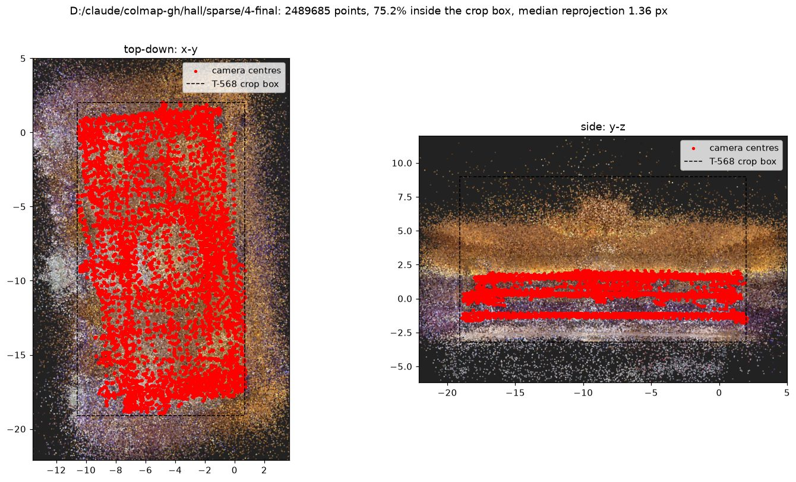
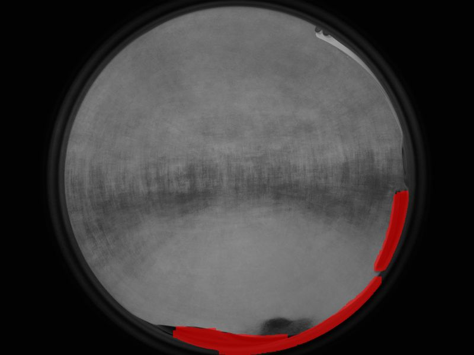
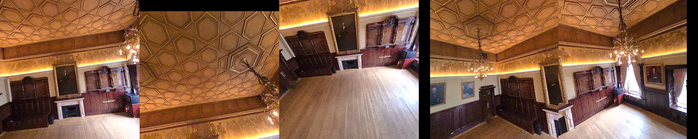

# The whole Grand Hall through the bridge, and the dataset handed to the T-502 trainer

**Date:** 2026-09-02 (run continuing into 2026-09-03) · **Task:** T-572 · **Status:** IN PROGRESS — the numbers marked `[pending]` are filled in when the serial pipeline finishes · **Instruction:** "run the bridge over the whole Grand Hall at a higher budget and hand the refined dataset to the T-502 trainer" · **Tool:** `tools/xgrids-xbag/xbag_colmap.py` (checkpoint 5db7aebd, 65 unit tests) · **Predecessor:** `xbag-colmap-zone-2026-09-02.md` (T-571, the south-west quarter)

## The short version

The whole hall means 12,158 four-camera instants inside the T-568 hall box. Motion keyframing (keep an instant after 0.4 m of travel or 15° of turn) reduces that to 3,761 instants, 15,044 frames, decoded to `D:\claude\colmap-gh\hall\`. Everything the zone run proved carries over: the settled reading of the T-566 receipt, the pose-file clocks, the refinement recipe. Three things did not carry over and each changed the design:

1. **Learned matching is blind to the fisheyes.** kornia's DISK + LightGlue on the RTX 4090 verified 1,084 pinhole pairs and zero fisheye pairs on the zone; COLMAP's SIFT verified 1,882 fisheye pairs on the same frames. The whole-hall run is therefore a hybrid: DISK + LightGlue for the two pinholes on the GPU, COLMAP SIFT for the two fisheyes on the CPU, one database.
2. **Rig-aware bundle adjustment drifts in pycolmap 4.2.0.** Declaring the four cameras as one rig and adjusting with position priors changed the frame's scale by 6 to 7 % and moved cameras 27 cm (median) on the zone, against 0.02 % and 12 cm for the per-image path the zone report validated. The rig path stays an experiment on a database copy; the shipped model is the per-image refinement.
3. **There is no runnable T-502 trainer to hand to.** Master's trainer exits at import ("upstream not vendored"), the branch's exits 78 by design, no trainer image has ever been built, no RunPod key exists on this machine, and the project's own rights gate refuses a training stage until a rights record exists. The honest deliverable is a package that passes the branch's T-514 preflight, a launch bundle that is ready but not executed, and the decisions only the owner can make (last section). No training ran, locally or in the cloud.

## What ran, in order

| stage | what | result |
|---|---|---|
| select | motion keyframing 0.4 m / 15° over the hall box | 3,761 instants of 12,158 |
| extract | four decoder processes (later three: memory) | 15,044 frames, slot pattern pinhole, pinhole, fisheye, fisheye at every instant |
| pairs | pinholes: same instant + 8 nearest instants within 3 m; fisheyes: 4 nearest | 76,237 pinhole pairs, 41,277 fisheye pairs |
| gpu-features | DISK, 1,600 px, 4,096 keypoints per frame | 15,044 frames in 41 min |
| gpu-match | LightGlue, pinhole pairs only, one shard | 76,237 pairs in 43 min; 46,823 verified at 907 inliers on average |
| features / match (fisheye) | COLMAP SIFT (8,192 keypoints) and matching, fisheye pairs only | 7,522 frames in 2.7 h; 41,277 pairs in 3.5 h; 38,237 verified at 188 inliers on average |
| score | 256 receipt readings over 85,060 verified pairs, 49.7 M matches | the established reading wins again (0.397; its imu_lidar twin 0.365; the swapped fisheye order 0.354; everything else under 0.20) |
| triangulate | known poses, strict | 1,481,154 points, mean 1.58 px, mean track 2.8, 279 observations per image, 35 min |
| refine × 2 | position priors 0.1 m, intrinsics fixed, loose 16 px pass then tight re-triangulation at 4 px | 3,380,296 loose points → refined median 3.05 px; re-triangulated 2,489,685 points → refined median 1.36 px (p90 2.33 px, 28 points over 16 px); scale kept to 0.01 % |
| cameras moved (15,044, against the pose file) | | median 0.40°, 2.3 cm; p95 1.30°, 7.9 cm; max 8.5°, 45 cm |
| mesh check | distance to the LCC2 mesh, pose-file vs refined (20,000 sampled points with 3+ views) | median 31.6 cm → 27.5 cm; within 20 cm 36.9 % → 41.4 %; within 5 cm 11.5 % → 13.1 % |
| package | the T-502 layout | 41,737 images kept of 45,132 rendered (1,913 dropped for blur, 1,482 fisheye views for no sparse support), 7 PINHOLE cameras, 2,477,228 points, 10,872,283 observations, 5,218 held out; 50 min |



Two readings of these numbers. First, the pose file is better than the zone run suggested: with 85,060 verified pairs constraining 15,044 frames, the refinement moved the median camera only 2.3 cm and 0.4°, against 11.9 cm and 1.4° on the sparser zone, so most of the zone's deltas were the freedom of a thinly connected set, not error in the trajectory; the worst cameras (45 cm, 8.5°) are real outliers that refinement fixes. Second, the mesh distance floor is high (27 cm median) because the hall's points are dominated by the coffered ceiling, the chandeliers and the mouldings that the 60k-face LCC2 mesh smooths over; the direction of change is again what the check establishes.

## The walk's three heights, and why the pole matters for the budget

The T-571 report established that the operator scanned at roughly 1.2, 2.9 and 4.3 m above the floor (a pole). Motion keyframing by distance and turn keeps all three heights in proportion to how long the operator spent at them, which is what a splat wants: the raised stretch is the only close look at the coffered ceiling and the dome.

## Telling the two lenses apart, revisited

The zone rule (lens-circle ratio with a 2× gap) failed at instant 2217 where the pinholes scored 0.096 against fisheyes at 0.051 in an unlit corner. The order never flipped in 3,761 instants, so the per-instant decision is now by rank alone and the guard moved up a level: every instant must show the same slot pattern, and any that does not is reported with its ratios. All 3,761 agree.

## The hybrid matching design

- Pinholes: DISK at 1,600 px (4,096 keypoints, half a pixel added on import for COLMAP's pixel-centre convention), LightGlue per pair, 73 ms per pair on the 4090, matches written to part files and imported with `write_keypoints` / `write_matches`, then COLMAP's own geometric verification (`verify_matches`). About 1,200 matches per consecutive pinhole pair against 750 for SIFT; strict triangulation keeps fewer points because 1,600 px keypoints are coarser, which the loose-then-tight refinement rounds absorb.
- Fisheyes: one COLMAP SIFT pass over the 7,522 fisheye frames (never a second pass in the same process, never two COLMAP processes at once), matched over the fisheye pairs only.
- Fisheye-to-pinhole pairs across instants are dropped (54 inliers on average, and the rig calibration already ties the lenses); same-instant pairs are kept for the pinholes.
- The first whole-hall pass lost every fisheye pair to a one-bit defect: cameras rewritten into the database by the bridge lacked COLMAP's prior-focal-length flag, so verification fitted a fundamental matrix, which cannot fit a 200-degree lens, and all 41,277 fisheye pairs came back empty while their raw matches (650 to 900 per pair) were fine. The refined model of that pass carried zero fisheye observations and its package dropped 36,037 fisheye views for lacking sparse support. Setting the flag and re-verifying the stored matches (no re-matching: clear the stale geometry rows first, since the batch verifier skips pairs that already have one) recovered 38,237 verified fisheye pairs at 188 inliers on average, next to 46,823 pinhole pairs at 907.

## Memory, the constraint that shaped the schedule

This machine's commit limit is about 50 GB, of which other software holds about 30 GB; a torch process commits 9 GB on its own. Four decoders, a package builder, a Ceres adjustment and a mesh check together exhausted it twice (`Cannot allocate memory` from PyAV, `_ArrayMemoryError` from numpy, a killed worker in the package builder). The pipeline was rewritten to run one heavy stage at a time, which is why the whole hall takes the better part of a day on this laptop: `[pending]` hours in all. The same work on a rented GPU box with a CUDA COLMAP is about an hour; it needs the RunPod key that does not exist here.

## The package for the T-502 trainer

The branch contract (T-514, `feature/diary-p0-slice-3`) accepts PINHOLE cameras only, binary `sparse/0`, `images/` plus exact half-size `images_2/`, a `splits.json` reproducing the sorted-index-modulo-8 hold-out, and `depths/*.npz` for training images. The package (`xbag_colmap.py package`) produces exactly that from the REFINED model:

- the two pinhole frames of each instant undistorted at full size into PINHOLE cameras (OpenCV's zero-crop new matrix);
- each fisheye frame rendered through the exact kb4 model into five square 90° pinhole views (centre; up and fore/aft tilted 50°; down tilted 35° so it stops short of the operator at the bottom rim), 1,400 px, so the dome and ceiling reach the trainer without the polynomial-out-of-domain undistortion the stock parser would apply;
- a static operator mask per fisheye (the operator's head at the bottom rim and the rig bracket at the right rim, found as the low-variance dark regions across 220 frames: 2.7 % and 1.2 % of the frame) blacked out of the rendered views and excluded from the depth samples;
- a blur gate: variance of the Laplacian per output, dropping anything under 35 % of its camera's median;




- poses composed from the refined camera pose and the view rotation; sparse depth samples from the refined points projected into each training view (`uv`, `depth_m`, `width`, `height`), none for held-out views;
- `splits.json`, `colmap_input.json`, `package-receipt.json`; images named `i{seq}_c{k}[_{view}].jpg` so an instant's twelve outputs sort together (short on purpose: the checker caps `splits.json` at 1 MB, which 41,737 longer names exceeded).

The zone package (`D:\claude\colmap-gh\zone-sw-t502\`): 1,678 images kept from 1,800 rendered (20 dropped for blur, 102 fisheye views dropped for having fewer than ten sparse observations), 7 PINHOLE cameras, 49,671 points, 244,740 observations, 210 views held out, `images/` JPEG and `images_2/` PNG. The T-514 preflight from a worktree at 9c98b293 **passes** (exit 0) and writes `preflight-receipt.json` with the compiled canonical argv (`mcmc --max-steps 30000 ... --with-ut --with-eval3d --no-pose-opt --data-factor 2`), `actualTraining: false`, `authority: none`, and the decision `contract_valid_runtime_blocked`, the branch's designed terminal state, naming seven runtime blockers: bilateral-grid serialisation undefined under D-014, E57 depth not wired into the upstream runner, the legacy RunPod runner disabled by execution policy, the dependency closure not fully pinned or proven, metrics and hold-out bundle production not proven, a trusted job-spec with rights confirmation and compute approval required, and the tyro runtime translation never run in the pinned image. Reaching that took six contract corrections in a row, each a real defect in the package builder (all-frustum observations instead of real tracks, an `images.bin` over 256 MB, the −1 default point error, empty tracks, JPEG in the runtime folder, training views without a depth prior). The whole-hall package: `[pending]`.

Known limits of the package, stated plainly: the masked pixels are black in the training images because the contract has no mask channel; the hold-out rule leaks co-timed siblings (the contract fixes the rule), so held-out metrics from it overstate generalisation and a fixed-viewpoint comparison is the honest judge; depth priors come from our own sparse points, not from the LCC2 mesh (a rights question) nor from a Matterport E57 (prohibited for training).

## What was NOT done, and why

- No training run, local or cloud. Local CUDA training is deprecated by D-016 and CLAUDE.md; a cloud run needs a RunPod API key, six secrets, a built image, a pod template with a disk sized to the package, and a spend cap, none of which exist on this machine (`D:\claude\colmap-gh\LAUNCH-DRAFT.md` has the exact commands, not executed).
- No rights record. The repo's licence matrix says raw XBAG parsing and LCC2-derived training need consent; Blake's verbal grants are quoted in `D:\claude\colmap-gh\rights-record-DRAFT.json` with the fields the Foundry gate needs; only the owner can turn that into a record.
- No rig-aware refinement in the shipped model (see above).
- No per-image eval writer, no D-014 bundle: those are training outputs.

## Decisions only the owner can make (from the adversarial review of the plan)

1. Which policy governs a training dispatch: master's un-gated runbook or the Foundry gate (they cannot both be followed; the Blake Clause wants the override in writing).
2. The rights record: may the raw XBAG frames train a model; is `poses.csv` LCC2 content; may the LCC2 mesh supervise depth or only judge.
3. May D-006a (Config B, status proposed) be treated as accepted for this work.
4. RunPod: the owner-side console hour (account, API key, six secrets, two R2 buckets, template, registry namespace) and a spend cap in writing.
5. The fisheye baseline for T-502: rectified pinhole virtual views (this package), a patched trainer with per-camera fisheye rendering, or pinhole-only.
6. Config B variances to accept or amend: bilateral grid (rejected by the D-014 verifier), depth from our sparse points instead of E57, a rig-level hold-out.
7. Whether a local 4090 smoke training is authorised despite D-016 (recommendation: no).

## Reproduce

```powershell
cd tools/xgrids-xbag
python -m unittest discover -s tests -p "test_*.py"
bash D:\claude\colmap-gh\run_hall.sh D:\claude\colmap-gh\hall select extract pairs
bash D:\claude\colmap-gh\run_hall_hybrid.sh        # gpu-features, zone package + preflight, gpu-match, fisheye SIFT, import, score, write, triangulate, refine x2, mesh check, plot, package
```
