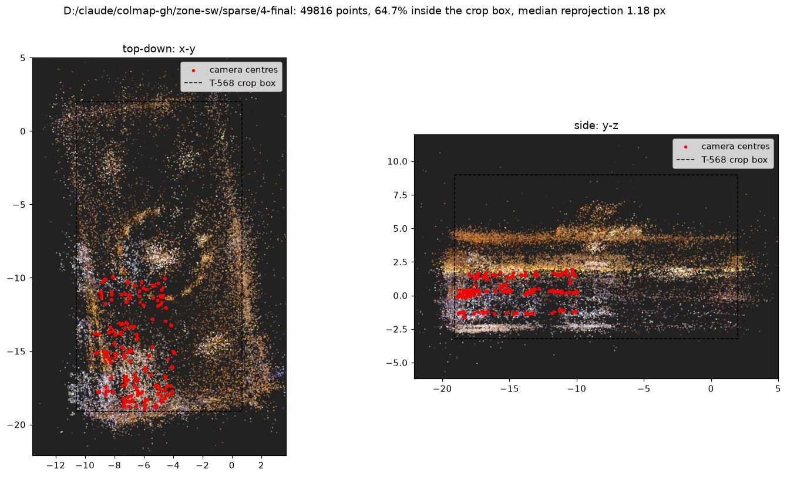
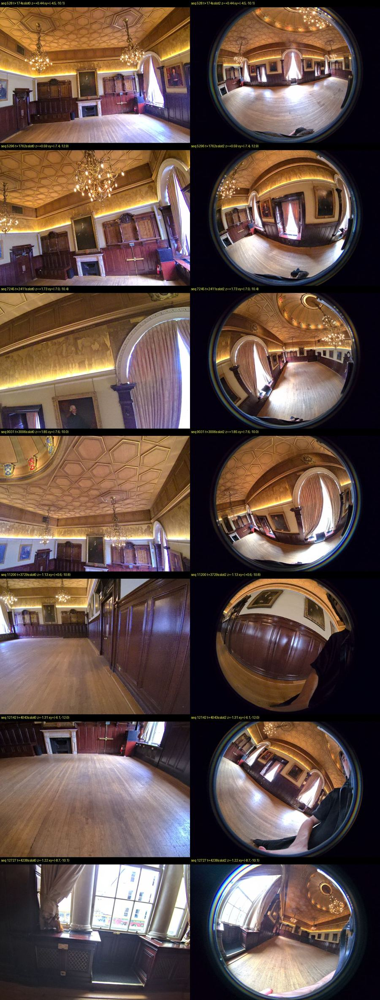

# XBAG to COLMAP: a posed dataset for the south-west quarter of the Grand Hall

**Date:** 2026-09-02 · **Task:** T-571 (the frames half of T-501) · **Status:** delivered; dataset at `D:\claude\colmap-gh\zone-sw\` (`images/` 1.9 GB, `database.db` 1.1 GB, `sparse/0` to `sparse/4-final`, `dataset-receipt.json`) · **Tool:** `tools/xgrids-xbag/xbag_colmap.py`, 49 unit tests across the package, all green

## What was built

A COLMAP dataset (`images/` plus `sparse/0/{cameras,images,points3D}.txt`) for the frames the PortalCam recorded while standing inside one bounded zone of the Grand Hall, with every camera pose derived from `project_data/poses.csv` and the T-566 factory calibration rather than estimated from the pictures. The zone is the south-west quarter of the hall in the capture's own metres (x −10.6 to −4.0, y −19.1 to −10.0, the frame of the T-568 crop box); it bounds where the scanner stood, while the frames see the whole hall. Alongside the pose-file model there is a refined one (`sparse/4-final`) in the same frame, and the difference between the two is the first measurement of how good the PortalCam's own trajectory is.

| | |
|---|---|
| instants in the capture / inside the zone / selected | 12,865 / 2,282 / 150 (every 15th, spread over the whole 71-minute walk) |
| frames | 600 (two pinhole, two fisheye per instant), seq 528 to 12,727, JPEG q95 at 4000 × 3000 |
| verified matches | 9,908 pose-guided pairs, 5,864 with 15+ inliers, 676,191 inlier matches |
| pose-file model, strict triangulation | 23,640 points, mean reprojection 1.60 px, mean track 2.6 |
| refined model | 49,816 points, median reprojection 1.18 px (p90 2.16 px), mean track 3.3, 273 observations per image |
| cameras moved by refinement (600, against the pose file) | median 1.4°, 11.9 cm; p95 3.8°, 28 cm; max 11.7°, 36 cm; frame scale kept to 0.1 % |
| points within 20 cm of the capture's own LiDAR mesh | 47 % under pose-file poses, 55 % after refinement (medians 21.7 cm and 17.6 cm) |



## Inputs

- Frames: the T-570 keyframe index (51,460 records, 12,865 four-camera instants). Selection takes the instants whose interpolated pose lies inside the zone and spreads a budget of 150 evenly over them, so the three heights the operator used and the several visits to the corner are all represented.
- Poses: `poses.csv`, 42,850 rows at 10 Hz, `ts, x, y, z, qx, qy, qz, qw`, on the frame timestamps' clock. Each frame's pose is interpolated (linear position, slerp rotation) between its two bracketing rows; a scan of clock offsets from −300 to +300 ms peaks sharply at 0 ms (cross-instant consistency 0.374 at 0, 0.27 and 0.30 at ∓50 ms), so no correction is applied and the two clocks agree to within about 25 ms.
- Calibration: the T-566 receipt as it is: kb4 fisheyes camera_0 and camera_1 (COLMAP `OPENCV_FISHEYE`), pinholes camera_2 and camera_3 with k1 k2 p1 p2 (COLMAP `OPENCV`), each camera's pose relative to camera_0, and the `camera_lidar` and `imu_lidar` matrices.

## Telling the two lenses apart

The T-570 rule (dark corners mean a fisheye) fails in the hall's unlit corners: at instant 1100 all four frames had corner means under 15 and at 1068 the pinholes were darker still. The replacement uses the calibrated lens circle: the kb4 model at 100° puts the circle's edge 1,543 px from the principal point, and the ratio of the mean intensity beyond that circle to the mean in a ring just inside it is near zero for a fisheye and near one for a pinhole however dark the scene. Over the 600 frames the fisheyes score 0.017 to 0.091 and the pinholes 0.121 to 1.57; the rule takes the two lowest of each instant as the fisheyes and requires the darkest pinhole to be at least twice the brightest fisheye (at 1068: 0.183 and 0.194 against 0.074 and 0.036). The writer's slot order held at every one of the 150 instants: pinhole, pinhole, fisheye, fisheye.

## Resolving what the receipt left open

The receipt does not say which stored fisheye is camera_0, which pinhole is camera_2, which way its matrices map, which sensor the pose file describes, or how to read the pose quaternion. Each combination is a hypothesis: two quaternion layouts, pose direction, eight body-frame readings (LiDAR or IMU with each matrix direction, or the pose already being camera_0 in OpenCV or OpenGL axes), the per-camera pose direction, and the two lens orderings: 256 in all. The scorer is the fraction of verified feature matches whose Sampson epipolar distance under the hypothesised relative pose stays under 4 px, on undistorted normalised coordinates; the matches are the same for every hypothesis, only the poses change.

| hypothesis | all | same instant | cross instant |
|---|---:|---:|---:|
| `xyzw`, pose file = IMU, `imu_lidar` LiDAR→IMU, `camera_lidar` LiDAR→camera, camera poses as given, fisheye slots = camera_1 then camera_0, pinhole slots = camera_3 then camera_2 | **0.357** | 0.723 | **0.226** |
| the same with `imu_lidar` read IMU→LiDAR (its twin: a 1° twist apart) | 0.320 | 0.723 | 0.174 |
| best of the remaining 254 | 0.206 | 0.723 | 0.020 |

Same-instant pairs depend only on the per-camera offsets and the lens orders, and they settle those outright: under the winner the stereo pinhole pairs sit at a 1.2 px median (81 % under 4 px), fisheye-to-pinhole at 3.5 px; inverting the camera poses or swapping either lens order destroys that. Cross-instant pairs settle the body frame: medians of 11.7 to 14.6 px for the winner against 14.7 to 17.3 px for its twin and 90 to 280 px for the wrong frames.

Two independent checks agree. A hand-eye solve on 943 same-camera pairs (relative rotations recovered from the matches by essential-matrix RANSAC) admits a consistent body-to-camera rotation only for the `xyzw` body-to-world reading (median residual 1.3 to 3.8° per slot, 14 to 17.5° for `wxyz`), and the rotation it measures lies within 0.5 to 2.2° of the winner's and 88 to 92° from every LiDAR or camera-frame reading. And the picture is physically right: the pose file's body x is camera_0's optical axis, the pinhole pair looks along camera_0's x, which is the direction the operator walks (their velocity aligns with the body's −z), so the forward-facing pair is the pinhole "seco" pair and the fisheyes are the sideways `left_main` and `right_main`.

What the twin ambiguity costs is a 1° twist that bundle adjustment absorbs; `sparse/0/hypothesis.json` records the winner and the slot assignment.

## The check: COLMAP's known-pose triangulation, then refinement

With the pose-file poses and the calibration fixed, COLMAP's point triangulator registers all 600 frames and builds 23,640 points at a 1.60 px mean; the loose-tolerance pass (16 px, 5°) builds 55,286. Bundle adjustment then refines poses only, with every camera tied to its pose-file position by a 0.1 m prior (which fixes gauge, scale and frame; the result is still aligned back onto the pose-file model by a similarity before the deltas are measured, and that similarity's scale comes out at 1.0002 and 0.9992 in the two rounds). Round one leaves a 1.83 px median; re-triangulating at 4 px on the refined poses gives 49,816 points, and the second round a 1.18 px median with one point over 16 px.

The cameras moved a median of 1.4° and 11.9 cm from where the pose file put them (p95 3.8° and 28 cm, worst 11.7° and 36 cm). That is the pose file's accuracy for this purpose, and it is consistent with the 12 to 15 px cross-instant residual seen before refinement: good enough to initialise, not good enough to train on unrefined.

The independent judge is the capture's own LiDAR mesh (`scans_BIG_MODEL_TH_GH_2/mesh-files/Grand_Hall.obj`, 59,763 faces, same frame as the pose file): triangulated points with three or more views sit a median 21.7 cm from it under pose-file poses and 17.6 cm after refinement, with the share within 20 cm rising from 47 % to 55 % and within 5 cm from 12 % to 17 %. The mesh is coarse (mouldings, chandeliers and frames are not in it), so the absolute numbers have a floor; the direction of the change is what the check establishes.

## The walk's three heights

The pose file's z runs from −1.9 to +2.2 within one hall, which looked like a storey change. Frames from each phase show it is not: the operator scanned at three heights, about 1.2 m above the floor in the last sixteen minutes, 2.9 m for most of the walk and up to 4.3 m in a raised stretch that fills the pinhole frames with the coffered ceiling. This is why the walk tool's eye-height clamp trips for the Grand Hall (T-569's open note): the walk's median sits 2.9 m above the floor slab at z ≈ −2.5. For training it is welcome vertical parallax. The fisheyes see the operator's arm at the bottom of every frame; a per-frame mask is a follow-up.



## Pipeline traps

Recorded in `.claude/gotchas/pycolmap-windows-traps.md`: pycolmap 4.2.0's CPU SIFT dies at start-up in about half of all child-process launches and in every second call within a process, while a first call in the tool's own process never did, so `features` is one pass over all four folders followed by a per-folder camera rewrite; a deleted `database.db` is not fresh while its WAL sidecar remains; the triangulator insists the model's camera ids carry the database's lens models; exhaustive CPU matching costs 0.15 to 0.3 s per pair at this resolution, hence pose-guided pairs (same instant, plus the six nearest instants within 3 m).

## Reproduce

```powershell
cd tools/xgrids-xbag
python -m unittest discover -s tests -p "test_*.py"
bash D:\claude\colmap-gh\run_zone.sh D:\claude\colmap-gh\zone-sw 150 6 select extract features pairs match score write triangulate triangulate-loose refine retriangulate refine2
python D:\claude\colmap-gh\mesh_check.py D:\claude\colmap-gh\zone-sw\sparse\0-triangulated D:\claude\colmap-gh\zone-sw\sparse\4-final
```

Wall-clock on the RTX 4090 machine (CPU-bound, no CUDA build of pycolmap): features about 4 minutes per 150 frames, matching 23.5 minutes for 9,908 pairs, scoring 3 minutes for 256 hypotheses, each triangulation about a minute, each refinement about 20 seconds. Exploration and evidence scripts (`diag_scores.py`, `handeye.py`, `time_offset.py`, `mesh_check.py`, `plot_model.py`) are under `D:\claude\colmap-gh\`.

## What this unlocks and what it does not

- Unlocked: the frames half of T-501. Posed, calibrated, COLMAP-format frames for any zone of any PortalCam capture, in the SLAM frame of the LCC2 export (so no `model_aligner` step is needed against the LiDAR mesh: the check above shows they already coincide), with the receipt's open readings settled by measurement rather than assumption. The T-566 blockers on camera mapping and matrix direction are closed for camera_lidar, the camera poses and the lens orders; the imu_lidar direction is a 1° twist the refinement absorbs.
- Not done: the LiDAR point records in the XBAG are still unparsed (the mesh served as the LiDAR truth); per-frame masks for the operator's arm; the other 2,132 zone instants and the rest of the hall (a budget choice, not a limit: the pipeline is linear in frames and the matching is the cost); a training run on this dataset (T-502's territory, RunPod-only under D-016).
- Boundary: the raw capture was opened read-only throughout; no calibration ZIP was touched; the July lawful-stop on the payload is overridden by Blake's directive for our own capture, as recorded for T-570.
