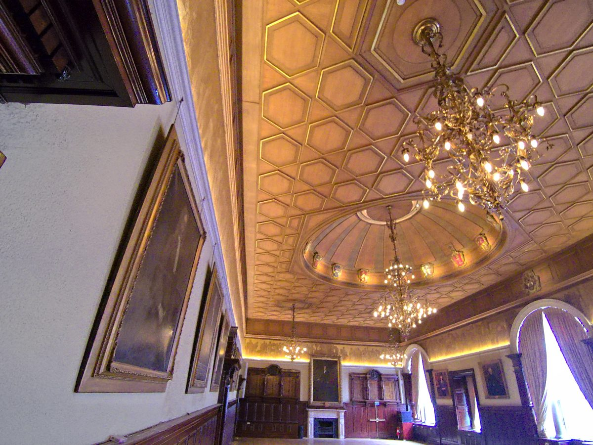
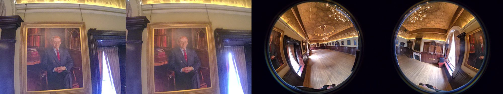
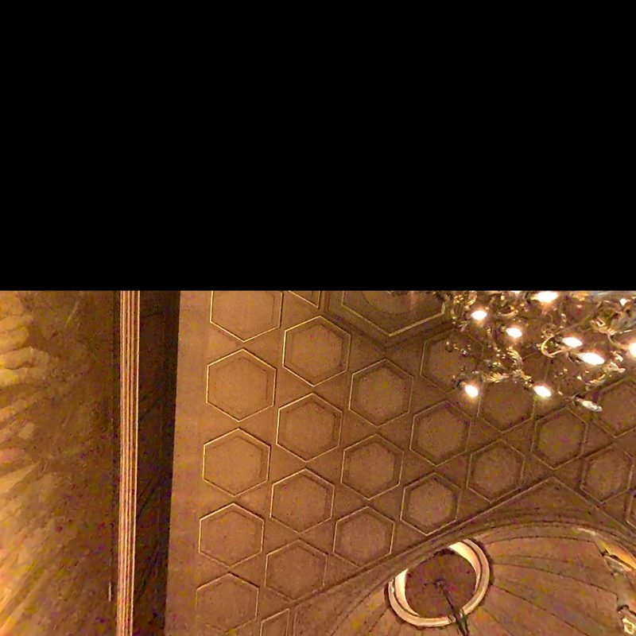
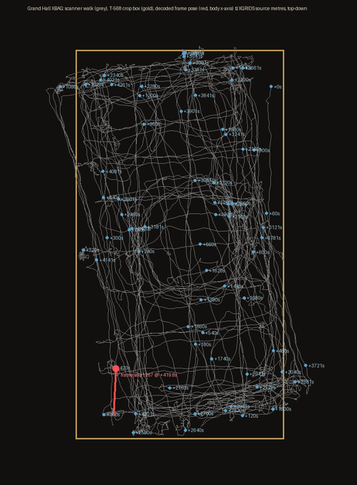
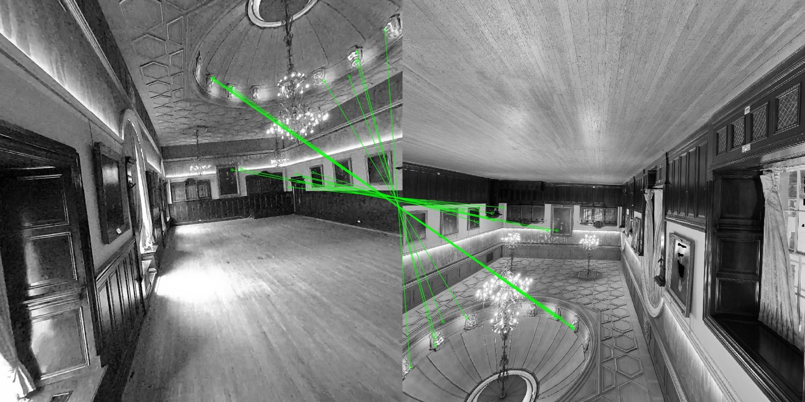

# XBAG frame decode: one synchronised camera frame from the Grand Hall raw capture, proven against a known view

**Date:** 2026-09-02 · **Task:** T-570 · **Status:** delivered; decoder in `tools/xgrids-xbag/` (13 unit tests) · **Source:** `F:\gaussian splat -- xgrids\model\The_Grand_Hall_2026-05-31-101837\2026-05-31-101837.xbin` (41,095,196,672 bytes, sha256 `42aac50b…` per the T-566 receipt), opened read-only throughout

## What the container turned out to be

- Header: `XBAG`, a device-info protobuf (PortalCam `A25AAA663D`, firmware `V3.2.1`, LCC `v2.1.2`), a compressed channel table (only the fragments `/camera_center/h264`, `…left…`, `…jpeg` are readable), then at byte 4,563 the uint32-prefixed block of six calibration records that T-566 parsed.
- Body: a flat run of protobuf messages. Every camera frame is one field-1 message: metadata `{seq, ZigZag microsecond timestamp, 20000}`, codec tag 3, width 4000, height 3000, one **H.264 Annex-B access unit (SPS, PPS, SEI, IDR)**, encoder statistics. There is no JPEG anywhere; every stored frame is an intra keyframe.
- **Four cameras share the stream.** At any instant there are four records with the same `seq` and timestamps within 21 microseconds: two rectilinear pictures (a vertical stereo pair, the calibration's two pinhole cameras, 92 by 76 degrees from their intrinsics) and two 200-degree fisheyes (the two kb4 cameras, black outside the lens circle). Nothing in the record names the camera; identity is the position within the co-timed group plus the optical class. Early in the file the writer emits runs of one camera before the next, so grouping must be by time, not adjacency.
- Rate and count (authoritative, from `xbag_extract.py index` over the whole file): **51,460 frame records = 12,865 instants × 4 cameras**, every instant complete, sequence numbers 0 to 12,864 contiguous, 0.300 s between instants (3.33 Hz per camera) across the 4,285 s walk; 24.21 GB of the 41.10 GB file is video, the rest LiDAR, IMU and other records not parsed here. A quick exploratory indexer had counted 50,944 because it skipped 516 valid records; the repo parser's fixture caught that class of bug.
- Timestamps are microseconds on the same clock as `project_data/poses.csv` (10 Hz: `ts, x, y, z, qx, qy, qz, qw`). The camera started 2.06 s before the first pose.

## The decode

`tools/xgrids-xbag/xbag_extract.py extract <xbin> 4094622858 frame.h264 --png frame.png` yields the fisheye frame at `seq 1267`, `ts 1780219539.649479`; its co-timed siblings sit at 4089789209 and 4092150381 (pinhole) and 4097002002 (the other fisheye). Decoding is PyAV's H.264 software path; 4000 by 3000 in all four cases.





## Using the T-566 calibration

- Pinhole: camera_2's intrinsics `[1928.71, 1931.91, 1941.87, 1727.77]` give 92.1 by 75.7 degrees, consistent with a front 100-degree camera; undistorting with its `[k1 k2 p1 p2]` is a subtle change (the coefficients are small) and is not the proof.
- Fisheye: camera_0's kb4 model `[791.54, 791.39, 2006.66, 1505.62]`, `[0.0832, -0.0016, -0.0162, 0.0039]` re-projects the fisheye frame into 90-degree pinhole views with `cv2.fisheye.initUndistortRectifyMap`; the hexagonal coffers come out as regular hexagons with straight edges, and the region beyond the 200-degree cone is black as it should be.



Unresolved from T-566 and still unresolved here: which fisheye is camera_0 versus camera_1, which pinhole is camera_2 versus camera_3, and the direction of the extrinsic matrices. The optical class is settled; the index mapping needs a stereo or LiDAR test.

## Synchronised

The frame's timestamp falls 3 ms after pose 4,196 and 97 ms before pose 4,197 in `poses.csv`; interpolating gives position (−8.418, −15.279, 0.762) m in XGRIDS source metres, inside the T-568 crop box (`[-10.6,-19.1,-3.2]` to `[0.7,2.0,9.0]`), near the hall's south-west corner. The body x-axis heads −93 degrees, toward the near end wall 3.8 m away; the fourth fisheye at that instant shows the fireplace end close ahead and the third the length of the hall behind, which is the consistent picture (the axis convention is the pose file's, not a proven camera axis). Across the whole capture every keyframe has a pose within 50 ms.



## Proven against a known view

Independent capture: the Matterport E57 cube faces (`F:\E57\cubemaps\scan_NNN_{up,front,back,left,right}.jpg`, 1536 square, 149 sweeps of the whole building). Instrument: SIFT, mutual ratio test (0.75), RANSAC homography (5 px), and two degeneracy guards (inliers must spread over at least 6% of the face's area and the homography's linear part must have condition number below 8). The guards matter: without them a featureless white ceiling on the floor below (sweep 114) "matched" with 178 phantom inliers, which is why the naive first run was discarded.

Result over all 149 sweeps, 5 faces each, against 5 kb4-re-projected views of the fisheye frame:

| sweep | inliers | face | where the sweep is |
|---|---:|---|---|
| 32 | 21 | right | Grand Hall (attested set 0 to 48) |
| 30 | 18 | front | Grand Hall |
| 42 | 18 | right | Grand Hall |
| 33 | 16 | right | Grand Hall |
| every other sweep (145) | 0 | | including all ground-floor sweeps 104 to 144 |

The inliers lie on the dome rim, the chandelier and the frieze above the portrait wall. A Saloon frame decoded from its own container by the same tool (`control-saloon-frame.jpg`) shows a different room. Verdict: the decoded frame is the Grand Hall, and it is the Grand Hall the Matterport scanner saw.



## Reproduce

```powershell
cd tools/xgrids-xbag
python -m unittest discover -s tests -p "test_*.py"
python xbag_extract.py index   "F:\gaussian splat -- xgrids\model\The_Grand_Hall_2026-05-31-101837\2026-05-31-101837.xbin" D:\claude\xbag\keyframes.csv
python xbag_extract.py extract "F:\gaussian splat -- xgrids\model\The_Grand_Hall_2026-05-31-101837\2026-05-31-101837.xbin" 4094622858 D:\claude\xbag\seq1267_fisheye.h264 --png D:\claude\xbag\seq1267_fisheye.png
```

Exploration scripts and full-size evidence (frames, re-projections, ranking CSV, sync figure) are under `D:\claude\xbag\`; the figures above are reduced copies.

## What this unlocks and what it does not

- Unlocked: posed RGB frames at 3.33 Hz per camera with calibration, the gate every fixer, super-resolution and independent-training lane was waiting on (T-500's "frames not extractable" is closed). The COLMAP bridge (T-501) can now be built from `poses.csv`, the T-566 extrinsics and these frames.
- Not done: camera index mapping and extrinsic direction; LiDAR and IMU record decoding (the non-video records are not parsed); the channel table's compression; any registration to the E57 frame (the T-565 lane).
- Boundary note: the July root investigation recorded the payload as a lawful stop; Blake's directive and the 2026-09-02 instruction override that for our own capture, and this decode touched no calibration ZIP.
