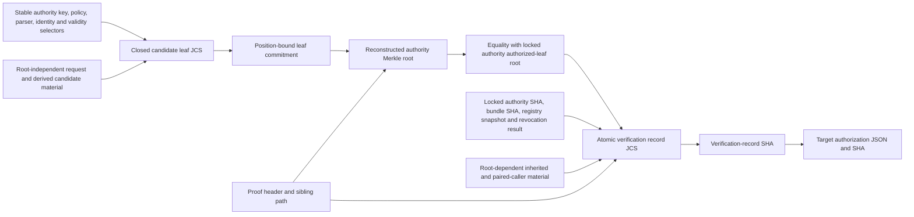

# OmniTwin Foundry activation V1 workload inclusion proof

Status: implementation-blocking normative contract for
`fdv1_api_register_workload(jsonb)`.

The key words **MUST**, **MUST NOT**, **SHOULD**, and **MAY** are normative.
This document defines a SHA-256 Merkle-membership verifier that stock
PostgreSQL can execute with the exact schema-qualified call
`omnitwin_fdv1_ext.digest(bytea, 'sha256')`. It does not
define or invoke a signature verifier. A successful proof means only that the
closed candidate leaf is a member of the authorization set committed by one
exact, separately authenticated, current trust-root row.

The adjacent normative schema is
`omnitwin-foundry-activation-v1-workload-inclusion-proof.schema.json`. Its
top-level union validates candidate leaves. Its `$defs/trustBundleV1`,
`$defs/dbCallerIdentityV1`, `$defs/evidenceSignerIdentityV1`,
`$defs/pairedCallerBindingV1`, `$defs/pairingPolicyV1`,
`$defs/merklePolicyV1`, and `$defs/verificationRecordV1` definitions validate
the other JSON values named below.

## 1. Security boundary and non-claims

The verifier provides all of the following or rejects:

- byte-exact proof parsing with no alternate encodings;
- domain-separated SHA-256 leaf, internal-node, empty-subtree, policy, and
  verification-record hashes;
- exact selection and locking of the request's named authority row;
- equality of the reconstructed root and that row's distinct
  `authorized_leaf_merkle_root_sha256`;
- binding of all root-dependent authority state into an atomic verification
  record; and
- one-use consumption of a candidate leaf/path, except for an exact
  idempotent replay that returns the already committed row.

It does **not** prove that a stored root was honestly created, verify an
Ed25519 signature, or make a public key authoritative by itself. Root
authenticity comes from the frozen bootstrap ceremony or from a prior runtime
trust-root leaf included under an already authenticated parent. Currentness
also requires the pair-exact recursive revocation resolver at database time.

`registry_root_sha256` and `authorized_leaf_merkle_root_sha256` are different
objects. The former is an opaque database-registry snapshot digest. The latter
is the Merkle root defined here. They MUST NOT be compared, substituted, or
stored in one column.

## 2. Dependency graph and fixed-point exclusion

Every input to a Merkle leaf MUST have a derivation graph that cannot reach the
authority root reconstructed from that leaf. This is a hard admission rule,
not documentation advice.



There is no edge from the target authorization SHA, verification-record SHA,
authority authorization SHA, authority bundle SHA, authority registry
snapshot, or authority authorized-leaf root back into the leaf. In particular:

- an authority authorization SHA and authority bundle SHA usually commit that
  authority's own authorized-leaf root, so neither may appear in a leaf under
  that root;
- an inherited parent bundle SHA in a DB-caller or evidence-signer leaf has the
  same forbidden dependency;
- an authority UUID generated when its row is inserted is not known while that
  root's immutable child tree is built, so the request-selected authority pair
  is bound only in the post-path record;
- a paired-caller ID/SHA and pairing-policy digest may not be known while the
  tree is built, so the evidence-signer leaf commits the paired caller's
  root-independent caller-binding SHA instead; and
- the verification record MUST NOT contain the new target authorization ID,
  target authorization SHA, or any post-append registry digest derived from
  that target SHA.

The target authorization JSON MAY and SHOULD contain the verification-record
SHA. This direction is acyclic. A value whose provenance cannot demonstrate
this ordering is rejected before hashing.

## 3. Primitive encodings

The following notation is used:

| Notation | Exact encoding |
| --- | --- |
| `C` | ASCII `OMNITWIN-FDV1-WORKLOAD-MERKLE-V1`, exactly 32 bytes; hex `4f4d4e495457494e2d464456312d574f524b4c4f41442d4d45524b4c452d5631` |
| `H(x)` | raw 32-byte SHA-256 digest of byte string `x` |
| `u8(n)` | one unsigned byte |
| `u32be(n)` | four-byte unsigned big-endian integer |
| `u64be(n)` | eight-byte unsigned big-endian integer |
| `JCS(x)` | RFC 8785 canonical JSON serialized as strict UTF-8 |
| displayed SHA | lower-case `sha256:` followed by 64 hexadecimal digits |

Concatenation is `||`. Tags, versions, algorithm IDs, levels, and depths are
raw bytes, never ASCII digits. PostgreSQL implementations MUST use bytea
concatenation and `digest`; concatenating textual hex is forbidden.

All leaf JSON integers are within the JSON safe-integer range. All schema keys
are ASCII. Every input string MUST be NFC, free of NUL, CR, LF, U+2028, and
U+2029, and must satisfy the adjacent schema. `issuer`, `subject`, and
`audience` additionally have no other C0/DEL controls, no surrounding
whitespace, and at most 240 UTF-8 bytes. The schema's character-count bound is
not a substitute for the UTF-8 byte check.

PostgreSQL `jsonb::text`, `json_build_object(...)::text`, locale collation,
and `localeCompare` are not JCS. The implementation MUST use a frozen,
byte-vector-tested RFC 8785 encoder or an equivalent closed field-by-field
encoder. It MUST reject duplicate object members before conversion to
`jsonb`.

## 4. Frozen Merkle policy

The policy is a closed `$defs/merklePolicyV1` object. Its
`leafSchemaArtifactSha256` is the raw-byte SHA-256 of the adjacent schema file.
The policy digest is:

```text
H_policy = H(C || 0x04 || 0x01 || 0x01 ||
             u32be(length(JCS(policy))) || JCS(policy))
```

The first `0x01` is proof version 1; the second is SHA-256 algorithm ID 1.
The exact policy JCS and digest for this artifact appear in section 13. An
authority row and its bundle MUST store that exact digest. A caller cannot
select a policy.

## 5. Trust-bundle byte contract

`trustBundleBase64url` is not self-describing merely because its digest is in a
Merkle leaf. Its decoded bytes have this separate, mandatory parser contract.

1. The request string is canonical unpadded RFC 4648 base64url. Decoding and
   re-encoding MUST reproduce the input byte for byte. `=`, whitespace, CR,
   LF, U+2028, U+2029, and non-alphabet characters are rejected.
2. Decoded length is 1 through 16,384 bytes inclusive.
3. Bytes are strict UTF-8 with no BOM, invalid sequence, NUL, or trailing byte.
4. The JSON parser detects and rejects duplicate members. The top-level value
   is an object and validates against `$defs/trustBundleV1` with no unknown or
   null property.
5. Re-encoding the parsed value with RFC 8785 MUST equal the decoded bytes.
   Thus leading/trailing whitespace, alternate escapes, noncanonical numbers,
   and a trailing line terminator are rejected.
6. `validFrom` and `expiresAt` are real UTC calendar instants, round-trip
   exactly through `timestamptz(3)`, and satisfy `validFrom < expiresAt`.
7. `rootSignerPublicKeyDerBase64url` is canonical unpadded base64url decoding
   to exactly 44 bytes:
   `302a300506032b6570032100 || 32-byte Ed25519 public key`. Algorithm
   parameters, a non-RFC-8410 OID, a short/long key, and trailing DER are
   rejected. Its raw-byte SHA-256 MUST equal both
   `rootSignerPublicKeySha256` and the digest suffix of `rootSignerKeyId`.
8. `authorizedLeafMerklePolicySha256` equals the frozen policy digest;
   `authorizedLeafMerkleRootSha256` is a distinct 32-byte SHA value; and
   `identityPolicySha256` identifies a pinned closed identity-policy artifact,
   not caller-authored JSON.

Despite its schema name, `trustBundleV1` is a V1 workload-trust descriptor,
not a standard SPIFFE bundle, CA-certificate set, or JWKS document. For the
closed `spiffe_x509_svid` credential kind, the exact Ed25519 SPKI in
`rootSignerPublicKeyDerBase64url` is intentionally also the sole raw-public-key
X.509 trust anchor for `trustDomain`. The content-addressed identity-policy
artifact named by `identityPolicySha256` supplies the remaining frozen X.509
and SPIFFE validation profile. A consumer MUST resolve that exact artifact
from the pinned catalog, hash its bytes for equality, and use the reviewed
transport-verifier artifact/configuration; the 12-field JSON object by itself
is not a usable certificate-validation policy.

The separate transport verifier accepts no ambient operating-system CA,
environment trust store, fetched bundle, alternate key, or caller-supplied
policy. It validates the presented chain and names under the pinned profile and
requires the terminal certificate signature to verify directly under the raw
SPKI (a self-signed root certificate need not be present). The profile MUST
freeze certificate/signature algorithms, path and time rules, key usage/EKU,
SPIFFE URI/trust-domain extraction, and revocation/currentness inputs. This
Merkle proof path still verifies no certificate or other signature: it only
binds the exact anchor/policy selectors already authenticated by the separate
authority and transport boundaries.

The frozen parser configuration is the following JCS object:

```json
{"allowBom":false,"allowDuplicateKeys":false,"allowTrailingBytes":false,"canonicalization":"RFC8785","maximumDecodedBytes":16384,"requireCanonicalBase64url":true,"requireCanonicalJcsBytes":true,"schemaId":"https://schemas.omnitwin.invalid/foundry/activation-v1-workload-inclusion-proof.schema.json#/$defs/trustBundleV1","utf8":"strict"}
```

Its raw-byte digest, the schema artifact digest, and the reviewed parser
artifact digest are separately stored and leaf-bound. The parser artifact SHA
is deployment/catalog material; it is never supplied by the API caller.

For a runtime `trust_root`, the parsed bundle MUST match the request's trust
domain, public key, validity interval, explicit
`authorizedLeafMerkleRootSha256`, and the pinned policy. The bundle's registry
generation/root is a previously frozen snapshot; its dependency graph MUST
not reach the parent proof root. For a `db_caller` or `evidence_signer`, no
bundle bytes are caller supplied: SQL copies the locked parent bundle only
after proof verification and records that inherited bundle in the verification
record. Its bundle SHA is deliberately absent from those leaves.

Parsing and matching the public key does not verify any signature in this
protocol.

## 6. Candidate authorization leaf

The caller never supplies leaf JSON. SQL constructs it from the already
closed request, locked catalog/authority values, and deterministic derivations;
validates exactly one top-level schema arm; serializes it with JCS; and rejects
more than 16,384 bytes.

The three arms contain exactly 26, 33, and 35 properties respectively. Every
property is required. Unknown and null properties are forbidden.

### 6.1 Root-independent common selectors

Every arm contains:

- the schema, binding, authority-relation, and runtime-origin literals;
- the authority's frozen Merkle-policy SHA, signer key ID/SHA, bundle-schema
  SHA, bundle-parser artifact/configuration SHAs, root-independent identity-
  policy SHA, trust domain, and validity bounds;
- the target bundle-schema and parser artifact/configuration SHAs;
- the target root-independent identity-policy SHA; and
- the requested validity bounds.

These values are compared to the locked row/catalog, not trusted because they
appear in a constructed object. Authority authorization UUID/SHA, authority bundle
SHA, authority registry generation/snapshot root, and authority Merkle root
are intentionally absent.

### 6.2 `trust_root`

SQL selects the authority by request field
`inclusionAuthorityRootAuthorizationId`, but binds that generated row ID only
in the verification record; leaf `authorityRelation` is
`inclusion_authority`. The arm additionally binds:

- SHA-256 of the exact candidate trust-bundle bytes;
- target trust domain;
- target root signer key ID and DER-byte SHA;
- target `authorizedLeafMerkleRootSha256`; and
- target `authorizedLeafMerklePolicySha256`.

The target root is the new root's own future child-authorization set. It is
safe in a leaf under a different, previously existing parent root. It MUST
equal both the explicit request property and parsed bundle property.

### 6.3 `db_caller`

SQL selects the authority by `parentRootAuthorizationId`, but binds that
generated row ID only in the verification record; leaf `authorityRelation` is
`parent_root`. The arm additionally binds every request identity/scope field,
the catalog-derived `dbRoleOid`, SPIFFE-derived trust domain, and the closed
workload-identity digest.

The workload identity preimage is the following exact
`$defs/dbCallerIdentityV1` object:

```text
schemaVersion = omnitwin.foundry.fdv1.db-caller-identity.v1
plane, dbRoleOid, dbSessionRole, dbSystemUserSha256,
spiffeId, trustDomain, issuer, subject, audience, credentialKind,
serviceArtifactSha256, serviceConfigurationSha256
```

Its digest is:

```text
H("OMNITWIN-FDV1-WORKLOAD-IDENTITY-V1" || 0x00 ||
  u32be(length(JCS(identity))) || JCS(identity))
```

`dbRoleOid` and `dbSessionRole` are obtained in the same transaction from one
exact catalog login and are checked again before insert. The normalized trust
domain is the SPIFFE authority and must equal the parent bundle domain.

### 6.4 `evidence_signer`

SQL selects the authority by `parentRootAuthorizationId`, but binds that
generated row ID only in the verification record; leaf `authorityRelation` is
`parent_root`. The arm additionally binds the evidence kind, derived semantic
plane, paired-caller binding SHA, all transport identity fields,
signer key ID/SHA, receipt-lag bound, service artifact/configuration, and the
signer's closed workload-identity digest.

The signer identity preimage validates against
`$defs/evidenceSignerIdentityV1`, uses schema literal
`omnitwin.foundry.fdv1.evidence-signer-identity.v1` and exactly these remaining
keys:

```text
evidenceKind, semanticPlane, spiffeId, trustDomain, issuer, subject,
audience, credentialKind, signerKeyId, signerPublicKeySha256,
serviceArtifactSha256, serviceConfigurationSha256
```

It uses the same workload-identity hash construction as section 6.3.

The semantic mapping is exact:

| Evidence kind | Semantic plane |
| --- | --- |
| `admin_action`, `predecessor_source` | `activation` |
| `gateway_token_commitment` | the paired caller's exact `submit_gateway` or `recovery_gateway` plane |
| `runner_terminal` | `submit_gateway` |
| `provider_result` | `recovery_gateway` |
| `storage_create` | `output_broker` |
| `storage_read`, `glb_verifier` | `output_custodian` |

For every row, not only `gateway_token_commitment`, the resolved
`pairedCallerPlane` MUST equal the signer's derived `semanticPlane` exactly.

The paired DB caller's `workloadIdentitySha256` is the section-6.3 digest over
its closed caller-identity fields. The narrower cross-root selector validates
against `$defs/pairedCallerBindingV1` and is a closed JCS object with exactly
these fields:

```text
schemaVersion = omnitwin.foundry.fdv1.paired-caller-binding.v1
workloadIdentitySha256, plane, validFrom, expiresAt, originKind,
parentTrustDomain, parentValidFrom, parentExpiresAt,
parentSignerKeyId, parentSignerPublicKeySha256,
parentIdentityPolicySha256, parentAuthorizedLeafMerklePolicySha256,
parentTrustBundleSchemaSha256, parentTrustBundleParserArtifactSha256,
parentTrustBundleParserConfigurationSha256
```

`originKind` is exactly the persisted row value `bootstrap_ceremony` or
`admin_action`; runtime leaf `registrationOrigin = runtime_admin_action` maps
to persisted `origin_kind = admin_action` before this object is constructed.
Its digest is:

```text
H(ASCII "OMNITWIN-FDV1-PAIRED-CALLER-BINDING-V1" || 0x00 ||
  u32be(length(JCS(binding))) || JCS(binding))
```

This digest excludes the caller and parent authorization IDs/SHAs, parent
bundle SHA, registry generation/root, authorized-leaf root, proofs, and
transcripts. It is therefore root-independent and has no dependency path back
to the Merkle root being built. Bootstrap and runtime caller insertion both
freshly compute and store it as `caller_binding_sha256`; a signer leaf commits
it as the single selector `pairedCallerBindingSha256`. The contained
`workloadIdentitySha256` is recomputed and transcript-bound, but is not a
second leaf selector.

At signer registration, the request's `pairedCallerAuthorizationId` selects
and locks one exact existing DB-caller row; there is no digest-only lookup or
fallback. SQL freshly recomputes that row's workload-identity and caller-
binding digests from its immutable fields, requires each to equal its
corresponding stored digest, and requires the recomputed caller-binding digest
to equal the signer leaf's `pairedCallerBindingSha256`. SQL then verifies the
caller's exact authorization SHA, required plane, catalog OID/name/session
binding, validity, and pair-exact current lineage. The binding digest need not
be globally unique:
caller rotation is disambiguated by the request-selected authorization ID,
while an identical preauthorized caller profile permits independent signer
rotation. The resolved caller ID/SHA, exact plane, currentness/lineage
verdicts, workload-identity/binding selectors, and pairing-policy SHA are
root-dependent and therefore appear in the post-path verification record.

The signer's proof authority and the paired caller's parent root may be the
same exact authorization pair or two distinct pairs. In particular, a runtime
signer may intentionally pair with a still-current bootstrap caller. Cross-root
pairing is allowed only because the transcript and pairing policy bind the
paired caller's exact parent-root pair and registry snapshot and the lock/
resolver covers both lineages root-first. The signer's requested validity
interval MUST also be contained by the paired caller's interval. Registration
freezes the exact selected caller authorization pair; the stable identity
selector permits independent signer rotation but does not make an existing
signer authorization automatically follow a later caller rotation.

The pairing-policy preimage validates against `$defs/pairingPolicyV1` and is a
closed JCS object with schema literal
`omnitwin.foundry.fdv1.pairing-policy.v1` and exactly:

```text
authorityRootAuthorizationId, authorityRootAuthorizationSha256,
authorityRegistryGeneration, authorityRegistryRootSha256,
pairedCallerParentRootAuthorizationId,
pairedCallerParentRootAuthorizationSha256,
pairedCallerRegistryGeneration, pairedCallerRegistryRootSha256,
pairedCallerAuthorizationId, pairedCallerAuthorizationSha256,
pairedCallerBindingSha256, pairedCallerWorkloadIdentitySha256,
pairedCallerPlane, pairedCallerDbRoleOid,
evidenceKind, semanticPlane,
deliveryChannel = authenticated_evidence_ledger,
crossRootRule = explicit-authority-and-caller-parent-pairs
```

Its digest is SHA-256 over ASCII
`OMNITWIN-FDV1-WORKLOAD-PAIRING-V1`, byte `0x00`, the four-byte JCS length, and
the JCS bytes, in that order.

### 6.5 Explicit exclusions

No leaf contains:

- proof bytes, proof SHA, depth, index, count, or sibling hashes;
- `adminEvidenceId`, `idempotencyKey`, API-request SHA, origin evidence or
  admission digests;
- generated target row ID, action sequence, database time, recorded time,
  target authorization JSON/SHA, or post-append registry root;
- authority authorization SHA, authority bundle SHA, authority registry
  generation/root, authority authorized-leaf root, or authority authorization
  UUID;
- inherited parent bundle SHA for a caller/signer; or
- paired-caller authorization ID/SHA or pairing-policy SHA. The paired
  caller's root-independent binding SHA is included instead.

Those exclusions prevent both circular hashes and a proof from authorizing
mutable operational evidence. The exact admin/idempotency request remains
bound by the API-request digest and replay rules in section 11.

## 7. Binary proof format

The request's canonical unpadded base64url decodes to exactly
`28 + 32 * depth` bytes: 28 through 1,052 bytes. The encoded string is 38
through 1,403 characters and is re-encoded for equality before parsing.

| Offset | Size | Field | Rule |
| ---: | ---: | --- | --- |
| 0 | 8 | magic | ASCII `OTFDMP01`, hex `4f5446444d503031` |
| 8 | 1 | version | `0x01` |
| 9 | 1 | hash algorithm | `0x01` for SHA-256 |
| 10 | 1 | depth | unsigned 0 through 32 |
| 11 | 1 | reserved | exactly `0x00` |
| 12 | 8 | leaf index | `u64be(index)` |
| 20 | 8 | leaf count | `u64be(count)` |
| 28 | `32 * depth` | siblings | raw 32-byte digests, bottom-up |

`1 <= count <= 2^depth`, `0 <= index < count`, and depth is minimal:
`depth = 0` exactly when `count = 1`; otherwise
`2^(depth-1) < count <= 2^depth`. Consequently count is at most `2^32` and
index at most `2^32 - 1`, despite their future-proof u64 encoding. No byte may
precede or follow the specified structure.

Sibling `s_i` is the height-`i` sibling subtree for the path step from leaves
toward the root. Bit `i` of `index`, least-significant bit first, gives the
direction: zero means current hash is left and sibling is right; one means
sibling is left and current hash is right.

## 8. Tree and hash construction

For leaf object `x` at depth `d`, index `j`, count `n`:

```text
L(x,d,j,n) = H(C || 0x00 || 0x01 || 0x01 || u8(d) ||
               u64be(j) || u64be(n) ||
               u32be(length(JCS(x))) || JCS(x))
```

For left/right child hashes at path level `i`, where level zero combines
leaves:

```text
N(i,left,right) = H(C || 0x01 || 0x01 || 0x01 ||
                    u8(i) || left || right)
```

The tree is left-complete in the range `[0,n)` and has capacity `2^d`. A
wholly empty subtree of height `h` starting at aligned index `start` has the
direct commitment:

```text
E(h,start,d,n) = H(C || 0x02 || 0x01 || 0x01 ||
                   u8(d) || u8(h) || u64be(start) || u64be(n))
```

This direct empty-subtree commitment is intentional; it permits O(depth)
verification and is not recursively expanded into billions of empty leaves.
The canonical builder is:

```text
Build(start, h):
  if start >= n: return E(h,start,d,n)
  if h == 0:     return L(leaf[start],d,start,n)
  return N(h-1,
           Build(start,             h-1),
           Build(start + 2^(h-1),   h-1))

root = Build(0,d)
```

For proof step `i`, sibling start is
`(((index >> i) xor 1) << i)`. If that start is at least `count`, the supplied
sibling MUST equal `E(i,start,depth,count)`. This rejects alternate padding.
If the sibling range is partially occupied, its digest is supplied by the
canonical builder and cannot be reconstructed from this one proof.

The verifier starts with `current = L(...)` and for each `i = 0..depth-1`
computes `N(i,current,s_i)` when index bit `i` is zero, otherwise
`N(i,s_i,current)`. The final raw bytes MUST equal the locked authority row's
decoded `authorized_leaf_merkle_root_sha256`. Text comparison alone is not
sufficient; both stored strings are first checked for canonical lower-case
form and decoded to 32 bytes.

### 8.1 Immutable-set liveness boundary

Each `authorizedLeafMerkleRootSha256` commits one immutable, finite, exact
leaf set with its fixed count and positions. This V1 API can consume only a
leaf already committed to that set; it cannot append a leaf, change a count,
replace a sibling, or treat registry authority as permission to admit a novel
workload or root.

Rotation or addition is possible at runtime only through an already committed
`trust_root` successor leaf. That leaf fixes the successor root's signer,
policy, validity, bundle, and its own immutable child-authorization Merkle
root before the successor is registered. Later caller/signer registrations
must in turn be leaves already present under that child root. If the active
lineage has no such precommitted successor path covering the desired workload,
V1 is intentionally unable to create one. Recovery requires a separately
reviewed, frozen bootstrap or migration contract and evidence; it is never a
fallback arm of `fdv1_api_register_workload`.

This closed-set limitation is intentional. The protocol is not a dynamic
registry-authority or key-holder-can-add-members design.

## 9. Exact authority selection and locking

At one database instant `T = clock_timestamp()` rounded and round-tripped as
`timestamptz(3)`, SQL selects:

| Candidate arm | Authority request field | Required authority relation |
| --- | --- | --- |
| runtime `trust_root` | `inclusionAuthorityRootAuthorizationId` | a strictly earlier `trust_root` via the inclusion-authority edge |
| `db_caller` | `parentRootAuthorizationId` | exact direct parent `trust_root` |
| `evidence_signer` | `parentRootAuthorizationId` | exact direct parent `trust_root` |

There is no latest, ambient, same-domain, same-key, or digest-only fallback.
The function derives the authority SHA from the selected row; the request does
not supply it.

Registration and revocation MUST use the same transaction-scoped lock protocol
for every involved authority lineage, then lock the union of trust-root rows
root-first, breaking ties across independent lineages by increasing immutable
action sequence. The authority row and every inclusion-authority ancestor are
checked with the shared pair-exact recursive resolver. The seed is included.
At `T` no member may be expired, directly revoked, descendant-affected by an
ancestor revocation, or compromise-effective. The requested interval must be
strictly nonempty and contained by the authority interval.

The authority row, parsed bundle, and catalog MUST agree on UUID/SHA, signer
key, policy, trust domain, identity policy, bundle/schema/parser digests,
registry generation/snapshot root, authorized-leaf root, and validity. The
authority bundle's authorized root is compared to the row before proof
comparison. A mismatch is corruption and aborts the transaction.

For an evidence signer, SQL also locks the exact request-selected paired-caller
UUID, freshly recomputes its workload-identity SHA and caller-binding SHA, and
requires the stored `caller_binding_sha256`, recomputed caller-binding SHA, and
signer leaf's `pairedCallerBindingSha256` to be exactly equal. The separately
recomputed workload-identity SHA is retained for the verification transcript,
not used as a leaf lookup key. SQL derives the caller's immutable authorization
SHA; verifies the required plane, current catalog OID/name/session binding,
validity containment, and current root lineage; and constructs the pairing
policy only after Merkle-root equality. The caller's exact parent-root pair and
registry snapshot are captured before transcript construction. Root-first
ordering covers both lineages; a lock-order inversion is forbidden.

## 10. Atomic verification record

After and only after every predicate above and root equality succeeds, SQL
constructs the appropriate closed `$defs/verificationRecordV1` arm. Its common
fields bind:

- the exact request-selected authority UUID/SHA, registry generation/snapshot root,
  authorized-leaf root/policy, signer key, bundle/schema/parser digests,
  identity policy, validity, database time, and recursive currentness result;
- the derived target bundle copy or candidate bundle, registry snapshot,
  identity policy, trust domain, validity, and parser material;
- leaf-schema artifact SHA, depth/index/count, leaf JCS SHA, position-bound
  leaf commitment;
- exact proof bytes as canonical base64url, proof SHA, reconstructed root, and
  equality verdict; and
- arm-specific derived target-root/key values, DB role OID, or the paired-
  caller authorization and parent-root pairs, registry snapshot, workload-
  identity selector, exact plane and DB-role OID, validity bounds, catalog/
  currentness/lineage/containment verdicts, and pairing policy.

For `trust_root`, `derivedTarget*` bundle fields come from the parsed candidate
bundle. For caller/signer arms they come from the exact locked parent bundle
that will be copied into the row. `derivedTargetRegistry*` is that already
frozen bundle snapshot, never the new post-append registry state.

The booleans `authorityCurrentAtDatabaseTime`,
`authorityLineageUnrevokedAtDatabaseTime`, and
`targetValidityWindowContained` are SQL-produced constants. The signer arm's
`pairedCallerCurrentAtDatabaseTime`,
`pairedCallerLineageUnrevokedAtDatabaseTime`,
`pairedCallerCatalogBindingCurrentAtDatabaseTime`, and
`targetValidityWindowContainedByPairedCaller` are also SQL-produced constants.
Together with `rootComparison = "equal"` and `verdict = "included"`, they are
reachable only after the corresponding checks and are never inputs.

The verification-record digest is:

```text
H_verification = H(C || 0x03 || 0x01 || 0x01 ||
                   u32be(length(JCS(record))) || JCS(record))
```

The record contains neither the target authorization ID/SHA nor a digest
derived from them. The subsequently built target authorization JSON MUST bind
`H_verification`, the leaf JCS SHA, and proof SHA; its SHA is computed last.

## 11. Transaction, persistence, and one-use semantics

The security-definer function executes the following in one transaction and
fails closed:

1. Strictly validate the closed API request and canonical base64url sizes.
2. Choose the exact authority and any exact request-selected paired caller;
   lock both lineages in the globally deterministic root-first order specified
   by section 9.
3. Strictly parse and cross-check authority and, for a new root, candidate
   trust bundles with the pinned parser/schema/configuration.
4. For an evidence signer, resolve the already locked paired caller, freshly
   recompute and compare its workload-identity and caller-binding digests, and
   verify both lineages, catalog bindings, plane, and validity containment.
   Retain the root-independent caller binding; do not yet construct the
   root-dependent pairing policy.
5. Derive all candidate fields, construct the closed leaf, validate it, encode
   JCS, and compute its plain SHA and position-bound commitment.
6. Parse the binary proof, enforce canonical tree/padding rules, reconstruct
   the root with `omnitwin_fdv1_ext.digest(bytea,text)` using the literal
   algorithm `sha256`, and compare raw root bytes.
7. After root equality, derive the root-dependent pairing policy for an
   evidence signer.
8. Construct, validate, JCS-encode, and hash the verification record.
9. Construct the target authorization JSON including the verification-record
   SHA; compute the target authorization SHA; insert all immutable columns.
10. Commit the leaf/proof/verification record and authorization row atomically.

The runtime row MUST persist exact candidate-leaf UTF-8 bytes, parsed leaf
JSON, plain leaf JCS SHA, position-bound commitment, proof bytes/SHA,
depth/index/count, verification-record JSON/JCS bytes/SHA, and the authority
pair. Persisting only a boolean or only a proof SHA is forbidden.
Every DB-caller row also persists its freshly computed
`caller_binding_sha256`; every evidence-signer row persists the equal
`paired_caller_binding_sha256`. These selectors are immutable authorization
material, not proof-consumption markers.

Every runtime candidate leaf is one-use. The relation has a non-null unique
constraint on the plain candidate-leaf JCS SHA and a second unique constraint
on `(proof_authority_id, proof_authority_sha256,
proof_authority_merkle_root_sha256, leaf_index)`. The global leaf-SHA
constraint conservatively prevents the same candidate from being instantiated
twice even if two authority rows share all root-independent selectors; the
verification record separately binds the exact request-selected authority pair.

Replay behavior is exact:

- the same authenticated activation caller, idempotency key, and byte-identical
  API request digest returns the original authorization ID/SHA and
  `newly_committed = false`;
- reuse of an idempotency key with any changed request is rejected;
- reuse of a consumed leaf or path with a different idempotency key,
  `adminEvidenceId`, proof encoding, or API request is rejected, not redirected
  to a new authorization; and
- no valid path can create a second authorization ID, even if all substantive
  candidate fields are otherwise identical.

An integrity/uniqueness failure is never retried as a fresh insert. Any failed
validation creates no authorization, proof-consumption marker, or capability.

## 12. Bootstrap special case

The separately frozen, one-time bootstrap ceremony does not call the runtime
Merkle verifier. It may create only the closed authorization set enumerated
byte-for-byte by the canonical installation manifest carried identically in
both bootstrap envelopes: every bootstrap trust-root authorization, exactly
one activation `db_caller`, exactly one evidence-admitter `db_caller`, and each
required administrator/source `evidence_signer` binding. Before insertion, SQL
deterministically constructs every authorization JSON/SHA and requires
one-to-one equality with that manifest enumeration: no omitted, additional,
duplicate, reordered, or implicitly synthesized authorization is permitted.

Every row in that enumerated set is directly envelope-bound. It has
`origin_kind = bootstrap_ceremony` and the exact same
`origin_evidence_id`/`origin_payload_raw_sha256` pair for the sole immutable
bootstrap evidence row. Each bootstrap trust-root row has no parent or
inclusion authority; each bootstrap caller or signer retains the normal
parent-root, paired-caller, and pairing-policy relational bindings that the
manifest names. The deferred evidence back-edge may bind the already-computed
authorization SHAs, but cannot expand the manifest set.

For **every** bootstrap-created authorization row, not only a trust-root row,
all candidate-leaf, proof-authority/path/proof, and verification-record columns
are null. Every bootstrap DB caller nevertheless stores its freshly computed
section-6.3 `workload_identity_sha256` and
`caller_binding_sha256`; every bootstrap evidence signer stores the matching
non-null `paired_caller_binding_sha256`. These selector columns are not part of
the null proof tuple. The manifest and authorization JSON also bind the
signer's exact paired-caller ID/SHA and pairing-policy SHA. A bootstrap trust
root still stores its distinct child authorized-leaf root/policy and exact
bundle/schema/parser material established by the envelopes. All other columns
required by the selected trust-root, caller, or signer arm remain non-null.

Every `runtime_admin_action` arm requires a non-null proof and verification
record. A runtime request cannot select bootstrap origin, omit a proof, or use
the bootstrap-only SQL entry point. Conversely, supplying a proof to the
bootstrap ceremony is rejected. This document makes no signature-verification
claim about the separate bootstrap envelopes.

## 13. Exact positive vectors

Every JSON value in this section is one physical UTF-8 line. The newline used
by Markdown after a code block is not part of the bytes. All integers are JSON
integers, not strings.

### 13.1 Shared constants

| Item | Value |
| --- | --- |
| Adjacent schema raw-byte SHA | `sha256:56900412b6041222aea82619c522ed26a87588331a22b141a8e6b9b9f39086e0` |
| Parser-configuration JCS SHA | `sha256:1785788bc407b43c2be58cb31f2d5ec6dfc79f538f43c54bf7eac5ef5b820227` |
| Vector parser-artifact SHA | `sha256:2261d8d2d672c39a069543a3743dc5065995ce94034b24abb23d372a5a7961c4` |
| Merkle-policy SHA | `sha256:c5283152e972604dc20fe0038ace024e197c4467ac8a0f3a11fa46d98c6b6c4c` |
| Request-selected authority UUID (verification record only) | `11111111-1111-4111-8111-111111111111` |
| Authority registry generation/root | `7` / `sha256:1010101010101010101010101010101010101010101010101010101010101010` |
| Authority trust domain/window | `authority.example` / `2026-01-01T00:00:00.000Z` through `2030-01-01T00:00:00.000Z` |
| Authority RFC-8410 SPKI | `MCowBQYDK2VwAyEAAAECAwQFBgcICQoLDA0ODxAREhMUFRYXGBkaGxwdHh8` |
| Authority key ID | `ed25519-sha256:9408457aefd071cec127c1f98539930861ad1ba94c940db975c972c09fc68b68` |
| Authority key SHA | `sha256:9408457aefd071cec127c1f98539930861ad1ba94c940db975c972c09fc68b68` |
| Authority identity-policy SHA | `sha256:f49c4522d6fae70c26072708387506f5dd44d25016b23050b33a5226ee7ac525` |
| Child RFC-8410 SPKI | `MCowBQYDK2VwAyEAICEiIyQlJicoKSorLC0uLzAxMjM0NTY3ODk6Ozw9Pj8` |
| Evidence-signer RFC-8410 SPKI | `MCowBQYDK2VwAyEAQEFCQ0RFRkdISUpLTE1OT1BRUlNUVVZXWFlaW1xdXl8` |

The vector parser-artifact SHA is `SHA-256(ASCII
"omnitwin-fdv1-trust-bundle-parser-artifact-v1")`; production must substitute
the catalog-pinned reviewed artifact digest while preserving the parser
configuration.

Every digest that this section claims to calculate has its complete preimage
in these artifacts: the adjacent raw schema file, an exact one-line JCS block,
an exact proof byte string, or the explicit domain-separated construction
above. Hash-shaped registry roots, authorized child roots, identity-policy
selectors, and service artifact/configuration selectors inside those
preimages are fixed opaque vector inputs; this section makes no claim to
derive them. The vectors deliberately do not publish exact authority-bundle,
authority-authorization, pairing-policy, verification-record, or target-
authorization SHAs because they do not enumerate all runtime IDs and
authorization preimages needed to reproduce those downstream values. Their
closed schemas and construction order remain normative; an implementation
MUST generate separate complete byte vectors for them before enablement.

Exact policy JCS:

```json
{"emptyHashTag":2,"hashAlgorithm":"sha256","hashAlgorithmId":1,"hashContext":"OMNITWIN-FDV1-WORKLOAD-MERKLE-V1","leafHashTag":0,"leafSchemaArtifactSha256":"sha256:56900412b6041222aea82619c522ed26a87588331a22b141a8e6b9b9f39086e0","leafSchemaId":"https://schemas.omnitwin.invalid/foundry/activation-v1-workload-inclusion-proof.schema.json","maxDepth":32,"maxLeafJcsBytes":16384,"maxProofBytes":1052,"maxTrustBundleBytes":16384,"nodeHashTag":1,"policyHashTag":4,"proofEncoding":"otfdmp01-big-endian-lsb-index-v1","proofMagic":"OTFDMP01","proofVersion":1,"schemaVersion":"omnitwin.foundry.fdv1.workload-merkle-policy.v1","treeShape":"left-complete-indexed-empty-v1","verificationHashTag":3}
```

The candidate root's exact trust-bundle JCS is:

```json
{"authorizedLeafMerklePolicySha256":"sha256:c5283152e972604dc20fe0038ace024e197c4467ac8a0f3a11fa46d98c6b6c4c","authorizedLeafMerkleRootSha256":"sha256:cccccccccccccccccccccccccccccccccccccccccccccccccccccccccccccccc","expiresAt":"2028-01-01T00:00:00.000Z","identityPolicySha256":"sha256:aab44cbd1831b204d8d3db8222cbaba0d300fa494291f354bb8b9de669b03501","registryGeneration":8,"registryRootSha256":"sha256:2020202020202020202020202020202020202020202020202020202020202020","rootSignerKeyId":"ed25519-sha256:417e5d372f6f9878e01d729c499b2d01bed38aa39a55437039364116de0a77cb","rootSignerPublicKeyDerBase64url":"MCowBQYDK2VwAyEAICEiIyQlJicoKSorLC0uLzAxMjM0NTY3ODk6Ozw9Pj8","rootSignerPublicKeySha256":"sha256:417e5d372f6f9878e01d729c499b2d01bed38aa39a55437039364116de0a77cb","schemaVersion":"omnitwin.foundry.fdv1.workload-trust-bundle.v1","trustDomain":"child.example","validFrom":"2027-01-01T00:00:00.000Z"}
```

Its byte SHA is
`sha256:46737a38aeb72f93d0745c65a081507215cb2240522d1cd88df49705977351a3`.

### 13.2 Vector A — runtime trust root, depth zero

Exact leaf JCS, 2,168 bytes:

```json
{"authorityAuthorizedLeafMerklePolicySha256":"sha256:c5283152e972604dc20fe0038ace024e197c4467ac8a0f3a11fa46d98c6b6c4c","authorityExpiresAt":"2030-01-01T00:00:00.000Z","authorityIdentityPolicySha256":"sha256:f49c4522d6fae70c26072708387506f5dd44d25016b23050b33a5226ee7ac525","authorityRelation":"inclusion_authority","authoritySignerKeyId":"ed25519-sha256:9408457aefd071cec127c1f98539930861ad1ba94c940db975c972c09fc68b68","authoritySignerPublicKeySha256":"sha256:9408457aefd071cec127c1f98539930861ad1ba94c940db975c972c09fc68b68","authorityTrustBundleParserArtifactSha256":"sha256:2261d8d2d672c39a069543a3743dc5065995ce94034b24abb23d372a5a7961c4","authorityTrustBundleParserConfigurationSha256":"sha256:1785788bc407b43c2be58cb31f2d5ec6dfc79f538f43c54bf7eac5ef5b820227","authorityTrustBundleSchemaSha256":"sha256:56900412b6041222aea82619c522ed26a87588331a22b141a8e6b9b9f39086e0","authorityTrustDomain":"authority.example","authorityValidFrom":"2026-01-01T00:00:00.000Z","authorizedLeafMerklePolicySha256":"sha256:c5283152e972604dc20fe0038ace024e197c4467ac8a0f3a11fa46d98c6b6c4c","authorizedLeafMerkleRootSha256":"sha256:cccccccccccccccccccccccccccccccccccccccccccccccccccccccccccccccc","bindingKind":"trust_root","expiresAt":"2028-01-01T00:00:00.000Z","registrationOrigin":"runtime_admin_action","schemaVersion":"omnitwin.foundry.fdv1.workload-authorization-leaf.v1","signerKeyId":"ed25519-sha256:417e5d372f6f9878e01d729c499b2d01bed38aa39a55437039364116de0a77cb","signerPublicKeySha256":"sha256:417e5d372f6f9878e01d729c499b2d01bed38aa39a55437039364116de0a77cb","targetIdentityPolicySha256":"sha256:aab44cbd1831b204d8d3db8222cbaba0d300fa494291f354bb8b9de669b03501","targetTrustBundleParserArtifactSha256":"sha256:2261d8d2d672c39a069543a3743dc5065995ce94034b24abb23d372a5a7961c4","targetTrustBundleParserConfigurationSha256":"sha256:1785788bc407b43c2be58cb31f2d5ec6dfc79f538f43c54bf7eac5ef5b820227","targetTrustBundleSchemaSha256":"sha256:56900412b6041222aea82619c522ed26a87588331a22b141a8e6b9b9f39086e0","targetTrustBundleSha256":"sha256:46737a38aeb72f93d0745c65a081507215cb2240522d1cd88df49705977351a3","trustDomain":"child.example","validFrom":"2027-01-01T00:00:00.000Z"}
```

| Output | Exact value |
| --- | --- |
| depth / index / count | `0 / 0 / 1` |
| leaf JCS SHA | `sha256:60b34af8c542933bad1b0280ecb82847376042269808d9a7997e53be7d617fd1` |
| leaf commitment | `sha256:075030fafab3b9df89d4ed5c1c627d405c55c2648fb7cfdf070a477cc5faf8a7` |
| proof hex | `4f5446444d5030310101000000000000000000000000000000000001` |
| proof base64url | `T1RGRE1QMDEBAQAAAAAAAAAAAAAAAAAAAAAAAQ` |
| proof SHA | `sha256:57783d08c892691f8022a71fa81fda3ca71e580e882ca26318dc71ee3d0a7226` |
| computed authority root | `sha256:075030fafab3b9df89d4ed5c1c627d405c55c2648fb7cfdf070a477cc5faf8a7` |

This vector proves the absence of a digest fixed point. The target child root
`sha256:cccc...` and target bundle SHA exist before the parent leaf. The parent
root is then `sha256:0750...`; authority bundle/authorization digests and the
verification record are downstream; the target authorization SHA is last.
None is an input to the parent leaf that produced `sha256:0750...`.

### 13.3 Vector B — recovery-gateway DB caller, depth one, left leaf

The exact caller-identity JCS is 702 bytes:

```json
{"audience":"omnitwin-fdv1-recovery-gateway","credentialKind":"spiffe_x509_svid","dbRoleOid":42001,"dbSessionRole":"omnitwin_fdv1_recovery_gateway","dbSystemUserSha256":"sha256:3131313131313131313131313131313131313131313131313131313131313131","issuer":"spiffe-ca.authority.example","plane":"recovery_gateway","schemaVersion":"omnitwin.foundry.fdv1.db-caller-identity.v1","serviceArtifactSha256":"sha256:3232323232323232323232323232323232323232323232323232323232323232","serviceConfigurationSha256":"sha256:3333333333333333333333333333333333333333333333333333333333333333","spiffeId":"spiffe://authority.example/fdv1/recovery-gateway","subject":"fdv1-recovery-gateway","trustDomain":"authority.example"}
```

Its section-6.3 digest is
`sha256:ceffa5c3a363d6603c1bb08ff28971c103d702c1850c7fa9dae798acf992d6b5`.

Exact leaf JCS, 2,357 bytes:

```json
{"audience":"omnitwin-fdv1-recovery-gateway","authorityAuthorizedLeafMerklePolicySha256":"sha256:c5283152e972604dc20fe0038ace024e197c4467ac8a0f3a11fa46d98c6b6c4c","authorityExpiresAt":"2030-01-01T00:00:00.000Z","authorityIdentityPolicySha256":"sha256:f49c4522d6fae70c26072708387506f5dd44d25016b23050b33a5226ee7ac525","authorityRelation":"parent_root","authoritySignerKeyId":"ed25519-sha256:9408457aefd071cec127c1f98539930861ad1ba94c940db975c972c09fc68b68","authoritySignerPublicKeySha256":"sha256:9408457aefd071cec127c1f98539930861ad1ba94c940db975c972c09fc68b68","authorityTrustBundleParserArtifactSha256":"sha256:2261d8d2d672c39a069543a3743dc5065995ce94034b24abb23d372a5a7961c4","authorityTrustBundleParserConfigurationSha256":"sha256:1785788bc407b43c2be58cb31f2d5ec6dfc79f538f43c54bf7eac5ef5b820227","authorityTrustBundleSchemaSha256":"sha256:56900412b6041222aea82619c522ed26a87588331a22b141a8e6b9b9f39086e0","authorityTrustDomain":"authority.example","authorityValidFrom":"2026-01-01T00:00:00.000Z","bindingKind":"db_caller","credentialKind":"spiffe_x509_svid","dbRoleOid":42001,"dbSessionRole":"omnitwin_fdv1_recovery_gateway","dbSystemUserSha256":"sha256:3131313131313131313131313131313131313131313131313131313131313131","expiresAt":"2028-01-01T00:00:00.000Z","issuer":"spiffe-ca.authority.example","plane":"recovery_gateway","registrationOrigin":"runtime_admin_action","schemaVersion":"omnitwin.foundry.fdv1.workload-authorization-leaf.v1","serviceArtifactSha256":"sha256:3232323232323232323232323232323232323232323232323232323232323232","serviceConfigurationSha256":"sha256:3333333333333333333333333333333333333333333333333333333333333333","spiffeId":"spiffe://authority.example/fdv1/recovery-gateway","subject":"fdv1-recovery-gateway","targetIdentityPolicySha256":"sha256:f49c4522d6fae70c26072708387506f5dd44d25016b23050b33a5226ee7ac525","targetTrustBundleParserArtifactSha256":"sha256:2261d8d2d672c39a069543a3743dc5065995ce94034b24abb23d372a5a7961c4","targetTrustBundleParserConfigurationSha256":"sha256:1785788bc407b43c2be58cb31f2d5ec6dfc79f538f43c54bf7eac5ef5b820227","targetTrustBundleSchemaSha256":"sha256:56900412b6041222aea82619c522ed26a87588331a22b141a8e6b9b9f39086e0","trustDomain":"authority.example","validFrom":"2027-01-01T00:00:00.000Z","workloadIdentitySha256":"sha256:ceffa5c3a363d6603c1bb08ff28971c103d702c1850c7fa9dae798acf992d6b5"}
```

| Output | Exact value |
| --- | --- |
| depth / index / count | `1 / 0 / 2` |
| leaf JCS SHA | `sha256:7a12a7bc114d221ea94deb0ca25aa9afc8ac513bdd85daa177d13126e41e78c8` |
| leaf commitment | `sha256:6602215650d290b08bd11762447193fff82958f04f338ae6ee34e8675ac173f0` |
| proof hex | `4f5446444d5030310101010000000000000000000000000000000002000102030405060708090a0b0c0d0e0f101112131415161718191a1b1c1d1e1f` |
| proof base64url | `T1RGRE1QMDEBAQEAAAAAAAAAAAAAAAAAAAAAAgABAgMEBQYHCAkKCwwNDg8QERITFBUWFxgZGhscHR4f` |
| proof SHA | `sha256:1d30d98470e970295df36eebfd3ab28233b2d61a13ecc69f0e798d8211a1b83b` |
| computed authority root | `sha256:f13b2f0335b1fca0a8c71a10b8154b0decafd69e84f9455c9bcc33a7134eafc1` |

The only sibling is raw bytes `00 01 ... 1f`. Index bit zero is zero, so the
root is `N(0, leafCommitment, sibling)`.

### 13.4 Vector C — evidence signer, depth two, index two

The signer's exact identity JCS is 779 bytes:

```json
{"audience":"omnitwin-fdv1-recovery-gateway","credentialKind":"spiffe_x509_svid","evidenceKind":"provider_result","issuer":"spiffe-ca.authority.example","schemaVersion":"omnitwin.foundry.fdv1.evidence-signer-identity.v1","semanticPlane":"recovery_gateway","serviceArtifactSha256":"sha256:4242424242424242424242424242424242424242424242424242424242424242","serviceConfigurationSha256":"sha256:4343434343434343434343434343434343434343434343434343434343434343","signerKeyId":"ed25519-sha256:5ac3096d286f751ea6631b860251a61e529f171dd0faf401f2a6ec06c685b475","signerPublicKeySha256":"sha256:5ac3096d286f751ea6631b860251a61e529f171dd0faf401f2a6ec06c685b475","spiffeId":"spiffe://authority.example/fdv1/provider-result","subject":"fdv1-provider-result","trustDomain":"authority.example"}
```

Its section-6.4 workload-identity digest is
`sha256:7f69707a1f9f654f5bb95da27029c523913d4ec6a223cd30fe13978eb7ecd219`.

The paired caller's exact binding JCS is 1,191 bytes:

```json
{"expiresAt":"2028-01-01T00:00:00.000Z","originKind":"admin_action","parentAuthorizedLeafMerklePolicySha256":"sha256:c5283152e972604dc20fe0038ace024e197c4467ac8a0f3a11fa46d98c6b6c4c","parentExpiresAt":"2030-01-01T00:00:00.000Z","parentIdentityPolicySha256":"sha256:f49c4522d6fae70c26072708387506f5dd44d25016b23050b33a5226ee7ac525","parentSignerKeyId":"ed25519-sha256:9408457aefd071cec127c1f98539930861ad1ba94c940db975c972c09fc68b68","parentSignerPublicKeySha256":"sha256:9408457aefd071cec127c1f98539930861ad1ba94c940db975c972c09fc68b68","parentTrustBundleParserArtifactSha256":"sha256:2261d8d2d672c39a069543a3743dc5065995ce94034b24abb23d372a5a7961c4","parentTrustBundleParserConfigurationSha256":"sha256:1785788bc407b43c2be58cb31f2d5ec6dfc79f538f43c54bf7eac5ef5b820227","parentTrustBundleSchemaSha256":"sha256:56900412b6041222aea82619c522ed26a87588331a22b141a8e6b9b9f39086e0","parentTrustDomain":"authority.example","parentValidFrom":"2026-01-01T00:00:00.000Z","plane":"recovery_gateway","schemaVersion":"omnitwin.foundry.fdv1.paired-caller-binding.v1","validFrom":"2027-01-01T00:00:00.000Z","workloadIdentitySha256":"sha256:ceffa5c3a363d6603c1bb08ff28971c103d702c1850c7fa9dae798acf992d6b5"}
```

Its domain-separated caller-binding digest is
`sha256:78e6c1500a0abc632c8cf46b71a38d21222d2b8338b9100fbf31988f5b80d41b`.

Exact leaf JCS, 2,567 bytes:

```json
{"audience":"omnitwin-fdv1-recovery-gateway","authorityAuthorizedLeafMerklePolicySha256":"sha256:c5283152e972604dc20fe0038ace024e197c4467ac8a0f3a11fa46d98c6b6c4c","authorityExpiresAt":"2030-01-01T00:00:00.000Z","authorityIdentityPolicySha256":"sha256:f49c4522d6fae70c26072708387506f5dd44d25016b23050b33a5226ee7ac525","authorityRelation":"parent_root","authoritySignerKeyId":"ed25519-sha256:9408457aefd071cec127c1f98539930861ad1ba94c940db975c972c09fc68b68","authoritySignerPublicKeySha256":"sha256:9408457aefd071cec127c1f98539930861ad1ba94c940db975c972c09fc68b68","authorityTrustBundleParserArtifactSha256":"sha256:2261d8d2d672c39a069543a3743dc5065995ce94034b24abb23d372a5a7961c4","authorityTrustBundleParserConfigurationSha256":"sha256:1785788bc407b43c2be58cb31f2d5ec6dfc79f538f43c54bf7eac5ef5b820227","authorityTrustBundleSchemaSha256":"sha256:56900412b6041222aea82619c522ed26a87588331a22b141a8e6b9b9f39086e0","authorityTrustDomain":"authority.example","authorityValidFrom":"2026-01-01T00:00:00.000Z","bindingKind":"evidence_signer","credentialKind":"spiffe_x509_svid","evidenceKind":"provider_result","expiresAt":"2028-01-01T00:00:00.000Z","issuer":"spiffe-ca.authority.example","maximumReceiptLagSeconds":120,"pairedCallerBindingSha256":"sha256:78e6c1500a0abc632c8cf46b71a38d21222d2b8338b9100fbf31988f5b80d41b","registrationOrigin":"runtime_admin_action","schemaVersion":"omnitwin.foundry.fdv1.workload-authorization-leaf.v1","semanticPlane":"recovery_gateway","serviceArtifactSha256":"sha256:4242424242424242424242424242424242424242424242424242424242424242","serviceConfigurationSha256":"sha256:4343434343434343434343434343434343434343434343434343434343434343","signerKeyId":"ed25519-sha256:5ac3096d286f751ea6631b860251a61e529f171dd0faf401f2a6ec06c685b475","signerPublicKeySha256":"sha256:5ac3096d286f751ea6631b860251a61e529f171dd0faf401f2a6ec06c685b475","spiffeId":"spiffe://authority.example/fdv1/provider-result","subject":"fdv1-provider-result","targetIdentityPolicySha256":"sha256:f49c4522d6fae70c26072708387506f5dd44d25016b23050b33a5226ee7ac525","targetTrustBundleParserArtifactSha256":"sha256:2261d8d2d672c39a069543a3743dc5065995ce94034b24abb23d372a5a7961c4","targetTrustBundleParserConfigurationSha256":"sha256:1785788bc407b43c2be58cb31f2d5ec6dfc79f538f43c54bf7eac5ef5b820227","targetTrustBundleSchemaSha256":"sha256:56900412b6041222aea82619c522ed26a87588331a22b141a8e6b9b9f39086e0","trustDomain":"authority.example","validFrom":"2027-01-01T00:00:00.000Z","workloadIdentitySha256":"sha256:7f69707a1f9f654f5bb95da27029c523913d4ec6a223cd30fe13978eb7ecd219"}
```

| Output | Exact value |
| --- | --- |
| depth / index / count | `2 / 2 / 3` |
| leaf JCS SHA | `sha256:2e79fa2c8e84377656969dcefeca027ffcb18cb2d52386e746795c34957d2493` |
| leaf commitment | `sha256:5f84bc9619f7d13c949f81641976ad1e58339be5d6c985166b64136f4836a999` |
| proof hex | `4f5446444d503031010102000000000000000002000000000000000311fd775d519817458302b9cb81e2a62782235373562c5d44e9c1b4d7c2b16457202122232425262728292a2b2c2d2e2f303132333435363738393a3b3c3d3e3f` |
| proof base64url | `T1RGRE1QMDEBAQIAAAAAAAAAAAIAAAAAAAAAAxH9d11RmBdFgwK5y4HipieCI1NzVixdROnBtNfCsWRXICEiIyQlJicoKSorLC0uLzAxMjM0NTY3ODk6Ozw9Pj8` |
| proof SHA | `sha256:0e7e07ba42a7b8505b53d1db01e50820d58d07acf29429b93364d6fc229c7471` |
| computed authority root | `sha256:de7b3d057186356171cccd525a68cbdb23072ba7c0edeec65bc59fc9a32838f2` |
| paired-caller binding SHA | `sha256:78e6c1500a0abc632c8cf46b71a38d21222d2b8338b9100fbf31988f5b80d41b` |
| paired-caller workload-identity SHA | `sha256:ceffa5c3a363d6603c1bb08ff28971c103d702c1850c7fa9dae798acf992d6b5` (Vector B) |

The level-zero sibling is the canonical empty-subtree commitment
`E(0,3,2,3) = sha256:11fd775d519817458302b9cb81e2a62782235373562c5d44e9c1b4d7c2b16457`.
Index bit zero is zero, so the first combine is `N(0,current,empty)`. The
level-one sibling is the occupied left-subtree digest bytes `20 21 ... 3f`;
index bit one is one, so the root is `N(1,sibling,firstCombine)`.

## 14. Mandatory rejection vectors

Each mutation below starts from the named positive vector or shared bundle and
must abort before insert. A distinct error label is useful operationally, but
no error may return a partially trusted parsed value.

| Mutation | Exact negative input or change | Required rejection |
| --- | --- | --- |
| bad magic | Vector A proof byte 0 `4f -> 4e`; hex begins `4e5446444d503031` | `proof_magic` |
| bad version | Vector A proof byte 8 `01 -> 02` | `proof_version` |
| bad algorithm | Vector A proof byte 9 `01 -> 02` | `proof_algorithm` |
| nonzero reserved | Vector A proof byte 11 `00 -> 01` | `proof_reserved` |
| truncated | remove the final byte from Vector A proof | `proof_length` before reading count |
| trailing byte | append `00` to Vector A proof hex | `proof_length`; trailing bytes are never ignored |
| noncanonical base64url | append `=` to Vector A base64url | `proof_base64url` |
| embedded line terminator | append LF, CRLF, U+2028, or U+2029 to Vector A base64url | schema/parser rejection, despite ECMA-262 `$` behavior |
| excessive depth | proof byte 10 is `21` (33) | `proof_depth` |
| zero count | Vector A count bytes 20–27 are all zero | `proof_count` |
| index out of range | Vector B index is `0000000000000002` while count is 2 | `proof_index` |
| nonminimal depth | Vector B keeps depth 1 and siblings but count becomes 1 | `proof_depth_nonminimal` |
| header/path mismatch | Vector C index changes from 2 to 1 without changing its leaf/path | reconstructed-root mismatch |
| changed sibling | Vector B sibling final byte `1f -> 1e` | reconstructed-root mismatch |
| alternate empty padding | Vector C first sibling final byte changes from `57` to `56` instead of exact `E(0,3,2,3)` | `proof_empty_subtree` before root acceptance |
| wrong locked root | verify Vector B against any stored root except `sha256:f13b2f0335b1fca0a8c71a10b8154b0decafd69e84f9455c9bcc33a7134eafc1` | `proof_root_mismatch` |
| leaf trailing LF | Vector B `audience` is the JSON string `"omnitwin-fdv1-recovery-gateway\n"` | leaf-schema rejection |
| leaf trailing U+2028 | Vector B `dbSessionRole` ends with U+2028 | leaf-schema rejection |
| unknown leaf member | add `authorityRootAuthorizationId` or `authorityRootAuthorizationSha256` to any vector leaf | `additionalProperties`; also preserves precomputability/fixed-point exclusion |
| root-dependent signer member | add `pairedCallerAuthorizationId`, `pairedCallerAuthorizationSha256`, or `pairingPolicySha256` to Vector C leaf | `additionalProperties`; only the closed `pairedCallerBindingSha256` selector is leaf-safe |
| redundant broad signer selector | add `pairedCallerWorkloadIdentitySha256` directly to Vector C leaf | `additionalProperties`; workload identity is already inside the narrower binding preimage and is transcript-bound separately |
| null or missing member | set any leaf member to null or remove it | exact-arm rejection |
| arm confusion | change Vector C `semanticPlane` to `activation` while kind remains `provider_result` | evidence-kind mapping rejection |
| non-JCS leaf | reorder/space a leaf byte string while claiming the vector leaf SHA | canonical-byte mismatch |
| oversized leaf | JCS is 16,385 bytes | `leaf_size` |
| bundle trailing LF | append byte `0a` to the candidate bundle JCS | canonical-bundle rejection |
| bundle duplicate | add a second `trustDomain` member before JCS conversion | duplicate-member rejection |
| bundle schema mismatch | add an unknown bundle member or remove any of the 12 members | bundle-schema rejection |
| DER ambiguity | insert ASN.1 NULL parameters after the Ed25519 OID | RFC-8410 exact-byte rejection |
| key mismatch | bundle key ID/SHA does not equal SHA-256 of its 44 DER bytes | `bundle_key_mismatch` |
| policy mismatch | replace either policy SHA with `sha256:00...00` | policy mismatch before path acceptance |
| candidate child-root mismatch | request, bundle, and trust-root leaf do not all name the same target child root | candidate derivation rejection |
| registry-root substitution | use an authority `registry_root_sha256` as the expected Merkle root | type/column invariant rejection |
| stale authority | `T` is outside authority validity | authority-currentness rejection |
| revoked lineage | seed authority or any inclusion-authority ancestor is revocation-effective at `T` | recursive resolver rejection |
| bad paired caller | UUID exists but exact authorization SHA, plane, current lineage, catalog binding, or validity containment fails | paired-caller rejection before transcript |
| broad-identity substitution | select a caller with the same workload-identity SHA but different validity, origin, or parent stable profile | recomputed caller-binding mismatch |
| digest-only caller lookup | omit the caller ID or select a row by binding/workload digest alone | request/selection rejection; no fallback |
| cross-root lineage failure | either the signer authority or selected caller parent lineage is not pair-exact current | recursive resolver rejection before transcript |
| consumed leaf | reuse any positive leaf SHA with a new idempotency/admin value | one-use rejection |
| changed idempotent replay | same caller/idempotency key but any request digest change | idempotency-conflict rejection |
| proof tuple on bootstrap | make any candidate-leaf, proof-authority/path/proof, or verification-record column non-null on any bootstrap trust-root, caller, or signer row | bootstrap-arm rejection |
| bootstrap binding selector | make a bootstrap caller's `caller_binding_sha256` or bootstrap signer's `paired_caller_binding_sha256` null or unequal to fresh recomputation | bootstrap-arm rejection |
| bootstrap manifest coverage | omit, add, duplicate, reorder, or synthesize any trust-root, activation caller, evidence-admitter caller, or required administrator/source signer authorization relative to the canonical manifest | bootstrap-set rejection before insert |
| no proof at runtime | null/empty proof for any runtime arm | runtime-arm rejection |
| uncommitted novel member | request any workload/root not already covered by the locked finite leaf set and proof path | membership rejection; no dynamic append/fallback |
| ambient transport CA | accept an SVID through an OS/environment/fetched trust store or alternate key | transport-policy rejection; only the exact raw SPKI and pinned identity policy are usable |

An implementation test suite MUST also cover every boundary: depths 0 and 32,
counts `1`, `2`, `2^31+1`, and `2^32`, indices 0 and `count-1`, proof lengths
28 and 1,052, leaf/bundle sizes 16,384 and 16,385, and every evidence-kind
mapping. Large-count tests use synthetic sibling hashes and O(depth) empty-
subtree checks; they do not allocate the full tree.

## 15. PostgreSQL implementation constraints

The proof path needs no extension beyond reviewed `pgcrypto` 1.3. The exact
extension member is `omnitwin_fdv1_ext.digest(pg_catalog.bytea,
pg_catalog.text)` and the algorithm argument is the literal `sha256`, never
caller-selected. Its extension dependency, `$libdir/pgcrypto` binary,
`pg_digest` symbol, immutable/parallel-safe/strict/security-invoker/non-leakproof
properties, member owner and ACL are mandatory catalog evidence. `PUBLIC` and
every service/capability identity lack EXECUTE; among managed identities only
`omnitwin_fdv1_owner` has EXECUTE. A suitable
implementation uses `convert_to(text,'UTF8')`, bytea constants from
`decode(hex,'hex')`, `int4send`/`int8send` for positive bounded network-order
integers, bytea concatenation, `get_byte`, `substring`, and
`omnitwin_fdv1_ext.digest(...,'sha256')`. It MUST test those encodings against
section 13.

Because `int8send` is signed, this contract deliberately caps count at
`2^32`, which is representable. `u8` values are emitted as one-byte bytea after
range checking. Casting an unchecked value, relying on host endianness, or
hashing PostgreSQL textual integer output is forbidden.

Strict base64url decoding requires adding only the mathematically required
zero, one, or two `=` characters for the decoder, decoding, translating the
standard alphabet back to URL form, stripping only those generated padding
characters, and comparing to the original. A length congruent to 1 modulo 4
is rejected before decode.

The JCS encoder and trust-bundle parser are separate reviewed helpers whose
artifact/configuration SHAs are catalog pinned and leaf-bound. `jsonb`'s sorted
text rendering is not accepted as a shortcut. All helpers are
`SECURITY DEFINER`, fixed-`search_path`, fully qualified, non-dynamic, and
revoked from `PUBLIC`; only the callable owner path gets exact `EXECUTE`.

The function never accepts `signatureValid`, a caller-supplied parsed bundle,
a caller-supplied leaf, a caller-supplied verification record, or a caller-
supplied derived digest. There is no Ed25519 verification call in this path.

## 16. Required integration changes (not applied here)

The following deltas are necessary before this contract can be implemented.
They are intentionally not edits to the existing draft files in this bounded
change.

### 16.1 Request contract

- Add required `authorizedLeafMerkleRootSha256:SHA` to the runtime
  `trust_root` request arm. It must match the parsed bundle; the arm becomes 12
  exact keys. The fixed policy SHA remains derived, not caller selectable.
- Narrow `inclusionProofBase64url` to canonical unpadded base64url decoding to
  28–1,052 bytes and an encoded maximum of 1,403 characters.
- Narrow `trustBundleBase64url` to 1–16,384 decoded bytes and an encoded
  maximum of 21,846 characters.
- Add explicit CR/LF/U+2028/U+2029 rejection to every variable-length anchored
  base64url, role, trust-domain, SPIFFE, identity, and idempotency pattern.
- State that the public runtime API has no bootstrap arm and that all three
  runtime arms require a proof.

### 16.2 Relation 25 and constraints

Add or separate these immutable columns on
`foundry_derivative_workload_authorizations_v1`:

- `authorized_leaf_merkle_root_sha256` and
  `authorized_leaf_merkle_policy_sha256`, required only for every trust-root
  row and never overloaded with `registry_root_sha256`;
- `trust_bundle_schema_sha256`,
  `trust_bundle_parser_artifact_sha256`, and
  `trust_bundle_parser_configuration_sha256`;
- `caller_binding_sha256`, non-null only for every bootstrap/runtime DB
  caller, and `paired_caller_binding_sha256`, non-null only for every
  bootstrap/runtime evidence signer; replace any candidate-leaf-derived
  pairing selector rather than retaining one as an alternate;
- `candidate_leaf_jcs_bytes`, `candidate_leaf_json`,
  `candidate_leaf_jcs_sha256`, and `candidate_leaf_commitment_sha256`;
- `proof_authority_id`, `proof_authority_sha256`,
  `proof_authority_merkle_root_sha256`, `merkle_depth`, `leaf_index`,
  `leaf_count`, exact `inclusion_proof_bytes`, and existing proof SHA; and
- `inclusion_verification_jcs_bytes`, `inclusion_verification_json`, and
  `inclusion_verification_sha256`.

All candidate-leaf, proof-authority/path/proof, and verification columns are
non-null together for every `admin_action` runtime row and null together for
**every** `bootstrap_ceremony` authorization row, including bootstrap DB
callers and evidence signers. The caller/binding selector columns are outside
that tuple: `caller_binding_sha256` is required for every DB caller and
`paired_caller_binding_sha256` for every evidence signer, regardless of
bootstrap/runtime origin. The caller authorization JSON/SHA must bind every
field in its binding preimage (directly or through the exact immutable field
projection), and the signer authorization binds the paired selector plus exact
pair/policy. Use named arm checks for these nullability branches. Add partial
unique constraints for non-null
`candidate_leaf_jcs_sha256` and for the exact non-null authority/root/index
tuple from section 11. The target `authorization_json`/SHA must bind the
verification SHA; the verification record must not bind the target
authorization SHA.

DB-caller and signer rows copy the exact parent bundle only after verification.
Trust-root authorization SHA construction must include its own distinct child
root/policy, bundle/parser/schema digests, and verification SHA. The bootstrap
authorization SHA binds the child root/policy and frozen ceremony evidence but
has no verification SHA.

### 16.3 Catalog, manifest, and bootstrap

- Content-address both new artifacts in the API/catalog/evidence manifests.
- Register the exact leaf and paired-caller-binding schemas, policy object/SHA,
  trust-bundle parser artifact/configuration, JCS encoder artifact/
  configuration, identity-policy bytes, and transport-verifier artifact/
  configuration. Catalog lookup must prove the identity-policy byte SHA and
  must not introduce an ambient certificate trust store.
- Freeze each bootstrap trust root's own child-authorization Merkle root/policy,
  bundle parser/schema digests, and byte-identical bundle in both bootstrap
  envelopes. The same canonical manifest must enumerate, one-for-one and with
  no extras, every trust root, the activation and evidence-admitter callers,
  and every required administrator/source signer authorization JSON/SHA that
  the ceremony inserts. Every such row is `bootstrap_ceremony`-origin and has
  a null candidate-leaf/proof/verification tuple.
- Ensure authorization-set tooling emits and stably addresses candidate-leaf
  JCS SHAs and closed caller-binding SHAs before root construction. Paired-
  caller ID is resolved only at signer registration and cross-checked to a
  fresh recomputation of the committed binding selector. Tooling also emits
  the dependency-DAG audit and every precommitted successor-root/child-root
  path; it cannot append an uncommitted member.
- Do not let a registry-snapshot builder include a value that depends on the
  proof root being built; use a prior frozen snapshot.

### 16.4 SQL, revocation, and tests

- Implement frozen JCS, strict bundle parsing, proof parsing, tree hashing,
  transcript construction, and one-use constraints with exact least privilege.
- Make registration and revocation share the same root-first lock and the same
  pair-exact recursive affected-root resolver, including its seed, for all
  future registrations and uses.
- Add the three positive vectors, all section-14 negatives, duplicate-key
  bundle tests, canonical base64url tests, cross-language JCS tests, and a
  PostgreSQL `omnitwin_fdv1_ext.digest(bytea,text)` byte-for-byte vector suite,
  exact member/binary/ACL checks and rejection of caller-selected algorithms.
  Bootstrap tests must cover
  exact manifest equality for every inserted caller/signer as well as null
  proof tuples and non-null recomputed caller-binding selectors on every
  ceremony-created authorization row. Add SVID tests proving raw-SPKI-only
  trust and rejection of ambient/fetched CAs.
- Preserve disabled/inert semantics: successful registration while generation
  1 is disabled creates no execution capability.

Until those deltas and the PostgreSQL vector suite are present, the runtime
registration path remains implementation NO-GO; this specification alone does
not enable it.
