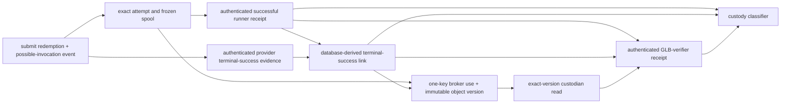

# OmniTwin Foundry authenticated result evidence V1

Status: **DESIGN DRAFT / NO-GO — grants no execution, upload, custody,
release, signing, publication, or runtime authority.**

Date: 2026-07-14

This contract is the prerequisite identified by the frozen 0058-A NO-GO
review. It replaces caller-constructible GLB, worker-manifest, provenance and
provider-outcome booleans with one generic immutable authenticated-evidence
ledger plus three typed relational projections: a runner terminal receipt, an
authenticated-provider/database-derived terminal-result link, and an exact-
byte GLB-verifier receipt. The same ledger carries closed administrator/source,
gateway-token-commitment and storage-create evidence without turning those
records into authority. It is
deliberately narrower than a production
workload-identity or storage deployment. No key is created, no receipt is
signed, and no provider, object store, shared database, or production service
is contacted by this design.

The contract applies only to the exact `normalize_mesh_glb/v0` subject in the
second-amended derivative-activation V1 contract. It does not generalize to
training, reconstruction, checkpoints, additional outputs, release, public
serving, measured geometry, or generated imagery.

Workload registration is further constrained by the normative
`omnitwin-foundry-activation-v1-workload-inclusion-proof.md` contract and its
adjacent JSON Schema. Those artifacts define the only accepted Merkle proof,
trust-bundle, SQL-constructed candidate-leaf and verification-record bytes;
this evidence contract cannot replace them with an opaque proof assertion.

## 1. Required outcome

The implementation may classify custody only from this closed graph:



The graph is the success-only prerequisite for object custody. Authenticated
runner or provider failure stops before `F` and remains historical evidence.

The custody API accepts one output-reservation ID and an idempotency key; it
derives the unique three-record graph and exact read/create chain. It accepts
no caller-selected receipt/link, verdict, GLB boolean, worker-manifest
substitution, terminal-state claim, actor string, authority timestamp, or
disposition. PostgreSQL resolves the immutable records, recomputes their closed digests, and derives
`content_valid`, `result_valid`, `glb_structure_valid`,
`public_reverse_scan_clear`, `authority_current`, and `disposition`.

## 2. Threat model and trust roots

### 2.1 In scope

The contract must fail closed against:

- an ordinary API caller constructing a self-consistent but false manifest or
  GLB proof;
- a service from one authority plane calling another plane's API;
- a generic/shared database login, `SET ROLE`, inherited cross-plane role, or
  caller-supplied actor identity;
- stale, future, expired, revoked, wrong-audience, wrong-trust-domain, or
  wrong-workload credentials;
- replay of one receipt for another activation, attempt, fence, output,
  object version, result observation, or verifier;
- signature/type confusion, signer/verifier substitution, trust-bundle
  substitution, canonicalization disagreement, duplicate JSON keys, and
  integer rounding;
- a valid runner receipt paired with a different provider terminal result, or
  a valid object paired with a different runner output;
- valid historical evidence being misused as current result authority; and
- post-receipt mutation, conflicting immutable versions, or public/runtime
  namespace leakage.

Database superusers/migration owners, the bootstrap and activation/auth
gateways, evidence-admission verifier, recovery adapter, runner, broker,
custodian, storage signer/control plane, GLB verifier, spool/OS freezer,
authenticated claim-offer/grant-ready queues and target-gateway secret store,
database clock, canonicalization/parser/crypto implementations, KMS/HSM,
host administrators and the exact trust roots remain trusted-computing-base
risks. Compromise of one is not claimed to be contained beyond the explicit
plane, key and phase boundaries below.

### 2.2 Positive trust chain

An authenticated receipt requires all of the following. A self-digest or an
unsigned JSON object is never authentication.

1. The semantic signer emits a raw-byte closed payload automatically from the
   exact pinned artifact; tenant/worker code cannot alter the predicate after
   the observed action.
2. A DSSE signature authenticates the exact payload bytes and payload type.
   The independent evidence-admission service verifies exactly one Ed25519
   signature against the stored action-time-valid signer/root/key/policy
   binding and verifies the signer transport identity.
3. That service connects through its unique evidence-admitter LOGIN. The
   privileged SQL boundary derives `session_user` and authenticated
   `system_user`; runner, recovery, broker and custodian roles cannot execute
   the admission function.
4. PostgreSQL receives raw envelope/report bytes rather than `jsonb`, re-parses
   their closed canonical forms, compares every relational binding, recomputes
   all non-signature digests, assigns acceptance time from
   `clock_timestamp()` after locks, and stores the exact bytes plus immutable
   admission facts.
5. Semantic APIs later consume only the admitted evidence ID. They never
   accept a signature verdict, signer identity, actor, timestamp or proof
   boolean from their own caller.

This is the normal-admission chain for every kind except
`bootstrap_ceremony`. Bootstrap is the one disabled sentinel-only-state
exception: two
distinct offline roots each produce a separate, canonical, exactly-one-
signature DSSE envelope over the identical frozen installation-manifest
payload/type. A two-signature envelope, two different payloads, repeated key,
or one root signing twice is denial. The pinned offline verifier authenticates
both before the one-time bootstrap SQL call; SQL re-parses both envelopes,
requires byte-identical decoded payloads and the two frozen key/root identities,
and persists both exact envelopes and signer/root bindings in the one bootstrap
evidence row. The runtime evidence-admission service cannot create that kind.

DSSE authenticates bytes and their type but deliberately does not solve key
management. SPIFFE identities establish a workload namespace only when the
matching trust-domain bundle and validation policy are present. Therefore the
enabled epoch must bind the exact trust-root registry, trust bundle, identity
policy, signer-key map, runner, verifier, and evidence-admission artifacts.
Possessing a SPIFFE-shaped URI or a DSSE-shaped envelope proves nothing by
itself.

Primary specifications consulted on 2026-07-14:

- [DSSE protocol](https://github.com/secure-systems-lab/dsse/blob/master/protocol.md)
  — the payload type and payload bytes are both covered by pre-authentication
  encoding; key management is out of scope.
- [in-toto Statement V1](https://github.com/in-toto/attestation/blob/main/spec/v1/statement.md)
  — subjects are immutable digest-bound artifacts and predicate types must be
  unambiguous.
- [RFC 8785 JSON Canonicalization Scheme](https://www.rfc-editor.org/rfc/rfc8785)
  — deterministic JSON primitive serialization and property ordering; this
  contract further rejects all JSON numeric leaves and restricts keys to ASCII.
- [SPIFFE Workload API](https://spiffe.io/docs/latest/spiffe-specs/spiffe_workload_api/)
  and [trust-domain/bundle specification](https://spiffe.io/docs/latest/spiffe-specs/spiffe_trust_domain_and_bundle/)
  — identity validation requires the matching trust-domain bundle; an absent
  usable bundle is denial.

## 3. Canonical bytes and digest domains

All signed payloads and database-derived objects are closed: unknown,
duplicate, omitted, null in a non-null field, non-finite, or wrong-type values
are denial. The original bytes must be UTF-8 with no BOM, leading/trailing
whitespace or trailing newline. Keys and security-relevant strings are ASCII;
human-readable display strings, where explicitly allowed, are NFC and are
never authority. Keys are sorted by unsigned ASCII byte order, never
locale-sensitive `localeCompare`. UUIDs are lower-case canonical text; raw
SHA-256 values are 64 lower-case hex characters and prefixed digests are
`sha256:` plus that value. Every integer leaf is a quoted canonical decimal
string matching `0|[1-9][0-9]*`; evidence payloads contain no JSON numeric
leaf, float, exponent, negative zero or unsafe JavaScript integer. Instants are
exact millisecond UTC `YYYY-MM-DDTHH:mm:ss.SSS+00:00` strings. Arrays have one
specified order and uniqueness rule.

For payload `P`, domain `D`, and payload type `T`:

1. `payloadBytes = UTF8(RFC8785_JCS(P))` after the stricter schema above;
2. `payloadSha256 = lowerhex(SHA256(payloadBytes))`;
3. `receiptSha256 = "sha256:" + lowerhex(SHA256(UTF8(D + "\n") || payloadBytes))`;
4. the DSSE signature covers `PAE(T, payloadBytes)` exactly;
5. the envelope has exactly `payloadType`, padded RFC 4648 canonical-base64
   `payload`, and `signatures`; `signatures` contains exactly one exact
   `{keyid, sig}` object with padded canonical base64 and no unknown key; and
6. `envelopeSha256 = "sha256:" + lowerhex(SHA256(UTF8(D +
   ".dsse-envelope\n") || envelopeBytes))` over the exact closed canonical
   envelope bytes. It is evidence identity, not a second signature.

For `bootstrap_ceremony` only, these rules are applied independently to
`envelopeA` and `envelopeB`; their decoded `payloadBytes` and payload type must
be identical, their `keyid` and root bindings must be distinct, and the
bootstrap evidence digest additionally domain-hashes both envelope digests in
lexicographic key-ID order. There is never a DSSE envelope with two signatures.

The exact domains and payload types are:

| Record | Domain `D` | DSSE payload type `T` |
| --- | --- | --- |
| bootstrap ceremony | `omnitwin.foundry.derivative-bootstrap-ceremony.v1` | `application/vnd.omnitwin.foundry.derivative-bootstrap-ceremony.v1+json`; accepted only by bootstrap |
| admin action | `omnitwin.foundry.derivative-admin-action.v1` | `application/vnd.omnitwin.foundry.derivative-admin-action.v1+json` |
| predecessor source | `omnitwin.foundry.derivative-predecessor-source.v1` | `application/vnd.omnitwin.foundry.derivative-predecessor-source.v1+json` |
| gateway token commitment | `omnitwin.foundry.derivative-gateway-token-commitment.v1` | `application/vnd.omnitwin.foundry.derivative-gateway-token-commitment.v1+json` |
| runner receipt | `omnitwin.foundry.derivative-runner-terminal-receipt.v1` | `application/vnd.omnitwin.foundry.derivative-runner-terminal-receipt.v1+json` |
| provider result evidence | `omnitwin.foundry.derivative-provider-result-evidence.v1` | `application/vnd.omnitwin.foundry.derivative-provider-result-evidence.v1+json` |
| storage create | `omnitwin.foundry.derivative-storage-create.v1` | `application/vnd.omnitwin.foundry.derivative-storage-create.v1+json` |
| storage read | `omnitwin.foundry.derivative-storage-read.v1` | `application/vnd.omnitwin.foundry.derivative-storage-read.v1+json` |
| provider result tuple | `omnitwin.foundry.derivative-provider-result-tuple.v1` | not DSSE; constructed inside PostgreSQL from the accepted provider evidence and locked typed graph |
| result link | `omnitwin.foundry.terminal-result-link.v1` | not DSSE; constructed inside PostgreSQL from admitted provider evidence and locked rows |
| GLB verifier | `omnitwin.foundry.derivative-glb-verifier-receipt.v1` | `application/vnd.omnitwin.foundry.derivative-glb-verifier-receipt.v1+json` |
| admission evidence | `omnitwin.foundry.evidence-admission.v1` | not caller-supplied; constructed inside PostgreSQL |

The signed payload must not contain its own `payloadSha256`, `receiptSha256`,
signature, envelope digest, database acceptance time, or admission verdict.
Those are external fields derived after parsing. PostgreSQL stores both exact
`bytea` and parsed `jsonb`; signature verification is always over bytes, never
reconstructed `jsonb`. SQL and TypeScript must share byte-exact canonical
vectors, including empty strings, ASCII sort boundaries, escaped characters,
canonical base64, decimal strings, deliberately reordered keys and duplicate-
key rejection.

V1 limits are 1 MiB per raw DSSE envelope, 512 KiB decoded payload and 256 KiB
verification report. Auxiliary bytes are exactly zero except a runner
transcript (at most 32 MiB/4096 frames), predecessor-source response (8 MiB),
raw provider response (4 MiB), or signed storage-create response/header block
or storage-read response/header block (1 MiB each). The separately bounded
second bootstrap envelope is stored in its dedicated envelope columns, not as
auxiliary bytes. `keyid` is 1-128 printable ASCII bytes; the signature decodes to
exactly 64 bytes. Base64 must decode and re-encode byte-for-byte identically.

The current `packages/reconstruction-foundry/src/canonical-json.ts` permits
JSON numbers and sorts keys with `localeCompare`; it is not evidence of this
receipt canonicalizer. Integration remains NO-GO until a byte-vector-tested
implementation matches this contract and PostgreSQL's verifier exactly.

## 4. Workload-identity admission

Semantic signer and evidence-admitter identities are different boundaries.
Runner, provider gateway, auth/source verifier, storage signer and GLB verifier
may not share a signer binding or key with the admission service. Signers need
not have a database login; only the independent admission workload writes the
generic evidence ledger.

`foundry_derivative_workload_authorizations_v1` is the common, append-only
trust registry. Its closed `bindingKind` is `trust_root`, `db_caller`, or
`evidence_signer`. A DB caller has one exact capability plane/login identity;
an evidence signer has one exact evidence-kind allowlist, one semantic consumer
plane and no database role. It carries an explicit authorized pairing to one
DB caller in that plane. This is a cross-root scope/delivery association, not
identity equivalence: runner, provider adapter, storage control plane, auth/
source verifier and GLB verifier remain distinct signer workloads.
The separate revocation table has action-time `recordedAt` and optional
conservative `compromiseNotBefore`. DB callers may not share login identities;
signer rows may not share keys across semantic planes.

Each workload authorization has these immutable leaves:

| Leaf | Rule |
| --- | --- |
| `bindingKind` | exact trust-root, DB-caller or evidence-signer discriminant |
| `parentRootAuthorizationId/Sha256` | exact stored trust root for a DB caller or evidence signer; null for a trust-root row |
| `inclusionAuthorityRootAuthorizationId/Sha256` | exact existing trust root that authorized a runtime trust-root registration; null for DB callers, evidence signers and bootstrap-special roots |
| `dbRoleOid`, `dbSessionRole` | exact OID/name for a DB caller; null for signer/root; no generic pooler |
| `dbSystemUserSha256` | non-null authenticated `system_user` digest for a DB caller only |
| `spiffeId` | exact normalized SPIFFE URI, no query or fragment |
| `trustDomain` | exact lower-case domain from the SPIFFE ID |
| `audience` | exact plane-specific audience |
| `credentialKind` | one reviewed SVID kind; no bearer fallback |
| `workloadIdentitySha256` | digest of the complete closed identity binding |
| `signerKeyId` | exact `ed25519-sha256:` plus lowerhex SHA-256 of the stored public-key DER, mapped to one evidence kind |
| `signerPublicKeyBytes`, `signerPublicKeySha256` | exact RFC 8410 Ed25519 SubjectPublicKeyInfo DER and `sha256:` raw-byte digest matching the key ID; no alternate encoding or embedded-payload trust |
| `trustBundleBytes`, `trustBundleSha256` | exact stored verification bundle, not only an artifact label |
| `trustBundleSchemaSha256`, parser artifact/configuration SHAs | exact strict-UTF-8, duplicate-rejecting, RFC 8785 JCS parser contract; runtime caller/signer rows copy the verified parent bundle only after proof equality, while bootstrap caller/signer rows copy the manifest-enumerated parent bundle only after dual-envelope and exact-manifest equality |
| `authorizedLeafMerkleRootSha256`, `authorizedLeafMerklePolicySha256` | distinct child-authorization Merkle root and frozen policy for trust-root rows only; never the registry snapshot root |
| `identityPolicySha256` | exact validation and selector policy |
| `validFrom`, `expiresAt` | database-comparable credential/authorization window |
| `maximumReceiptLagSeconds` | integer 1 through 300 inclusive for every normal evidence-signer kind: admin, predecessor, token commitment, runner, provider, storage create/read and verifier |
| `callerBindingSha256` | DB-caller-only digest of the exact closed root-independent caller selector: workload identity, plane, validity/origin and stable parent-root profile |
| `pairedCallerBindingSha256`, paired caller authorization ID/SHA, transcript `pairedCallerWorkloadIdentitySha256` and `pairingPolicySha256` | signer-only committed caller binding plus the exact post-proof semantic consumer, both lineages and cross-root scope/authenticated-delivery policy; never a shared-login assertion or a second broad leaf selector |
| candidate-leaf JCS bytes/JSON/SHA and position-bound commitment | SQL-constructed root-independent proof subject; never caller JSON |
| proof authority pair, depth/index/count, proof bytes/SHA | exact parsed `OTFDMP01` membership path and selected authority |
| inclusion-verification JCS bytes/JSON/SHA | atomic root-dependent record binding authority/currentness, inherited bundle, paired caller, proof and root equality without binding the new target authorization SHA |

The table is a discriminated relational union, not a nullable free-for-all.
A runtime `trust_root` requires registry/root/bundle/policy material, a named
current inclusion-authority root, a distinct requested child-authorization
Merkle root and an exact proof verified against that selected stored root; the
bootstrap-special root has neither authority nor proof, and every bootstrap
authorization row has a null candidate-leaf/proof/verification tuple. After
both bootstrap envelopes and the canonical installation manifest compare
equal, SQL copies each manifest-enumerated caller/signer's parent bundle,
resolves the manifest-named caller for each signer, enforces exact signer-
interval containment and freshly computes both caller-binding digests without
constructing a leaf or verification record. Runtime candidate
leaves exclude authority row IDs/SHAs, authority bundle/registry/root material
and the target row ID/SHA, so a new trust root can precompute its immutable
child set without a digest or UUID preallocation cycle. Before constructing a
runtime signer leaf, SQL selects and locks the request-selected caller ID, freshly
recomputes its workload-identity and caller-binding SHAs from immutable fields,
requires the leaf's single `pairedCallerBindingSha256` selector to match, and
requires `signer.valid_from >= caller.valid_from` plus
`signer.expires_at <= caller.expires_at`.
After proof equality it binds the exact caller authorization SHA, workload-
identity SHA, both current lineages and pairing-policy SHA in the verification
record, whose paired-caller interval-containment verdict MUST be true. Both root forms
forbid DB-role and workload-signer leaves. `db_caller` requires role OID/name, system-user and
transport identity but forbids a receipt-signing key; `evidence_signer`
requires one semantic evidence kind/plane, paired-caller policy, independent
transport identity and Ed25519 key but forbids DB-role leaves. Exact CHECKs and
typed unique indexes enforce each arm.

The future enabled epoch binds the exact resulting registry generation and
root material. During generation 1 disabled, only the separately frozen
one-time bootstrap and then the seeded activation registrar may append inert
bindings. A key/bundle cannot be registered merely because an administrator
supplies its digest; SQL compares stored material or verifies a stored closed
`OTFDMP01` proof against the request's exact named authority row and its
distinct authorized-leaf Merkle root. Leaf/proof/verification data are one-use
and persisted atomically with the target authorization; exact idempotent replay
returns the existing row and any changed replay fails. Revoking a
trust root resolves a pair-exact set seeded by that root and recursively
containing all and only its inclusion-authority descendants, then their exact
caller/signer children. It then follows one additional exact edge from each
affected DB caller to every evidence signer whose immutable paired-caller
ID/SHA names that caller, even when that signer's own parent root is different,
and finally selects evidence/phase rows bearing any affected root/caller/signer
pair. A direct DB-caller revocation starts at that caller and uses the same
pairing edge; a signer revocation starts only at that signer. The pairing hop
does not affect the signer's parent root, siblings or unrelated consumers. The
same resolver denies every future registration, admission and phase use after
root-first locking and rechecking both signer and paired-caller lineages at the
revocation boundary; it never selects same-domain/key rows or the registry
wholesale.

At admission, the evidence service strictly parses the raw bytes, verifies
DSSE/Ed25519 and signer transport, and creates a canonical verification report
before opening the SQL transaction. The raw-byte SQL function independently
verifies the evidence-admitter session, direct role membership, caller
authorization, byte-canonical envelope/payload/report shapes, payload type and
hash, key/root/policy identities, relational subject, nonce/replay keys and
DB-time horizon. The report binds the verifier artifact and exact key-registry
snapshot. There is no `signatureValid` input. This contract explicitly trusts
the pinned admission service for cryptographic verification; stock PostgreSQL
0058 has no reviewed native Ed25519 verifier.

`foundry_derivative_authenticated_evidence_v1` stores the generic immutable
row: a DB-generated forensic ledger-row ID, the signed semantic/planned evidence
ID, kind/purpose, exact envelope and payload bytes/SHAs,
parsed closed payload, signer/root/key/policy bindings, signer transport
identity, admission-service caller binding, exact verification-report
bytes/SHA, bounded kind-specific auxiliary bytes/length/SHA, nonce,
signer-observed interval, DB acceptance time and authority `none`. Semantic
services receive only this row's ID. Auxiliary bytes are mandatory for the
runner transcript, predecessor source response, provider response and storage-
create/read response/header blocks, and zero-length for all other V1 kinds.

The raw verification report has an exact JCS schema: report version/ID,
admission-service caller authorization and artifact/configuration SHAs,
canonicalizer/parser/Ed25519 implementation SHAs, registry generation/root/
bundle/policy snapshot, envelope/payload type and SHAs, algorithm literal
`ed25519`, signature count `"1"`, key ID/public-key SHA, signer transport
issuer/subject/audience/credential SHA, signer-observed verification instant
and result literal `verified`. That literal is accepted only from the
authenticated evidence-admitter session and never from a semantic caller; DB
acceptance time and authority are still derived after locks.

Accepted-only unique keys cover semantic evidence ID, `(signer binding,
evidence kind, purpose, nonce)` and planned challenge. A separate unique
submission fingerprint covers the exact envelope/report/auxiliary byte tuple.
Admission first resolves the authenticated admitter/idempotency key: equal
request SHA returns its immutable row and changed request SHA is `23505` with no
mutation. Byte-identical content under a different key is also `23505`; V1 does
not create an unpersisted replay-key alias, and the caller must retry the
original key. A changed authenticated submission under a fresh key and an
accepted ID/nonce/challenge gets a distinct forensic ledger row with
`authenticated_structural_conflict`, conflict fingerprint and no typed
projection; it cannot refresh acceptance time, horizon or consumption state.

An authorization or trust-root compromise revocation has both DB
`recordedAt` and optional conservative `compromiseNotBefore`. Receipts admitted
outside the action-time-valid interval are invalid. A later revocation does
not erase evidence, but any receipt at or after `compromiseNotBefore` cannot
support current authority and triggers source-scoped containment. Rotation
requires a new authorization; a receipt may not combine the old identity with
the new bundle or key.

### 4.1 Closed non-result evidence kinds

Every normal payload begins with exact `schemaVersion`, `evidenceKind`,
`authority = "none"`, `evidenceId`, one-use `nonceSha256`,
environment/tenant/project scope, signer-binding ID/SHA, `issuedAt`,
`expiresAt`, and its closed subject binding. The DB acceptance interval is the
intersection of signed expiry, signer credential/key/root validity, admission-
service validity, challenge expiry and any conservative compromise boundary.
The signed observation must satisfy signer `validFrom <= observedAt <= dbNow`,
`dbNow - observedAt <= maximumReceiptLagSeconds`, and strict
`dbNow < min(expiresAt...)`; signed time can narrow but never backdate or extend
DB authority.
Runner/provider-result/storage-create/storage-read/verifier kinds must equal their DB-preallocated ID and
challenge. Admin/source/token-commitment IDs and nonces are signer-generated,
globally unique under signer/kind/purpose, and become one-use at admission;
their exact action/request/row/scope binding prevents cross-subject replay.

`admin_action` additionally binds one closed action enum, canonical request
SHA and idempotency key, every subject kind/ID/SHA, administrator user ID,
authenticated auth-session ID, authentication method/assurance, auth-gateway
issuer and audience. It is one-use for that exact action/request/scope. A bare
user ID or receipt SHA is not this evidence.

The exact V1 action literals are:

```text
register_storage_profile
revoke_storage_profile
register_workload
revoke_workload
register_executor
revoke_executor
activate
revoke_activation
disable_epoch
revoke_broker_authorization
revoke_custodian_authorization
```

No alias, generic `revoke`, future action or caller-selected extension is
accepted. The two output-authorization revocations bind the exact scalar target
authorization ID and the complete call-wrapper SHA just like every other mixed
scalar/JSON administrative action.

`predecessor_source` additionally binds exact source table/kind, primary key,
complete row-material SHA, applicable accepted admin-action evidence ID,
payload raw SHA and admission SHA,
authoritative source system, verification-method enum, raw source-response
SHA, source version and verifier artifact/configuration. The only V1 methods
are:

| Predecessor rows | Required authoritative source |
| --- | --- |
| 0053 execution policy, provider adapter artifact/deployment, request profile and trusted worker profile | signed infrastructure/artifact-registry release record matching exact artifact/config bytes |
| 0053 job, job-worker mapping, job/envelope/manifest subject | signed job-authoring record plus immutable manifest/envelope byte digests |
| 0053 base rights policy/approval/revocation, compute approval and execution confirmation | signed rights/auth-gateway action record for the exact row subject and administrator |
| 0054 derivative policy/approval/revocation | signed derivative-rights registry/reviewer record for the exact generation and definition |
| 0055 terms-evidence custody and derivative-rights review | original immutable terms-document bytes/custody receipt plus signed reviewer decision |
| 0057 registry attestation/revocation and execution candidate/reservation | signed registry source record and deterministic candidate-compiler receipt over the exact inputs |
| 0056 barrier behavior | frozen migration bytes/SHA and replay evidence only; no invented row attestation |

Missing source bytes, an unknown method, a signature by the activation service
over its own restatement, or a row mismatch is denial.

`gateway_token_commitment` binds the target submit/recovery gateway signer,
its exact current target DB-caller authorization ID/SHA, exact pending provider-
command ID/sidecar SHA, plane, queue scope,
32-byte redemption-token SHA-256, maximum expiry and one-use nonce. The gateway retains
plaintext; the claimer receives only the admitted ID/admission SHA through the
non-secret authenticated claim-offer queue, and one grant may reference it.
The base command's UUID `claim_token` is instead a non-secret claim handle equal
to that accepted commitment evidence ID; no table or signed payload stores the
redemption-token plaintext.

`storage_create` binds broker object-use/upload IDs, exact provider/account,
bucket/key, immutable version, ETag as a non-cryptographic identity leaf, raw
and prefixed SHA-256, byte length, media type/suffix, response-body/header SHA,
storage control-plane signer and completed-observed instant. It is not PUT
authority and is admitted only after broker use.

`storage_read` binds the custodian authorization and read challenge, the exact
accepted `storage_create` evidence ID/payload-raw SHA/admission SHA triple,
provider/account/bucket/key/immutable version,
ETag, raw/prefixed SHA-256, byte length, media type/suffix, exact-version half-
open full range `[0, byteLength)` (including `[0,0)` for an empty object)
and response-body/header SHA, read-start/read-complete observations and storage
control-plane signer. It proves only the authenticated exact-version read; it
does not prove GLB validity or current custody authority.

## 5. Authenticated runner terminal receipt

The runner is outside the network-none worker namespace. It owns the process,
attempt spool and authenticated control-channel capture, but it has no object
store, provider, release, signing, publication, or runtime capability. The
worker cannot call this API.

`foundry_derivative_runner_terminal_receipts_v1` is an append-only typed
projection over one admitted `runner_terminal` ledger row. The output
reservation preallocates `planned_runner_receipt_id`, a random challenge nonce
hash, lease issue/not-after DB times, runner-phase context SHA and expected
signer/trust-binding ID/SHA. The nonce is delivered in the sealed provider
request; only its hash is stored. The admitted evidence/receipt ID must equal
the planned ID, and one reservation/attempt/fence/slot has at most one receipt.

The signed payload is a closed discriminated union on `terminal.outcome`. Both
arms have exactly the common top-level objects `identity`, `challenge`,
`subject`, `submit`, `source`, `reservation`, `worker`, `runner`, `transcript`,
`terminal`, and `denials`, with these common leaves:

| Object | Exact required leaves |
| --- | --- |
| identity | `schemaVersion`, `evidenceKind = "runner_terminal"`, `authority = "none"`, receipt/evidence ID, runner ID/version/artifact/image/config/deployment SHAs, runner signer-binding ID/SHA |
| challenge | planned receipt ID, nonce SHA, DB issue/not-after times and runner-phase context SHA exactly equal to the reservation |
| subject | candidate ID/SHA and reservation receipt SHA; closure ID/SHA; activation ID/SHA; execution ID/subject SHA; attempt ID/ordinal `"1"`; fencing token; stage ID |
| submit | command ID, immutable UUID claim-handle/claimed-by/acquired/not-after tuple, submit grant/redemption IDs/SHAs, invocation-event ID and provider idempotency key; no redemption-token plaintext |
| source | source asset ID, raw SHA-256, byte length, immutable source version/read receipt, type `glb_gltf`, media type `model/gltf-binary`, suffix `.glb`, read mode `read_only` |
| reservation | reservation ID/SHA, slot `normalized_glb_v0`, prefix/bucket/key, spool-root/spool-identity SHAs and relative path `normalized.glb` |
| worker | worker profile/artifact/image/identity/filesystem/network-policy SHAs plus exact ordered software set/components |
| runner | sandbox/network/execution-authorization SHAs plus exact issuer/subject/audience/credential/key/public-key/identity binding |
| transcript | schema, SHA, byte length, frame count, first/last sequence and hash, and the closed frame-kind sequence; bounded to 32 MiB and 4096 frames |
| terminal | process instance, literal outcome, runner-start and terminal observations, exit disposition, last completed frame sequence/SHA and the observation fields present in that arm |
| denials | authority `none`; release/sign/publication/redistribution/public-serving/runtime/measured-geometry flags all false |

For `terminal.outcome = "succeeded"`, the payload has exactly the three
additional top-level objects `recipe`, `output`, and `manifest`; `failure`,
`failureRecipe`, `failureOutput`, and `failureManifest` are forbidden. The
success-only leaves are:

| Object | Exact success leaves |
| --- | --- |
| recipe | operation `normalize_mesh_glb/v0`, deterministic/lossless classes, exact sealed command, recipe/version/SHA, invocation/report and before/after semantic snapshot SHAs |
| terminal | exit disposition `exit_code`, exit code `"0"`, no signal; output-close, manifest, worker-exit and spool-freeze observations; `spoolState = "frozen_after_exit"`; file set exactly `["normalized.glb"]` |
| output | path `normalized.glb`, stable file identity, link count `"1"`, raw/prefixed SHA-256, byte length, media type and suffix |
| manifest | one complete `omnitwin.foundry.derivative-normalization-worker-manifest.v2` frame/SHA captured after output-handle close and before worker exit |

For `terminal.outcome = "failed"`, the payload instead has the required
top-level `failure` object; success `recipe`, `output`, and `manifest` are
forbidden. `failure` contains exactly:

- `failureCode`, one of `runner_setup_failed`, `source_open_failed`,
  `worker_start_failed`, `worker_nonzero_exit`, `worker_signalled`,
  `output_missing`, `output_close_failed`, `output_identity_invalid`,
  `manifest_missing`, `manifest_invalid`, `spool_freeze_failed`,
  `post_exit_hash_mismatch`, or `runner_internal_failed`;
- `failureStage`, one of `runner_setup`, `source_open`, `worker_start`,
  `worker_execute`, `output_close`, `manifest_capture`, `worker_exit`,
  `spool_freeze`, or `post_exit_verify`;
- the last completed frame sequence/SHA, the SHA of the bounded final error
  record, and `exitDisposition`, one of `not_started`, `exit_code`, `signal`,
  or `runner_abort`; and
- `recipeState`, one of `not_started`, `started_no_report`, or
  `report_captured`; `outputState`, one of `absent` or
  `partial_quarantined`; and `manifestState`, one of
  `absent_before_manifest`, `captured_invalid`, or
  `captured_before_failure`; and `spoolState`, one of `not_created`,
  `quarantined_unfrozen`, or `frozen_after_exit`.

The failure sub-arm is closed by those state literals. `failureRecipe` is
forbidden for `not_started`, contains only the sealed invocation/recipe
identity for `started_no_report`, and additionally contains the report and
before/after snapshot SHAs for `report_captured`. `failureOutput` is forbidden
for `absent`; for `partial_quarantined` it contains only the reserved path,
stable partial-file identity, bounded last verified length/SHA, and sealed
quarantine-handle SHA. It never contains or populates the accepted output
digest/length columns. `failureManifest` is forbidden for
`absent_before_manifest`; for `captured_invalid` it contains the captured frame
sequence/SHA and closed validation failure, and for `captured_before_failure`
it contains the complete captured V2 manifest identity/SHA. Neither state
turns the failure arm into success. `exit_code` requires one quoted decimal
exit code and forbids a signal; `signal` requires one closed signal literal and
forbids an exit code; the other dispositions forbid both. `frozen_after_exit`
requires the ordered worker-exit and spool-freeze frames; `not_created`
forbids a failure output; `quarantined_unfrozen` cannot be transferred to the
broker.

A complete manifest repeats the exact activation, closure, execution, attempt/fence,
source, reservation/key, recipe/report, worker image and output bindings. It
cannot contain result observation/classification IDs that do not yet exist;
the current synthesized v1 domain is not reused. Transcript frames form a
domain-hashed finite-state sequence. Success uses exactly:

```text
runner_context, source_opened, worker_started,
stdout_chunk|stderr_chunk (zero or more), output_handle_closed,
worker_manifest (exactly one), worker_exited, spool_frozen, runner_terminal
```

Each frame binds sequence, kind, runner-observed time, previous-frame SHA,
payload and frame SHA; binary chunks use canonical base64. The accepted raw
transcript must reproduce its length/SHA/count/terminal hash and manifest
frame when present. A failure follows the same ordering but may append its
final `runner_terminal` from any reached state. `worker_exited` may follow
`worker_started`, any chunk, `output_handle_closed`, or `worker_manifest`;
`spool_frozen` may follow only `worker_exited`. A failure has at most one
manifest frame, exactly the conditional objects declared by its three state
literals, no invented later-stage observation, and no frame after
`runner_terminal`. A transcript that violates this automaton is malformed
evidence, not an authenticated failure.

The normalized signal allowlist is exactly `SIGABRT`, `SIGBUS`, `SIGFPE`,
`SIGILL`, `SIGKILL`, `SIGPIPE`, `SIGQUIT`, `SIGSEGV`, `SIGTERM`, `SIGXCPU`, and
`SIGXFSZ`. Numeric, platform-private and unknown signal names are malformed.
Failure fields are not an independent Cartesian product. The exact code matrix
is:

| Failure code | Exact failure stage | Exit disposition | Required state constraint |
| --- | --- | --- | --- |
| `runner_setup_failed` | `runner_setup` | `not_started` or `runner_abort` | recipe/output/manifest not started/absent; spool `not_created` |
| `source_open_failed` | `source_open` | `not_started` or `runner_abort` | recipe/output/manifest not started/absent; no frame after `runner_context` |
| `worker_start_failed` | `worker_start` | `not_started` or `runner_abort` | recipe `started_no_report`; output/manifest absent; last nonterminal frame `source_opened` |
| `worker_nonzero_exit` | `worker_exit` | `exit_code` with code other than `0` | last reached frame `worker_exited` or `spool_frozen`; artifact states equal the reached-frame derivation |
| `worker_signalled` | `worker_execute` or `worker_exit` | `signal` | one allowlisted signal; last reached frame is at/after `worker_started`; artifact states equal the reached-frame derivation |
| `output_missing` | `output_close` | `exit_code` with code `0` | recipe `report_captured`; output/manifest absent |
| `output_close_failed` | `output_close` | `runner_abort` or `exit_code` | recipe is started; output `partial_quarantined`; manifest absent; spool not frozen |
| `output_identity_invalid` | `post_exit_verify` | `exit_code` with code `0` | recipe `report_captured`; output `partial_quarantined`; any manifest state must equal the captured frame |
| `manifest_missing` | `manifest_capture` | `exit_code` with code `0` | recipe `report_captured`; output `partial_quarantined`; manifest `absent_before_manifest` |
| `manifest_invalid` | `manifest_capture` | `exit_code` with code `0` | recipe `report_captured`; output `partial_quarantined`; manifest `captured_invalid` |
| `spool_freeze_failed` | `spool_freeze` | `exit_code` with code `0` | recipe/report and partial output captured; complete manifest captured; spool `quarantined_unfrozen` |
| `post_exit_hash_mismatch` | `post_exit_verify` | `exit_code` with code `0` | recipe/report, partial output and complete manifest captured; spool `frozen_after_exit` |
| `runner_internal_failed` | the stage mapped from the last completed nonterminal frame | `runner_abort` | every recipe/output/manifest/spool state is the deterministic reached-frame/artifact value; it cannot claim a later stage |

For the two rows permitting multiple stages/dispositions, the last completed
frame fixes the one admissible value. A relation-28 deferred guard replays the
transcript automaton, derives the reached stage and state tuple, and compares
every matrix cell; a syntactically allowed but incompatible combination is a
malformed submission and receives no accepted projection.

For success, the output is create-only, no-follow, single-link and opened below the
reserved spool root; the runner re-hashes the same stable handle after exit
and freeze, proves exactly one spool entry, then transfers only a sealed
read-only immutable snapshot/open handle to the broker. The broker must stream
and hash that same handle during PUT; mutable pathname reopen, rename, symlink,
hardlink, descriptor swap and post-freeze write tests must fail. The runner
receives no storage credential. A success-arm manifest/transcript/handle
mismatch is denial, not a valid receipt. An authenticated terminal failure is
retained as historical failure evidence but never authorizes the broker, read,
verifier, custody, release, signing, publication, serving, runtime, or
measured-geometry path. The typed projection enforces the union relationally:
common binding columns are non-null; success proof/output/manifest columns are
non-null only for `succeeded`; failure code/stage/state/error columns are
non-null only for `failed`; the opposite arm's columns are null; and
failure-only partial diagnostics are stored separately from accepted output
identity.

The runner receipt proves only what the trusted runner observed. It does not
prove provider contact, external storage creation, GLB validity, semantic
equivalence, useful quality, current rights, or release eligibility.

## 6. Authenticated-provider/database-derived terminal-result link

`foundry_derivative_terminal_result_links_v1` is append-only and references one
admitted terminal `provider_result` ledger row plus a separate closed link JSON
constructed by PostgreSQL. Recovery redemption preallocates the provider
evidence, observation, completion, classification and link IDs and issues a
one-use result challenge. The signed evidence is produced by the exact recovery
adapter/gateway after authenticating the provider/process response. It binds
the challenge, raw response/channel SHAs, endpoint/provider identity, adapter
ID/version/artifact/configuration SHAs, recovery caller/signer bindings,
provider reference, exact command claim/grant/redemption/call identities,
lifecycle/exit observations, execution/attempt/fence, planned runner receipt
ID and observed time. Its closed terminal-success arm additionally binds the
authenticated runner receipt and exact output digest/length. Its closed
terminal-failure arm forbids output digest/length and may bind either no runner
receipt or one authenticated failed runner receipt for the same planned ID. It
contains no outcome, authority or custody verdict supplied as a scalar.

Under one root-first evidence-admission transaction, PostgreSQL first derives
the exact result state/tuple, complete 0053 graph, branch and any first-terminal
owner from the authenticated payload and locked command/invocation/attempt
state. It assigns the R27 sequence, inserts the accepted row, then inserts the
preallocated observation, completes a still-live command or validates the sole
V1-aware expired-watchdog closure, accounts for every installed completion
cascade, inserts or validates the completion event, and inserts the
classification in installed 0053 order. A deferred bidirectional guard makes commit impossible
unless that complete graph matches the R27 evidence triple, state, tuple,
branch, planned IDs, outcome digests and classification. The graph binds:

- submit redemption and actual possible-invocation event;
- recovery authority, one-use call grant/redemption and actual call event;
- provider command and exact immutable claim tuple;
- authenticated provider-result payload/envelope/admission SHAs;
- provider result observation and observed provider reference;
- command outcome JSON/SHA;
- `provider_command_completed` event;
- result classification and terminal-outcome SHA; and
- DB observation and completion times. A newly created link additionally binds
  its DB link time; a later branch returns that immutable existing link time.

Only invoked `provider_reconcile|provider_poll|provider_stop` claims are in
scope. For a still-live claimed command, admission is the sole conclusive V1
completion path and must explicitly use all three planned 0053 IDs. The caller
prelocks the complete installed-guard superset before those guards sample their
entry clocks; the command completion is
`GREATEST(command_guard_clock, old_command.updated_at + interval '1
microsecond')`, is strictly before claim expiry, and produces
`already_authoritative`. The order is observation `recorded_at <=` command
`completed_at =` completion-event `recorded_at <=` classification
`classified_at`.

The only pre-existing completion allowed by the minimal design is an
authenticated V1-aware watchdog's invoked expired-claim closure:
`uncertain/unknown`, outcome code `claim_lease_expired_effect_unknown`, exact
internal-evidence domain SHA, watchdog actor bound to its authenticated database
caller, and `completed_at >= claim_expires_at`. Because R27 does not yet exist,
the event ID comes from the locked command-claim→R19 grant→R20 redemption and
actual-call-event chain; R19 and R20 planned IDs must agree, the invocation must
be exact, and the later R27 must copy that same ID. No observation or
classification may exist. Admission retains the immutable
command/event time, then inserts the planned observation and classification as
`late_eligible`; command/event time is no later than observation time, which is
no later than classification time. It validates the historical event/revision
prefix, not current projection equality. An expired open claim must be closed
by that watchdog before admission retries.

A baseline conclusive or pre-existing succeeded/failed command is not
adoptable: installed 0053 has already consumed the unique command/claim rows
with database-generated observation/event/classification IDs, and the baseline
observation's six admission fields cannot be filled by any permitted update.
The same is true of an expired closure with a random or circularly sourced event
ID. Every dependent
digest is recomputed from final stored values; there is no historical lease or
projection replay. A cryptographically authenticated but structurally invalid
candidate takes retained R27 conflict with no typed 0053 graph or R29 and uses
the generic authenticated-structural-conflict security/containment policy.

The complete installed cascade remains a deliberate NO-GO blocker. Command
completion can update attempts/executions, cancel a variable same-fence command
set with nested transition events, and require reconcile/stop successor rows;
the installed cancellation trigger uses `SKIP LOCKED`. Admission closes five
semantic preamble outcomes (equal replay, changed-key `23505`, duplicate-
content/different-key `23505`, fresh authenticated conflict, fresh accepted)
and expands fresh accepted to exactly five result branches × two completion
subarms. Every operation has a mandatory semantic selector and guard array even
when its ordinary lock/sequence selector is null. A future revised vector and
catalog must enumerate the exact cascade and generic-conflict effects, lock them
before mutation, detect any skipped row as rollback/`40001`, and prove one exact
AST/access/write/return/outcome row for every operation/subarm. `PR-A-009` and
the live routine/expanded catalog must match; the partial operation list alone
does not authorize implementation.

The recovery gateway later supplies only the execution ID and an idempotency
key to the closed result function. Before the root, PostgreSQL derives
`SESSION_USER`/`SYSTEM_USER`, verifies exact `pg_roles`/`pg_auth_members`
membership, hashes the system identity with the pinned digest and resolves one
identity-only R25 candidate without treating it as authority. It then takes the
global root and locks the R5-pinned recovery caller/provider signer and both
recursive parent/inclusion-root R25/R26 lineages plus preliminary R1/execution/
R11/R5 subject/phase/current-containment eligibility. A claimed caller/key observation is
locked through stored R27/R29; later-different replay additionally locks and
validates the current-R27-linked R24 and its exact R22 source/attempt/fence/
phase. Only after that complete set does every call sample one operation-1
authorization clock and validate both current R5 identities. Equal replay may
return, changed reuse is `23505`, and only an authorized fresh key continues.
A fresh key retains those locks and enumerates accepted provider-result R27 rows in
`(admission_sequence,evidence_id)` order, validates every earlier row's complete
graph and claim state plus the selected R27-to-locked attempt/execution/fence/
subject/phase equality, and selects the unique earliest admission-materialized
but unclaimed observation. It never filters away a missing/mismatched graph.
Under the complete fresh lock set it samples a separate claim clock, revalidates
the same caller/provider-signer recursive R25/R26 closure at that time and fills
only that observation's four nullable API-claim fields:
request SHA, idempotency key, binding SHA and DB-sampled `api_claimed_at`.
Installed 0053 fields and the six admission-binding fields cannot change.
Nonterminal and later-same calls only claim; a first terminal also creates
relation 29; a later-different call validates the R24/R22 closure already
created synchronously by admission and returns its status plus the canonical
link, not closure IDs.

That allowance is non-positive historical materialization of an already
accepted complete R27/0053 graph, including after later containment. It does
not require a current enabled epoch and never establishes positive
enabled-epoch authority. It binds locked R1/R11, the existing execution/
attempt/fence,
frozen subject/phase and current containment. It permits only the observation
claim and conditional historical R29. Submit/invoke/broker/custody/release, new
execution/evidence graphs and new R24/R22 remain forbidden. Generation-1
disabled or any state with no eligible complete graph fails `23514` without
mutation. The R5-pinned recovery caller and
provider signer, paired-caller equality, interval containment, adapter identity
and every parent/inclusion-root revocation remain current at both clocks.

The catalog-format contract freezes this as a seven-branch/nine-operation vector:
pre-root identity/membership/candidate work, root-first current-authority/replay
locking and authorization; remaining ordered
graph enumeration; frozen-arm
validation; post-lock claim-time/binding derivation; the exact four-column
observation update; first-terminal-only R29 allocation; first-terminal-only R29
insert; read-only link/containment resolution; and exact write-set closure plus
return. The three write selectors are exactly
`update:observation_api_claim`, `sequence_allocation:r29.action_sequence`, and
`insert:r29.first_terminal_link`. Operations use closed guard arrays, not `+`
strings; guard matching is by
`(operationNamespace,operationOrdinal,guardId)` and repeat use across
operations is valid within the closed namespace. Admission preamble operation
`preamble:1` is distinct from accepted operations `accepted:1..13`. Every exact operation branch requires its own
`semanticOperationSteps.branchEffects` applicability, AST, access, aggregate,
write, return and structured outcome binding. Each continuation binds a
non-null `(nextOperationNamespace,nextOperationOrdinal)` target; return and
error outcomes set both target fields to null. Ordinary `orderedSteps`
remains lock/sequence-only. Until `PR-R-001` proves the complete mapping, this
frozen vector is not implementation authority.

The observation has three closed V1 states: baseline with all ten added columns
null; admission-materialized/unclaimed with caller pair, R27 evidence triple and
branch non-null but four API-claim fields null; and claimed with all ten non-null.
The six admission fields copy the selected R27 recovery-caller pair, evidence
ID/payload-raw/admission triple and frozen branch exactly; the observation ID is
that R27 row's `planned_observation_id`.
SQL derives `sql_derived_api_request_sha256` from the scalar-only wrapper under
schema/domain `omnitwin.foundry.fdv1.record-provider-result-api-request.v1`.
The wrapper identifies `public.fdv1_api_record_provider_result(uuid,text)`, has
`scalarArguments` exactly equal to the two-element array of closed objects
`[{name:"executionId",value:<lower-case UUID>},
{name:"apiIdempotencyKey",value:<exact nonempty UTF-8 text of at most 160
characters>}]`, and has exact empty-object request `{}`. Its exact fields are
`schemaVersion,functionIdentity,scalarArguments,request`; strict RFC 8785 JCS
uses no implicit coercion or Unicode normalization, and the prefixed SHA-256
hashes domain + LF + wrapper JCS bytes. Same caller/key with a different
execution is changed reuse `23505`, never replay.
The claim binding is exactly
`"sha256:" || lowerhex(SHA256(UTF8("omnitwin.foundry.fdv1.provider-result-api-binding.v1\n") ||
UTF8(RFC8785_JCS(B))))`, where `B.schemaVersion` is the same domain literal and
`apiClaimedAt` is the millisecond-precision UTC rendering of the stored claim
time. `B` has exactly
`schemaVersion,observationId,recoveryCallerId,recoveryCallerSha256,
apiRequestSha256,apiIdempotencyKey,providerEvidenceId,
providerPayloadRawSha256,providerAdmissionSha256,resultBranch,apiClaimedAt`.
Its partial unique key is caller/API key where the API key is non-null. After
the locked current-authority preamble, equal replay returns status from the
stored branch mapping; evidence/state/planned graph IDs and sequence from the
locked stored-triple R27; the originally null or locked branch-specific R29
link pair; the original observation claim time; and literal
`newly_committed = false`. Later-different replay additionally requires its
current-R27-linked R24 and exact R24-sourced R22 but returns neither ID. Changed
reuse is `23505`.

Every fresh branch resolves the same 11-field order. Eight common fields come
from selected R27 (evidence/state/planned IDs/sequence), claimed observation
time, and literal true. Status and link ID/SHA are exact per-arm overrides:
pending/null for nonterminal; recorded/operation-7 R29 for first success or
failure; and recorded-same-terminal or denied-terminal-conflict with the locked
frozen-owner R29 for later-same or later-different. The semantic branch effect
must bind these sources exactly and may not claim their union.

The accepted typed projection has exactly three SQL-derived
`provider_result_state` values: `nonterminal`, `terminal_success`, and
`terminal_failure`. The state is recomputed from the authenticated closed
payload and locked typed rows; it is not a signer- or caller-selected verdict.
`result_tuple_sha256` is null exactly for `nonterminal`. For either terminal
state, PostgreSQL constructs the following closed object and stores
`"sha256:" + lowerhex(SHA256(UTF8("omnitwin.foundry.derivative-provider-result-tuple.v1\n") || UTF8(RFC8785_JCS(P))))`:

```text
P = {
  schemaVersion: "omnitwin.foundry.derivative-provider-result-tuple.v1",
  authority: "none",
  scope: {
    activationId, activationSha256, closureId, closureSha256,
    executionId, executionSubjectSha256,
    attemptId, attemptOrdinal, fencingToken, stageId,
    reservationId, reservationSha256, outputSlot
  },
  provider: { providerKind, providerReference },
  result: one of
    {
      state: "terminal_success",
      plannedRunnerReceiptId,
      runnerOutcome: "succeeded",
      runnerReceiptId, runnerReceiptSha256,
      outputRawSha256, outputByteLength
    }
    {
      state: "terminal_failure",
      plannedRunnerReceiptId,
      runnerOutcome: "failed",
      runnerReceiptId, runnerReceiptSha256
    }
    {
      state: "terminal_failure",
      plannedRunnerReceiptId,
      runnerOutcome: "absent_final",
      absenceReason: "runner_challenge_expired_without_receipt"
    }
}
```

UUIDs are lower-case strings; ordinals, fences and byte lengths are canonical
positive decimal strings; digests and all other leaves use section 3's exact
forms. The object contains no provider command, poll, provider-result-evidence,
claim, grant,
redemption, call, observation, completion or classification ID; no raw response,
adapter-outcome or command-outcome SHA; no open-ended outcome code; no lifecycle
or projection state; and no provider, signer, admission or processing time.
Those facts remain auditable eligibility evidence but never decide cross-command
terminal equality. In particular, two authenticated responses with different
provider-specific diagnostic prose but the same closed authority-semantic tuple
are the same terminal result, not a containment conflict. Changing this policy
requires a new tuple version with a closed normalized failure-disposition enum;
an open provider outcome code can never be added to V1 equality.

Admission may project a terminal state and tuple from the authenticated payload
and locked pre-0053 typed graph. Before the accepted projection and complete
0053 graph commit, however, the derived graph must prove
`provider_was_invoked = true`, the exact command-kind/outcome/lifecycle matrix
and provider-reference agreement. Every accepted typed graph, including a
semantically nonterminal or later-different one, requires prospective 0053
classification `already_authoritative|late_eligible`. Command-local
`terminal_conflict` means the new observation contradicts that same command's
immutable completion; `not_eligible` is likewise not an eligible closure.
Either disposition takes the retained R27 `authenticated_structural_conflict`
path, creates no typed 0053 graph or R29, and follows the generic structural-
conflict security/containment policy rather than the accepted later-different
closure. Neither disposition is the cross-command comparator: only equality or inequality of the separately
domain-separated R27 terminal tuples selects later-same or later-different.
`not_observed`, `unknown`, `queued`, `running`, an adapter-command
failure, or a bare `not_found` observation remains `nonterminal`; none proves
terminal authority. Terminal linking for success requires lifecycle `exited`
plus the exact accepted successful relation-28 receipt and output equality.
Terminal linking for failure requires an authenticated conclusive failure with
lifecycle `exited` or `terminated` and either the exact accepted failed
relation-28 receipt or the finalized-absence arm below. Raw lifecycle/status/
classification values are gates only and are deliberately absent from `P`.

`absent_final` is DB-derived, never signer-asserted. Under the global root and
planned-receipt locks, the evidence-admission DB time must be greater than or
equal to the exact runner challenge/lease `not_after`, no accepted relation-28
row may exist for the planned ID, and runner admission must use the strict
pre-boundary rule `database_now < not_after`. Equality at the boundary therefore
closes future runner admission. Before that instant an absent runner is
nonterminal; a signed terminal-failure/absent arm cannot enter the accepted typed
projection and follows the authenticated-structural-conflict admission path.
An accepted successful receipt contradicts terminal failure; an accepted failed
receipt selects the `failed` arm rather than `absent_final`.

The `terminal_success_exact_output` arm also requires the successful runner
receipt ID/SHA and its activation/execution/attempt/fence/output tuple. The
`terminal_failure` arm instead binds the reservation's planned runner-receipt
ID; its runner receipt FK is nullable only for the finalized `absent_final`
arm above and, when present, must reference the same attempt's authenticated
`failed` receipt. Its output digest/length and accepted-output FKs are null. A terminal-failure link creates no broker
authorization, object read, verifier challenge, or custody path.

The link is unique by `(activation, attempt, fence, output slot)` as well as by
provider evidence, observation, completion and classification; the successful
arm is additionally unique by runner receipt.
There is one canonical terminal selection; a contradictory later terminal
receipt becomes security/containment evidence, not an alternative link. The
link is `terminal_success_exact_output`
only when the locked rows prove the current V1 success shape, including
`provider_was_invoked = true`, lifecycle `exited`, succeeded recovery command,
exact provider reference, matching attempt/fence, output SHA/length equal to
the runner receipt, and the exact accepted classification. The closed provider
terminal-failure arm becomes `terminal_failure` only when its locked lifecycle,
exit and 0053-derived classification prove that arm and all success-only fields
are absent. An arm mismatch is structural denial/containment, not coercion into
failure. Failure evidence is retained but never upgraded by caller input.
Authenticated nonterminal/unknown poll
evidence returns `pending`, cannot consume the unique terminal-link key and
cannot block a later recovery command from producing terminal evidence.

The first accepted terminal row, fixed at admission by
`(admission_sequence,evidence_id)` UUID-byte order, owns the unique link even
before the result function materializes it. Its branch is
`first_terminal_success|first_terminal_failure` and its terminal-owner triple
is null. Every later accepted terminal row stores an immediate owner triple to
that exact first row and a frozen `later_same_terminal|later_different_terminal`
branch. It is the same exactly when its SQL-derived `result_tuple_sha256` equals
the owner's accepted tuple digest; equality is historical same-result evidence,
while inequality is authenticated conflict and can never supersede the link.
The result function validates rather than reselects that branch. Command-local
0053 outcome/classification digests are expressly not this comparator. This
rule is independent of recovery call order for all rows already admitted;
withholding the result claim can delay a first link but cannot choose a result
or delay conflict containment.

Admission of `later_different_terminal` appends R24 then R22 after its complete
0053 graph and before commit. If the owner's R29 does not yet exist, the frozen
owner R27 plus complete graph is already the terminal barrier and selects
`post_terminal_broker_deny`; neither provider stop nor any output chain is then
possible. If R29 exists, the deepest locked graph selects
`post_terminal_broker_deny`, `output_quarantine`, or
`post_custody_evidence_only`. This closure has null terminal/stop targets and
cannot prevent the owner result call from creating historical R29, but it denies
every broker, custodian and public-output path.

Before either later branch returns, relation 29's provider-evidence triple must
equal the frozen owner triple and resolve to that same owner row; any mismatch
is invariant corruption and commits nothing.

The link also verifies that the 0053 adapter outcome and worker-observed time
match the authenticated evidence rather than treating those existing caller-
populated columns as an origin of truth. A self-consistent 0053 outcome without
the exact admitted provider evidence is denial.

The link's canonical JSON/SHA is constructed from relational values inside the
same transaction. The public function accepts no actor, time, outcome JSON,
observation/completion/classification ID or verdict. It contains
`authority = "none"` and no current-authority claim; it is historical result
evidence only. The closed link JSON includes the accepted owner relation-27
`resultTupleSha256`, and its SHA guard recomputes that leaf from the locked
tuple. Later comparison still follows the link's exact provider-evidence triple
back to relation 27; no duplicate SQL tuple-digest column is added to relation
29.

## 7. Authenticated exact-byte GLB-verifier receipt

The verifier is a separate signer from both custodian and admission service.
It runs after an authenticated create receipt and one exact immutable-version
read, receives bytes through the custodian, and has no database, provider,
upload or release credential. Its authorization pins the exact verifier
ID/version/artifact/image/configuration/software set, parser policy,
exact-version-read policy and signer binding.

`foundry_derivative_glb_verifier_receipts_v1` is an append-only typed
projection over one admitted `glb_verifier` ledger row. Custodian authorization
preallocates separate storage-read and verifier evidence/receipt IDs/nonces and
stores both DB challenge issue/expiry values, maximum verification seconds,
result-authority horizon/context SHA, expected storage/verifier signer bindings
and canonical terminal-result IDs. One exact object version has at most one
admitted verifier receipt for this activation/slot.

The signed payload contains exactly:

- exact challenge fields, verifier receipt ID/nonce, verifier
  ID/version/artifact/image/config/software/parser/read-policy SHAs and signer
  binding;
- activation/closure/execution/attempt/fence/stage/source/reservation and
  literal output slot/filename;
- runner receipt ID/SHA and terminal-result-link ID/SHA;
- broker authorization/object-use/upload-operation/create-receipt identities;
- custodian authorization and separately admitted `storage_read` evidence
  IDs/SHAs; the GLB verifier receipt is not permitted to impersonate the
  storage actor's read receipt;
- exact bucket, key, immutable object version, ETag, raw/prefixed SHA-256,
  byte length, media type and suffix;
- terminal-result tuple and one closed result arm: valid, invalid structure, or
  invalid semantics; and
- authority-none/capability-denial literals.

For `verdict = "valid"`, `invalidityKind`, `structuralFailure`, and
`semanticFailure` are forbidden; the structural proof is a closed object
containing:

1. exact parser policy ID/version/SHA and byte/JSON/depth/member bounds;
2. header magic hex `676c5446`, version `"2"`, declared and actual lengths;
3. exactly two ordered chunks: ordinal `"0"` JSON type bytes `4a534f4e`
   beginning at offsets `"12"`/`"20"`, then ordinal `"1"` final BIN type
   bytes `42494e00`; each binds header/data/end offsets, length and payload SHA;
4. a JSON witness with fatal UTF-8 and parse states, duplicate-key count `"0"`,
   top-level object, document bytes/SHA, member/depth counts and deterministic
   space-only (`20`) padding witness; and
5. coverage with chunk count `"2"`, first header `"12"` and final end equal to
   actual length.

This exact-two-chunk rule is a deliberate operation-specific output invariant,
not a claim about every structurally valid glTF 2.0 binary. The reviewed
`normalize_mesh_glb/v0` parser in
`packages/reconstruction-foundry/src/normalize-mesh-glb-worker.ts` requires one
JSON chunk followed by one exactly final BIN chunk (the `parseGlb` checks at
lines 427-445), and the V0 semantic proof is defined only over that reviewed
subset. A general-purpose GLB that is valid under a broader specification but
lacks this exact layout is `unexpected_chunk_layout` for this V0 derivative
contract; the receipt does not label it universally invalid.

All offset arithmetic is checked for overflow; each data offset is header plus
eight, chunk lengths are four-byte aligned, the second header begins at the
first end, and no gap/overlap/trailing byte exists. Full-stream raw SHA covers
the exact object bytes. The valid arm additionally requires a semantic proof
whose outcome is `exact_match`.

For `verdict = "invalid"` and `invalidityKind = "structure"`,
`structuralProof` and `semanticProof` are forbidden. The required
`structuralFailure` instead contains the same policy identity, first
deterministic failure offset, partial witness SHA/object and exactly one failure
code from:

```text
byte_limit_exceeded, bad_magic, bad_version, declared_length_mismatch,
truncated_chunk_header, unaligned_chunk, chunk_out_of_bounds,
missing_json_first, unexpected_chunk_layout, json_utf8_invalid,
json_parse_invalid, duplicate_json_key, json_bounds_exceeded, trailing_bytes
```

That arm also requires `semanticReplayState = "not_run_structure_invalid"` and
forbids every recipe/report/snapshot/exact-match leaf. For `verdict =
"invalid"` and `invalidityKind = "semantics"`, the full valid structural proof
is required, `semanticProof` is forbidden, and `semanticFailure` binds the
exact replay implementation, invocation/report/source/output and available
snapshot/validator identities, deterministic first failure step and exactly
one code from:

```text
source_binding_mismatch, replay_execution_failed, report_binding_mismatch,
before_snapshot_mismatch, after_snapshot_mismatch, output_byte_mismatch,
validator_report_mismatch
```

The semantic-failure arm cannot claim `exact_match`.

The policy fixes validation order. Authenticated invalid bytes are retained;
malformed/unauthenticated evidence creates no typed receipt. The current 0058
CHECK that requires good magic/version/length even for invalid custody must be
replaced by this discriminated valid/invalid invariant.

The valid-arm semantic proof is exact `normalize_mesh_glb_v0_replay` and binds recipe
invocation/report, source/output and before/after snapshot SHAs, verifier
implementation/validator report and outcome `exact_match`. Structural validity
and semantic equivalence are separate predicates. A byte identity must equal
runner output, broker local bytes, admitted storage-create receipt and exact-
version read in digest, length, bucket, key, version, media type and suffix;
ETag alone never passes. Cryptographic, signature, untrusted-key or signer-
workload authentication failure is rejected before DB mutation and creates no
V1 security row. Only a valid-signature payload whose receipt identity, object
version or relational envelope conflicts with locked state is retained as a
relation-27 authenticated structural conflict; it receives no typed projection
and creates the exact relation-24/relation-22 security/containment graph.

For replay, the verifier independently hashes the source bytes it receives on
a read-only content-addressed mount and requires equality to the approved
source asset SHA/length locked in the activation closure and runner receipt.
The source path, URL or mount label is not trusted; only those exact bytes enter
the deterministic replay.

Neither structural nor semantic proof authorizes measured geometry or release.

## 8. Custody consumption and disposition

The custody classifier receives only the output-reservation ID and an
idempotency key. It derives the one runner receipt, canonical terminal-result
link, admitted storage-create evidence, custodian read authorization and GLB-
verifier receipt. The custody row carries real FKs and exact digest columns for
all records. Caller-supplied legacy columns
`glb_structure_valid`, `content_valid`, `result_valid`, worker manifest,
worker-observed time, authority, and disposition are removed from the public
function signature and set only by the function/guards.

This contract supersedes the older derivative-activation draft paragraph that
allowed a missing/wrong custody identity to create relation-24/relation-22 rows
without relation 23. Malformed, unauthenticated, wrong-key or wrong-identity
input is rejected before V1 DB mutation. A cryptographically authenticated
relational conflict is retained earlier by evidence admission as relation 27
`authenticated_structural_conflict` with its own exact security/containment
graph. `fdv1_api_classify_custody` therefore operates only on the complete,
uniquely derived envelope and always has relation 23 as its committed primary
row on success.

An authenticated invalid verifier receipt for an existing exact object
produces `quarantined_invalid`. A second valid version/digest produces
`quarantined_conflict`. Valid non-conflicting evidence without current
result-phase authority produces `quarantined_late_authority`. Only exact valid,
non-conflicting evidence with a clear reverse scan and current result-phase
authority produces `quarantined_current_authority`. A failed runner receipt or
provider terminal-failure link is retained as historical failure evidence. An
accepted failed runner is a closed `runner_terminal_failure` containment source:
its admission transaction creates the typed projection, security event and
provider-stop containment when no terminal link exists, or post-terminal broker
denial when a terminal-failure link already exists. It never terminalizes by
broker denial alone. A later provider terminal-failure may consume the same
failed receipt in its canonical link, while absence of provider evidence is an
availability failure already contained by that row. Neither failure path creates
an object, read authorization, verifier challenge, or custody row. All four dispositions
retain authority `none` and deny release, signing, publication,
redistribution, public serving, runtime promotion and measured geometry.

The classification side effects are closed. The primary R23 row is inserted
first. `quarantined_invalid`, `quarantined_conflict`, and
`quarantined_late_authority` then each append exactly one R24
`quarantine_security_event` with respective reason code
`custody_content_invalid`, `custody_object_conflict`, or
`custody_result_authority_late`, followed by exactly one R22 row sourced from
that R24 event with `phase_effect = 'post_custody_evidence_only'`, null target
terminal state and no provider stop intent. Their R24 and R22 action sequences
are strictly later than R23's. `quarantined_current_authority` appends neither
row. Exact API replay returns the original graph and never emits a second event;
an occupied source key with non-identical closure is `23514` and rolls back.

## 9. Phase clocks and result authority

Every phase samples one millisecond-normalized DB time only after its complete
root-first lock set. Acceptance requires all applicable `not_before <= db_now`
and strict `db_now < H_phase`, where `H_phase` is the finite minimum below;
omission/non-finite input is denial. Signed, worker, provider, HTTP and storage
times are observations only.

| Phase | Required least-horizon set |
| --- | --- |
| activation | enabled epoch/current policy and rights boundaries; admin/source evidence expiry; activation caller, executor and storage binding validity/revocation/compromise |
| claim | activation/command eligibility; claimer binding; target gateway token-commitment/signer expiry; claim maximum |
| submit | historical dispatch/pricing/confirmation; executor and submit-gateway caller validity; grant expiry; planned invocation window |
| recovery | recovery authority; recovery caller/signer and grant validity; call challenge; stop-intent boundary when applicable; explicitly no fresh dispatch/pricing authority |
| runner | runner challenge/lease, attempt/fence/cancel/containment, runner signer/root/credential and reservation expiry |
| broker/create | runner evidence accepted, reservation/storage/broker caller validity, capability and PUT/create windows |
| read/verifier | immutable create evidence, storage/custodian caller, verifier signer/root/policy, challenge and maximum-verification windows |
| result custody | current epoch/base and derivative rights, activation/attempt/fence, storage retention/object-lock/read/verifier/admission policy, scheduled boundaries and `terminal_link_db_time + maximum_result_custody_seconds` from the exact activation-bound quarantine storage profile |

Each evidence/action row also carries an immutable DB admission/action sequence.
Revocation race ordering uses locked rows and that sequence; the external
observation time cannot backdate authority. Database clock rollback/skew and
sequence integrity remain explicit TCB risks.

Historical submit, recovery, runner, broker, create, read and verifier actions
are validated at their own DB acceptance/action times. Their later expiry does
not erase evidence. Custody must not reuse `activation.authority_not_after`, a
pricing snapshot, dispatch deadline, submit-grant horizon, executor expiry, or
the fixed V0 `foundry_execution_authority_is_current` predicate.

For `quarantined_current_authority`, a new
`fdv1_result_authority_at(activation_id, attempt_id, db_now)` derives a
result-specific horizon after locks. It requires:

- latest effective activation epoch selected regardless of enabled state,
  then exact enabled-release epoch equality;
- current, unrevoked derivative and base rights generations plus the exact
  activation approval/review/attestation;
- unrevoked activation and no containment for the exact attempt/fence;
- attempt state `validating`, no cancellation, and exact successful terminal
  result link;
- current output reservation, storage profile, custodian/verifier
  authorization and evidence-admission policy at custody commit;
- next scheduled derivative/base/epoch boundary; and
- the configured maximum result-custody window anchored at the terminal-link
  DB time, never a caller/provider/verifier observation.

`result_authority_not_after` is the least applicable current boundary above;
omitting one is denial and `db_now < result_authority_not_after` is strict.
`maximum_result_custody_seconds` is an integer from 1 through 86400, is covered
by the storage-profile JSON/SHA and predecessor-source evidence, and is copied
into the custodian authorization/result-context SHA and custody row. A caller,
runner, provider, broker or verifier cannot supply or extend it.
Dispatch/pricing/submit boundaries are proved historically at redemption, not
reused here. Forensic custody remains available when this predicate is false.

## 10. Required schema amendment

The current exact 24-table list cannot provide independent, referencable
trust/principal, authenticated-evidence, runner, verifier and result records. Before
0058 is repaired, the activation contract must be amended to add exactly these
six append-only
tables:

25. `foundry_derivative_workload_authorizations_v1`;
26. `foundry_derivative_workload_authorization_revocations_v1`;
27. `foundry_derivative_authenticated_evidence_v1`;
28. `foundry_derivative_runner_terminal_receipts_v1`;
29. `foundry_derivative_terminal_result_links_v1`;
30. `foundry_derivative_glb_verifier_receipts_v1`.

The normative column order/types/nullability, composite keys, special dual-
envelope bootstrap arm, existing-table deltas, function OUT records and exact
privilege matrix are in
`docs/specs/omnitwin-foundry-activation-v1-schema-privilege-manifest.md`. This
section is a semantic summary and cannot be used to omit a manifest field.
Administrative JSON value shapes and the required expanded-catalog
representation are separately frozen in
`docs/specs/omnitwin-foundry-activation-v1-request-schemas.md` and
`docs/specs/omnitwin-foundry-activation-v1-request-schemas.schema.json`, plus
`docs/specs/omnitwin-foundry-activation-v1-catalog-manifest-format.md` and
`docs/specs/omnitwin-foundry-activation-v1-catalog-manifest.schema.json`.

The output reservation gains planned runner evidence/receipt ID, nonce hash,
lease issue/not-after, runner-phase context SHA, expected signer binding and
challenge identity. Recovery grants/redemptions gain planned provider-evidence,
observation/completion/classification/link IDs and a result challenge.
Broker object use gains planned storage-create evidence ID, nonce hash,
challenge issue/expiry/context SHA, expected storage signer binding and
challenge identity. Custodian authorization gains separate planned storage-read and
verifier evidence/receipt IDs, nonce hashes, challenge issue/expiry values,
result horizon/context, expected storage/verifier signer bindings, canonical
terminal IDs and independent challenge identities. Phase-specific authorizations and
call grants reference exact DB-caller and evidence-signer registry rows.
Custody gains small receipt/link composite FKs. Existing 0053-0057 bytes remain
unchanged.

Security-critical payload leaves are duplicated into typed relational columns
and compared under locks; JSON alone is never an FK or authority predicate.
Each typed projection has a three-column composite FK to its generic evidence
ID/payload SHA/admission SHA. A separate named guard fixes the required evidence
kind and `disposition = 'accepted'`; kind is not part of an undeclared FK target
key. Each projection also has typed FKs to the exact activation/attempt/fence/
subject chain. Projection replay keys cover the activation/attempt/fence/slot
and the object version or result tuple applicable to that receipt.

The generic evidence ledger is the sole normal signature-ingress table. Its
closed kinds cover admin action, predecessor source, token commitment, runner,
provider result, storage create/read and GLB verifier evidence; bootstrap inserts
only its one ceremony kind. Activation requires the closed admin/source set for
every 0053-0057 approval, policy, review, attestation, confirmation,
candidate/reservation and worker record it consumes. Merely re-signing or
restating a caller-authored row is not verification; absent authoritative
source evidence remains denial.

Recovery authority is not permanently pinned to one recovery workload SHA.
It preserves its historical creator identity, but each newly claimed recovery
call references the recovery-caller/provider-signer pair pinned by that
activation's exact executor authorization. Rotation can use a new pair only in
a newly admitted executor authorization/activation without rewriting historical
recovery authority or reopening submit authority; an in-flight activation on a
revoked/expired/compromised pair is contained and cannot claim a new call.

The migration also adds the independent NOLOGIN
`omnitwin_foundry_evidence_admitter` capability role with EXECUTE only on the
raw-byte evidence-admission function. The signer workloads do not gain that
role. Exact LOGIN roles and credentials are infrastructure/application
evidence and are not created by 0058.

## 11. Required adversarial evidence

Design and implementation review must include at least:

1. unsigned, self-signed, wrong-key, wrong-type, wrong-audience,
   wrong-trust-domain, stale/future/expired/revoked credential and replaced
   trust-bundle receipts;
2. runner/provider/storage/verifier/admission key reuse, a semantic role calling
   admission, an admission role calling semantic APIs, and cross-plane DB calls;
3. generic pooler login, `SET ROLE`, inherited cross-plane membership,
   null/spoofed `system_user`, and direct table DML;
4. raw-envelope/payload/report duplicate keys, unknown fields, reordered keys,
   whitespace/BOM/trailing bytes, Unicode/control characters,
   non-finite values, bigint rounding, base64 malleability and DSSE PAE/type
   confusion;
5. receipt replay across activation, closure, execution, attempt, fence,
   reservation, slot, source, provider reference and object version;
6. worker control-frame truncation, duplicate/missing manifest frames, wrong
   frame ordinal, post-close mutation, link-count/path/symlink/hardlink races,
   and mismatched transcript/output bytes;
7. unsigned or substituted provider response/channel evidence, terminal
   observation/outcome/completion/classification substitution,
   future-ID guessing, a runner success paired with provider failure/unknown,
   and outcome bytes differing from the runner output;
8. GLB bad magic/version/endianness/declared length, header overflow, chunk
   overflow, zero/huge chunk, bad order/type/alignment, duplicate/missing JSON,
   invalid UTF-8/JSON/padding, overlap and trailing bytes;
9. local spool, broker use, create receipt, read receipt and immutable object
   each containing a different digest, length, ETag, key or version;
10. invalid/valid/conflict/late/current priority and concurrent custody for
    the same activation/slot;
11. result custody after dispatch/pricing/executor expiry proving forensic
    acceptance without accidental lateness, alongside rights/epoch/storage/
    result-window expiry proving current-authority denial; and
12. trust-root compromise with `compromiseNotBefore` on both sides of the
    receipt admission time, proving retention plus phase-scoped containment;
13. absent/mismatched two-person bootstrap, second bootstrap, membership left
    open, registry digest without material, root/key rotation and disabled-to-
    enabled bootstrap-cycle attempts;
14. admin receipt replay across action/tenant/subject/request, predecessor
    restatement without authoritative bytes, wrong per-kind source method and
    source response substitution; and
15. target-gateway token commitment reuse/wrong plane/scope/hash/expiry,
    broker capability loss/replay, storage-create signer/version mismatch and
    plaintext exposure before commit.

Every positive signature test uses disposable test keys and an isolated test
database. It is not production signing evidence. The test report binds exact
schema, canonical-vector, runner, verifier, migration and trust-policy hashes.

## 12. Design acceptance gate

This design is GO for integration into the activation contract only when an
independent reviewer reports no P0/P1/P2 finding against one frozen hash and
confirms:

- the three-record graph, including authenticated provider evidence inside the
  result link, is referentially complete without a future-row FK;
- authentication is rooted in exact workload/transport/key/bundle evidence,
  not caller booleans or self-digests;
- the trusted computing base and key-management residuals are explicit;
- invalid bytes remain quarantined without acquiring a valid identity record;
- terminal evidence cannot be substituted across attempts or outputs;
- the result horizon is independent of dispatch/pricing; and
- no record grants execution, upload, release, signing, publication,
  redistribution, runtime, measured or generated authority.

Until that audit passes and the exact schema/application/IAM/storage evidence
exists, the frozen 0058 draft remains NO-GO and 0059 remains prohibited.
