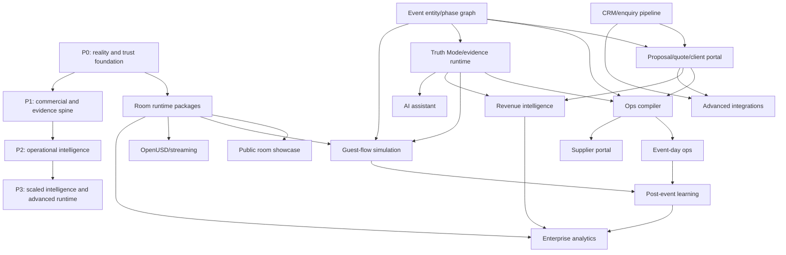

# SS++ Platform Execution Plan

Date: 2026-06-12
Status: internal master build programme
Audience: Blake, Venviewer product/engineering/operators
Scope: research ingestion and execution plan for turning Venviewer into a proof-carrying venue reality operating system.

This document is internal planning material. It is not public marketing copy. It does not claim that any captured runtime asset, evidence pack, simulation, approval, certification, or operational proof exists until the referenced artifact has been produced, loaded, reviewed, and recorded.

## 0. Executive Strategy

Venviewer is a proof-carrying venue reality operating system.

It is not just a scanner viewer. It is not just a floorplan app. It is not just CRM. The defensible product is the fusion of:

- captured venue reality
- spatial planning UI
- commercial pipeline
- proposal and quote workflow
- evidence and claim governance
- simulated planning support
- operations handoff
- supplier and event-day execution
- post-event learning
- integrations and analytics

The moat is not any single renderer, capture format, or dashboard. The moat is that Venviewer can carry a venue from enquiry to event delivery while preserving what is known, what is assumed, what is simulated, what is reviewed, and what still needs human judgement.

The first non-negotiable execution target remains T-091: make Trades Hall real. That means real captured room assets, room-level runtime packages, honest provenance, and a runtime path that can switch between individual rooms without confusing one continuous venue scan with per-room truth. T-091 and T-091A must not be marked done until real captured asset loading has been verified for the required scope.

## 1. Research Ingested

### Cvent/Salesforce Replacement Spine

A credible luxury venue platform must own or orchestrate:

- enquiry capture
- lead, contact, and opportunity pipeline
- proposal and quote versioning
- contract, e-sign, and payment hooks
- BEO and event-order generation
- operational handoff
- supplier coordination
- invoicing and analytics
- client portal
- reporting and integrations

Execution consequence: Venviewer cannot stop at visual planning. It must own the commercial and operational spine from enquiry through delivery.

### Guest-Flow Simulation Direction

The recommended simulation v0 is browser-first, deterministic, fixed-step, and seeded. It should use:

- constructive navmesh from floor polygons minus buffered object footprints
- polygon clipping and offsetting
- triangulation and navcells
- A* pathfinding and funnel/string-pulling
- explicit semantic venue primitives:
  - queue zones
  - service points
  - bottlenecks
  - staff lanes
  - guest-only and staff-only permissions
  - doors
  - connectors
  - lifts and stairs
- Web Workers for simulation jobs
- WebGL overlays for heatmaps and agents
- clear "simulated", "planning evidence", and "human review required" language

Execution consequence: Guest Flow Replay v0 can start simple, but the boundary must be designed for a real navmesh and semantic venue graph rather than a one-off visual animation.

### UI/Product Standard

Venviewer must be:

- dark-first
- spatial-first
- keyboard-capable
- data-serious
- brand-atmospheric
- visually premium
- non-generic SaaS
- WCAG 2.2 AA minimum
- visually regression-tested
- route-level screenshot tested
- performance-budgeted
- immediate-feedback oriented
- delightful, effortless, and nontechnical-user friendly

Execution consequence: generic SaaS drift is a product risk. Dashboards are acceptable when they support work, but the venue or room must remain the primary mental model.

### Capture-to-Runtime Architecture

The correct architecture is layered:

- Matterport, LiDAR, and E57 as canonical master reference sources
- XGRIDS / PortalCam Gaussian splats as high-fidelity runtime derivatives
- glTF / GLB mesh fallback and proxy assets
- OpenUSD as long-term composition and interchange target
- room manifests
- runtime packages
- immutable R2 objects
- custom domain delivery
- hash and provenance records
- transform chains
- room segmentation from the master venue scan
- private, internal, and public asset access tiers

Execution consequence: one continuous master scan can support venue context, but Venviewer must expose individual room experiences through room-local manifests, transforms, bounds, and authority zones.

### Current Repo Gap Report

The repo is strong as a single-venue planner/review/hallkeeper foundation. The missing platform spine includes:

- real captured assets in runtime
- room runtime packages
- XGRIDS/Matterport capture intake UI
- CRM/sales pipeline
- proposal/quote/client portal
- guest-flow simulation engine
- event entity and phase graph data model
- supplier/event-day ops
- post-event learning
- executive analytics
- full Truth Mode/evidence runtime
- organisation/workspace onboarding
- production observability and commercial polish

Some of these foundations now exist in local work, but the programme remains the source of order and quality gates. A feature is not GREEN merely because a table, route, or screen exists.

## 2. Real-World Asset Context

Known asset state from Blake:

| Room / source | Current state | Platform implication |
|---|---|---|
| Lady Convenor's Room | Gaussian splat exists outside repo. | Candidate first real room runtime package if URL, file format, transforms, and provenance can be verified. |
| North Gallery | Gaussian splat exists outside repo. | Candidate multi-room switching proof after first room loading works. |
| South Gallery | Gaussian splat exists outside repo. | Candidate multi-room switching proof after first room loading works. |
| Grand Hall | Captured, still needs processing. | Flagship experience, but cannot be claimed as runtime-real until processed and loaded. |
| Reception Room | Captured, still needs processing. | Needs room-level runtime package. |
| Robert Adam Room | Captured, still needs processing. | Needs room-level runtime package. |
| Saloon | Captured, still needs processing. | Needs room-level runtime package. |
| XGRIDS / PortalCam captures | Some processing reports around 165GB RAM required. | Processing plan must include a high-RAM AWS G6e or equivalent lane and artifact provenance. |
| Matterport / LiDAR continuous venue scan | Exists as one large master venue scan. | Use as master reference; expose individual room experiences through room-local packages and transforms. |

Supported room slugs:

- `grand-hall`
- `reception-room`
- `robert-adam-room`
- `saloon`
- `lady-convenors-room`
- `north-gallery`
- `south-gallery`

## 3. SS++ Engineering Principles

SS++ engineering means the platform is built as if it will be audited, acquired, extended, operated by demanding venue teams, and repaired under pressure.

Principles:

- **Clean architecture:** domain contracts, services, API routes, UI, and external adapters stay separable.
- **Typed data boundaries:** durable concepts get shared TypeScript and Zod contracts before API/UI coupling.
- **Migrations with tests:** schema additions include migration SQL, drift checks, constraint tests, and rollback posture where practical.
- **No fake data success:** fixture, demo, mocked, generated, simulated, and real states are distinct.
- **No unsafe claims:** commercial, client, and public wording cannot exceed available evidence.
- **Visual regression:** critical spatial and commercial routes need deterministic screenshot coverage.
- **Accessibility:** keyboard, focus, contrast, labels, reduced motion, and touch targets are release gates, not polish.
- **Route performance:** heavy capture, simulation, and runtime work must be lazy, budgeted, and kept off request paths.
- **Auditability:** evidence, decisions, AI drafts, review gates, runtime packages, and handoffs must carry source and timestamps.
- **Ease of use:** operator and client flows need clear next actions, recovery paths, and plain language.
- **Delightful default states:** empty, loading, error, success, and next-step states must feel intentional.
- **No generic SaaS drift:** the venue/room remains the primary canvas; dashboards support the work.

## 4. Safe Language Rules

Allowed posture:

- "planning evidence"
- "human review required"
- "machine checked"
- "simulated"
- "not legally certified"
- "not yet signed"
- "runtime asset loaded"
- "layout-grade"
- "planning-grade"

Avoid public or customer-facing posture unless separately supported by qualified evidence and approved wording:

- "fire approved"
- "certified safe"
- "legally compliant"
- "survey-grade"
- "approved for occupancy"
- "guaranteed accessible"
- "production ready"
- "photoreal digital twin"

Rules:

1. A pretty render is not evidence.
2. A signed artifact proves chain of custody for that artifact, not that the venue is unchanged.
3. A simulation is planning support unless a qualified review process says otherwise.
4. A room can be visually loaded but not yet operationally verified.
5. A continuous scan does not automatically grant per-room runtime authority.
6. Missing venue facts must be shown as missing, not guessed.
7. Client copy must be generated from current claim state or pass a claim guard.
8. AI output is a draft until reviewed by a human.

## 5. Product Modules

| Module | Purpose | GREEN definition |
|---|---|---|
| Capture/runtime package layer | Turn raw captures, master references, processed splats, fallback meshes, manifests, transforms, hashes, access tiers, and QA records into room-level runtime packages. | At least one real room runtime package has URL, format, hash/provenance, room slug, exposure tier, known limitations, and can load without fixture/text-splat fallback. |
| Public showcase | Show rooms and planning entry points without unsupported claims. | Public page uses only client-safe assets and copy; room visuals are real and labelled correctly or explicitly preview/demo. |
| Client portal | Give clients a controlled proposal/review surface. | Client can view current scoped proposal/quote/layout evidence language and respond without accessing internal records. |
| Onboarding/billing | Bring venues and planners into managed access. | Organisation, venue, role, plan, entitlement, and billing/invoice state are enforceable and provider-verified. |
| CRM/sales | Track enquiries, leads, contacts, opportunities, owner, stage, activity, source, and next action. | Every public enquiry becomes a trackable record linked to proposal/client portal history. |
| Proposal/quote | Convert planning outputs into versioned commercial artifacts. | Staff can send a scoped proposal with exact quote line items, version history, safe evidence disclosure, and client response state. |
| Event entity/phase graph | Represent an event as phases, not one static layout. | One event can move through arrival, ceremony, room flip, dinner, speeches, bar queue, dancing, and breakdown with distinct snapshots. |
| Planner | Let staff design layouts quickly and accurately from venue data. | Placement, save, review, evidence, and commercial context are immediate, keyboard-capable, and recoverable. |
| Truth Mode/evidence | Make source, assumptions, evidence status, review gates, stale/current state, and safe wording inspectable. | Users can inspect why a claim is trusted, partial, stale, missing, or human-review-required. |
| Guest-flow simulation | Provide clearly simulated movement, queue, bottleneck, and route-conflict planning support. | One seeded replay runs from explicit geometry, assumptions, and phase data; outputs are replayable and labelled simulated. |
| Ops compiler | Turn approved snapshots/events into BEO-style internal handoff artifacts. | A saved approved layout produces pick list, setup tasks, room flip tasks, supplier notes, BEO body, and snapshot diff. |
| Supplier/event-day ops | Make plans usable by staff and suppliers during execution. | Mobile/tablet board supports task status, issues, changes, supplier arrivals, escalation notes, and offline-safe progress. |
| Post-event learning | Feed real outcomes back into venue intelligence. | Completed events record actuals, variance, feedback, incidents, timing, reusable patterns, source, scope, and freshness. |
| AI assistant with claim guard | Accelerate internal drafting and explanation without becoming authority. | AI output is env-gated, draft-only, reviewed, `ai_generated`, unverified, and claim-guarded before display. |
| Integrations | Connect to calendars, email, CRM/export, accounting, e-sign, payments, storage, embed surfaces, and webhook systems. | Credentials are scoped/redacted, webhooks are signed, retries/idempotency exist, and failed integrations do not corrupt canonical state. |
| Observability/reliability | Make the platform operable. | Errors, uptime, metrics, backups, restore drill, audit logs, deploy gates, performance budgets, and runbooks are visible and tested. |

## 6. Build Order

### P0 - Reality and Trust Foundation

Scope:

1. Repo hygiene and release gates.
2. Room-agnostic asset/runtime package foundation.
3. Register and load the first real splat from Lady Convenor's Room, North Gallery, or South Gallery.
4. XGRIDS/AWS G6e processing runbook and artifact provenance checklist.
5. Public room showcase from safe runtime package states.

GREEN:

- One real external room asset is registered and loaded as a room-scoped runtime package.
- The package records room slug, URL/object key, format, hash or verified-hash status, source label, access tier, transform state, limitations, and runtime status.
- Runtime loading uses the registered package path, not a fixture/text-splat/manual public bypass.
- Public showcase has no private/internal artifacts and no unsupported claims.
- High-RAM processing lane has a documented cost, input, output, hash, storage, and review path.

### P1 - Commercial and Evidence Spine

Scope:

1. Proposal/quote/client portal.
2. CRM pipeline.
3. Event entity/phase graph.
4. Truth Mode/evidence runtime.
5. Ops compiler.

GREEN:

- An enquiry becomes a lead/opportunity with owner, status, activity history, and next action.
- Staff can create a proposal/quote from planner/event data and send a client-safe portal link.
- The event model supports phases and phase-specific snapshots.
- Evidence packs and Truth Mode summaries are generated from frozen/approved snapshots and explicit assumptions.
- Ops handoff artifacts cite event, configuration, snapshot, version, review gates, and known stale/missing evidence.

### P2 - Operational Intelligence

Scope:

1. Guest-flow simulation.
2. Event-day ops.
3. Supplier portal.
4. Revenue intelligence.
5. Post-event learning.

GREEN:

- Guest Flow Replay runs from explicit geometry, semantic primitives, assumptions, and seed.
- Event-day mobile board is usable under time pressure and survives offline windows.
- Supplier-safe views expose only relevant instructions, arrival windows, and source-linked changes.
- Revenue views preserve comfort floors, review bottlenecks, and assumptions.
- Completed events create reusable learning records without treating past success as universal truth.

### P3 - Scaled Intelligence and Advanced Runtime

Scope:

1. AI assistant.
2. Advanced integrations.
3. OpenUSD/streaming pipeline.
4. AR/localisation.
5. Multi-venue enterprise analytics.

GREEN:

- AI remains draft-only behind claim guard and human review.
- Integrations support e-sign, payment, accounting, calendar/email, CRM/export, and embed replacement through scoped adapters.
- OpenUSD/streaming work preserves canonical room/package provenance rather than replacing it.
- AR/localisation is tied to reviewed room transforms and access tiers.
- Enterprise analytics compares venues, rooms, pipeline, utilisation, revenue, ops outcomes, and evidence bottlenecks without hiding uncertainty.

## 7. Explicit Dependencies

- Proposal requires CRM/enquiry links.
- Client portal requires proposal/quote versioning and safe public-share boundaries.
- Ops compiler requires event records and approved/frozen configuration snapshots.
- Guest-flow simulation requires geometry, navmesh inputs, placed objects, doors/connectors, and assumptions.
- Truth Mode requires evidence items, check results, assumption records, review gates, claim states, and staleness records.
- Public room showcase can use runtime packages, but only package metadata that is client-safe for the selected exposure tier.
- AI must run behind claim guard and human review.
- Revenue intelligence requires quote/event/layout inputs and must preserve comfort/review constraints.
- Supplier portal requires handoff packs and supplier-scoped instruction records.
- Post-event learning requires event-day ops and outcome records.
- OpenUSD/streaming work depends on stable runtime package, transform, and provenance contracts.

## 8. Dependency Graph



## 9. Release Gates

Every phase must pass these gates before it is called GREEN.

### Schema Gate

- Shared contracts exist for durable domain objects.
- Zod schemas validate runtime inputs/outputs.
- Database migrations have named constraints and drift tests.
- Missing/unknown/unsupported states are explicit.

### API Gate

- Auth and scope are enforced.
- Idempotency exists for write/retry paths.
- Webhooks are signature-verified where applicable.
- API tests cover validation, auth, happy path, failure path, and secret redaction.

### UI Gate

- Core journey is complete, not a dead-end screen.
- Empty/loading/error/success states are designed.
- Desktop/tablet/mobile postures are considered.
- Keyboard access is covered for critical workflows.
- No misleading success state.

### Visual QA Gate

- Route screenshots exist at target viewports.
- Room/canvas nonblank checks exist where 3D is involved.
- Layout bounds and text-overlap checks are covered where practical.
- Performance budget is checked for heavy 3D/simulation routes.
- Real assets are labelled with correct status.

### Safety / Claim Gate

- Public/deployable copy passes claim guard.
- Exposure tier is correct.
- Runtime assets are not over-described.
- Evidence language is scoped.
- Review gates are visible.
- Unsafe terms are blocked or listed only as prohibited wording in internal docs/tests.

### Operations Gate

- Logs, errors, metrics, uptime, and runbook status are visible.
- Backup restore has been verified before customer data reliance.
- External env gaps are shown as missing, not silently assumed.
- Failure/retry paths are tested for event-day and commercial workflows.

## 10. Definition of GREEN by Phase

| Phase | GREEN |
|---|---|
| P0 | One real room runtime package loads through the registered package path; public showcase is claim-safe; processing lane and asset provenance are documented. |
| P1 | Enquiry, CRM, proposal, quote, client portal, event phases, evidence, and ops handoff form one coherent workflow with shared models. |
| P2 | Guest-flow, event-day ops, supplier views, revenue intelligence, and post-event learning run from canonical event/layout/handoff data and remain clearly planning-scoped. |
| P3 | AI, advanced integrations, OpenUSD/streaming, AR/localisation, and enterprise analytics are review-gated, auditable, env-guarded, and do not replace evidence authority. |

## 11. First 30 Implementation Tasks

1. Confirm the first external room asset URL/object key, format, file size, and access path.
2. Verify whether Lady Convenor's Room, North Gallery, or South Gallery is the lowest-risk first runtime package.
3. Record source label, capture date if known, room slug, owner, known limitations, and access tier.
4. Compute or record hash status for the source asset and derived runtime object.
5. Register one real `RuntimePackage` for the chosen room.
6. Load the package through Spark on the internal visual route.
7. Add visual QA screenshot and nonblank check for the loaded room.
8. Add room-local transform and camera preset fields to the package manifest if missing.
9. Add operator note for continuous master scan versus room-local package authority.
10. Document XGRIDS/PortalCam AWS G6e processing inputs, outputs, cost, RAM, and storage path.
11. Add public showcase room picker using runtime package status and safe labels.
12. Add client-safe public embed state for runtime package preview.
13. Extend CRM from enquiry record to opportunity, owner, activity, and next action.
14. Link proposal/quote records back to CRM/enquiry/opportunity records.
15. Complete staff-side proposal builder UI for current quote/layout/version state.
16. Complete client portal comments and approve/request-changes flow.
17. Attach event phases to proposals and configuration snapshots.
18. Attach evidence pack status to proposal and ops handoff surfaces.
19. Generate a handoff pack from one approved event phase snapshot.
20. Add supplier-scoped view over existing supplier instructions.
21. Upgrade Guest Flow Replay boundary toward navmesh inputs and semantic primitives.
22. Move replay computation into a Web Worker boundary.
23. Add WebGL heatmap and agent overlay budget checks.
24. Add event-day board reload/resume and offline failure/retry journey tests.
25. Add post-event outcome, variance, and feedback records.
26. Feed post-event learning into layout pattern suggestions with source/scope/freshness.
27. Add revenue scenario comparison tied to quote/event/layout inputs.
28. Add e-sign/payment/accounting integration stubs with env guards and redaction tests.
29. Add OpenUSD composition/interchange architecture note tied to runtime package provenance.
30. Add multi-venue enterprise analytics plan for pipeline, utilisation, revenue, ops, and evidence bottlenecks.

## 12. Top 10 Build Priorities

1. First real room runtime package.
2. Room-local transform, bounds, and camera presets.
3. Public room showcase from safe runtime states.
4. CRM opportunity spine.
5. Staff proposal builder and client portal completion.
6. Event phase snapshots tied to proposal and ops handoff.
7. Evidence pack status visible across planner/proposal/ops.
8. Guest Flow Replay navmesh/semantic primitive upgrade.
9. Supplier portal and event-day retry/reload hardening.
10. Post-event learning loop with source, scope, and freshness.

## 13. Recommended Next Prompt

Use this as the next product-code prompt:

```text
You are Codex working inside the Venviewer / OMNITWIN repository.

MODE:
SS++ P0 real-room runtime package execution.

Do not push.
Do not mark T-091 or T-091A done.
Do not fake a real asset.
Do not use textSplats.
Do not change public marketing copy.
Do not use unsafe claims.

GOAL:
Register and load the first real externally existing Trades Hall room splat through the room runtime package path.

READ FIRST:
- docs/strategy/ss-plus-plus-platform-execution-plan.md
- docs/state/tasks.md
- packages/web/src/pages/TradesHallVisualPage.tsx
- packages/web/src/components/scene/SparkSplatLayer.tsx
- packages/web/src/lib/runtime-visual-asset.ts
- packages/web/src/lib/runtime-package-resolution.ts
- packages/types/src/asset-version.ts
- packages/types/src/runtime-venue-manifest.ts
- packages/api/src/routes/assets.ts

TASK:
Use the first verified external splat from Lady Convenor's Room, North Gallery, or South Gallery. Create or update the private/internal descriptor path so the room slug, source label, object URL/key, format, hash or hash-status, exposure tier, known limitations, and runtime status are recorded. Load only through the registered runtime package path. Keep procedural fallback honest. Add tests proving fixture/text-splat/demo markers are rejected and loaded copy says "runtime asset loaded" plus "human review required" or "not yet signed" as appropriate.

RETURN:
GREEN / YELLOW / RED with files changed, tests run, and the exact next operator step for Blake to verify the external room splat.
```

## 14. Final Planning Rule

The platform should grow by proof slices:

1. one real room
2. one real proposal
3. one real staff handoff
4. one real evidence packet
5. one real event-day learning loop

Every slice should be beautiful, usable, and honest before the next layer adds ambition.
