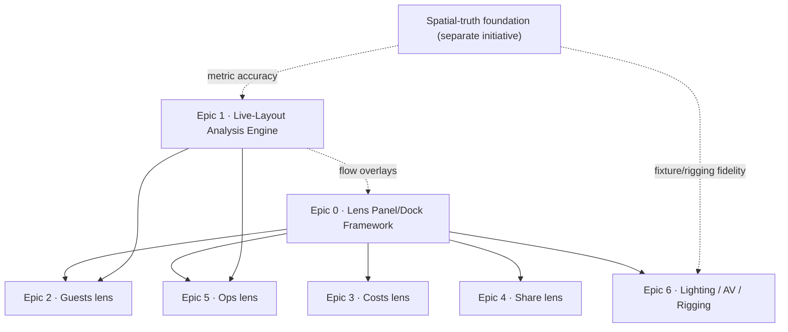

# Cockpit Lens Program — Roadmap Design

- **Date:** 2026-06-21
- **Status:** Approved (macro roadmap). Per-epic specs to follow.
- **Author:** Engineering (with Blake)
- **Supersedes/extends:** [`2026-06-13-planner-cockpit-design.md`](./2026-06-13-planner-cockpit-design.md) (the cockpit shell this fills in)
- **Related memory:** `project_feature_reality_inventory_2026_06`, `project_clickpath_audit_2026_06`

---

## 1. Motivation

The whole-app reality inventory (2026-06-19) found the app is overwhelmingly real and
data-backed, with the placeholder/canned gaps concentrated in the **planner cockpit
lenses** — which *are* shipped to desktop users on `/plan` (`EditorPage` renders
`<PlannerCockpit/>` on desktop; mobile gets the plain editor).

Current lens reality:

- **Design** — real (the editor).
- **Flow / Evidence** — real R3F overlays, but the guest-flow simulation runs on a
  hardcoded demo input (`TRADES_HALL_GUEST_FLOW_REPLAY_INPUT` via
  `use-cockpit-replay.ts`), **not** the live placed furniture. Rearranging furniture does
  not change them.
- **Lighting** — explicit, self-labelled placeholder (`LightingProbeGrid`, a fixed 3×2
  ring grid, "no measured photometrics").
- **Guests / Ops / Costs / Share** — stubs: no scene overlay and no panel. Switching to
  them only flips a `data-cockpit-mode` CSS attribute (hides the editing toolbar).

This is honestly labelled "Phase 2" work, not deception — but against the bar "nothing
shipped is a placeholder; every button leads to a real thing," 4 of 8 lenses are dead and
3 more run on canned/placeholder data. **Only Design is fully real.**

## 2. Goal & non-goals

**Goal:** every cockpit lens becomes a real, purpose-built planning tool ("Full S+, no
compromise"), built **foundation-first** so nothing is throwaway scaffolding.

**Non-goals (this roadmap):**

- Detailed per-epic implementation — each epic gets its own brainstorm → spec → plan.
- The spatial-truth / E57 foundation itself (separate top-5 initiative). This roadmap
  *depends on* it for two epics but does not build it.
- Multi-venue de-hardcoding (separate, intentional staging decision).

**Definition of done (program):** no dead or canned lens on desktop `/plan`; every lens
either is a real tool or is removed from the rail; every customer-facing number routes
through the existing truth-mode/claim-guard.

## 3. Program shape

Seven epics, foundation-first. Epic 0 and Epic 1 are shared substrate; Epics 2–6 are the
lens tools.

**Build order:** `0 → 1 → 3 → 4 → 2 → 5 → 6`.

**Order rationale:**

- **0 first** — there is no per-lens panel framework today; every rich tool needs a place
  to live. Build it once.
- **1 second** — the live-layout analysis engine is the data spine shared by Flow,
  Evidence, Guests, and Ops. Wiring Flow/Evidence proves it end-to-end.
- **3 (Costs) and 4 (Share) next** — smallest new-data footprint, heaviest reuse of
  existing real backends (quotes money engine; proposal share infra). Fast "real" wins
  that validate the panel framework.
- **2 (Guests)** — larger; needs a new guest data model + Epic 1.
- **5 (Ops)** — medium-large; wraps the real ops handoff / event-day pages and the phase
  model; benefits from Epic 1 (flow → setup sequencing).
- **6 (Lighting/AV/Rigging) last** — net-new domain, biggest research need, and full
  fidelity depends on the spatial-truth foundation.

## 4. Per-epic scope

### Epic 0 — Lens Panel/Dock Framework  ·  size **M**  ·  gated on: —

A docking system the cockpit shell hosts, plus a `lens → panel` registry. Each lens tool
registers a lazy-loaded panel; the framework owns the chrome (SAFE/truth-mode header,
consistent footer, close/expand), placement (desktop dock vs mobile bottom-sheet), and the
rule that the **Design lens keeps the full editing surface** untouched.

- **Reuses:** `cockpit-store` (`activeMode`), the `PlannerCockpit` CSS-grid shell.
- **New:** panel registry + dock component + responsive panel shell; one reference panel
  to validate the pattern (recommend Costs or Share — smallest).
- **Risk:** responsive/layout complexity; must not regress Design-lens editing or the
  existing scene overlays.

### Epic 1 — Live-Layout Analysis Engine  ·  size **M–L**  ·  gated on: 🔬 research, spatial-truth (for metric accuracy)

Derive analysis inputs from the **actual placed layout** instead of the demo constant:
placed furniture → walkable navmesh (obstacles = tables/stage/bars/AV) → guest-flow
simulation (existing worker) → density, bottlenecks, route conflicts, egress timing. This
is the spine the Flow, Evidence, Guests, and Ops lenses consume.

- **Reuses:** `guest-flow-replay-worker` (real sim today), `cockpit-overlay-projection`,
  the existing overlay rendering.
- **Replaces:** `TRADES_HALL_GUEST_FLOW_REPLAY_INPUT` with a live-derived input builder
  (`layout → GuestFlowReplayInput`).
- **Claim posture:** planning-grade on the procedural room now; certified egress timing
  needs spatial truth. Never presented as a measured/certified route.

### Epic 3 — Costs lens  ·  size **M**  ·  gated on: Epic 0

Layout-driven cost/revenue scenario. Derive billable line-items from the placed layout
(room hire, per-cover catering from capacity, furniture, AV) → the **real quotes/money
engine** (exact minor-units). What-if scenarios, margin, "estimate, not a quote".

- **Reuses:** proposals/quotes money engine, capacity engine (covers).
- **New:** layout → line-item mapping + scenario UI in the lens panel.

### Epic 4 — Share lens  ·  size **M**  ·  gated on: Epic 0

A client-safe shareable view of the **current layout** (read-only 3D/2D + key facts),
behind a share token (reuse proposal-share infra), with client comments/approval tied into
the proposal conversation.

- **Reuses:** proposal share-token infra, `ProposalPage` public renderer, comment system.
- **New:** layout-share token type + client-safe layout view + lens panel.

### Epic 2 — Guests lens  ·  size **L**  ·  gated on: Epics 0, 1 + new schema/API

Guest list, seat/table assignment synced to placed tables, capacity per layout,
dietary/accessibility flags, place-card export; "fits N guests" backed by real capacity +
flow (Epic 1).

- **Reuses:** capacity engine, Epic 1 (comfort/flow), table-dressing seat counts.
- **New:** guest data model (schema + API), seating-assignment UI, sync to placed tables.

### Epic 5 — Ops lens  ·  size **M–L**  ·  gated on: Epic 0 (and benefits from Epic 1)

Compile layout + event into a setup/strike plan: task list, crew, timeline/phases (the
phase graph already exists), load-in/out, equipment manifest. Integrates with the real
`OpsHandoffPage` / `EventDayOpsPage` and the cockpit phase model.

- **Reuses:** ops handoff + event-day ops pages/APIs, `cockpit-phase-model`.
- **New:** layout/event → ops-compiler logic + lens panel; optional flow→sequencing.

### Epic 6 — Lighting / AV / Power / Rigging lens  ·  size **XL (own program)**  ·  gated on: 🔬 research, spatial-truth

Fixture placement (lighting, AV, speakers), DMX/channel mapping, power/circuit load
budgeting, rigging/truss points + structural limits, photometric/coverage visualisation,
integration with the room's real structure.

- **Reuses:** little — net-new domain models, likely new schema/APIs, new 3D fixture
  assets.
- **Dependency:** full fidelity needs spatial truth (real ceiling height, rigging-anchor
  positions, scale). A planning-grade fixture-layout version can precede it.

## 5. Cross-cutting concerns

- **Claim safety / truth-mode:** every new number flows through the existing claim-guard
  and truth-mode summary. No "certified" / "compliant" claims without backing evidence;
  hedged planning-grade wording otherwise. This is non-negotiable and applies to every
  epic.
- **Spatial-truth coupling:** Epics 1 (certified egress) and 6 (lighting/rigging fidelity)
  reach full accuracy only after the E57/signed-transform foundation. Planning-grade
  versions ship earlier and are labelled as such.
- **Testing (per epic):** pure-logic model (unit-tested in isolation) + thin R3F/panel
  layer (in-canvas test pattern from the existing cockpit work) + one e2e for the user
  flow. Matches existing repo conventions.
- **Panel conventions:** all lens panels share the Epic 0 chrome; no lens invents its own
  docking. Mobile shows the plain editor (no cockpit) — lens tools are a desktop surface
  unless a panel opts into a mobile sheet.

## 6. Research gates

Two epics cannot be specced to S+ depth from the codebase alone. Blake to run deep
research and feed answers back; see the companion research prompts.

1. **Epic 6 — Lighting/AV/power/rigging domain.** Fixture taxonomies; DMX/channel + power
   distribution modelling; truss/rigging structural load limits; photometric coverage
   math; AV/speaker coverage. Biggest unknown.
2. **Epic 1 — live-flow / crowd simulation.** Navmesh-from-furniture generation;
   defensible crowd-flow/egress modelling at planning grade (claimable without certified
   scale); the existing worker's input contract.

Epics 0, 2, 3, 4, 5 can be specced fully from the codebase now.

## 7. Sequencing & milestones

- **M1 — Foundation:** Epic 0 (+ reference panel). Outcome: a real lens panel renders;
  framework proven.
- **M2 — Live spine:** Epic 1. Outcome: Flow/Evidence reflect the actual layout; demo
  constant deleted from the runtime path.
- **M3 — Reuse tools:** Epics 3, 4. Outcome: Costs + Share are real, validating the
  framework against two existing backends.
- **M4 — Guests + Ops:** Epics 2, 5. Outcome: seating + ops compiler real.
- **M5 — Lighting/AV/Rigging:** Epic 6 (research-complete + spatial-truth available).

## 8. Open questions (deferred to per-epic specs)

- Epic 0: dock placement (right-rail vs slide-over vs split) and how it coexists with the
  truth rail and command deck — decide in the Epic 0 spec with the panel mockups.
- Epic 2: guest data ownership — per-configuration vs per-event vs per-enquiry.
- Epic 5: how much of ops is "compiled from layout" vs authored — boundary with the
  existing ops handoff.
- Whether any lens should be **hidden** rather than built if its full-S+ version is far
  off (e.g., Lighting before spatial truth). Default: keep the rail honest — hide until
  the real tool ships, or ship a clearly-labelled planning-grade version.

## 9. Next steps

1. Kick off the two research threads (Epic 1, Epic 6).
2. Drop into the **Epic 0** detailed spec (brainstorm → spec → writing-plans → build) — it
   is unblocked and unlocks everything else.
